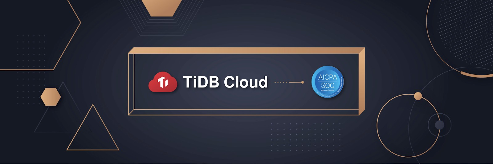

San Mateo, CA - August 28, 2020 - [PingCAP](https://pingcap.com/), provider of the cloud-native hybrid transactional and analytical processing (HTAP) [TiDB](https://docs.pingcap.com/tidb/stable/overview) database, announced today that it has successfully completed a Type 1 System and Organization Controls (SOC) 2 examination for its flagship managed service, [TiDB Cloud](https://docs.pingcap.com/tidbcloud/beta/tidb-cloud-intro). The examination, conducted by Schellman & Company, LLC, found that PingCAP has suitably designed controls to meet the SOC 2 criteria for the Security, Availability and Confidentiality Trust Services Categories as of July 31, 2020.

SOC 2 reports are attestation reports that opine on controls at an organization relevant to the security, availability, processing integrity, confidentiality, and/or privacy of the system or services. Type 1 reports attest to the design of an organization's controls as of a review date. Type 2 reports generally follow a Type 1 examination, and attest to the operating effectiveness of an organization's controls over a specified review period.

PingCAP officially launched the beta version of TiDB Cloud service in the summer of 2020. Using the Type 1 examination as a catalyst, PingCAP has implemented a robust control framework to meet the security, availability, and confidentiality commitments made to customers. With the Type 1 examination complete, PingCAP is now working toward a successful SOC 2 Type 2 examination, which is expected to conclude in early 2021.

"Companies today increasingly prioritize security, scalability, and reliability in the infrastructure services they use", said Max Liu, PingCAP's CEO. "At PingCAP, we have heavily invested in baking these principles into our people, processes, and technologies so that TiDB Cloud customers can focus on developing their product. As we move into the Type 2 review period, we are committed to earning the trust of our customers by demonstrating our continued compliance."

SOC 2 is the first of many compliance frameworks PingCAP seeks to implement as the TiDB Cloud service continues to mature. For more information about TiDB Cloud or to sign up for a free trial, visit [https://pingcap.com/products/tidbcloud](https://pingcap.com/products/tidbcloud).
