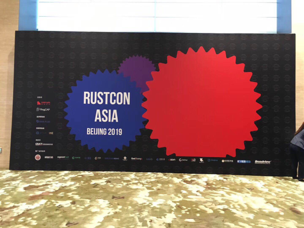
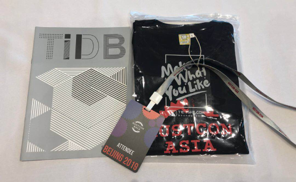
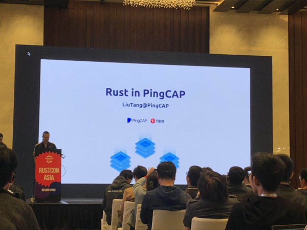
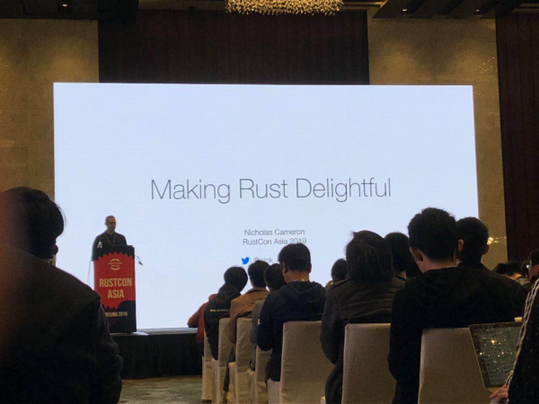
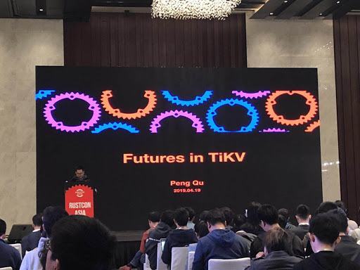
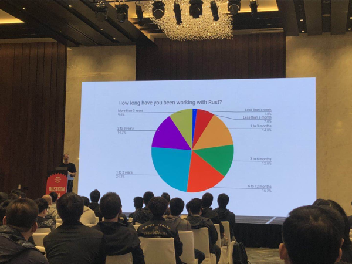
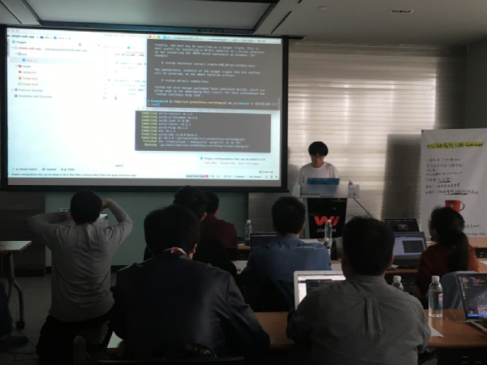
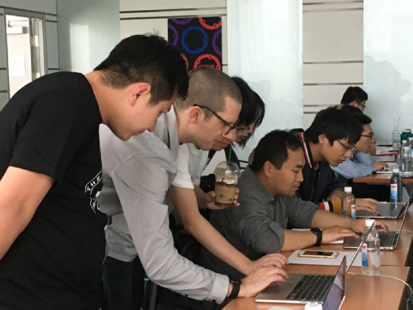

Sunshine, blue sky, with sprinkles of rain - such diverse weather these days echoed the lively atmosphere at Hyatt Regency Beijing, where the Rust Conference was held for the first time in Asia. Co-organized by PingCAP and Cryptape, this conference lasted for 4 days, involving 2 days of talks and 2 days of workshops. Speakers came from all over the world, representing some of the top influencers in the Rust community, especially in Asia. Nearly 300 Rust developers and fans attended this international event. Some of them even traveled all the way from Singapore, Germany, Australia, and Canada. For many attendees, first time encounters  blossomed into new friendships.

 Signature Board 

 Souvenir and material offered at RustCon Asia 

PingCAP has been an active member in the Rust community, and one of the first production users of Rust in building [TiKV](https://github.com/tikv/tikv), a CNCF project. For this conference, as part of being a co-organizer, we also contributed several topics in both keynote sessions and workshops.

 Siddon Tang, Chief Engineer and TiKV team lead at PingCAP, at RustCon Asia 

In the opening remarks, Siddon Tang, our chief engineer, shared the birth of TiKV and its "marriage" with Rust, which has been proven to be a win-win choice for both TiKV project and the Rust community. According to Siddon, Rust is simply more performant, safe, and reliable. Thanks to these qualities, TiKV 3.0 GA is around the corner as TiKV evolves fast into maturity. TiKV has been adopted in-production in several hundred companies. On the other hand, we are giving back to the Rust community along the way. Since TiKV was born, key components such as [grpc-rs](https://github.com/pingcap/grpc-rs), [raft-rs](https://github.com/pingcap/raft-rs) and [rust-Prometheus](https://github.com/pingcap/rust-prometheus) have been maintained as reusable open source packages, thereby enriching the Rust ecosystem in terms of tooling and libraries. PingCAP has been actively promoting Rust by organizing or participating in Rust meetups and conferences, and also developing beginners' online courses on Rust and distributed systems.

 Nick Cameron is making an opening remark at RustCon Asia 

Normally we use a language to implement our designs, but how often do we get to think about the design codes and philosophies behind a language? Well, lucky for the attendees in RustCon Asia, we had Nick Cameron, a Rust core team member and now a PingCAP senior engineer, give an opening speech entitled "Making Rust Delightful". It was indeed a delightful speech! Nick shared in detail some key philosophies of Rust, which could be highlighted by ergonomics and empathy. According to Nick, ergonomics with minimum friction has been a goal for Rust core teams, especially since the release of [Rust's language ergonomics initiative](https://blog.rust-lang.org/2017/03/02/lang-ergonomics.html) in 2017 aiming to improve productivity and bring down the learning curve. This initiative ultimately comes down to empathy for users of the language. The inspiring highlights in his talk were some principles and heuristics to be followed during the design and improvement process of Rust, but you may find them applicable to other programming work as well, such as "The right choice should be the easy choice", "Important should be implicit", etc. Rust developers need to figure out what's important before starting their work.

 Qu Peng, TiKV team engineer, at RustCon Asia 

    <a href="/download" onclick="trackViews('PingCAPers at the First RustCon Asia!', 'download-tidb-btn-middle')"><button>Download TiDB</button></a>
    <a href="https://share.hsforms.com/1e2W03wLJQQKPd1d9rCbj_Q2npzm" onclick="trackViews('PingCAPers at the First RustCon Asia!', 'subscribe-blog-btn-middle')"><button>Subscribe to Blog</button></a>

While talks from Siddon and Nick were delivered from high-level perspectives on development and designs, our third talk, "Futures in TiKV" from Qu Peng, a core engineer on the TiKV team, focused on some hardcore implementation details of Rust in TiKV. (Not the development or roadmap of our product in the future, but the futures crate in Rust provides common asynchronous primitives for Rust). With a few code samples, Qu Peng illustrated how TiKV utilizes futures in multiple critical contexts like basic streaming and remote procedure calls (RPCs), how TiKV collects futures in a stream to reduce context switch cost, and how TiKV implements an executor-task style batch system using future and stream traits.

On Day 2, Nick closed RustCon Asia with results from a survey on the Rust community. He listed many figures which vividly showed how the Rust community is growing worldwide. Particularly, the Chinese community is becoming a key contributor in Asia. According to Nick, the Rust 2018 edition has offered stability without stagnation. Besides, "Rust is a language that can really get your work done," said Nick. In 2019, what we can expect is a more mature Rust. As the community grows in popularity, governance has started to become an important issue. Objectively, we should admit that there are still some long-standing requests. However, as Rust advances, we can have confidence and optimism about the continuous improvements to resolve these requests.

 Nick Cameron making a closing talk at RustCon Asia 

The two-day talks received many kudos from the attendees. Beside PingCAP, other speakers from our co-organizer, Cryptape, Internet giants like Baidu and Alibaba, and emerging companies like Bilibili, a popular video sharing website, and Zhihu, a Chinese version of Quora delivered equally brilliant talks covering a wide range of Rust applications, including security, IoT embedded systems, blockchain, and image processing. The engaging discussions still went on after the conference. If you missed the talks, go to the [Rust Channel](https://www.youtube.com/channel/UCaYhcUwRBNscFNUKTjgPFiA) on Youtube for the available videos.

Meanwhile, the Rust workshops on the following days also provided a great opportunity to get your hands dirty with Rust. To continue the topic Make Rust Delightful, Nick provided a half-day workshop named Think in Rust. We also had TiKV core engineers, Shirley Wu and Wish Shi there to show attendees how to integrate rust-Prometheus into your application to continuously collect metrics for monitoring purposes.

 Wish Shi at workshop 

 Nick Cameron is helping the "students" 

The first RustCon Asia was absolutely a success. All of this indicates the thriving global community and the rise of visibility of Rust. As a committed user and promoter of Rust, we are glad to be part of the Rust community and grow together with it. We look forward to more interesting stuff at next year's RustCon Asia!  

Finally, we would like to express our thanks to Cryptape and Baidu X-Lab. It was truly a pleasure working with these two companies as co-organizers, and we are honored to be part of the event with them. We can't wait to continue this collaboration for next year's conference and together let's build a stronger Rust community here in Asia.
