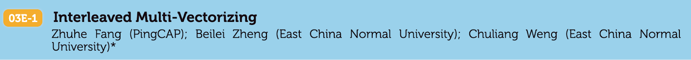

[The 46th International Conference on Very Large Databases (VLDB)](https://vldb2020.org/) will be broadcast online from August 31st to September 4th. VLDB is a premier annual international forum for data management and database researchers, vendors, practitioners, application developers, and users. VLDB2020 will feature research talks, tutorials, demonstrations, and workshops. PingCAP is honored and proud to attend this conference, with two selected papers to be shared with you.

It's worth noting that the talks are pre-recorded. Considering the time differences, each session will be broadcast twice, and the author will be available for an online Q&A during one of the sessions. The detailed schedule for PingCAP sessions is as follows:

* [TiDB: A Raft-based HTAP Database](https://vldb2020.org/program_flat.html?p=13F-2#)

    

    In this paper, we propose TiDB as a Hybrid Transactional/Analytical Processing (HTAP) database—a "one size fits many" solution for OLTP and OLAP applications.

    This is the first paper in the industry on the Raft-based implementation of a distributed real-time HTAP database. The author will be available for a live QA in the day one session.

    **Presented by**: Ed Huang, CTO and Cofounder at PingCAP

    **Schedule**:

    * Wednesday, September 2nd, 2020, 7:00 [Tue, Sep 1st, 23:00 UTC] (Primary session with live Q&A from the author)
    * Thursday, September 3rd 2020, 18:00 [10:00 UTC], 2020 (Re-play session)

* [Interleaved Multi-Vectorizing](https://vldb2020.org/program_flat.html?p=03E-1)

    This paper proposes interleaved multi-vectorizing (IMV), a new approach that reduces cache misses, branch misses, and computational overhead for an application at the same time. This is in contrast to pure scalar implementation and pure Single Instruction Multiple Data (SIMD) vectorization. The author will be available for a live QA in the day one session.

    

    **Presented by**: Dr. Zhuhe Fang, Database Engineer at PingCAP.

    **Schedule**:

    * Wednesday, September 2nd, 2020, 7:00 [Tue, Sep 1st, 23:00 UTC] (Primary session with live Q&A from the author)
    * Thursday, September 3rd, 2020, 18:00 [10:00 UTC]

You're welcome to join our venue at VLDB 2020 and discuss HTAP and next-generation databases with us. If you haven't already, register for free [here](https://tokyo.vldb2020.org/).
