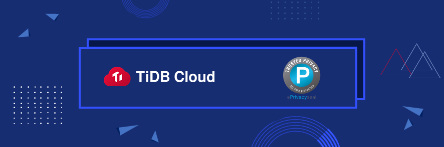

PingCAP continues to make headway in data security and privacy compliance. The recent certification highlights the company's continued commitment to providing the gold standard for enterprise databases
 

SAN MATEO, CA—October 12, 2021: PingCAP, the leading distributed SQL provider, is proud to announce that [TiDB Cloud](https://pingcap.com/products/tidbcloud/?utm_source=newsrelease&utm_id=GDPR), the fully-managed service of TiDB, now holds the highest level of data privacy with full GDPR Certification. Following an in-depth audit, TiDB received the ePrivacyseal issued by ePrivacy GmbH, an independent firm offering data protection seals for the certification of digital products and services to achieve a high standard in data protection. 

"Data has become an intrinsic part of business, and securing its protection and privacy is one of our top priorities. At PingCAP, we are devoted to providing services that ensure security, availability, and confidentiality so that our customers can deploy a trusted cloud database platform-as-a-service." said Frank Dai, GM of TiDB Cloud business at PingCAP. "The most recent GDPR certification, alongside the recent certifications we have attained, not only demonstrates our commitment to hold the strictest data privacy and compliance at global scale, it also positions TiDB Cloud as one of the most trusted cloud based database platform in the market."

The GDPR Certification is only the latest in a series of certifications attained by TiDB Cloud. On the heels of its public preview period announcement this past May, TiDB has achieved [ISO 27001 certification](https://pingcap.com/blog/announcing-iso-27001-certification-for-tidb-cloud) and successfully completed [SOC 2 Type 2](https://pingcap.com/blog/pingcap-successfully-completes-soc2-type2-examination-for-tidb-cloud) examination. The GDPR Certified status announcement further solidifies PingCAP's commitment to being the global leader in cloud-based database-as-a-service offerings.

TiDB Cloud was developed to be the global gold standard in enterprise database performance and scalability. It makes deploying, managing, and maintaining TiDB clusters even simpler with a fully managed cloud instance. TiDB Cloud also simplifies deployment, scaling, and recovering from outages through its cloud-native, distributed architecture eliminating the need for manual sharing and complex failover schemes.

"We are proud to have achieved the GDPR certification; however, our commitment does not stop here." Continued Dai. "We continue our work, taking a holistic approach to providing business continuity with a highly available database platform but also adhering to the data privacy and compliance needs of our customers."
