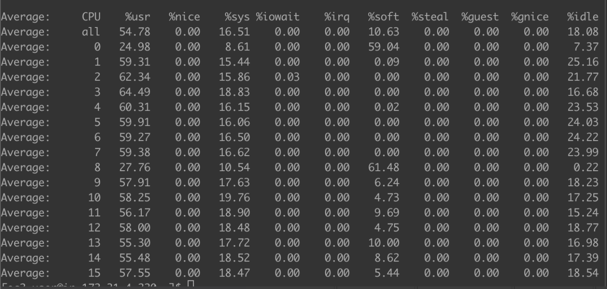

The Intel x86-64 is the most widely used processor in server architectures. However, [Arm](https://en.wikipedia.org/wiki/Arm_architecture), previously known as Advanced RISC Machine, is attracting more and more attention, and many companies have migrated their products from x86-64 to Arm.

At PingCAP, we also want to run [TiDB](https://en.wikipedia.org/wiki/TiDB) on Arm. This article describes how we compiled and benchmarked TiDB on the Amazon Web Services (AWS) Arm64 platform.

## Compiling

The TiDB platform is comprised of three main components: the TiDB server, the Placement Driver (PD) server, and the TiKV server. To compile and build these components, we did the following:

* Installed supporting software that is compatible with Arm64.

    TiDB and PD are written in the GO programming language, so we installed [go1.12.6.linux-arm64](https://dl.google.com/go/go1.12.6.linux-arm64.tar.gz). TiKV is written in the Rust programming language, so we used [rustup](https://rustup.rs/) to install Rust.

    We installed Arm64-compatible versions of the [Grafana](https://grafana.com/grafana/download?platform=arm) and [Prometheus](https://prometheus.io/download/) monitoring software.

* Before we compiled, TiKV, we used yum to install the following dependencies:

    ```
    sudo yum install -y gcc gcc-c++ wget git zlib-devel
    wget http://dl.fedoraproject.org/pub/epel/epel-release-latest-7.noarch.rpm
    sudo rpm -ivh epel-release-latest-7.noarch.rpm
    sudo yum install -y epel-release
    sudo yum install -y cmake3 gcc gcc-c++ wget git zlib-devel
    sudo ln -s /usr/bin/cmake3 /usr/bin/cmake
    ```

* During the TiDB and PD builds, we discovered compatibility issues with a TiDB vendor. We upgraded the [vendor software](https://github.com/pingcap/tidb/pull/10805) and solved the problem.

* During the TiKV build, we addressed [RocksDB 5450](https://github.com/facebook/rocksdb/pull/5450) and [Titan 23](https://github.com/pingcap/titan/pull/23) compilation issues. We resolved these issues by passing an Arm64 or AARCH64 marco to each component.

By the way, there is a [script](https://gist.github.com/siddontang/3a35473437bc47ebf27e541ba7d41141#file-build_on_arm-sh) which can help you build TiDB on Arm64. Enjoy it.

## Benchmarking the TiDB Arm64 and x86-64 versions

After we built our TiDB version for Arm64, we benchmarked it to compare its performance with the same configuration on x86-64.

We used [Yahoo! Cloud Serving Benchmark (YCSB)](https://github.com/pingcap/go-ycsb) for our benchmarking software.

We used two machines for our test setup: one Arm64 machine with 16 cores and 32 GB RAM, and one x86-64 machine with 16 cores and 32 GB RAM. On each machine, we started one PD instance and one TiKV instance with default configurations.

Note: We only use the go-ycsb Raw mode to benchmark TiKV, not TiDB.

We used 100 threads, loaded 1 million rows of data, and executed 1 million operations. The benchmark results were as follows:

|       | x86-64 (operations/sec) | Arm64 (operations/sec) |
| :---- | :---- | :---- |
| Load | 22,948.5 | 14,698.6 |
| Workload A | Update: 14,244.5<br/>Read: 14,224.5 | Update: 9,932.6<br/>Read: 9,917.8 |
| Workload B | Update: 4,819.0<br/>Read: 92,302.2 | Update: 2,102.0<br/>Read: 39,776.8 |
| Workload C | Read: 113,663.1 | Read: 49,262.0 |

As you can see, the performance on Arm64 is much worse than that on x86-64. So we need to do some optimizations. From [Optimizing Network Intensive Workloads on Amazon EC2 A1 Instances](https://aws.amazon.com/cn/blogs/compute/optimizing-network-intensive-workloads-on-amazon-ec2-a1-instances/), we know we can do something to handle the network more efficiently. This article provides a script that makes CPU 0 and 8 handle network interruptions, and evenly distribute received packets to all CPUs. But unfortunately, after we applied this script and did the benchmark again, we ran `mpstat` and found that CPU 0 and 8 were full.



So we did a little change, to distribute received packets to all the CPUs except 0 and 8:

```
sudo sh -c 'echo fe > /sys/class/net/eth0/queues/rx-0/rps_cpus'
sudo sh -c 'echo fe00 > /sys/class/net/eth0/queues/rx-1/rps_cpus'
```

The result was better on Arm64, but CPU 0 and 8 were still the bottleneck. Specifically, the bottleneck was caused by the network interrupt handling. We'll try to optimize it later.

You can see that CPUs run more evenly on x86-64 than on Arm64.


## Conclusion

This article showed how we built TiDB and performed some benchmark optimizations on Arm. Because of its low power and low cost, I believe Arm can be used more and more widely in servers. Maybe this is the future in China, too.
