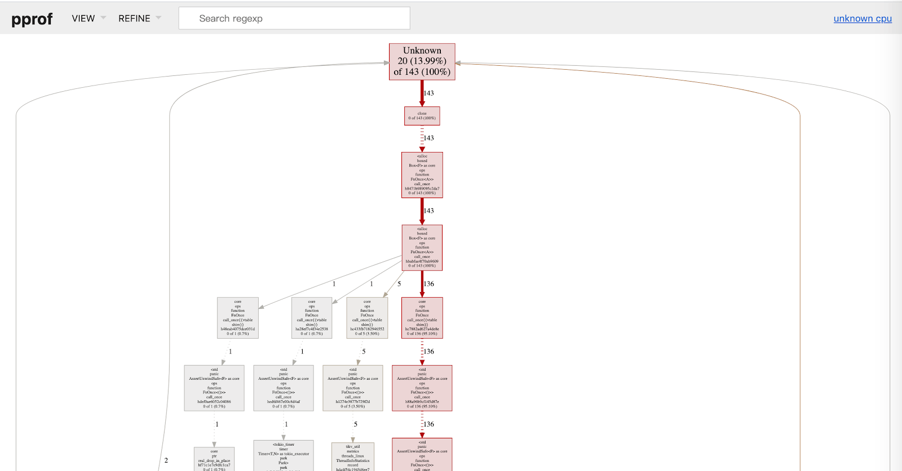
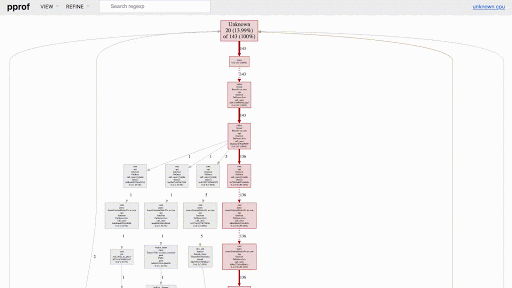

Profiling large [Rust](https://en.wikipedia.org/wiki/Rust_(programming_language)) applications online is difficult. Current profilers are not up to the job.

When we need to analyze a Rust program's performance, we often think about [perf](https://en.wikipedia.org/wiki/Perf_(Linux)). To use perf, we need to:

1. Install a complete perf program to sample stack traces.
2. Use a set of script tools to process the file obtained by sampling.
3. Visualize the output of the processing result in the previous step.

However, perf doesn't perfectly support programs written in Rust. For example, it doesn't understand Rust's closures. Therefore, symbols for the stack information in the visualization are complex.

To collect profiling statistics for Rust programs like [TiKV](https://github.com/tikv/tikv), we developed [pprof-rs](https://github.com/tikv/pprof-rs), which samples, analyzes, and visualizes performance data in one step. We integrated pprof-rs in TiKV's `status_server`, which outputs monitoring information. 

Because pprof-rs uses the same data format as the Go tool [pprof](https://golang.org/pkg/net/http/pprof/), we can use pprof, to visualize TiKV's profiling data. This makes it easier for developers and online users to find TiKV's performance bottlenecks. 

In this post, I'll share how we use pprof to visualize TiKV's profiling data to help quickly locate TiKV's performance bottlenecks online. If you also write Rust programs, you can introduce pprof-rs into your projects to help analyze your programs' performance online. 

## Why the protobuf format?

[pprof](https://github.com/google/pprof) is a tool that analyzes and visualizes profiling data. It profiles data in the [Protocol Buffers](https://github.com/google/pprof/blob/master/proto/profile.proto) (protobuf) format. Protobuf is Google's data interchange format and helps serialize structured data. 

If we want to obtain detailed profiling data for a comprehensive analysis or use other community tools for profiling diagnosis, a program-readable file format is essential. pprof-rs outputs files in the protobuf format. Thus, we can use other tools that depend on this format for profiling analysis.

## How to use pprof to visualize a Rust program's profiling data

TiKV is a distributed, transactional, key-value database written in Rust. Taking it as an example, let's see how to use pprof to visualize a Rust program's profiling data:

> **Note:** 
> 
> Before you start, make sure that you've installed the following in the environment:
>
> * [Graphviz](https://www.graphviz.org/download/)
> * [The Go client](https://golang.org/doc/install/source)

Assume that TiKV exports protobuf files via [http://127.0.0.1:22039/](http://127.0.0.1:22039/).

1. Sample the program and download a protobuf file. In this example, pprof samples the program for 50 seconds:

    ```
    curl -H "Content-Type: application/protobuf"
    http://127.0.0.1:22039/debug/pprof/profile\?seconds=50 > some.pb
    ```

    After 50 seconds, sampling stops, and the corresponding protobuf file is returned.

2. Use pprof to parse the protobuf file.

    ```
    go tool pprof -http=:8080 some.pb
    ```

3. Go to [http://localhost:8080](http://localhost:8080), and you can see the graph of stack traces:


<div class="caption-center"> Graph of stack traces </div>

4. (Optional) From the **VIEW** drop-down menu, select **Flame Graph**. You can see the [flame graph](http://www.brendangregg.com/flamegraphs.html), a visualization of profiled software which quickly and accurately identifies the most frequent code paths.


<div class="caption-center"> Flame graph </div>

With the protobuf format, you can write your own visualization or performance analysis tool to parse pprof-rs' output. Because pprof-rs uses [backtrace-rs](https://github.com/rust-lang/backtrace-rs), it can go deeper into the stack and obtain more backtrace information than perf. This may be more information than you need. When pprof starts, you can use pprof's command line parameters to ignore unnecessary stack information.

For example, you can run this command to ignore `threadpool`-related information:

```
go tool pprof -ignore threadpool -http=:8080 some.pb
```

## Conclusion

It has long been a problem to locate Rust programs' performance bottlenecks online. By integrating pprof-rs in TiKV, we can use the Go tool pprof to visualize TiKV's profiling data. This helps you quickly locate TiKV's performance issues in the production environment. Meanwhile, pprof can directly output a flame graph via HTTP requests. 

If you introduce pprof-rs into your Rust-written programs, you can use pprof to visualize your programs' profiling data online. If you're interested in [pprof-rs](https://github.com/tikv/pprof-rs), give it a try.
