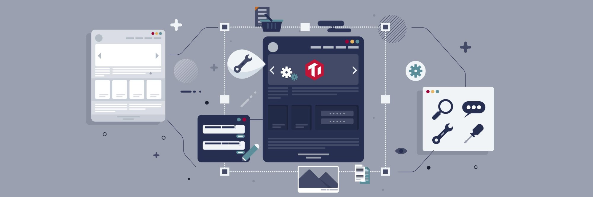
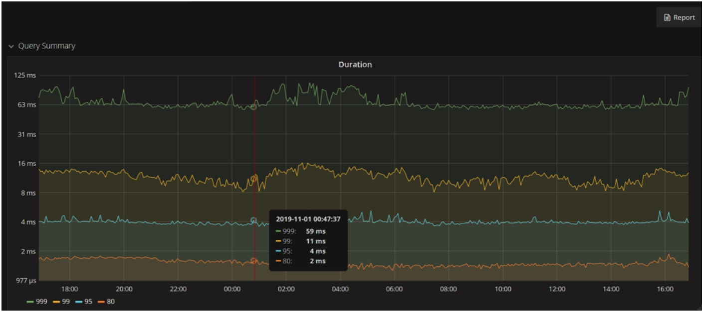
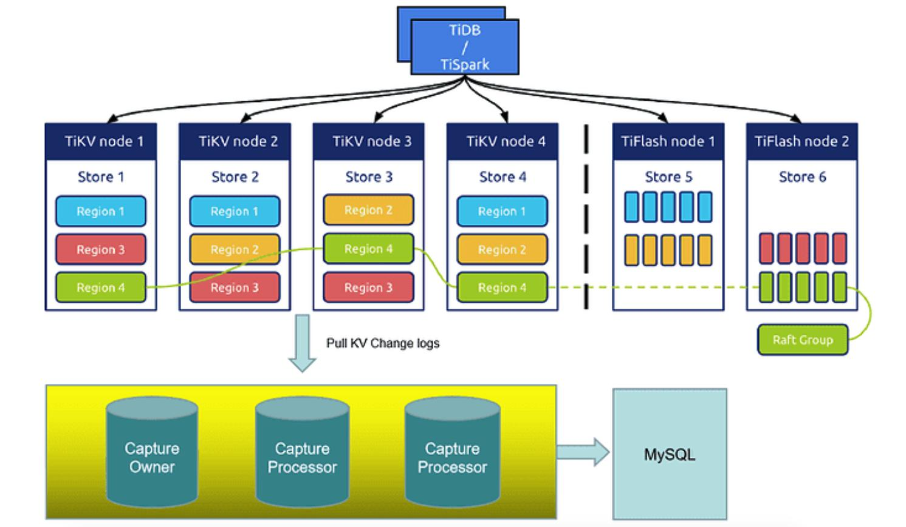

**Industry:** Automobile

**Authors:**

* Xianqi Jin (DBA at Autohome)
* Fan Zhang (R&D at Autohome)
* Technical Architecture Team of Autohome Technical College

**Transcreator:** [Caitin Chen](https://github.com/CaitinChen); **Editor:** Tom Dewan

[Autohome](https://www.crunchbase.com/organization/autohome) is the leading online destination for automobile consumers in China. It's one of the most visited auto websites in the world. We provide professionally produced and user-generated content, a comprehensive automobile library, and extensive automobile listing information, covering the entire car purchase and ownership cycle.

The Autohome community forum is one of our oldest applications, with 100 million+ daily visits and 1 billion+ daily interface calls. As our data size rapidly grew, SQL Server became our database bottleneck. **Sharding didn't meet our app requirements**, and **scaling database capacity affected apps.** We looked for a new database solution.

After we compared [TiDB](https://docs.pingcap.com/tidb/stable/overview), Apache Ignite, and CockroachDB, we chose TiDB, an open-source, distributed, Hybrid Transactional/Analytical Processing (HTAP) database. Thanks to its horizontal scalability, now we can easily scale out our database, and our transactional **99th percentile latency is within 12 ms.**

In 2020, TiDB also served as the underlying storage for our big sales promotion **with hundreds of thousands of Queries Per Second (QPS)**. **Our real-time query latency was reduced from 0.5 s to 0.01 s. TiDB's 99th percentile latency was within 20 ms**.

This post introduces how TiDB helps us achieve database scaling and real-time analytics, and covers:

* [Our forum reply app's pain points](#our-pain-points-for-the-community-forum-reply-app)
* [Why we chose TiDB over Ignite and CockroachDB](#our-exploration-of-distributed-sql-databases)
* [How we use TiDB in the forum reply app](#how-we-use-tidb-in-the-autohome-forum-reply-application)
* [Why and how we use TiDB in our big sales promotion app](#introducing-tidb-to-our-big-sales-promotion)

## Our pain points for the community forum reply app

Over the past 14 years, the Autohome community forum has grown to 100 million+ posts and 1 billion+ replies. It has 10 million+ daily active users, 100 million+ visits per day, and 1 billion+ average daily interface calls. We stored the forum's data in SQL Server. As our businesses quickly grew, we encountered more and more database problems. We needed to resolve two urgent issues: sharding and scaling.

### Database sharding didn't meet our app requirements

The Autohome forum reply database stores replies to posts. When SQL Server's single table was too large, database performance degraded. To solve this issue, we sharded the reply database based on the post ID. The result was 100+ shards and 1,000+ tables in the reply database.

However, our applications developed and application requirements changed, and **when we wanted to implement some application requirements, sharding couldn't meet our needs**. We hoped that data was logically in a single table.

### Scaling database capacity affected applications

In recent years, as our businesses rapidly grew, our data size increased remarkably. But hard disks had limited capacity, and on each server, we could only add limited disks. As a result, every once in a while we had to add storage servers of larger capacity. However, this approach was complicated, and **every time we changed servers, we still needed to pay attention to related applications**. We hoped that scaling database storage would not affect applications. In addition, large-capacity database servers were expensive.

## Our exploration of distributed SQL databases

### Why we chose TiDB over Apache Ignite and CockroachDB

In 2019, we investigated three popular distributed SQL databases: TiDB, Apache Ignite, and CockroachDB. After many tests, we chose TiDB, because:

* TiDB is compatible with the MySQL protocol, so we can use TiDB as we used MySQL.
* TiDB's architectural design is better than Ignite and CockroachDB.
* TiDB has a vibrant community and rich documentation.
* The TiDB team is easy to work with and responsive to our needs.

### TiDB features we value most

[TiDB](https://docs.pingcap.com/tidb/stable/overview) is an open-source, cloud-native, distributed SQL database built by [PingCAP](https://pingcap.com/) and its open-source community. It is MySQL compatible and features **horizontal scalability**, **strong consistency**, and **high availability**. It's a one-stop solution for both Online Transactional Processing (OLTP) and Online Analytical Processing (OLAP) workloads. You can learn more about TiDB's architecture [here](https://docs.pingcap.com/tidb/v4.0/architecture).

Among TiDB's features, we think these are the most attractive:

* Horizontal scalability

    We can add nodes to the cluster at any time, and it's easy to change nodes.

* Massive data support

    It can easily handle 10 billion+ rows of data. For example, you can check out the [Zhihu case study](https://pingcap.com/case-studies/lesson-learned-from-queries-over-1.3-trillion-rows-of-data-within-milliseconds-of-response-time-at-zhihu).

* High availability

    SQL Server uses the Publish/Subscribe replication model, while TiDB uses the Raft algorithm to achieve 100% strong data consistency. When the majority of data replicas are available, TiDB can implement automatic fault recovery.

* Real-time HTAP

    TiDB is an HTAP database that targets both OLTP and OLAP scenarios. [TiFlash](https://docs.pingcap.com/tidb/dev/tiflash-overview), TiDB's analytical engine, lets users perform real-time analytics.

### Testing TiDB in OLTP, OLAP, and exception scenarios

We conducted many functionality, performance, exception, and application access tests on TiDB. Our test results in OLTP, OLAP, and exception scenarios showed that TiDB met our database requirements.

#### OLTP testing for TiDB

We tested TiDB against 20 million rows of data and 500 concurrent threads in an OLTP scenario.

As the following figure shows, **TiDB's 99th percentile response time was within 16 ms**. This met our application requirement. **When the amount of data increased, TiDB showed even greater advantages.** In addition, we can add TiDB or [TiKV](https://docs.pingcap.com/tidb/dev/tikv-overview) nodes to improve read and write performance.

 TiDB's query response time 

#### OLAP testing for TiDB

To compare TiDB vs. MySQL, we ran a 50 GB TPC-H test. The test results showed that TiDB had a great advantage over MySQL. In the table below, the superior performance for each query is shown in bold:

<table>
  <tr>
   <td rowspan="2" ><strong>Query</strong>
   </td>
   <td colspan="2" ><strong>Query response time (seconds)</strong>
   </td>
  </tr>
  <tr>
   <td><strong>TiDB</strong>
   </td>
   <td><strong>MySQL</strong>
   </td>
  </tr>
  <tr>
   <td>1
   </td>
   <td>

<strong>201.89</strong>

   </td>
   <td>

1285.14

   </td>
  </tr>
  <tr>
   <td>2
   </td>
   <td>

<strong>30.62</strong>

   </td>
   <td>

35.78

   </td>
  </tr>
  <tr>
   <td>3
   </td>
   <td>

<strong>133.73</strong>

   </td>
   <td>

1789.76

   </td>
  </tr>
  <tr>
   <td>4
   </td>
   <td>

<strong>31.47</strong>

   </td>
   <td>

311.68

   </td>
  </tr>
  <tr>
   <td>5
   </td>
   <td>

600.01

   </td>
   <td>

<strong>553.70</strong>

   </td>
  </tr>
  <tr>
   <td>6
   </td>
   <td>

<strong>77.13</strong>

   </td>
   <td>

298.15

   </td>
  </tr>
  <tr>
   <td>7
   </td>
   <td>

<strong>78.81</strong>

   </td>
   <td>

818.32

   </td>
  </tr>
  <tr>
   <td>8
   </td>
   <td>

<strong>512.43</strong>

   </td>
   <td>

1542.10

   </td>
  </tr>
  <tr>
   <td>9
   </td>
   <td>

<strong>309.06</strong>

   </td>
   <td>

3478.29

   </td>
  </tr>
  <tr>
   <td>10
   </td>
   <td>

<strong>48.31</strong>

   </td>
   <td>

595.37

   </td>
  </tr>
  <tr>
   <td>11
   </td>
   <td>

<strong>37.86</strong>

   </td>
   <td>

201.42

   </td>
  </tr>
  <tr>
   <td>12
   </td>
   <td>

600.01

   </td>
   <td>

<strong>385.05</strong>

   </td>
  </tr>
  <tr>
   <td>13
   </td>
   <td>

<strong>121.17</strong>

   </td>
   <td>

648.64

   </td>
  </tr>
  <tr>
   <td>14
   </td>
   <td>

<strong>68.92</strong>

   </td>
   <td>

336.48

   </td>
  </tr>
  <tr>
   <td>15
   </td>
   <td>

<strong>0.01</strong>

   </td>
   <td>

1080.20

   </td>
  </tr>
  <tr>
   <td>16
   </td>
   <td>

<strong>90.70</strong>

   </td>
   <td>

192.12

   </td>
  </tr>
  <tr>
   <td>17
   </td>
   <td>

315.73

   </td>
   <td>

<strong>94.43</strong>

   </td>
  </tr>
  <tr>
   <td>18
   </td>
   <td>

600.00

   </td>
   <td>

<strong>308.18</strong>

   </td>
  </tr>
  <tr>
   <td>19
   </td>
   <td>

<strong>94.02</strong>

   </td>
   <td>

139.46

   </td>
  </tr>
  <tr>
   <td>20
   </td>
   <td>

<strong>87.58</strong>

   </td>
   <td>

569.54

   </td>
  </tr>
  <tr>
   <td>21
   </td>
   <td>

<strong>600.012</strong>

   </td>
   <td>

1410.61

   </td>
  </tr>
  <tr>
   <td>22
   </td>
   <td>

62.07

   </td>
   <td>

<strong>47.89</strong>

   </td>
  </tr>
</table>

#### Exception testing for TiDB

We tested the performance of PD and TiKV during abnormal downtime. We found that PD's and TiKV's downtime had little impact on applications, and the cluster could automatically recover from failures.

## How we use TiDB in the Autohome forum reply application

We made a detailed migration plan and migrated from SQL Server to TiDB. If you'd like to learn more about our migration process, you can join the [TiDB community on Slack](https://slack.tidb.io/invite?team=tidb-community&channel=everyone&ref=pingcap-blog). To guarantee that faults would not occur after we deployed applications to production, we made several changes to our applications. Then, we optimized each SQL statement, so that they could hit the optimal index. By doing so, **for one billion rows of data, our OLTP applications' 99th percentile response time was within 12 ms, and the 99.9th percentile response time was within 62 ms**.

 TiDB's 99th and 99.9th percentile response times 

In September 2019, we ran the distributed database TiDB in the production environment. Since then, it has been running stably.

Next, we'll introduce how we use TiDB in our yearly big sales promotion party.

## Introducing TiDB to our big sales promotion

On August 18, 2020, Autohome held a three-hour sales promotion party. This promotion party included multiple interactive activities, such as bargain rushes, [red envelopes](https://en.wikipedia.org/wiki/Red_envelope), and lucky draws. These applications involved **millions of users**, and the system reached **a peak of hundreds of thousands of QPS**. The promotional activities issued millions of prizes and red envelopes. Because each round of bargain rushes and lucky draws was short, its traffic was intense, and these applications involved reconciliation and write-off, this set high requirements for system design.

### Why we chose TiDB

Based on these application scenarios, the system design needed a suitable data persistence layer. As I explain in detail below, we deployed TiDB in three data centers (DCs) across two cities as the underlying storage.

#### Cross-city high availability

The three DCs across two cities architecture is a high-availability disaster recovery solution for production DCs, intra-city disaster recovery centers, and remote disaster recovery centers. In this deployment, the three DCs are interconnected. If one DC fails or a disaster occurs, the other DCs can normally operate and take over critical applications or all applications. Compared with the multi-DCs in the same city plan, the three DCs in two cities deployment has cross-city high availability and can survive urban natural disasters.

#### Real-time HTAP

TiDB provides two storage engines: the [TiKV](https://docs.pingcap.com/tidb/dev/tikv-overview) row storage engine and the [TiFlash](https://docs.pingcap.com/tidb/dev/tiflash-overview) column storage engine. TiDB replicates updated data from TiKV to TiFlash in real time to ensure data strong consistency between TiKV and TiFlash. For HTAP resource isolation, we can deploy TiKV and TiFlash on different machines as needed.

#### Scaling out and scaling in easily

The TiDB architecture separates computing from storage, so we can separately scale out or scale in the computing or storage capacity online as needed. The scaling process is transparent to application operations and maintenance staff.

#### Compatible with the MySQL 5.7 protocol and MySQL ecosystem

TiDB is compatible with the MySQL 5.7 protocol, common features of MySQL, and the MySQL ecosystem. We were able to migrate our applications to TiDB with minimal code changes, and, in some cases, no changes at all. In addition, TiDB provides a series of [data migration tools](https://docs.pingcap.com/tidb/stable/migration-overview) to help migrate application data easily into TiDB.

#### Good reputation and use experience

At Autohome, the User Product Center was the first business unit to use TiDB, and it migrated the core application forum replies from SQL Server to TiDB. The car owner price application migrated from MySQL to TiDB. We have experience in migrating to, using, and optimizing TiDB. TiDB has a good reputation in Autohome.

### The TiDB cluster architecture for our big sales promotion

TiDB uses the Raft algorithm to support the three DCs in two cities configuration and ensure that TiDB cluster data is consistent and highly available. In addition, because DCs in the same city have low network latency, we can distribute application traffic to them simultaneously and control the distribution of the [Region](https://docs.pingcap.com/tidb/stable/glossary#regionpeerraft-group) [leader](https://docs.pingcap.com/tidb/stable/glossary#leaderfollowerlearner) and PD leader. This lets DCs in the same city co-load application traffic.

For the sales promotion, we deployed TiDB in three DCs across two cities, with five replicas for data. Our cluster components were as follows:

<table>
  <tr>
   <td><strong>Component</strong>
   </td>
   <td><strong>Version</strong>
   </td>
   <td><strong>Instance count</strong>
   </td>
  </tr>
  <tr>
   <td>TiDB
   </td>
   <td>4.0.3
   </td>
   <td>10
   </td>
  </tr>
  <tr>
   <td>PD
   </td>
   <td>4.0.3
   </td>
   <td>5
   </td>
  </tr>
  <tr>
   <td>TiKV
   </td>
   <td>4.0.3
   </td>
   <td>10
   </td>
  </tr>
  <tr>
   <td>TiFlash
   </td>
   <td>4.0.3
   </td>
   <td>2
   </td>
  </tr>
  <tr>
   <td>TiCDC
   </td>
   <td>4.0.3
   </td>
   <td>4
   </td>
  </tr>
  <tr>
   <td>MySQL
   </td>
   <td>5.7.25
   </td>
   <td>1
   </td>
  </tr>
</table>

 TiDB + TiFlash + TiCDC 

As this diagram shows:

* TiFlash is TiDB's columnar storage engine. This makes TiDB a true HTAP database. TiFlash provides the same snapshot isolation level of consistency as TiKV and ensures that the latest data is read.

    During the big sales promotion party, we used TiFlash to display real-time data on a large screen.

* [TiCDC](https://docs.pingcap.com/tidb/dev/ticdc-overview/) is an open-source feature that replicates TiDB's incremental changes to downstream platforms by subscribing to change logs in TiKV. It also provides [TiCDC Open Protocol](https://pingcap.com/docs/dev/ticdc/ticdc-open-protocol/) to support other systems that subscribe to TiKV's data changes.

    In our cluster, it replicated TiDB cluster data to the downstream MySQL database in real time. TiCDC's replication latency was within seconds, which satisfied our real-time requirements for online sales promotion applications.

* The MySQL database was used as a backup in case of failures to improve the applications' capacity to tolerate disasters.

### TiDB stress tests

Before we put TiDB into production for the big sales promotion, we performed multiple tests on TiDB 3.0.16, 4.0.1, 4.0.2, and 4.0.3 in three DCs across two cities. In these tests, we encountered a problem and a bug. With the PingCAP team's help, we fixed them quickly.

#### Test tools

Because Sysbench didn't have reconnection functionality, we couldn't use it to test some scenarios. We used Sysbench and an application simulation program.

<table>
  <tr>
   <td><strong>Tool</strong>
   </td>
   <td><strong>Description</strong>
   </td>
  </tr>
  <tr>
   <td>Sysbench
   </td>
   <td>Performance tests and some functionality tests
   </td>
  </tr>
  <tr>
   <td>Application simulation program
   </td>
   <td>Application simulation, functionality tests, and performance tests
   </td>
  </tr>
</table>

#### Test items

We developed a test plan based on actual application scenarios. The main test items were as follows:

* Single node failure tests simulated:

    * A tidb-server failure
    * A PD follower failure
    * A PD leader failure
    * A tikv-server failure
    * Two tikv-server failures

* Internet data center (IDC) failure tests simulated:

    * All servers' downtime in IDC 2, with the PD leader in IDC 1
    * All servers' downtime in IDC 2, with the PD leader in IDC 2
    * IDC 2 network isolation, with the PD leader in IDC 1
    * IDC 2 network isolation, with the PD leader in IDC 2

* Performance tests:

    * `oltp_read_write` test, five replicas, optimistic transactions
    * `oltp_read_write` test, five replicas, pessimistic transactions
    * `oltp_read_write` test, three replicas, optimistic transactions
    * `oltp_read_write` test, three replicas, pessimistic transactions

#### Test conclusion

We won't discuss test results in detail here, but our conclusion was that **whether it was a single node failure or an IDC failure, the cluster could recover within about 30 seconds** and continue to provide services to meet application needs.

### TiDB's performance metrics in production

During the big sales promotion, TiDB showed good performance and supported our bargain rush, red envelopes, and lucky draw activities very well:

* **TiFlash reduced the query response time for panel real-time analytics from 0.5 s to 0.01 s.**
* **TiCDC replicated TiDB's data to MySQL downstream with about 2 s latency.**
* **TiDB's 99th percentile response time was within 20 ms, with 9,000+ connections.**

## Conclusion

As our community forum's visits and posts continued to increase, the huge data size placed great pressure on our SQL Server database. To scale out our database, we migrated from SQL Server to TiDB. We no longer need to worry about troublesome database sharding.

We've run TiDB for more than two years, and it's used in important applications such as forum replies, resource pools, and friend management. We also deployed TiDB in three DCs across two cities for our 2020 big sales promotion applications. This solution guaranteed our data high availability and helped us achieve real-time HTAP. We could scale out or scale in our database as needed. In addition, TiCDC's high availability and low latency, as well as support for large-scale clusters has made a big impression on us.

If you have any questions or want detailed information about our experience, you could join the [TiDB community on Slack](https://slack.tidb.io/invite?team=tidb-community&channel=everyone&ref=pingcap-blog).
