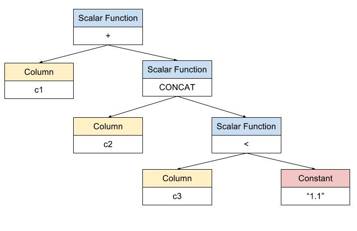

In order to accelerate expression evaluation, we recently refactored its framework. This tutorial will show you how to use the new computational framework to rewrite or add a built-in function in TiDB.

## Table of Content

+ [The overall process](#the-overall-process)
+ [Example](#example)
  - [Take a look at `builtin_string.go`](#take-a-look-at-expressionbuiltin_stringgo)
  - [Refine the existing `TestLength()` method](#refine-the-existing-testlength-method)
  - [Test the implementation of LENGTH at the SQL level](#test-the-implementation-of-length-at-the-sql-level)
+ [Before refactoring...](#before-refactoring)
+ [After refactoring...](#after-refactoring)
+ [Appendix](#appendix)

### The overall process

1. Select any function to your interest from the [expression](https://github.com/pingcap/tidb/tree/master/expression) directory, assuming the function is named XX.

2. Override the `XXFunctionClass.getFunction()` method:

    This method refers to MySQL rules, inferring the return value type according to the parameter of the built-in function.

    Different function signatures will be generated based on the number & type of the parameters, and the return value type of the function.

    See detailed description of the function signature in the appendix at the end of this article.

3. Implement the `evalYY()` method on all the function signatures corresponding to the built-in function. YY represents the return value type of the function signature.

4. Add tests

    In the [expression](https://github.com/pingcap/tidb/tree/master/expression) directory, refine tests about the implementation of the given function in the `TestXX()` method.

    In the executor directory, add tests at the SQL level.

5. Run `make dev` and ensure that all the test cases pass.

### Example:

Let's look at the [PR](https://github.com/pingcap/tidb/pull/3519) of overriding the `LENGTH ()` function for detailed explanation:

#### Take a look at `expression/builtin_string.go`:

First, let's take a look at the [`expression/builtin_string.go`](https://github.com/pingcap/tidb/blob/master/expression/builtin_string.go) file:

1. Implement the `lengthFunctionClass.getFunction()` method. This method mainly accomplishes two tasks:

    1. Infer the return value type of the `LEGNTH` function according to MySQL rules.

    2. Generate function signature based on the number & type of parameters, and return value type of the `LENGTH` function. Because the `LENGTH` function only has one number & type of parameters, and return value type, we don't need to define a type for the new function signature. Instead, we modified the existing `builtinLengthSig`, so that it could be **composite with `baseIntBuiltinFunc`, which means that the return value type in the given function signature is int.**

    ```go
    type builtinLengthSig struct {
        baseIntBuiltinFunc
    }
    func (c *lengthFunctionClass) getFunction(args []Expression, ctx context.Context) (builtinFunc, error) {

    //Infer the return value type of `LEGNTH` function according to MySQL rules
    tp := types.NewFieldType(mysql.TypeLonglong)
    tp.Flen = 10
    types.SetBinChsClnFlag(tp)

    //Generate function signature based on the number & type of parameters, and return value type. Note that after refactoring, instead of the `newBaseBuiltinFunc` method, the `newBaseBuiltinFuncWithTp` method is used here.
    //In the `newBaseBuiltinFuncWithTp` function declaration, `args` represents the function's parameters, `tp` represents the return value type of the function, and `argsTp` represents the correct types of all parameters in the function signature.
    // The number of parameters for `LENGTH` is 1, the parameter type is string, and the return value type is int. Therefore, `tp` here stands for the return value type of the function and `tpString` is used to identify the correct type of parameter. For a function with multiple parameters, when calling `newBaseBuiltinFuncWithTp`, we need to input the correct types of all parameters.
    bf, err := newBaseBuiltinFuncWithTp(args, tp, ctx, tpString)
        if err != nil {
                return nil, errors.Trace(err)
        }
        sig := &builtinLengthSig{baseIntBuiltinFunc{bf}}
        return sig.setSelf(sig), errors.Trace(c.verifyArgs(args))
    }
    ```

2. Implement the `builtinLengthSig.evalInt()` method:

    ```go
    func (b *builtinLengthSig) evalInt(row []types.Datum) (int64, bool, error) {
    // For the `builtinLengthSig` function signature, the parameter type is decided as string, so we can directly call the `b.args[0].EvalString()` method to calculate the parameter:
        val, isNull, err := b.args[0].EvalString(row, b.ctx.GetSessionVars().StmtCtx)
        if isNull || err != nil {
                return 0, isNull, errors.Trace(err)
        }
        return int64(len([]byte(val))), false, nil
    }
    ```

<div class="trackable-btns">
    <a href="/download" onclick="trackViews('Refactoring the Built-in Functions in TiDB', 'download-tidb-btn-middle')"><button>Download TiDB</button></a>
    <a href="https://share.hsforms.com/1e2W03wLJQQKPd1d9rCbj_Q2npzm" onclick="trackViews('Refactoring the Built-in Functions in TiDB', 'subscribe-blog-btn-middle')"><button>Subscribe to Blog</button></a>
</div>

#### Refine the existing `TestLength()` method:

Moving on to [`expression/builtin_string_test.go`](https://github.com/pingcap/tidb/blob/master/expression/builtin_string_test.go), let's refine the existing `TestLength()` method:

```go
func (s *testEvaluatorSuite) TestLength(c *C) {
    defer testleak.AfterTest(c)() // This line is used to monitor goroutine leak.
    // You can use the following cases to test the `LENGTH` function
    // Note: in addition to normal cases, it is best to add some abnormal cases, such as the input args is nil, or the function has different types of parameters.
    cases := []struct {
           args     interface{}
           expected int64
           isNil    bool
           getErr   bool
    }{
           {"abc", 3, false, false},
           {"你好", 6, false, false},
           {1, 1, false, false},
           ...
    }
    for _, t := range cases {
           f, err := newFunctionForTest(s.ctx, ast.Length, primitiveValsToConstants([]interface{}{t.args})...)
           c.Assert(err, IsNil)
           // The following lines test the return value type of the `LENGTH` function:
           tp := f.GetType()
           c.Assert(tp.Tp, Equals, mysql.TypeLonglong)
           c.Assert(tp.Charset, Equals, charset.CharsetBin)
           c.Assert(tp.Collate, Equals, charset.CollationBin)
           c.Assert(tp.Flag, Equals, uint(mysql.BinaryFlag))
           c.Assert(tp.Flen, Equals, 10)
           // The following lines test the evaluation result of LENGTH function:
           d, err := f.Eval(nil)
           if t.getErr {
                  c.Assert(err, NotNil)
           } else {
                  c.Assert(err, IsNil)
                  if t.isNil {
                         c.Assert(d.Kind(), Equals, types.KindNull)
                  } else {
                         c.Assert(d.GetInt64(), Equals, t.expected)
                  }
           }
    }
    // The following lines test whether the function has determinacy:
    f, err := funcs[ast.Length].getFunction([]Expression{Zero}, s.ctx)
    c.Assert(err, IsNil)
    c.Assert(f.isDeterministic(), IsTrue)
}
```

#### Test the implementation of `LENGTH` at the SQL level

Finally let's look at [`executor/executor_test.go`](https://github.com/pingcap/tidb/blob/master/expression/evaluator_test.go) and test the implementation of `LENGTH` at the SQL level:

```go
// Tests for string built-in functions can be added in the following method:
func (s *testSuite) TestStringBuiltin(c *C) {
    defer func() {
           s.cleanEnv(c)
           testleak.AfterTest(c)()
    }()
    tk := testkit.NewTestKit(c, s.store)
    tk.MustExec("use test")
    // for length
    // It's best that these tests can also cover different scenarios:
    tk.MustExec("drop table if exists t")
    tk.MustExec("create table t(a int, b double, c datetime, d time, e char(20), f bit(10))")
    tk.MustExec(`insert into t values(1, 1.1, "2017-01-01 12:01:01", "12:01:01", "abcdef", 0b10101)`)
    result := tk.MustQuery("select length(a), length(b), length(c), length(d), length(e), length(f), length(null) from t")
    result.Check(testkit.Rows("1 3 19 8 6 2 <nil>"))
}
```

### Before refactoring...

TiDB abstracts the expression through the Expression interface (defined in the [expression/expression.go](https://github.com/pingcap/tidb/blob/master/expression/expression.go) file) and defines the `eval` method to evaluate the expression:

```go
type Expression interface{
    ...
    eval(row []types.Datum) (types.Datum, error)
    ...
}
```

Expressions that implement the Expression interface include:

- Scalar Function
- Column
- Constant

The case below shows the framework of expression evaluation before refactoring:

```sql
create table t (
    c1 int,
    c2 varchar(20),
    c3 double
)
select * from t where c1 + CONCAT( c2, c3 < "1.1" )
```

About the `where` condition in the `select` statement shown above:

In the **compiling phase**. TiDB will build an expression tree as shown in the graph below:



In the **executing phase**, the `eval` method of the root node is called, and the expression is evaluated by the following traversal expression tree.

The evaluate the `<` expression, take the types of the two parameters into account, and convert the values of the two parameters into required data types according to certain rules. In the expression tree above, the parameter types are double and varchar. According to the evaluation rules of MySQL, these two parameters need to be compared using the float type. Therefore, "1.1" should be converted to double type, and then be evaluated.

Similarly, for the `CONCAT` expression in the expression tree above, the parameters should be converted to string type before evaluation. For the expression '+', the parameters should be converted to double before evaluation.

Therefore, before refactoring, the framework of expression evaluation needs to  **determine the data type of the parameter on each branch repeatedly** for every group of data involved. If the parameter type does not meet the evaluation rules of the expression, you need to convert it to the corresponding data type.

Moreover, from the definition of the `Expression.eval ()` method, we can see that when evaluating, we must **continually wrap and unwrap intermediate results through the Datum structure**, which also increases time and capacity cost.

In order to solve these two problems, we refactored the expression evaluation framework.

### After refactoring...

The refactored framework has two advantages:

1. In the compiling phase, we use the existing information on expression types to generate the expression with parameter types that match the evaluation rules. This way, no extra branch judgment about the parameter types are needed in the executing phase.
2. Only the original data types are involved in the evaluation, thus avoiding the time and capacity cost by Datum.

Let's go back to the previous example, in the **compiling phase**, the generated expression tree is shown in the following graph. For expressions that do not match the function parameters types, we add the `cast` function for type conversion:


In this way, in the **executing phase**, for every `ScalarFunction`, it is guaranteed that all of its parameter types match the data types in the given expression evaluation, and we don't need to check and convert parameter types repeatedly.

### Appendix

- For a built-in function, multiple function signatures may be created to handle different scenarios, depending on the number & type of parameters, and the type of return value. For most built-in functions, each parameter type and return value type are determined, so only a function signature is needed.
- For referring rules of more complicated return value type, you can refer to the implementation and test of the `CONCAT` function. You can use the `MySQLWorkbench` tool to run the query `select funcName (arg0, arg1, ...)` to observe the field type of the return value in MySQL's built-in functions when inputting different parameters.
- In the evaluation process of TiDB expression, only the following six evaluation types (currently we are implementing the JSON type) are supported:

    1. int (int64)
    2. real (float64)
    3. decimal
    4. string
    5. Time
    6. Duration

    The `WrapWithCastAsXX ()` method can convert an expression to the corresponding type.

- For a function signature, its return value type has been determined, so when defining, you need to combine it with the corresponding `baseXXBuiltinFunc` and implement the `evalXX ()` method. Note that XX should only be one of the six types listed above.
