**Author:** Will Zhang (SRE at iSoftStone)


[KubeSphere](https://kubesphere.io/), an open-source, distributed operating system with Kubernetes as its kernel, helps you manage cloud-native applications on a GUI container platform. [TiDB](https://docs.pingcap.com/tidb/stable/) is an open-source, cloud-native database that runs smoothly on Kubernetes.

In [my last blog post](https://pingcap.com/blog/run-cloud-native-distributed-database-on-hybrid-cloud-kubernetes-platform/), I talked about how to deploy TiDB on KubeSphere. If you want TiDB to be available to tenants across the workspace, you can release the TiDB app to the KubeSphere public repository, also known as the KubeSphere App Store. In this way, all tenants can easily deploy TiDB in their project, without having to repeat the same steps.

In this article, I will walk you through how to deploy TiDB on KubeSphere by app templates and release TiDB to the App Store.

## Prerequisites

Before you try the steps in this post, make sure:

* You have [prepared the environment with KubeSphere installed](https://kubesphere.io/blogs/tidb-on-kubesphere-using-qke/#preparing-environments).
* You have [enabled the KubeSphere App Store](https://kubesphere.io/docs/pluggable-components/app-store/).

## Prepare TiDB Helm Charts

To deploy TiDB on KubeSphere, you need TiDB [Helm](https://helm.sh/) charts. Helm helps you create, install, and manage Kubernetes applications. A Helm chart contains files that describe the necessary collection of Kubernetes resources. In this section, I'll demonstrate how to download the required Helm charts and upload them to KubeSphere.

### Download TiDB Helm Charts

1. Install Helm. Based on your operating system and tools, there are several ways to install Helm. For detailed information, see [the Helm documentation](https://helm.sh/docs/intro/install/). The simplest to install Helm is to execute the following command directly:

    

    ```shell
    curl https://raw.githubusercontent.com/helm/helm/master/scripts/get-helm-3 | bash
    ```

2. Add the PingCAP TiDB Helm repository:

    

    ```shell
    helm repo add pingcap https://charts.pingcap.org/
    ```

3. View all the Helm charts in this repository:

    ```shell
    $ helm search repo pingcap --version=v1.1.6

    NAME                    CHART VERSION   APP VERSION     DESCRIPTION
    pingcap/tidb-backup     v1.1.6                          A Helm chart for TiDB Backup or Restore
    pingcap/tidb-cluster    v1.1.6                          A Helm chart for TiDB Cluster
    pingcap/tidb-drainer    v1.1.6                          A Helm chart for TiDB Binlog drainer.
    pingcap/tidb-lightning  v1.1.6                          A Helm chart for TiDB Lightning
    pingcap/tidb-operator   v1.1.6          v1.1.6          tidb-operator Helm chart for Kubernetes
    pingcap/tikv-importer   release-1.1                     A Helm chart for TiKV Importer
    ```

    Note that in this article, I use v1.1.6 charts. You can also get [the latest version](https://github.com/pingcap/tidb-operator/releases) released by PingCAP.

4. Download the charts you need. For example:

    

    ```shell
    helm pull pingcap/tidb-operator --version=v1.1.6 &&
    helm pull pingcap/tidb-cluster --version=v1.1.6
    ```

5. Make sure they have been successfully pulled:

    ```shell
    $ ls | grep tidb

    tidb-cluster-v1.1.6.tgz
    tidb-operator-v1.1.6.tgz
    ```

### Upload Helm charts to KubeSphere

Now that you have Helm charts ready, you can upload them to KubeSphere as app templates.

1. Log in to the KubeSphere web console and create a workspace.

    1. In the upper left corner of the current page, click **Platform** to display the **Access Control** page.
    2. In **Workspaces**, click **Create** to create a new workspace and give it a name; for example, `dev-workspace` as shown below.

    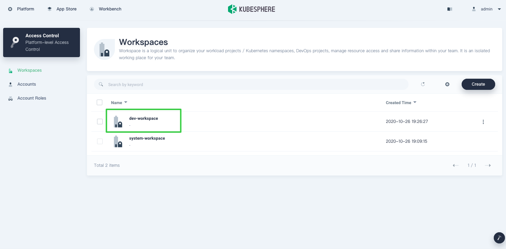

2. Go to your workspace. From the navigation bar, select **App Templates**, and, on the right, click **Upload Template**.

    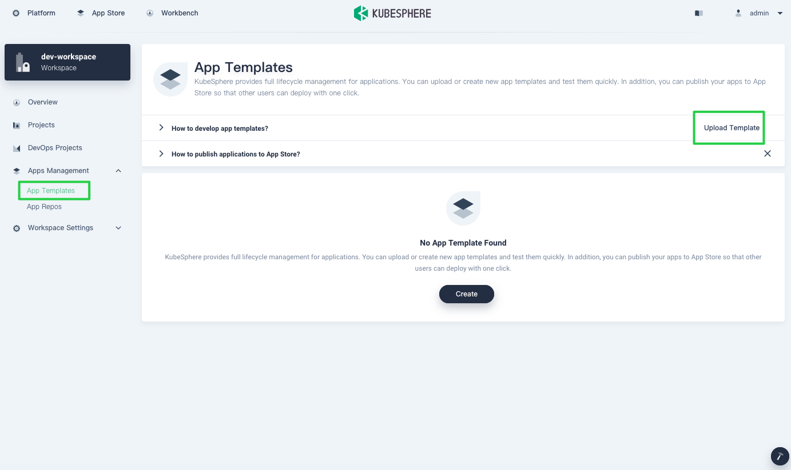

    [My last blog post](https://pingcap.com/blog/run-cloud-native-distributed-database-on-hybrid-cloud-kubernetes-platform) explained how to deploy TiDB using an app repository. This time, let's upload Helm charts as app templates.

3. Select the Helm charts you want to upload to KubeSphere. After they are successfully uploaded, they appear in the list below.

    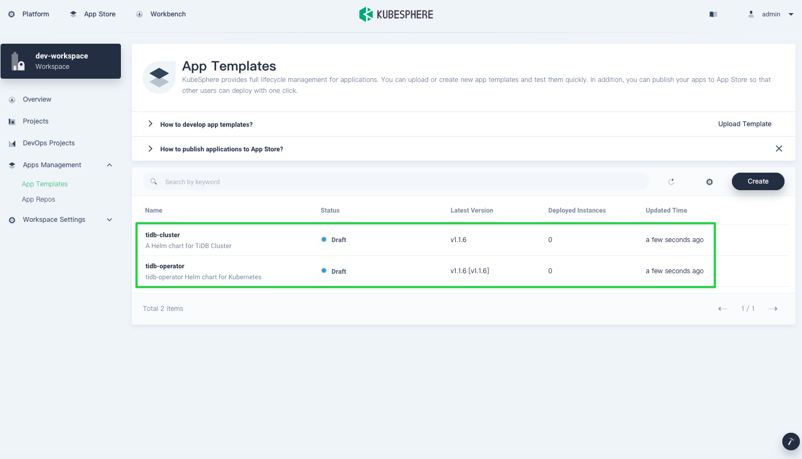

## Deploy TiDB Operator and a TiDB cluster

1. To deploy TiDB, you need to [create a project](https://kubesphere.io/docs/quick-start/create-workspace-and-project/#task-3-create-a-project) (also known as a namespace) where all workloads of an app run.

    

2. After you create the project, navigate to **Applications** and click **Deploy New Application**.

    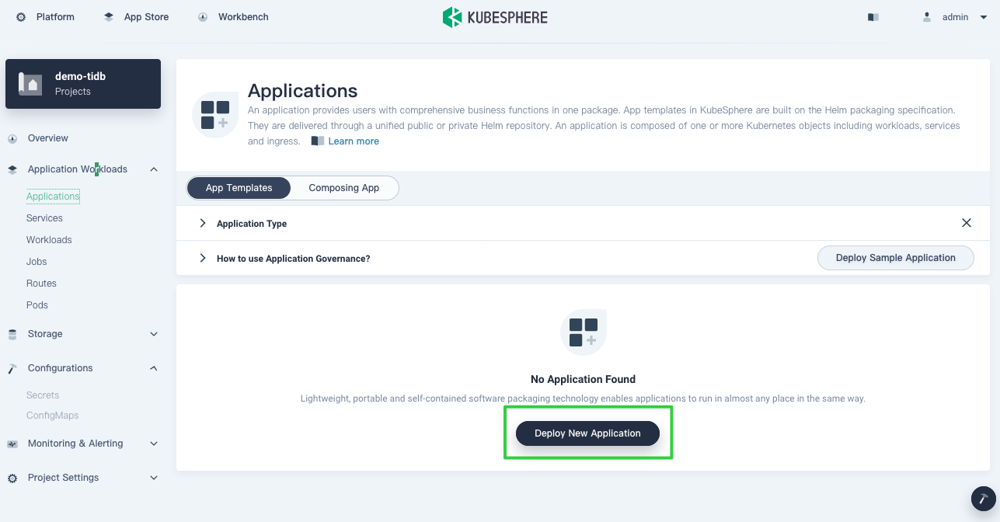

3. In the **Deploy New Application** dialog box, select **From App Templates**.

    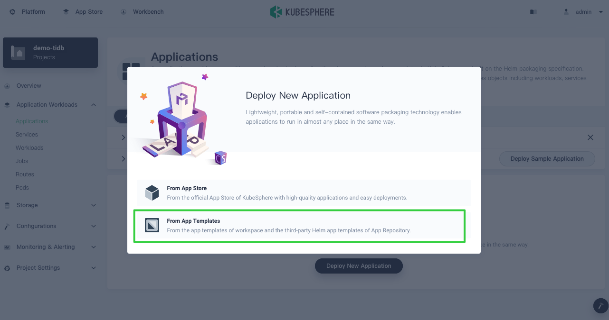

4. Deploy TiDB Operator and the TiDB cluster. In the drop-down list, select **From workspace** and click **tidb-cluster** and **tidb-operator** respectively to deploy them. For more information about how to configure them, see [my last post](https://pingcap.com/blog/run-cloud-native-distributed-database-on-hybrid-cloud-kubernetes-platform).

    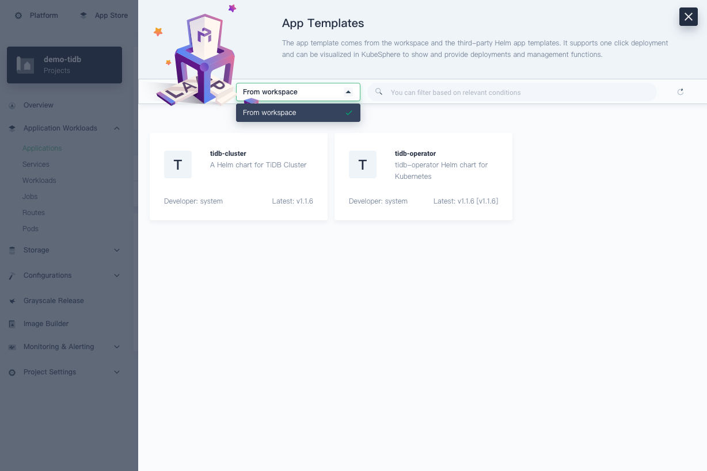

    All Helm charts uploaded individually as app templates appear on the **From workspace** page. If you add an app repository to KubeSphere to provide app templates, they display in other repositories in the drop-down list.

## Release TiDB to the App Store

[App templates](https://kubesphere.io/docs/project-user-guide/application/app-template/) enable you to deploy and manage apps in a visual way. Internally, they play an important role as shared resources. Enterprises create these resources—which include databases, middleware, and operating systems—for the coordination and cooperation within teams.

You can release apps you have uploaded to KubeSphere to the public repository, also known as the App Store. In this way, all tenants on the platform can deploy these apps if they have the necessary permissions, regardless of the workspace they belong to.

1. In the top left corner, click **Platform** and select **Access Control**.

2. On the **Workspaces** page, click the workspace where you uploaded the Helm charts.

    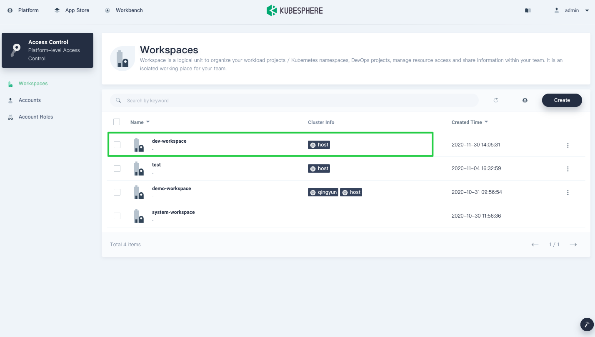

3. From the navigation bar, click **App Templates**, and you can see the uploaded apps. To release it to the App Store, click `tidb-operator`.

    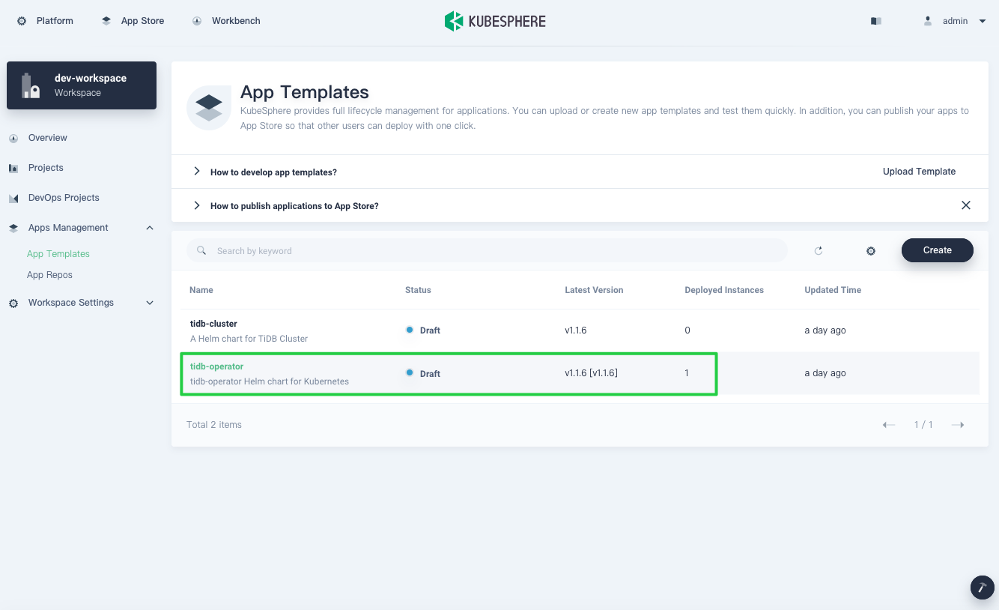

4. On the **Versions** page, click the version number to expand the menu and click **Submit Review**.

    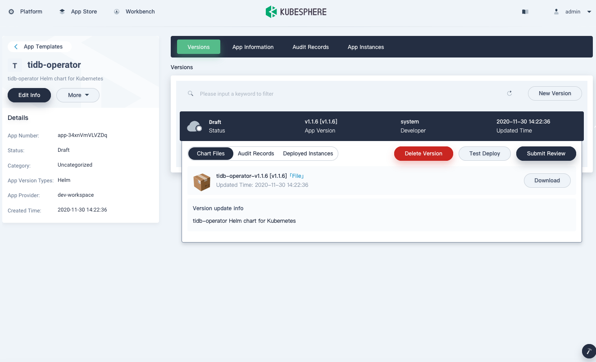

    KubeSphere allows you to manage an app across its entire lifecycle, including deleting the version, testing the deployment, or submitting the App for review. For an enterprise, this is very useful when different tenants need to be isolated from each other and are only responsible for their own part of the life cycle as they manage an app version.

5. Approve the app submitted for review. In the top left corner, click **Platform** and select **App Store Management**.

    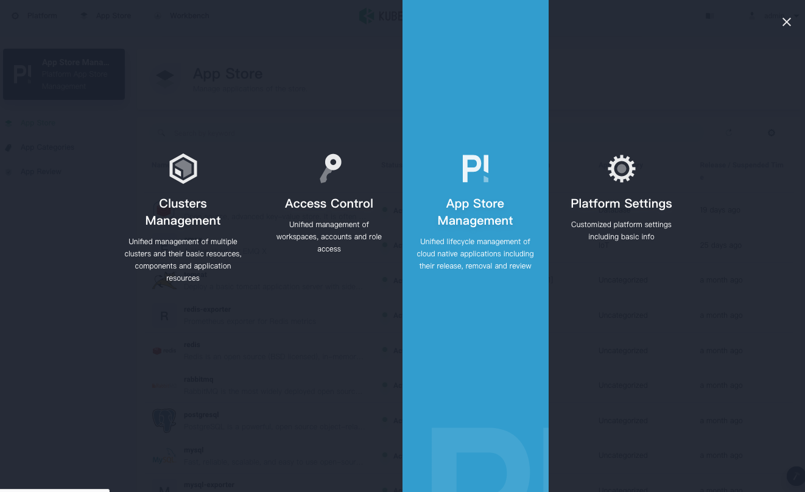

6. In the **App Reviews** page, click the app you just submitted.

    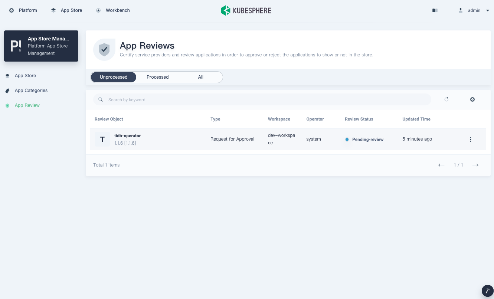

7. In the **App Info** page that appears, review the app information and chart files. To approve the app, click **Pass**.

    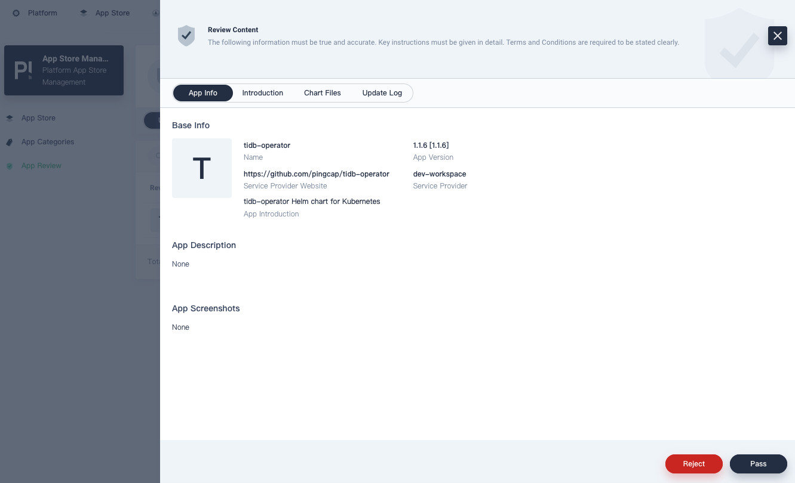

8. After the app is approved, you can release it to the App Store. In the top left corner, click **Platform** and select **Access Control**.

9. Go back to your workspace. From the navigation bar, select **App Templates** and click **tidb-operator**.

    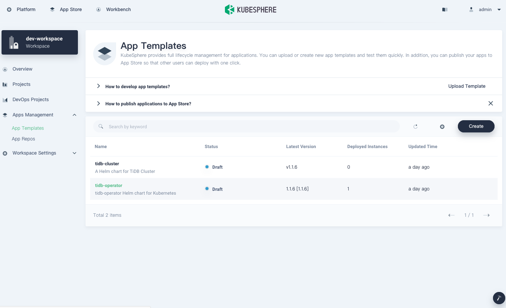

10. On the **Versions** page, click the version number again, and you can see that the status has reached **Passed**. The **Submit Review** button has changed to **Release to Store**.

11. Click **Release to Store**, and in the confirmation box, click **OK**.

    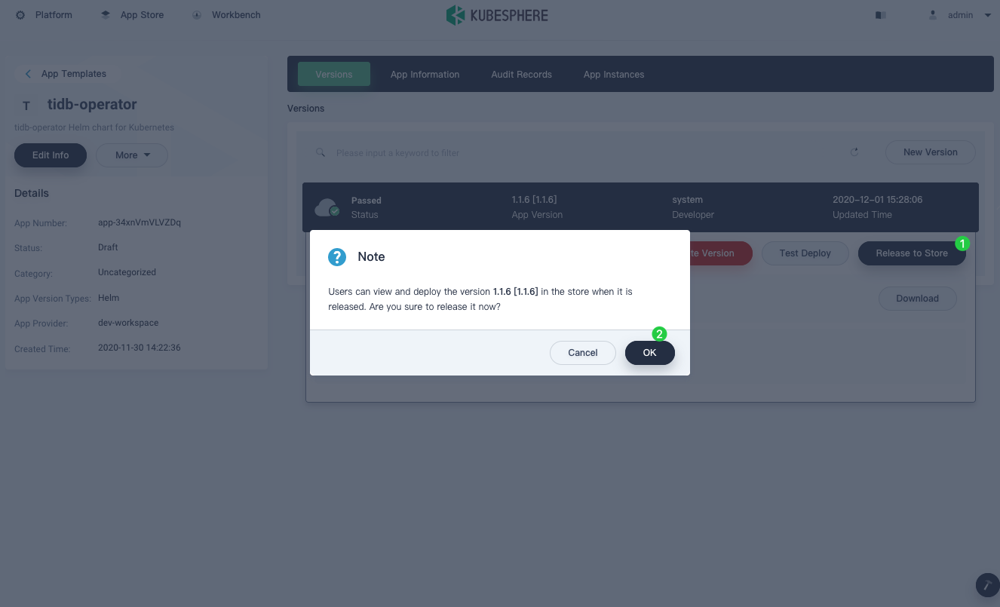

12. To view the app released, in the top left corner, click **App Store**, and you can see it in the App Store. Likewise, you can use the same steps to deploy **tidb-cluster** to the App Store.

    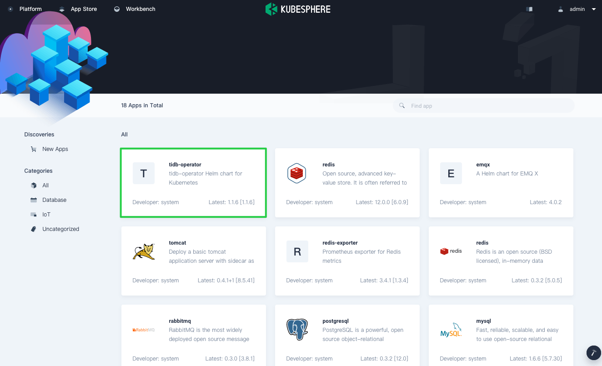

For more information about how to deploy an app from the App Store, see the [KubeSphere documentation](https://kubesphere.io/docs/project-user-guide/application/deploy-app-from-appstore/). You can also see [Application Lifecycle Management](https://kubesphere.io/docs/application-store/app-lifecycle-management/) to learn more about how an app is managed across its entire lifecycle.

## Summary

Both TiDB and KubeSphere are powerful tools for us as we deploy containerized applications and use the distributed database on the cloud. As a big fan of open source, I hope both groups can continue to deliver efficient and effective cloud-native tools for us in production.

If you have any questions, don't hesitate to contact us in [Slack](https://join.slack.com/t/kubesphere/shared_invite/enQtNTE3MDIxNzUxNzQ0LTZkNTdkYWNiYTVkMTM5ZThhODY1MjAyZmVlYWEwZmQ3ODQ1NmM1MGVkNWEzZTRhNzk0MzM5MmY4NDc3ZWVhMjE) or [GitHub](https://github.com/kubesphere).

## References

- [KubeSphere GitHub](https://github.com/kubesphere/kubesphere)
- [KubeSphere Documentation](https://kubesphere.io/docs/)
- [TiDB GitHub](https://github.com/pingcap/TiDB)
- [TiDB Operator Documentation](https://docs.pingcap.com/tidb-in-kubernetes/stable/tidb-operator-overview)
