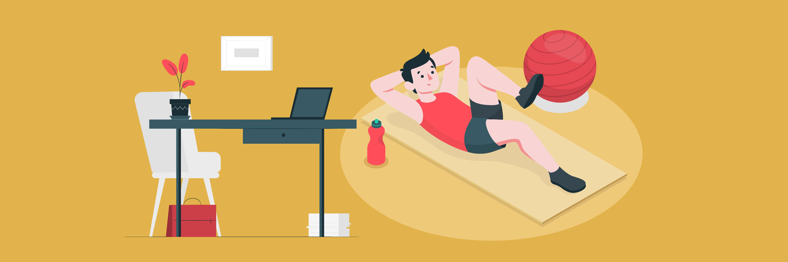

This is the third (and last, for now) post in a series on remote work. [My previous post](https://pingcap.com/blog/remote-work-part-2/) discussed some basics for remote work and communication. In this post, I'll talk a bit about some of the practicalities, specifically around work/life balance.

When working remotely there is nobody to keep an eye on you. Nobody is checking that you are looking well or that you're not screaming at your desk. Hopefully you have a manager who can make sure you're doing the right work at the right speed, but everything else is on you.

Note: my experience with remote work is working at home where I've had a separate room and fairly understanding family/house mates. If you're in a shared office or have a different situation at home, then you will probably have different issues to the ones I discuss in this post. I've mostly struggled with separating work from the rest of life, and spending too much time working (and 'sort-of' working, checking email at dinner, etc.). If you struggle to stay motivated and not get distracted, then a lot of this post won't be useful (but hopefully some of it will be).

## Work and life

Everyone has to find a balance between life and work. That balance is a personal thing and different for everyone. When working remotely, there is much more of an issue of work/life *separation* - how do you keep your work life and personal life distinct? Just like the time balance, how much separation is idea is a personal thing. The important thing is to figure out what is optimal *for you*.

It's a good idea to have a well-defined idea of the hours you will work. Sticking to those hours makes it easier for colleagues and family to know if you're likely to be working, and for you to maintain boundaries between work and the rest of your life. It should also help you focus on work during those hours and avoid distractions.

The hours don't have to be in a block, some people work better by starting early or finishing late and taking a break in the middle (it can be especially handy if you have kids). Make sure you share your work hours with your team (put them in your calendar if you use a calendar to schedule meetings).

Just like having well-defined times at work helps separate life and work, so does having a well-defined space. Ideally you have a separate office in a low-traffic part of your home. If you don't, at least try to have a desk that you only use for work in a relatively quiet spot.

Having a separate space means that you go into work mode when you enter that space. That can help you focus on work and not get distracted by everything else going on. It also helps family or house mates know when you're working and when you're off work. And it means that you can optimise the space for work, rather than work *and* some other stuff.

Turn off work notifications outside work hours (unless you're on-call, obviously). You can use tools like Screen Time on iPhone to make sure you're not letting work stuff impinge on your non-work time. Be disciplined about social media - we often let work and life overlap there and you can get sucked in to work when you should be being social.

It can be really hard for family, house-mates, and others around you to really understand that you're at work. Even if people know, they may not properly internalise that you are working and therefore not available. As described above, keeping a distinct time and space for work helps with this. You can sit down and have a 'serious talk' about when you're available and not, and what it means when you're working. This works best if you stick to your schedule: if you work late every night, then others will learn that you're not taking your schedule seriously. Also learn to say 'no'. It can be hard to decline doing some extra chores and errands if you are the one in the house with the most flexible hours and location. But you must do it!

Remote work offers amazing flexibility. You don't have to work like office workers do. You can take time in the middle of the day to do some exercise when the gym is quiet or shop when there are no queues. Then do some work in the evening when some of your colleagues are awake and online. Different people need different schedules and different levels of merging work and life. Find what works for you. And don't end up spending your whole time working, or worse, spend your whole time 'sort-of working' so you aren't effective in your work *and* you don't have any free time.

## Staying in good health

Everyone should keep an eye on their physical and mental health. When working remotely, there are a few things that I particularly look out for.

You might be surprised how much you walk on a regular day at the office - to and from public transport or your car, around the office, out for lunch, up and down stairs, etc. When you're at home you will probably do a fraction of that, so it is really important to do some regular exercise.

With no interruptions, you can end up spending a lot of time at your desk without a break. Remember to get up, walk around, and stretch regularly.

If I don't go outside all day I feel a bit claustrophobic and very tired/foggy at the end of the day. I try to get out the house every day - to get lunch or coffee (I also really like working in a cafe for an hour or so - the different scene gives me a bit more energy), or even just walk around the block (with apologies to my friends in China who can't leave their homes right now).

Even the most introverted of use need some human contact. Being by yourself all day will quickly get you down (the UN recognises solitary confinement as a form of torture due to these psychological effects). Make sure to socialise some how. Notice if you're feeling low, un-motivated, or that you want to avoid socialising (irony!), these are possible signs that you need to be more social.

Don't be afraid to take breaks, either to socialise or to get out of the house. People in offices don't usually spend every minute at their desks. They take coffee breaks, go for lunch, chat at the watercooler, hide in the toilet and cry, etc. It is fine to take a break when you're remote too (in fact, it'll probably make you more productive in the long run).

It's pretty easy for remote work to feel like a grind, and that can lead to burnout. If you notice that more often than when you work in an office, then it means you need to change something! Maybe you can change something about your office or hours. Maybe it is time to arrange a trip to an office and spend some time with colleagues. Or maybe you need a new hobby. Don't let it get on top of you.

## Motivation and the right amount of work

It is more difficult for a remote worker to judge if they are doing the right amount of work. Less chat with colleagues and not being able to see when others are in the office or taking breaks means that it is harder to compare yourself to others. It's easy to miss the non-code work colleagues do and end up doing enough (or too much) coding and not enough planning/design/mentoring/communication/learning. It's easy to assume you're never doing enough work and that you need to do more.

There's no easy solution. You just have to monitor your own work and talk to your manager and colleagues to make sure you're doing the right kind and amount of work.

If you're doing too much, you can try timing yourself or setting goals and recording your progress towards them (including wrong turns). If you're not doing the right kind of work, try planning your day in advance (e.g., spend half an hour on email, then 3 hours on code, then lunch, then 2 hours on review, half an hour reading a paper, then half an hour on email). Review what you've done each day and week. Think hard before saying yes to requests for work. Set alarms for when to start and stop work.

*This post was first published [here](https://www.ncameron.org/blog/remote-work-part-3/).*
