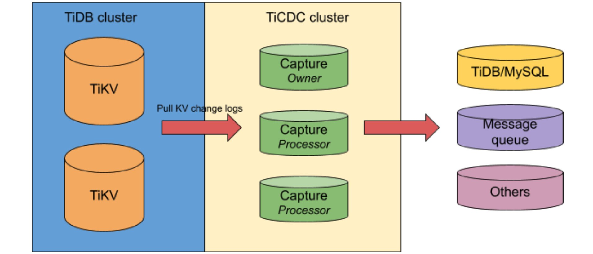

[TiDB](https://pingcap.com/docs/stable/) is an open-source, distributed SQL database that supports [Hybrid Transactional/Analytical Processing](https://en.wikipedia.org/wiki/HTAP) (HTAP) workloads. Before 4.0, TiDB provided [TiDB Binlog](https://pingcap.com/docs/stable/reference/tidb-binlog/overview/#tidb-binlog-cluster-overview) to achieve near real-time replication to downstream platforms. But as time goes by, it's difficult for TiDB Binlog to meet rapidly changing requirements and effectively handle emerging scenarios. 

Therefore, it's time for a change: TiDB 4.0 introduces [change data capture](https://en.wikipedia.org/wiki/Change_data_capture) for TiDB or [TiCDC](https://pingcap.com/docs/dev/ticdc/ticdc-overview/). This feature replicates TiDB's incremental changes to downstream platforms by subscribing to change logs in TiKV (TiDB's storage engine). It also provides [TiCDC Open Protocol](https://pingcap.com/docs/dev/ticdc/ticdc-open-protocol/ ) to support other systems that subscribe to TiKV's data changes. 

One of the hallmarks of TiCDC is its low latency. In this context, "latency" means the amount of time it takes for data that is written to TiDB to be dispatched to a downstream platform, such as MySQL or Kafka. With **high data reliability** and **horizontal scalability** features, TiCDC provides **high-availability** replication services for 100 TB clusters **with only milliseconds of latency**.

In this post, I'll deep dive into why we built TiCDC and how we implement its key features. If you'd like to try TiCDC, you can get it [here](https://pingcap.com/docs/stable/releases/release-4.0.0-rc.2/).

## Why TiCDC?

With nearly 1,000 companies using TiDB in their production environments, you can be assured that many TiDB users need to replicate data to other scenarios in real time. For traditional relational database management systems, the most common replication solution is master-slave replication based on the binary log (binlog). This method is efficient, stable, and easy to use. 

Before version 4.0, TiDB provided TiDB Binlog, which collects binlog data from TiDB and provides near real-time replication to downstream platforms. TiDB Binlog is a mature product: it was developed and improved over several years, and it's proven successful in many production environments.

However, challenges in application scenarios are endless and requirements are always changing:

* For example, if a TiDB cluster becomes very large, storing hundreds of terabytes of data, can our replication feature **horizontally scale** to offer data replication services with the same throughput as the upstream?
* In a scenario where replication latency is critical, can we provide a replication link as short as possible to achieve a **low latency**—for example, within milliseconds for every row? 
* When we need to replicate TiDB's data to a third-party partner, and the third-party system wants a specific data format and dispatching strategy, can we provide a **customized replication protocol for different scenarios**?

It is becoming more difficult for the old-school TiDB Binlog to deal with the rapidly changing requirements described above and the evolution of usage scenarios. 

Therefore, TiDB 4.0 introduces TiCDC to solve these problems. TiCDC is under development and iterating rapidly. We believe that, in the near future, it will solve all of the problems above and bring a new level of TiDB data replication.

## An overview of TiCDC

TiCDC pulls TiDB's data change logs from a TiKV cluster via the Google remote procedure call (gRPC) API and outputs data to downstream platforms. TiCDC can output data in the following ways:

* Directly replicate data to MySQL-protocol-compatible databases.
* Output data to a message queue (MQ) system, such as Kafka, with the data format and dispatching rule defined in the [TiCDC Open Protocol](https://pingcap.com/docs/dev/reference/tools/ticdc/open-protocol/).

Here is TiCDC's architecture:

 TiCDC architecture 

## Digging into TiCDC

Data reliability and service availability are two extremely difficult problems in the data replication ecosystem. In TiCDC, we solve these problems with the help of the high availability capabilities provided by TiKV and Placement Driver (PD), the managing component of a TiDB cluster. For details about TiDB's architecture, see the [TiDB platform introduction](https://pingcap.com/docs/stable/architecture/).

### High data reliability

TiCDC's data reliability goal is a zero recovery point objective (RPO). When a disaster happens, no data should be lost. 

TiCDC features zero RPO because its source data comes from TiKV, and its replication metadata is stored in PD. Both TiKV and PD (with etcd embedded) provide zero-RPO data service. Thanks to these TiDB components, TiCDC inherits the high data reliability feature naturally.

### High availability for services

Currently, TiCDC guarantees that the recovery time objective (RTO) is less than 15 seconds. Thanks to etcd in PD, TiCDC features high availability for services.

All TiCDC nodes select an owner via etcd's `concurrency.Election` interface. Based on the metadata stored in PD, the owner node performs internal scheduling within the TiCDC cluster. If the owner suffers a network partition or crash, a new owner is elected as soon as possible. The new owner can reload metadata from PD and continue the owner's job. On the other side, if a non-owner node is not working normally, the owner can detect it and reschedule tasks from this abnormal node to other normal nodes. Through such scheduling mechanisms and metadata management, TiCDC nodes are stateless, and TiCDC achieves service high availability. 

### Horizontal scalability for large-scale clusters with low replication latency

TiCDC's architecture makes it easy to scale for large clusters while maintaining low replication latency. 

* TiCDC's data subscription is based on [Regions](https://pingcap.com/docs/stable/glossary/#regionpeerraft-group), the basic data storage unit in TiKV. It's easy for TiCDC to expand the number of TiCDC nodes to achieve the scalability of source data subscriptions. 
* In TiCDC's replication advancing model, we designed multiple levels of advancing strategies, including Region, table, processing instance, and global levels. With the help of the hierarchical strategies, TiCDC can balance loads and flexibly reduce the scale of data sorting. It makes full use of distributed nodes and multi-core computing resources to accelerate data replication and reduce replication latency.

### Replication correctness

The baseline of any data replication product is correctness. Compared with TiDB Binlog, TiCDC uses a new replication mechanism; therefore, we must prove it is correct. 

We've verified TiCDC's replication correctness in the following ways:

* Generated the [TiCDC replication model via TLA](https://github.com/pingcap/tla-plus/pull/27), which has been proved by a mathematics-based formal method. You can learn more about TLA+ [here](https://en.wikipedia.org/wiki/TLA%2B).
* Passed multiple test scenarios integrated with [Chaos Mesh](https://github.com/pingcap/chaos-mesh).
* Passed all of [TiDB Binlog's integration test cases](https://github.com/pingcap/tidb-binlog/tree/master/tests).
* Successfully ran in our customers' production environments.

## TiCDC's benchmarks

We tested TiCDC's performance in two scenarios. In our tests, TiCDC demonstrated high throughput, low replication latency, and good scalability. 

### Throughput and latency benchmarks

In a 1.5 TB TiDB cluster (with more than 25 K Regions), we used [Loader](https://pingcap.com/docs/dev/reference/tools/loader/) to import data. The queries per second (QPS) of TiDB upstream was 15-25 K, and the data import speed was 30 MB/s. 

We used TiCDC to replicate the imported data in TiDB to Kafka at the same time. The replication statistics were:

* The average QPS for Kafka was 38 K/s, the peak QPS was 69 K/s, and the maximum latency was less than 3 seconds.
* The average QPS for key-value (KV) events that TiCDC processes was 238 K/s, and the peak QPS was 713 K/s.

### Scalability benchmarks

In another scalability-testing scenario, TiCDC replicated 12 TB of data in a cluster with more than 200 K Regions.

## Give TiCDC a try

If your TiDB cluster is version [4.0.0-rc.1](https://pingcap.com/docs/stable/releases/release-4.0.0-rc.1/) or later, you can give TiCDC a try. You can learn more about TiCDC [here](https://pingcap.com/docs/dev/reference/tools/ticdc/overview/). 

As our [previous post](https://pingcap.com/blog/back-up-and-restore-a-10-tb-cluster-at-1-gb-per-second/) mentioned, the TiDB 4.0 release candidate (RC) introduced [Backup & Restore](https://github.com/pingcap/br) (BR), a distributed backup and restore feature that offers high backup and restore speeds—1 GB/s or more for 10 TB of data. Why not try both features: use BR to perform a full backup of a TiDB cluster and then use TiCDC to replicate TiDB's incremental changes to the target database. These two features make your backup and replication easier and more reliable than ever.

TiCDC is still in the beta stage and will be generally available in our upcoming TiDB 4.0 GA. If you have any problems with TiDC or any ideas about how to improve it, let us know. Feel free to [file an issue](https://github.com/pingcap/ticdc/issues) or join our [community on Slack](https://slack.tidb.io/invite?team=tidb-community&channel=everyone&ref=pingcap-blog) and send us your feedback. You're welcome to build TiCDC with us and make it more powerful and easier to use.
