**Author:** Will Zhang (SRE at iSoftStone)

**Transcreator:** [Ran Huang](https://github.com/ran-huang); **Editor:** Tom Dewan


[Kubernetes](https://kubernetes.io/) is the de facto standard for building application services that span multiple containers, so a scalable, reliable database that can run on Kubernetes is essential. [TiDB](https://docs.pingcap.com/tidb/dev/overview), a cloud-native, open-source NewSQL database that supports Hybrid Transactional and Analytical Processing (HTAP) workloads, meets that need admirably. Its architecture is suitable for Kubernetes, and it is MySQL compatible. TiDB also features horizontal scalability, strong consistency, and high availability.

As an SRE engineer responsible for cloud applications, I use TiDB as well as [KubeSphere](https://kubesphere.io/docs/introduction/what-is-kubesphere/#overview), an open source distributed operating system that manages cloud-native applications. KubeSphere uses Kubernetes as its kernel and provides a plug-and-play architecture so you can seamlessly integrate your applications into its ecosystem. [You can run KubeSphere anywhere](https://kubesphere.io/docs/introduction/what-is-kubesphere/#run-kubesphere-everywhere) without changing any Kubernetes code.

By combining TiDB with KubeSphere, I can have Kubernetes-powered TiDB clusters and manage the clusters using a developer-friendly web UI. In this post, I will demonstrate how to deploy TiDB on KubeSphere from scratch.

## Prepare the environment

Before you can deploy TiDB, you need a Kubernetes cluster. Installing the cluster might seem daunting: you need to prepare working machines, either physical or virtual, and you must configure network rules so that traffic can move smoothly among instances.

Fortunately, KubeSphere's sponsor, QingCloud, provides a highly-functional platform that enables you to quickly deploy Kubernetes and KubeSphere at the same time with just a few clicks. (You can also deploy Kubernetes by itself.)

In this tutorial, I use QingCloud Kubernetes Engine (QKE) to prepare the environment, which creates virtual machines, configures networks, and sets storage for you. If you don't use QKE, you may also directly use instances on QingCloud to [install KubeSphere and Kubernetes](https://kubesphere.io/docs/installing-on-linux/public-cloud/kubesphere-on-qingcloud-instance/) by yourself.

Note: You can install KubeSphere on any infrastructure. We just use the QingCloud platform as an example. For more details, see the [KubeSphere documentation](https://kubesphere.io/docs/).

To prepare the environment using QKE:

1. Log in to the QingCloud [web console](https://console.qingcloud.com/).
2. Create a Kubernetes cluster with KubeSphere installed. From the left **Container Platform** menu, select **KubeSphere (QKE)**. The platform allows you to install various KubeSphere components.
3. Power on KubeSphere's app management feature. On the **Environment Setting** page, in the **Extra Modules** configuration checkbox, select **ks-openpitrix** ([OpenPitrix](https://github.com/openpitrix/openpitrix)). (In this example, I selected three working nodes to make sure that I had enough resources for the deployment later. You can customize your configuration based on your needs.)

    The cluster will be up and running in about 10 minutes.

    (Note: To create a Kubernetes cluster on QingCloud, you need to purchase the required computing resources. Before you deploy a cluster, make sure your account has a sufficient balance.)

4. When the cluster is ready, log in to the KubeSphere web console with the default account and password (`admin`/`P@88w0rd`). The cluster **Overview** page is displayed:

    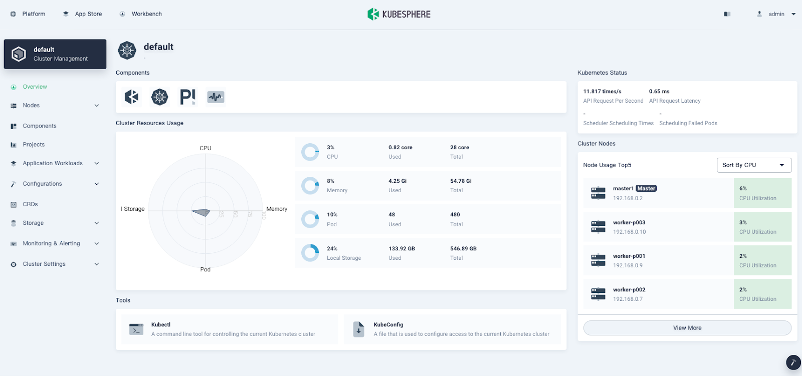

5. Install the TiDB Operator CustomResourceDefinition (CRD). [TiDB Operator](https://github.com/pingcap/tidb-operator) is an automatic operation system for TiDB clusters in Kubernetes. In the **Tools** section at the bottom of the page, click the **Kubectl** command line tool and enter the following command:

    

    ```shell
    kubectl apply -f https://raw.githubusercontent.com/pingcap/tidb-operator/v1.1.6/manifests/crd.yaml
    ```

    The output is shown below:

    ```shell
    # kubectl apply -f https://raw.githubusercontent.com/pingcap/tidb-operator/v1.1.6/manifests/crd.yaml
    customresourcedefinition.apiextensions.k8s.io/tidbclusters.pingcap.com created
    customresourcedefinition.apiextensions.k8s.io/backups.pingcap.com created
    customresourcedefinition.apiextensions.k8s.io/restores.pingcap.com created
    customresourcedefinition.apiextensions.k8s.io/backupschedules.pingcap.com created
    customresourcedefinition.apiextensions.k8s.io/tidbmonitors.pingcap.com created
    customresourcedefinition.apiextensions.k8s.io/tidbinitializers.pingcap.com created
    customresourcedefinition.apiextensions.k8s.io/tidbclusterautoscalers.pingcap.com created
    ```

6. [Create a new workspace](https://kubesphere.io/docs/quick-start/create-workspace-and-project/#task-2-create-a-workspace). In the upper left corner of the current page, click **Platform** to display the **Access Control** page. In **Workspaces**, click **Create** to create a new workspace and give it a name; for example, `dev-workspace`.

    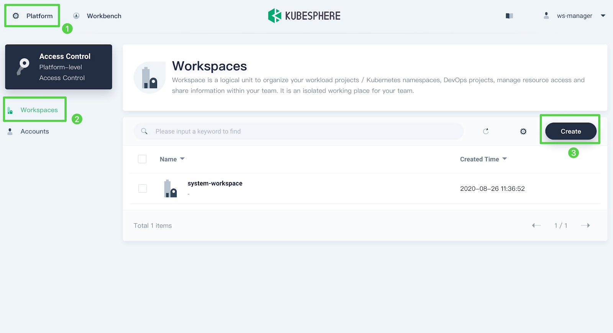

    In a workspace, users have various permissions to perform project tasks. Usually, a department-wide project requires a multi-tenant system so that everyone is responsible for their own part. In this tutorial, I use the admin account. Review [the official KubeSphere documentation](https://kubesphere.io/docs/quick-start/create-workspace-and-project/) to learn more about how the multi-tenant system works.

7. Go to the workspace you just created and add a KubeSphere application repository. Click **Add Repos**:

    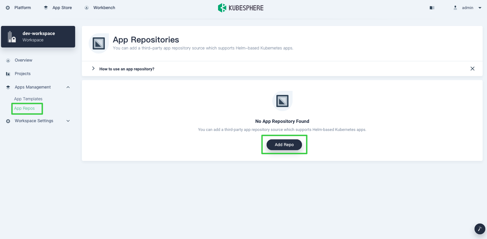

    KubeSphere provides two methods to add Helm charts: **App Templates** and **App Repos**. This article only talks about adding a KubeSphere application repository. You can also upload your own application templates and submit them to the KubeSphere App Store.

8. In the **Add App Repository** dialog box, and in the **URL** field add the PingCAP Helm repository ([https://charts.pingcap.org](https://charts.pingcap.org/)):

    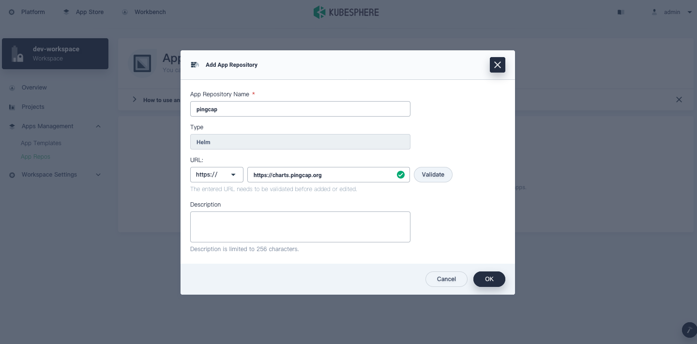

## Deploy TiDB Operator

[TiDB Operator](https://github.com/pingcap/tidb-operator) is an automatic operation system for TiDB clusters in Kubernetes. It provides a full management life-cycle for TiDB, including deployment, upgrades, scaling, backup, fail-over, and configuration changes. With TiDB Operator, TiDB can run seamlessly in Kubernetes clusters deployed on public or private clouds. Before you deploy a TiDB cluster, you should first deploy TiDB Operator on KubeSphere.

1. Create a project (also known as a namespace) to run the TiDB cluster. On the **Projects** page, click **Create**.
2. After the project is created, navigate to **Applications** and click **Deploy New Application**.
3. In the dialog box below, select **From App Templates**.

    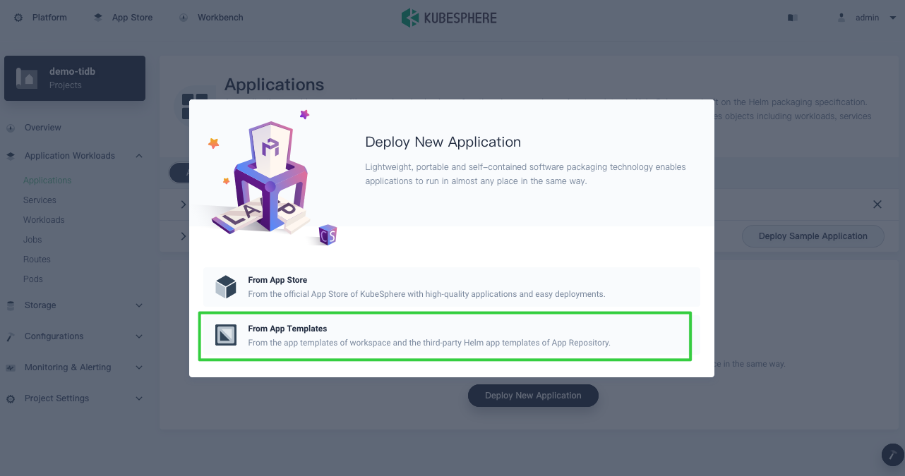

4. Deploy TiDB Operator. Switch to the PingCAP repository that stores multiple Helm charts and click **tidb-operator**.

    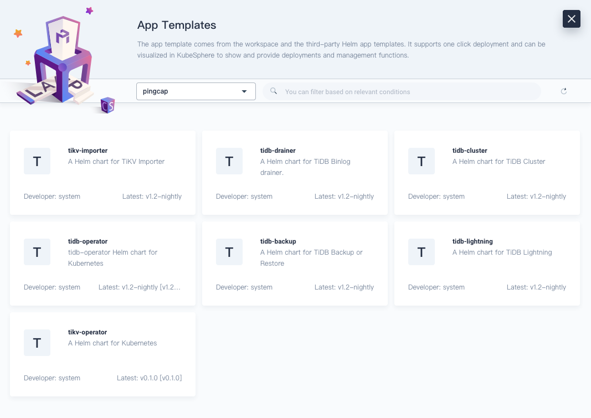

    Note: This article only demonstrates how to deploy TiDB Operator and TiDB clusters. You can also deploy other tools based on your needs.

5. On the **tidb-operator** page, select the **Chart Files** tab. You can view the configuration from the console directly or download the default `values.yaml` file. From the **Versions** drop-down menu on the right, select the version you want to install.

    

6. On the **Basic Info** page, confirm your app name, version, and deployment location.
7. On the **App Config** page, you can either edit the `values.yaml` file, or click **Deploy** directly with the default configurations.
8. On the **Applications** page, wait for TiDB Operator to be up and running.

    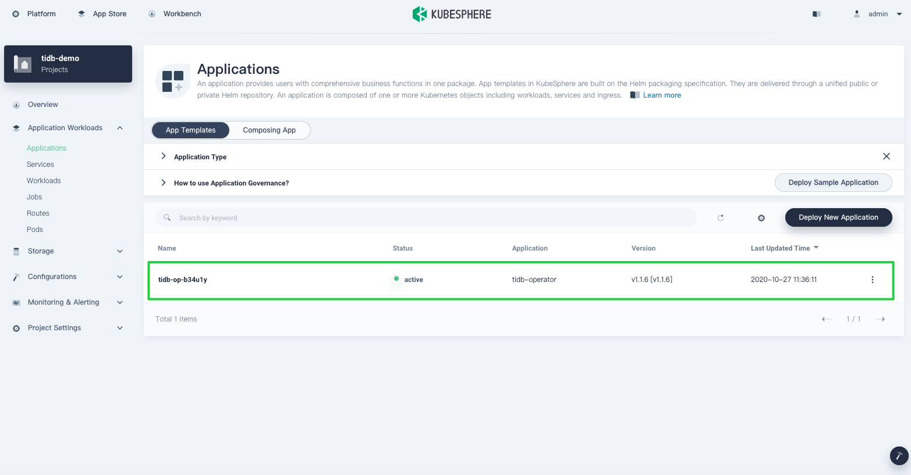

9. Verify your deployment. In **Workloads**, you can see two deployments created for TiDB Operator.

    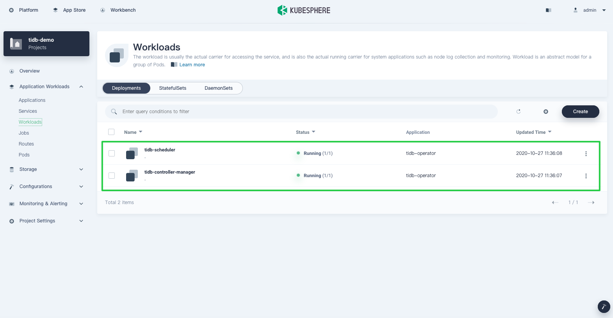

## Deploy a TiDB cluster

After you deploy TiDB Operator, you can deploy a TiDB cluster on Kubernetes. The process of deploying a TiDB cluster is similar to deploying TiDB Operator.

Note: If you have trouble deploying TiDB on KubeSphere, contact us on [GitHub]( https://github.com/kubesphere/kubesphere).

1. From the PingCAP repository, select **tidb-cluster**.
2. Switch to **Chart Files** and download the `values.yaml` file.
3. Select the [Container Storage Interface](https://github.com/container-storage-interface/) (CSI). In the `values.yaml` file, set `storageClassName` to `csi-standard`.

    Some TiDB components require persistent volumes. QingCloud Platform offers the following storage classes:

    ```shell
    / # kubectl get sc
    NAME                       PROVISIONER     RECLAIMPOLICY   VOLUMEBINDINGMODE   ALLOWVOLUMEEXPANSION   AGE
    csi-high-capacity-legacy   csi-qingcloud   Delete          Immediate           true                   71m
    csi-high-perf              csi-qingcloud   Delete          Immediate           true                   71m
    csi-ssd-enterprise         csi-qingcloud   Delete          Immediate           true                   71m
    csi-standard (default)     csi-qingcloud   Delete          Immediate           true                   71m
    csi-super-high-perf        csi-qingcloud   Delete          Immediate           true                   71m
    ```

    Because I installed KubeSphere through QKE, all of these storage components were deployed automatically. The QingCloud CSI plugin implements an interface between the CSI-enabled Container Orchestrator and QingCloud storage. For more information on the QingCloud CSI, see their [GitHub repository](https://github.com/yunify/qingcloud-csi).

    Note: In this tutorial, to provide external persistent storage, you only need to change the field `storageClassName`. If you want to deploy each TiDB component, such as [TiKV](https://docs.pingcap.com/tidb/dev/tidb-architecture#tikv-server) and [Placement Driver](https://docs.pingcap.com/tidb/dev/tidb-architecture#placement-driver-pd-server) (PD), to individual nodes, specify the field `nodeAffinity`.

4. Click **Deploy**. The Applications list displays two apps:

    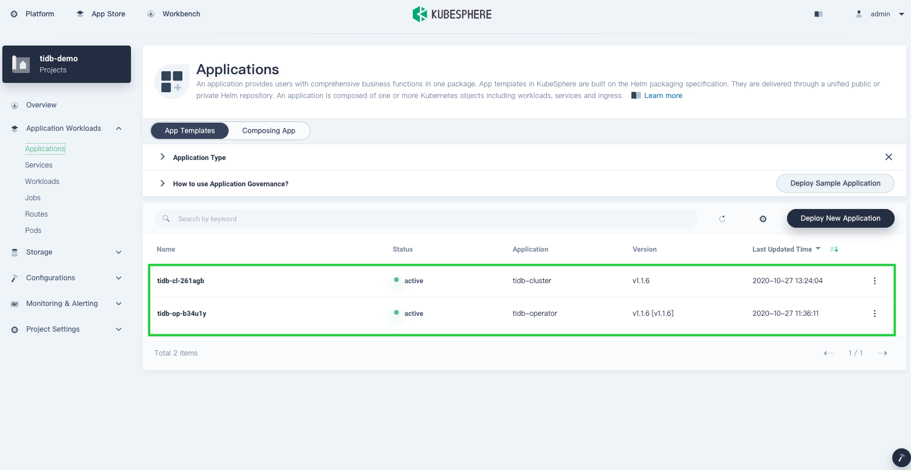

## View the cluster status

Now that we have our apps ready, we may need to focus more on observability. KubeSphere dashboard lets us observe applications throughout their lifecycle.

1. Verify that all TiDB cluster deployments are up and running. Navigate to **Workloads** > **Deployment** and note the status of each cluster.

    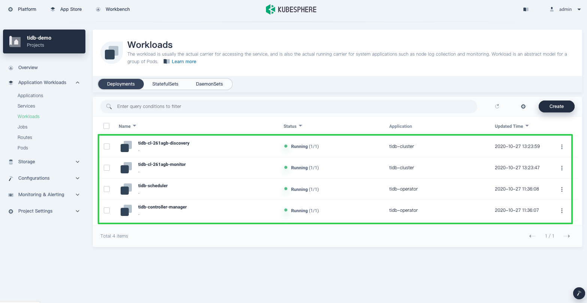

2. Verify the stateful applications: TiDB, TiKV and PD. TiKV and TiDB will be created automatically. It may take a while before they are displayed in the list.

    Click the **StatefulSets** tab. Click on a single StatefulSet item to display its details page. The page shows metrics in line charts over a period of time. The following is an example of TiDB metrics:

    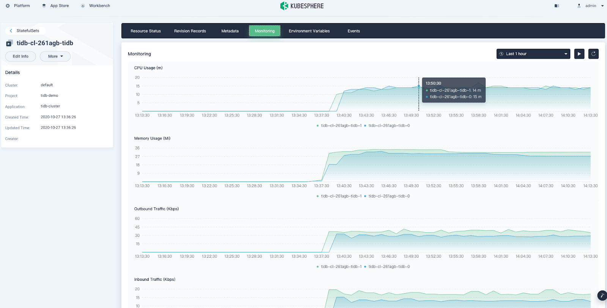

    This page also lists relevant **Pods**. As you can see, the TiDB cluster contains three PD Pods, two TiDB Pods, and three TiKV Pods.

    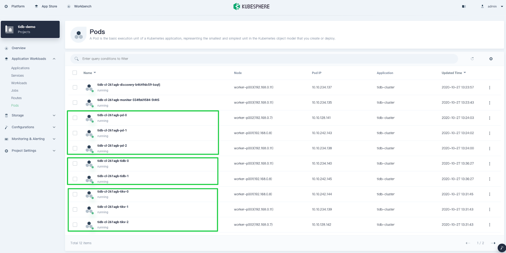

3. Go to the **Storage** section. You can see that TiKV and PD use persistent storage. This page also monitors Volume usage. Here is an example for TiKV:

    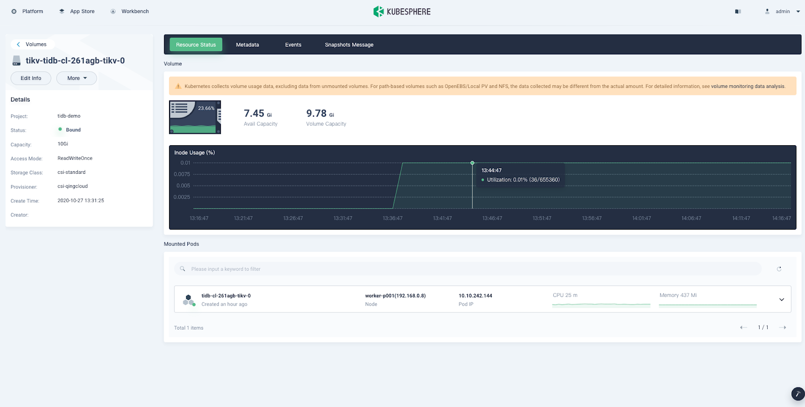

4. On the **Overview** page, you can see the resource usage for the current project.

    

## Access your TiDB cluster

Kubernetes lists the running services and the port each service is exposed to, so you can easily access them.

1. To display information on all services, navigate to **Application Workloads** > **Services**.

    Because the service type is set to `NodePort`, you can also access a service through the node IP address outside the cluster.

2. Optional: Test the connection to the database through MySQL client.

    

    ```shell
    [root@k8s-master1 ~]# docker run -it --rm mysql bash
    [root@0d7cf9d2173e:/# mysql -h 192.168.1.102 -P 32682 -u root
    Welcome to the MySQL monitor.  Commands end with ; or \g.
    Your MySQL connection id is 201
    Server version: 5.7.25-TiDB-v4.0.6 TiDB Server (Apache License 2.0) Community Edition, MySQL 5.7 compatible

    Copyright (c) 2000, 2020, Oracle and/or its affiliates. All rights reserved.

    Oracle is a registered trademark of Oracle Corporation and/or its affiliates. Other names may be trademarks of their respective owners.

    Type 'help;' or '\h' for help. Type '\c' to clear the current input statement.

    mysql> show databases;
    +--------------------+
    | Database           |
    +--------------------+
    | INFORMATION_SCHEMA |
    | METRICS_SCHEMA     |
    | PERFORMANCE_SCHEMA |
    | mysql              |
    | test               |
    +--------------------+
    5 rows in set (0.01 sec)

    mysql>
    ```

3. Access the monitoring dashboard. TiDB also integrates Prometheus and Grafana to monitor database cluster performance. As shown in the first step, Grafana is exposed through `NodePort`.

    After you [configure necessary port forwarding rules](https://docs.pingcap.com/tidb-in-kubernetes/dev/monitor-a-tidb-cluster#view-the-monitoring-dashboard) and open the Grafana port in security groups on QingCloud Platform, you can view metrics from the Grafana UI.

    Log in to the Grafana monitoring at `${Grafana-ip}:3000`. The default username and password are both `admin`.

    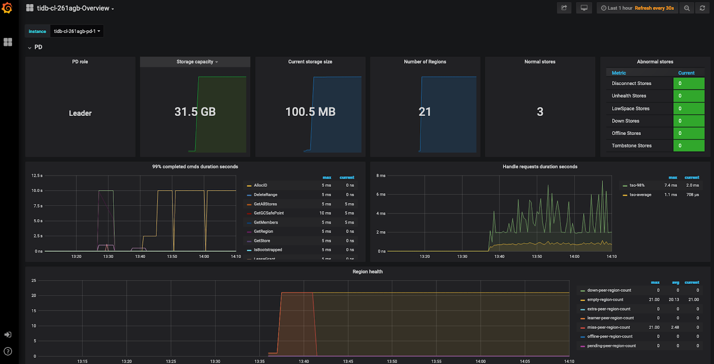

> **Note:**
>
> After you're done with your cluster, remember to delete all its resources; otherwise, you may receive a large bill for services you didn't use.

## Summary

I hope you have successfully deployed TiDB. Because TiDB and KubeSphere are such powerful tools for cloud-native applications, I cannot showcase all their features in a single post. For example, the application deployment function (described in [Deploy TiDB Operator](#deploy-tidb-operator) has much to offer for cloud-native enthusiasts like me. I will post another article on how to deploy TiDB by uploading Helm charts to the KubeSphere App Store.

If you have trouble deploying TiDB on KubeSphere, contact us on [GitHub](https://github.com/kubesphere/kubesphere).

## References

* [KubeSphere on GitHub](https://github.com/kubesphere/kubesphere)
* [KubeSphere Documentation](https://kubesphere.io/docs/)
* [TiDB on GitHub](https://github.com/pingcap/tidb)
* [TiDB Documentation](https://docs.pingcap.com/tidb/stable)
* [TiDB Operator Documentation](https://docs.pingcap.com/tidb-in-kubernetes/stable)
