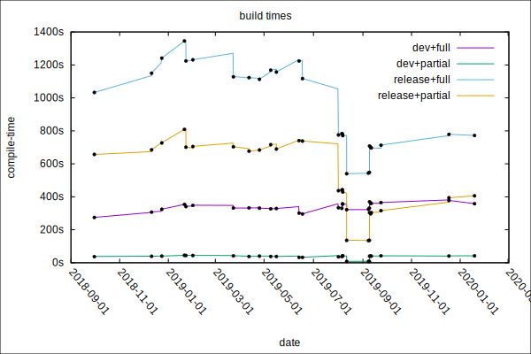

**Author:** [Brian Anderson](https://github.com/brson) (Senior Database Engineer at PingCAP)

**Editor:** [Calvin Weng](https://github.com/dcalvin)

_The Rust programming language was designed for slow compilation times._

I mean, that wasn't _the goal_. As is often cautioned in debates among their designers, programming language design is full of tradeoffs. One of those fundamental tradeoffs is **run-time performance** vs. **compile-time performance**, and the Rust team nearly always (if not always) chose run-time over compile-time.

So Rust compile times are bad. This is kinda infuriating, as almost everything that matters about Rust is pretty damn good. But Rust compile times are so, so bad.

## Rust Compile-time Adventures with TiKV: Episode 1

At [PingCAP](https://pingcap.com/), we develop our distributed storage system, [TiKV](https://github.com/tikv/tikv/), in Rust, and it compiles slow enough to discourage many in the company from using Rust. I recently spent some time, along with several others on the TiKV team and its wider community, investigating TiKV's compile times.

Over a series of posts, I'll discuss what we have learned:

- Why compiling Rust is slow, and/or feels slow;
- How Rust's development lead to slow compile-times;
- Compile-time use cases;
- Things we measured; things we want to measure but haven't or don't know how;
- Ideas that improved compile times;
- Ideas that did not improve compile times;
- How TiKV compile times have changed over time;
- Suggestions for how to organize Rust projects that compile fast;
- Recent and future upstream improvements to compile times.

In this episode:

* [The spectre of poor Rust compile times at PingCAP](#the-spectre-of-poor-rust-compile-times-at-pingcap)
* [Preview: the TiKV compile-time adventure so far](#preview-the-tikv-compile-time-adventure-so-far)
* [Rust's designs for poor compilation time](#rusts-designs-for-poor-compilation-time)
  * [Bootstrapping Rust](#bootstrapping-rust)
  * [(Un)virtuous cycles](#unvirtuous-cycles)
  * [Early decisions that favored run-time over compile-time](#early-decisions-that-favored-run-time-over-compile-time)
* [Recent work on Rust compile times](#recent-work-on-rust-compile-times)
* [In the next episode](#in-the-next-episode)
* [Thanks](#thanks)

## The spectre of poor Rust compile times at PingCAP

At [PingCAP](https://pingcap.com/), my colleagues use Rust to write [TiKV](https://github.com/tikv/tikv/), the storage node of [TiDB](https://github.com/pingcap/tidb), our distributed database. They do this because they want this most important node in the system to be fast and reliable by construction, at least to the greatest extent reasonable.

It was mostly a great decision, and most people internally are mostly happy about it.

But many complain about how long it takes to build. For some, a full rebuild might take 15 minutes in development mode, and 30 minutes in release mode. To developers of large systems projects, this might not sound so bad, but it's much slower than what many developers expect out of modern programming environments. TiKV is a relatively large Rust codebase, with 2 million lines of Rust. In comparison, Rust itself contains over 3 million lines of Rust, and [Servo](https://github.com/servo/servo) contains 2.7 million (see [full line counts here](https://gist.github.com/brson/31b6f8c5467b050779ce9aa05d41aa84)).

Other nodes in TiDB are written in Go, which of course comes with a different set of advantages and disadvantages from Rust. Some of the Go developers at PingCAP resent having to wait for the Rust components to build. They are used to a rapid build-test cycle.

Rust developers, on the other hand, are used to taking a lot of coffee breaks (or tea, cigarettes, sobbing, or whatever as the case may be — Rust developers have the spare time to nurse their demons).

## Preview: The TiKV Compile-time adventure so far

The first entry in this series is just a story about the history of Rust with respect to compilation time. Since it might take several more entries before we dive into concrete technical details of what we've done with TiKV's compile times, here's a pretty graph to capture your imagination, without comment.

 Rust Compile Times for TiKV 

## Rust's designs for poor compilation time

Rust was designed for slow compilation times.

I mean, that wasn't _the goal_. As is often cautioned in debates among their designers, programming language design is full of tradeoffs. One of those fundamental tradeoffs is **run-time performance** vs. **compile-time performance**, and the Rust team nearly always (if not always) chose run-time over compile-time.

The intentional run-time/compile-time tradeoff isn't the only reason Rust compile times are horrific, but it's a big one. There are also language designs that are not crucial for run-time performance, but accidentally bad for compile-time performance. The Rust compiler was also implemented in ways that inhibit compile-time performance.

So there are intrinsic language-design reasons and accidental language-design reasons for Rust's bad compile times. Those mostly can't be fixed ever, although they may be mitigated by compiler improvements, design patterns, and language evolution. There are also accidental compiler-architecture reasons for Rust's bad compile times, which can generally be fixed through enormous engineering effort and time.

If fast compilation time was not a core Rust design principle, what were Rust's core design principles? Here are a few:

* _Practicality_ — it should be a language that can be and is used in the real world.
* _Pragmatism_ — it should admit concessions to human usability and integration into systems as they exist today.
* _Memory-safety_ — it must enforce memory safety, and not admit segmentation faults and other such memory-access violations.
* _Performance_ — it must be in the same performance class as C++.
* _Concurrency_ — it must provide modern solutions to writing concurrent code.

But it's not like the designers didn't put _any_ consideration into fast compile times. For example, for any analysis Rust needs to do, the team tried to ensure reasonable bounds on computational complexity. Rust's design history though is one of increasingly being sucked into a swamp of poor compile-time performance.

Story time.

### Bootstrapping Rust

I don't remember when I realized that Rust's bad compile times were a strategic problem for the language, potentially a fatal mistake in the face of competition from future low-level programming languages. For the first few years, hacking almost entirely on the Rust compiler itself, I wasn't too concerned, and I don't think most of my peers were either. I mostly remember that Rust compile time was always bad, and like, whatever, I can deal with that.

When I worked daily on the Rust compiler, it was common for me to have at least three copies of the repository on the computer, hacking on one while all the others were building and testing. I would start building workspace 1, switch terminals, remember what's going on over here in workspace 2, hack on that for a while, start building in workspace 2, switch terminals, etc. Little flow, constant context switching.

This was (and probably is) typical of other Rust developers too. I still do the same thing hacking on TiKV today.

So, historically, how bad have Rust compile times been? A simple barometer here is to see how Rust's self-hosting times have changed over the years, which is the time it takes Rust to build itself. Rust building itself is not directly comparable to Rust building other projects, for a variety of reasons, but I think it will be illustrative.

The [first Rust compiler](https://gist.github.com/brson/31b6f8c5467b050779ce9aa05d41aa84/edit), from 2010, called rustboot, was written in OCaml, and it's ultimate purpose was to build a second compiler, rustc, written in Rust, and begin the self-hosting bootstrap cycle. In addition to being written in Rust, rustc would also use [LLVM](https://llvm.org/) as its backend for generating machine code, instead of rustboot's hand-written x86 code-generator.

Rust needed to become self-hosting as a means of "dog-fooding" the language — writing the Rust compiler in Rust meant that the Rust authors needed to use their own language to write practical software early in the language design process. It was hoped that self-hosting could lead to a useful and practical language.

The first time Rust built itself was on April 20, 2011. [It took one hour](https://mail.mozilla.org/pipermail/rust-dev/2011-April/000330.html), which was a laughably long time. At least it was back then.

That first super-slow bootstrap was an anomaly of bad code-generation and other easily fixable early bugs (probably, I don't exactly recall). rustc's performance quickly improved, and Graydon quickly [threw away the old rustboot compiler](https://github.com/rust-lang/rust/commit/6997adf76342b7a6fe03c4bc370ce5fc5082a869) since there was nowhere near enough manpower and motivation to maintain parallel implementations.

This is where the long, gruelling history of Rust's tragic compile times began, 11 months after it was initially released in June 2010.

> **Note:**
>
> I wanted to share historic self-hosting times here, but after many hours and obstacles attempting to build Rust revisions from 2011, I finally gave up and decided I just had to publish this piece without them. Instead, here are some madeup numbers:
>
>* _7 femto-bunnies_ - rustboot building Rust prior to being retired
>* _49 kilo-hamsters_ - rustc building Rust immediately after rustboot's retirement
>* _188 giga-sloths_ - rustc building Rust in 2020

Anyway, last time I bootstrapped Rust a few months ago, it took over five hours.

The Rust language developers became acclimated to Rust's poor self-hosting times and failed to recognize or address the severity of the problem of bad compile times during Rust's crucial early design phase.

    <a href="https://share.hsforms.com/1e2W03wLJQQKPd1d9rCbj_Q2npzm" onclick="trackViews('The Rust Compilation Model Calamity', 'subscribe-blog-btn-middle')"><button>Subscribe to Blog</button></a>

### (Un)virtuous cycles

In the Rust project, we like processes that reinforce and build upon themselves. This is one of the keys to Rust's success, both as a language and a community.

As an obvious, hugely-successful example, consider [Servo](https://github.com/servo/servo). Servo is a web browser built in Rust, and Rust was created with the explicit purpose of building Servo. Rust and Servo are sister-projects. They were created by the same team (initially), at roughly the same time, and they evolved together. Not only was Rust built to create Servo, but Servo was built to inform the design of Rust.

The initial few years of both projects were extremely difficult, with both projects evolving in parallel. The often-used metaphor of the [Ship of Theseus](https://en.wikipedia.org/wiki/Ship_of_Theseus) is apt - we were constantly rebuilding Rust in order to sail the seas of Servo. There is no doubt that the experience of building Servo with Rust while simultaneously building the language itself led directly to many of the good decisions that make Rust the practical language it is.

Here are some cursory examples of the Servo-Rust feedback loop:

* Labeled break and continue [was implemented in order to auto-generate an HTML parser](https://github.com/rust-lang/rust/issues/2216).
* Owned closures [were implemented after analyzing closure usage in Servo](https://github.com/rust-lang/rust/issues/2549#issuecomment-19588158).
* External function calls used to be considered safe. [This changed in part due to experience in Servo](https://github.com/rust-lang/rust/issues/2628#issuecomment-9384243).
* The migration from green-threading to native threading was informed by the experience of building Servo, observing the FFI overhead of Servo's SpiderMonkey integration, and profiling "hot splits", where the green thread stacks needed to be expanded and contracted.

The co-development of Rust and Servo created a [virtuous cycle](https://en.wikipedia.org/wiki/Virtuous_circle_and_vicious_circle) that allowed both projects to thrive. Today, Servo components are deeply integrated into Firefox, ensuring that Rust cannot die while Firefox lives.

Mission accomplished.

The previously-mentioned early self-hosting was similarly crucial to Rust's design, making Rust a superior language for building Rust compilers. Likewise, Rust and [WebAssembly](https://webassembly.org/) were developed in close collaboration (the author of [Emscripten](https://github.com/emscripten-core/emscripten), the author of [Cranelift](https://github.com/CraneStation/cranelift), and I had desks next to each other for years), making WASM an excellent platform for running Rust, and Rust well-suited to target WASM.

Sadly there was no such reinforcement to drive down Rust compile times. The opposite is probably true — the more Rust became known as a _fast_ language, the more important it was to be _the fastest_ language. And, the more Rust's developers got used to developing their Rust projects across multiple branches, context switching between builds, the less pressure was felt to address compile times.

This only really changed once Rust 1.0 was released in 2015 and started to receive wider use.

For years Rust [slowly boiled](https://en.wikipedia.org/wiki/Boiling_frog) in its own poor compile times, not realizing how bad it had gotten until it was too late. It was 1.0. Those decisions were locked in.

Too many tired metaphors in this section. Sorry about that.

### Early decisions that favored run-time over compile-time

If Rust is designed for poor compile time, then what are those designs specifically? I describe a few briefly here. The next episode in this series will go into further depth. Some have greater compile-time impact than others, but I assert that all of them cause more time to be spent in compilation than alternative designs.

Looking at some of these in retrospect, I am tempted to think that "well, of course Rust _must_ have feature _foo_", and it's true that Rust would be a completely different language without many of these features. However, language designs are tradeoffs and none of these were predestined to be part of Rust.

* _Borrowing_ — Rust's defining feature. Its sophisticated pointer analysis spends compile-time to make run-time safe.

* _Monomorphization_ — Rust translates each generic instantiation into its own machine code, creating code bloat and increasing compile time.

* _Stack unwinding_ — stack unwinding after unrecoverable exceptions traverses the callstack backwards and runs cleanup code. It requires lots of compile-time book-keeping and code generation.

* _Build scripts_ — build scripts allow arbitrary code to be run at compile-time, and pull in their own dependencies that need to be compiled. Their unknown side-effects and unknown inputs and outputs limit assumptions tools can make about them, which e.g. limits caching opportunities.

* _Macros_ — macros require multiple passes to expand, expand to often surprising amounts of hidden code, and impose limitations on partial parsing. Procedural macros have negative impacts similar to build scripts.

* _LLVM backend_ — LLVM produces good machine code, but runs relatively slowly.

* _Relying too much on the LLVM optimizer_ — Rust is well-known for generating a large quantity of LLVM IR and letting LLVM optimize it away. This is exacerbated by duplication from monomorphization.

* _Split compiler/package manager_ — although it is normal for languages to have a package manager separate from the compiler, in Rust at least this results in both cargo and rustc having imperfect and redundant information about the overall compilation pipeline. As more parts of the pipeline are short-circuited for efficiency, more metadata needs to be transferred between instances of the compiler, mostly through the filesystem, which has overhead.

* _Per-compilation-unit code-generation_ — rustc generates machine code each time it compiles a crate, but it doesn't need to — with most Rust projects being statically linked, the machine code isn't needed until the final link step. There may be efficiencies to be achieved by completely separating analysis and code generation.

* _Single-threaded compiler_ — ideally, all CPUs are occupied for the entire compilation. This is not close to true with Rust today. And with the original compiler being single-threaded, the language is not as friendly to parallel compilation as it might be. There are efforts going into parallelizing the compiler, but it may never use all your cores.

* _Trait coherence_ — Rust's traits have a property called "coherence", which makes it impossible to define implementations that conflict with each other. Trait coherence imposes restrictions on where code is allowed to live. As such, it is difficult to decompose Rust abstractions into, small, easily-parallelizable compilation units.

* _Tests next to code_ — Rust encourages tests to reside in the same codebase as the code they are testing. With Rust's compilation model, this requires compiling and linking that code twice, which is expensive, particularly for large crates.

## Recent work on Rust compile times

The situation isn't hopeless. Not at all. There is always work going on to improve Rust compile times, and there are still many avenues to be explored. I'm hopeful that we'll continue to see improvements. Here is a selection of the activities I'm aware of from the last year or two. Thanks to everybody who helps with this problem.

* The Rust compile-time [master issue](https://github.com/rust-lang/rust/issues/48547)
  * Tracks various work to improve compile times
  * Contains a great overview of factors that affect Rust compilation performance and potential mitigation strategies
* Pipelined compilation ([1](https://github.com/rust-lang/rust/issues/60988),[2](https://github.com/rust-lang/cargo/issues/6660),[3](https://internals.rust-lang.org/t/evaluating-pipelined-rustc-compilation/10199))

  * Typechecks downstream crates in parallel with upstream codegen. Now on by default on the stable channel
  * Developed by [@alexcrichton](https://github.com/alexcrichton) and [@nikomatsakis](https://github.com/nikomatsakis).
* Parallel rustc ([1](https://internals.rust-lang.org/t/parallelizing-rustc-using-rayon/6606),[2](https://github.com/rust-lang/rust/issues/48685),[3](https://internals.rust-lang.org/t/help-test-parallel-rustc/11503/14))

  * Runs analysis phases of the compiler in parallel. Not yet available on the stable channel
  * Developed by [@Zoxc](https://github.com/Zoxc), [@michaelwoerister](https://github.com/michaelwoerister), [@oli-obk](http://github.com/oli-obk), and others
* [MIR-level constant propagation](https://blog.rust-lang.org/inside-rust/2019/12/02/const-prop-on-by-default.html)
  * Performs constant propagation on MIR, which reduces duplicated LLVM work on monomorphized functions
  * Developed by [@wesleywiser](https://github.com/wesleywiser)
* [MIR optimizations](https://github.com/rust-lang/rust/pulls?q=mir-opt)
  * Optimizing MIR should be faster than optimizing monomorphized LLVM IR
  * Not in stable compilers yet
  * Developed by [@wesleywiser](https://github.com/wesleywiser) and others
* cargo build -Ztimings ([1](https://internals.rust-lang.org/t/exploring-crate-graph-build-times-with-cargo-build-ztimings/10975),[2](https://github.com/rust-lang/cargo/issues/7405))

  * Collects and graphs information about cargo's parallel build timings
  * Developed by [@ehuss](https://github.com/ehuss) and [@luser](https://github.com/luser)
* rustc -Zself-profile ([1](https://rust-lang.github.io/rustc-guide/profiling.html),[2](https://github.com/rust-lang/rust/issues/58967),[3](https://github.com/rust-lang/rust/pull/51657))

  * Generates detailed information about rustc's internal performance
  * Developed by [@wesleywiser](https://github.com/wesleywiser) and [@michaelwoerister](https://github.com/michaelwoerister)
* [Shared monomorphizations](https://github.com/rust-lang/rust/issues/47317)
  * Reduces code bloat by deduplicating monomorphizations that occur in multiple crates
  * Enabled by default if the optimization level is less than 3.
  * Developed by [@michaelwoerister](https://github.com/michaelwoerister)
* [Cranelift backend](https://www.reddit.com/r/rust/comments/enxgwh/cranelift_backend_for_rust/)
  * Reduced debug compile times by using [cranelift](https://github.com/bytecodealliance/cranelift) for code generation.
  * Developed by [@bjorn3](https://github.com/bjorn3)
* [perf.rust-lang.org](https://perf.rust-lang.org/)
  * Rust's compile-time performance is tracked in detail. Benchmarks continue to be added.
  * Developed by[@nrc](https://github.com/nrc), [@Mark-Simulacrum](https://github.com/Mark-Simulacrum), [@nnethercote](https://github.com/nnethercote) and many more
* [cargo-bloat](https://github.com/RazrFalcon/cargo-bloat)
  * Finds what occupies the most space in binaries. Bloat is correlated with compile time
  * Developed by [@RazrFalcon](https://github.com/RazrFalcon) and others
* [cargo-feature-analyst](https://github.com/psinghal20/cargo-feature-analyst)
  * Finds unused features
  * Developed by [@psinghal20](https://github.com/psinghal20)
* [cargo-udeps](https://github.com/est31/cargo-udeps)
  * Finds unused crates
  * Developed by [@est31](https://github.com/est31)
* [twiggy](https://github.com/rustwasm/twiggy)
  * Profiles code size, which is correlated with compile time
  * Developed by [@fitzgen](https://github.com/fitzgen), [@data-pup](https://github.com/data-pup), and others
* [rust-analyzer](https://github.com/rust-analyzer/rust-analyzer)
  * A new language server for Rust with faster response time than the original [RLS](https://github.com/rust-lang/rls)
  * Developed by [@matklad](https://github.com/matklad), [@flodiebold](https://github.com/flodiebold), [@kjeremy](https://github.com/kjeremy), and many others
* ["How to alleviate the pain of Rust compile times"](https://vfoley.xyz/rust-compile-speed-tips/)
  * Blog post by vfoley
* ["Thoughts on Rust bloat"](https://raphlinus.github.io/rust/2019/08/21/rust-bloat.html)
  * Blog post by [@raphlinus](https://github.com/raphlinus)
* Nicholas Nethercote's work on rustc optimization

  * ["How to speed up the Rust compiler in 2019"](https://blog.mozilla.org/nnethercote/2019/07/17/how-to-speed-up-the-rust-compiler-in-2019/)
  * ["The Rust compiler is still getting faster"](https://blog.mozilla.org/nnethercote/2019/07/25/the-rust-compiler-is-still-getting-faster/)
  * ["Visualizing Rust compilation"](https://blog.mozilla.org/nnethercote/2019/10/10/visualizing-rust-compilation/)
  * ["How to speed up the Rust compiler some more in 2019"](https://blog.mozilla.org/nnethercote/2019/10/11/how-to-speed-up-the-rust-compiler-some-more-in-2019/)
  * ["How to speed up the Rust compiler one last time in 2019"](https://blog.mozilla.org/nnethercote/2019/12/11/how-to-speed-up-the-rust-compiler-one-last-time-in-2019/)

I apologize to any person or project I didn't credit.

## In the next episode

So Rust dug itself deep into a corner over the years and will probably be digging itself back out until the end of time (or the end of Rust — same thing, really). Can Rust compile-time be saved from Rust's own run-time success? Will TiKV ever build fast enough to satisfy my managers?

In the next episode, we'll deep-dive into [the specifics of Rust's language design that cause it to compile slowly](https://pingcap.com/blog/rust-compilation-model-calamity).

Stay Rusty, friends.

## Thanks

A number of people helped with this blog series. Thanks especially to Niko Matsakis, Graydon Hoare, and Ted Mielczarek for their insights, and Calvin Weng for proofreading and editing.

## About the author

[**Brian Anderson**](https://github.com/brson) is one of the co-founders of the Rust programming language and its sister project, the Servo web browser. He is now working in PingCAP as a senior database engineer.
