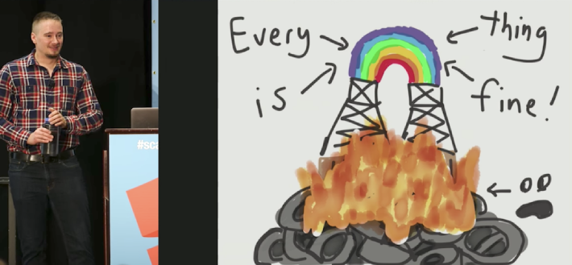

<center> Image source: [Jepsen Offers System-Wide Approach to Testing Databases at Scale](https://thenewstack.io/jepsen-offers-system-wide-approach-testing-databases-scale/) </center> 

When [Jepsen](https://jepsen.io/) appeared in the industry several years ago we couldn't have been happier. Finally, an approachable, understandable reliability testing framework along with an enjoyable and rigorous library of analyses of popular databases.

Jepsen is an umbrella term for the software library, collection of articles, and service of the same name. Together, the project pushes distributed systems to be more accurate in their claims and more thorough in their testing.

It's been indispensable for battle-testing TiDB, our distributed NewSQL database, as we deploy it in some of the largest technology companies in the world.

This article is, in many ways, a love letter to one of our favorite projects. We'll talk about [why it's important](#why-is-jepsen-so-important-to-our-industry), [how it works](#how-does-jepsen-work), [common issues found](#commonly-found-problems), [how we use Jepsen](#how-we-use-jepsen-with-tidb), and finally we included a really [short summary of all the problems Jepsen has found](#appendix-i).

In the rest of this article, and in any Jepsen analyses you might find, you're going to find a lot of database jargon. Jepsen has our back! [Located here](https://jepsen.io/consistency) you can see definitions and explanations of many of these terms.

We'll refer to [*serializability*](https://jepsen.io/consistency/models/serializable) and [*linearizability*](https://jepsen.io/consistency/models/linearizable) often below, so you may benefit from quickly (re)familiarizing yourself with them.

## Why is Jepsen so important to our industry?

Testing a distributed system like [TiDB](https://en.wikipedia.org/wiki/TiDB) isn't easy! Because these systems depend on multiple nodes coordinating there is a lot of room for failures. Networks and hardware aren't reliable, and when multiple nodes are involved, the probability of failure is much higher. Even still, deployments (and even nodes!) are highly variable in scale, OS, hardware, and workloads. It's impossible to test all of them.

Is all hope lost? No! In [Why Is Random Testing Effective for Partition Tolerance Bugs?](https://people.mpi-sws.org/~fniksic/popl2018/paper.pdf) Majumdar and Niksic formalized many failure scenarios and discussed how even a small, random subset of possibilities can be sufficient to achieve a specific coverage goal.

It's fairly rare to see projects and articles tackling the same kind of content as Jepsen. Vendors aren't always honest (by mistake or not) about what they do and don't guarantee. Projects like Jepsen, produced independently and rigorously, that test these claims are reinvigorating when compared to often banal marketing copy.

The Jepsen library helps automate and reproduce test cases, allowing the testers and readers to reproduce results for themselves.

## How does Jepsen work?

Many projects use the Jepsen library to test their systems before a Jepsen analysis, or never undergo an analysis while still using the Jepsen framework.

This is great. This is the goal:

> Jepsen is an effort to improve the safety of distributed databases, queues, consensus systems, etc. 

-- [The Jepsen website](https://jepsen.io/)

When a project wishes to improve themselves, a Jepsen analysis places the Jepsen framework in the hands of an expert operator who improves and expands the test suite. Often this involves adding aggressive failure scenarios or entirely new complex tests.

### Jepsen (the framework)

The tool itself, also called Jepsen, is a Clojure framework used to set up distributed systems tests, run operations against them, and verify the operation history is sane and possible given the claims of the project. Then, it can generate some nice graphs out of that data.

> It's kind of like a really flexible failure-injecting fuzzer.

In many cases, Jepsen tests for *linearizability* by using [Knossos](https://github.com/jepsen-io/knossos) to prove that a given history (from a test) is non-linearizable. Jepsen also frequently tests for timing-related issues using [libfaketime](https://github.com/jepsen-io/libfaketime) to create clock skew.

Jepsen itself doesn't rigorously enforce any specific tests, it's **up to the tester to determine which claims, under which conditions, they wish to attempt to disprove**. Once these claims are written, the framework can attempt to find examples in invalid states.

While the specifics of tests are up to the author, there is a common suite of tests for testing certain claims, such as how required for *snapshot isolation* or *sequential consistency*.

Common tests include:

* **Bank:** simulated bank accounts including transfers between accounts (using transactions).

    - Claim: the total of all accounts should be consistent.
    - Required for: snapshot isolation.

* **Monotonic:** a counter which increments over time.

    - Claim: successive reads of that value by any single client should observe monotonically increasing transaction timestamps and values.
    - Required for: monotonicity.

* **Register:** read, writes, and compare-and-swap operations on registers.
	
    - Claim: the operations should be linearizable (according to Knossos).
    - Required for: snapshot isolation.

* **Set:** unique integers inserted as rows in a table.

    - Claim: concurrent reads should include all present values at any given time and at any later time.
    - Note: a stricter variant requires immediate visibility instead of allowing stale reads.

* **Long Fork:** non-intersecting transactions are run concurrently.

    - Claim: transactions happen in *some* specific order for future reads.
    - Prohibited in: [snapshot isolation](https://jepsen.io/consistency/models/snapshot-isolation) (Prefix property).
    - Allowed in: parallel snapshot isolation.

* **Sequential:** in one process, perform two write transactions (`write_1` then `write_2`), concurrently read in the reverse order.

    - Claim: no instances where `write_2` is present before `write_1` should be discovered.
    - Required for: sequential Consistency.

In addition to these tests, Jepsen uses *Nemeses*, an error injection tool which introduces failures to a system. A Nemesis can create partitions, fail processes, and cause other types of actions.

Here's an example of some nemeses that do partitioning:

* `partition-halves`: Cuts the network into two halves, a majority and a minority.
* `random-partition-halves`: Cuts the network into two randomly chosen halves.
* `partition-random-node`: Isolates a random node from the rest of the network. 

### Jepsen (the analysis)

When a project requests a Jepsen analysis from Jepsen, they're actually asking Jepsen to verify the claims the system makes, rather than check the system against a rigorous, formal model or set of requirements. E.g., if the project claims to withstand single node failures, then Jepsen can test that. In many cases, the project (or a possible customer) is funding some or all of the work.

All of this is quite important. This means Jepsen analyses aren't just someone "dunking" on a project. Moreover, Jepsen is validating the claims the project makes in its own documentation.

## Commonly found problems

While not all analyses map directly to specific suites, tests, or claims, there were some problems that just seem to keep popping up!

### Responding too early

When you write data to disk, it isn't immediately persistent on the disk. Instead, the data will be held in a buffer until it is "flushed" to disk. In the event of a failure, the data in the buffer may be lost, corrupted, or partially written. Therefore, in systems which promise no data loss, writes must be flushed before they can be acknowledged.

There were cases like in [ElasticSearch 1.1.0](https://aphyr.com/posts/317-jepsen-elasticsearch) where writes were not fsynced by default. In these cases, for either performance reasons or mistakenly, a system responded prior to fsync. This created write loss during node failures.

A good way to test this yourself is to kill nodes at the start of a network write, then validate if the data was saved in the node on recovery.

### Membership Changes are hard

Over time, a distributed system is likely to grow, shrink, or otherwise change its membership to accommodate maintenance and load. These phases of transition often involve periods of hand-off, where failures may expose previously undiscovered bugs.

In the [RethinkDB configuration](https://jepsen.io/analyses/rethinkdb-2-2-3-reconfiguration) analysis, Jepsen built a nemesis that would interact with RethinkDB's reconfiguration API to reconfigure the cluster. Then, in conjunction with another nemesis that creates partitions, Jepsen was able to create very aggressive membership change tests.

In several cases, testing for more aggressive error modes during these times of transition lead to the discovery of subtle bugs. In RethinkDB, a split-brain (multiple competing sub-clusters) could happen during transition, requiring emergency repairs by a human operator.

### Split brains from a bridge

Split brains were a regular problem in many Jepsen analyses. A split-brain occurs when a cluster somehow promotes multiple leaders in a cluster that should only have a single leader.

While many projects test trivial partition scenarios (such as `{A,B,C,D,E}` becoming `{A,B,C},{D, E}`), there were cases, such as Elasticsearch testing a "bridge", where nodes on each side of a partition were only partially disconnected, yielding split brains.
 
An example of this is `{A,B,C,D,E}` becoming `{A,B,C},{C,D,E}`, where `C` is a bridge between the two partitions.

```markdown
A - C - E
 \ / \ /
  B   D
```

Intuitively, we can see from the diagram that `C` should probably be the elected leader. It's totally connected. But this isn't always what happens.

In [Zendisco (2014)](https://aphyr.com/posts/317-call-me-maybe-elasticsearch), Elasticsearch's membership system, there was no invariant preventing two leaders from existing, so it was possible for two nodes to believe themselves to be in a majority, and become elected leaders.

### Poor behavior on failed connections

Some projects suffered from connection behaviors that are not ideal for operators. TiKV issue [#4500](https://github.com/tikv/tikv/issues/4500) is an interesting example of this. TiKV 2.1.7 would retry a failed PD connection for up to 60 seconds on startup. However, if it lost connection to PD while online, it would retry until recovery.

In this case, if PD failed, then TiKV failed before PD recovered. This could lead to a state where TiKV nodes would never recover.

Here's an example of a problematic case involving 1 TiKV node, and 1 PD node:

```rust
kill(pd);
restart(tikv);
sleep(61_000);
recover(pd);
// TiKV never recovers connection.
```

[Dgraph behaved similarly](https://jepsen.io/analyses/dgraph-1-0-2) with interactions between it's Alpha and Zero nodes.

### Inappropriate retries

Both CockroachDB and TiDB recently were shown to have issues where they could improperly retry a transaction using a newer timestamp. In CockroachDB, this could result in duplicate writes. In TiDB, this could lead to read skew or lost updates, as indicated by a drifting total in the bank test.

In TiDB's case, these could occur under the default configuration for two reasons:

* When one transaction conflicts with another, TiDB would automatically retry the transaction. ([10075](https://github.com/pingcap/tidb/issues/10075), [10076](https://github.com/pingcap/tidb/issues/10076))
* If TiDB lost connection to PD, TiDB would also retry. ([10495](https://github.com/pingcap/tidb/issues/10495), [4500](https://github.com/tikv/tikv/issues/4500), [10470](https://github.com/pingcap/tidb/issues/10470))

### Misleading or incorrect advertising

Projects like Aerospike suffered from making obviously false claims such as "100% Uptime" on their marketing pages. These sorts of claims ultimately only are a detriment to the project's credibility. These sorts of claims show either deliberate lying, or lack of knowledge about fundamental principles.

Jepsen testing showed in these cases that these claims were too good to be true. These kinds of problems remind us all to properly evaluate systems for our needs, instead of trusting in marketing copy.

### Incorrect claims by developers

Often, Jepsen analyses test claims or "sanctioned use cases" by the developers. For example, RabbitMQ developers [claimed](https://www.rabbitmq.com/blog/2014/02/19/distributed-semaphores-with-rabbitmq/) to support distributed semaphores but was not able to provide the common guarantees associated with these structures. In the case of NuoDB, a developer made [bold claims](https://groups.google.com/forum/#!msg/cloud-computing/nn7Sw5T0eSE/NxOTUwD_0ykJ) about the database's capabilities in relation to the CAP theorem.

While these claims aren't sitting on the glossy marketing pages of the product, it's common for developers to reference official blogs and mailing lists when learning the capabilities and limits of a system. Developers of a project are typically considered trustworthy sources of knowledge about their product, so claims they make are often taken as true by users.

## Interesting notes

During my review of Jepsen history, some interesting notes came up that may be of your interest. Here are a few of them that may hopefully encourage you to read the analyses for yourself.

### Serializability vs strict serializability: casual reverse

In the [CockroachDB analysis](https://jepsen.io/analyses/cockroachdb-beta-20160829), Jepsen talks about the differences between [*strict serializability*](https://jepsen.io/consistency/models/strict-serializable) and *serializability*. Serializability, but not “strict serializability”, means it was possible for reads to fail to observe the most recent transactions.

Strict serializability means that operations should appear to have some order consistency with the real-time ordering. It implies both serializability and linearizability.

<div class="trackable-btns">
    <a href="/download" onclick="trackViews('Safety First! Common Safety Pitfalls in Distributed Databases Found by Jepsen Tests', 'download-tidb-btn-middle')"><button>Download TiDB</button></a>
    <a href="https://share.hsforms.com/1e2W03wLJQQKPd1d9rCbj_Q2npzm" onclick="trackViews('Safety First! Common Safety Pitfalls in Distributed Databases Found by Jepsen Tests', 'subscribe-blog-btn-middle')"><button>Subscribe to Blog</button></a>
</div>

### Error message compatibility

In [ElasticSearch - 2014-06-15 - 1.1.0](https://aphyr.com/posts/317-call-me-maybe-elasticsearch) it was noted that different JVMs serialize classes differently (e.g., InetAddress), meaning it was possible clients and servers would be unable to correctly communicate error messages from a different node.

This is [issue #3145](https://github.com/elastic/elasticsearch/issues/3145):

```java
[2013-06-05 09:35:20,480][WARN ][action.index         	] [es-1] Failed to perform index on replica [rules][4]
org.elasticsearch.transport.RemoteTransportException: Failed to deserialize exception response from stream
Caused by: org.elasticsearch.transport.TransportSerializationException: Failed to deserialize exception response from stream
```

Using tools such as [Protobuf](https://developers.google.com/protocol-buffers/) or [Cap'n Proto](https://capnproto.org/) can help prevent these kinds of issues, as they have a well defined backward compatibility semantic.

## How we use Jepsen with TiDB

The team at PingCAP uses Jepsen to test TiDB (which uses TiKV) frequently. This includes tests developed for the [official Jepsen Analysis](https://jepsen.io/analyses/tidb-2.1.7) for TiDB.

Each new release of TiDB and TiKV passes a check ensuring that there are no claims we have made which the Jepsen framework disproves.

## Appendix I

This is a summary of each report's problems discovered.

> Note: Since Jepsen has expanded its feature set over time, these results are somewhat skewed, since some problems detected in new reports may have not been detectable in earlier reports.

* Aerospike
	+ 2015-05-04 - 3.5.4
    	- Routine Linearizability violations and timeouts in read and CaS ops during network interruptions between nodes.
    	- Counter operation loss (despite being acknowledged) during network interruptions between nodes.
    	- Split brain detected (via counter operation fluctuation) during networking between nodes.
	+ 2018-03-07 - 3.99.0.3
    	- lost updates when more than k nodes crash (either concurrently or in sequence).
    	- when either process pauses or clock skew exceed 27 seconds, Aerospike could lose committed updates
    	- Aerospike could inform a client that a write did not succeed when, in fact, it had
* Cassandra
	+ 2013-09-24 - 2.0.0
    	- Due to last-write-win semantics, even under perfect clocks, QUORUM consistency, and a perfect lock service, Cassandra lost 28% of it's acknowledged writes during an ordered mutation test on a single cell.
    	- If a cluster is partitioned during around half of a test run, counters could drift by up to 50% of the value.
    	- Row isolation seems to be probabilistic at best due to duplicate timestamps.
    	- Lightweight transactions dropping 1-5% of requests without network partitions.
* Chronos
	+ 2015-08-10 - 2.4.0
    	- Poor error handling and poor Debian packaging could lead to multiple copies of the service running.
    	- Hard crashes in response to a network partition.
    	- It is seemingly impossible to recover Chronos after a network failure.
* CockroachDB
	+ 2017-02-16 - beta-20160829
    	- Casual reverses in insert order show a subtle example of how serializability and strict serializability differ.
    	- Non-monotonicity (decreasing values with increasing timestamps) as well as a serializability violation due to a cache not discriminating between transaction IDs.
    	- Nodes coordinating a transaction may attempt to retry a request and receive an error, causing another retry with a new timestamp, resulting in a duplicate entry.
* Crate
	+ 2016-06-28 - 0.54.9
    	- ElasticSearch 1.7 as a data store meant that updates could be lost.
    	- During partitions or split brains the system seems to hold two different copies of a row with the same `_version` value.
* Dgraph
	+ 2018-08-23 - 1.0.2
    	- Schema issues could transform data in unexpected ways, including unexpectedly treating integers as floats.
    	- Several segfaults and deadlocks around cluster joining, mostly related to leader discovery when a leader wasn't present.
    	- Concurrent upserts on the same key could succeed, resulting in duplicate keys.
    	- Several delete anomalies, including deletions committed after a read began, occurred in part due to a race condition.
    	- Client-side sequencing race conditions meant clients could experience read skew.
    	- Acknowledged writes could be lost during network partitions in part by Dgraph failing to advance read timestamps on leader changes.
    	- The same bug as above caused transactions writing to a given key to abort with a conflict, despite none existing.
    	- Nodes could lock up during partitions, causing requests to time out.
    	- Partitions could push transaction timestamps into the future, causing requests to fail with outdated timestamps for some time.
    	- No configurable retry loop on Alpha startup made recovery difficult for operators.
    	- Write loss may occur during Alpha node crashes.
    	- After crashes Alpha nodes could return timeouts due to not having up been informed of a leadership change.
    	- During the cluster join process, nodes which received requests shortly after restarting could handle requests before initializing, resulting in a null pointer dereference.
    	- Migration read skew & write loss due to race conditions on the commit path.
    	- Migration read skew & write loss due to race conditions between updates and predicate moves.
    	- Predicate moves could cause node failure, resulting in a permanently unavailable state.
    	- During a large read-write transaction, if a predicate move happens, a cluster could lock up indefinitely.
    	- Read skew issues in otherwise healthy clusters.
* Elasticsearch
	+ 2014-06-15 - 1.1.0
    	- Error messages between JVM versions are unstable, resulting in poor error reporting.
    	- Cluster convergence is not instantaneous, takes approximately 90s with defaults.
    	- Health endpoints may lie (reporting green) in the case of a split-brain.
    	- During bridge (nontransitive partition) many acknowledged writes may be lost.
    	- During shifting total partitions (with distinct majority and minorities) writes may be lost.
    	- During static total partitions some writes may be lost.
    	- During partitions where the primaries (split-brain) are cut off, reconverge, and cut off again, some writes may be lost.
    	- During partitions where the primary node is cut off, then the cluster can reconverge, then heal the cut, and reconverge, some writes may still be lost.
	+ 2015-04-27 - 1.5.0
    	- All data loss problems from prior report still an issue.
    	- Long GC pauses, high swap pressure, or an IO scheduler hiccup can result in a split-brain (and lost data)
    	- Writes are not fsynced immediately by default, leading to data loss on crashed nodes.
* etcd
	+ 2014-06-09 - 0.4.1
    	- Race condition in cluster join.
    	- Consistent reads were not going through Raft, and thus registers were not linearizable.
    	- Consul also had the same issue.
* FaunaDB
	+ 2019-03-05 - 2.5.4
    	- Slow partition recovery.
    	- Several Data definition language bugs related to it being non-transactional.
    	- Asking a node to remove itself will always fail.
    	- Removed nodes would fail to actually leave the cluster.
    	- Topology changes could result in unexpected internal errors from nodes.
    	- Rebooting nodes to apply topology changes could result in errors until the topology stabilized.
    	- Nodes could leave the cluster before log partitions had been spun down/migrated, causing future leaves to stall.
    	- Removing nodes could stall transaction pipelines due to log segments being closed but not destroyed.
    	- Clock skew can cause availability issues.
    	- Pagination issues related to double-sized integers.
    	- Events log pagination had issues returning the correct pages.
    	- Read skew due to non-transactional pagination.
    	- Read skew issues in bank test due to inconsistent indices, due to incomplete *bitemporal indices*.
    	- The query engine filtered unapplied transactions from the index, but still counted these transactions against the total number of results.
    	- Near present and future reads could result in non-monotonic anomalies.
    	- Reads may fail to observe the most recent state of some (but not necessarily all) instances read in a transaction, instead of observing some other, past state.
    	- An off by one error in a development release resulted in acute, persistent read skew.
* Hazelcast
	+ 2017-10-06 - 3.8.3
    	- Locks fail to provide mutual exclusion in the presence of network failures and split brains.
    	- During a small window of time at the start of a network partition enqueues on queues may be lost.
    	- During a partition, AtomicLongs and AtomicReferences can diverge, upon healing, all but one are discarded.
    	- IdGenerator does not generate cluster-wide unique types in the presence of network failure.
    	- Map's replace can lose modifications around the start of network partition
* Kafka
	+ 2013-09-24 - 0.8 beta
    	- Writes can lose during partition due to a leader operating independently, then the leader loses its claim and a new election occurs, later the old leader reappears. This creates a situation with data loss, since the new leader is not aware of the old leader's updates.
* MariaDB Galera
	+ 2015-09-01 - 10.0
    	- Under more than minimal load, Reads can see data that's being modified by a transaction. This seems to be read skew.
* MongoDB
	+ 2013-05-18 - 2.4.3
    	- At the start of a network partition a minority-part primary may accept (unsafe) writes before stepping down, resulting in the newly chosen primary having lost writes. The old primary loses this data upon cluster recovery.
    	- The same problem also exists with `WriteConcern.SAFE` writes.
    	- The same problem persists (to a much lesser degree) with `WriteConcern.MAJORITY` writes.
    + 2015-04-20 - 2.6.7
    	- Stale and dirty reads at the start of a network partition may demonstrate impossible behavior due to illegal histories.
    + 2017-02-07 - 3.4.0‑rc3
    	- In the replication protocol v1, some bugs in the rollback process of the snapshot approach lead to loss of committed writes.
    + 2018-10-23 - 3.6.4
    	- Using Casual Consistency, when recovering from a network partition, it may be possible for writes to be lost. (two separate anomalies)
* NuoDB
	+ 2013-09-23 - 1.2
    	- Cold starts may result in multiple clusters instead of one.
    	- It is possible to join a node to itself, and this has consequences.
    	- Race conditions on database creation.
    	- Under network partitions, many writes went unacknowledged (in addition to a few false negatives).
* Percona XtraDB Cluster
	+ 2015-09-04 - 5.6.25
    	- When multiple nodes are involved in a cluster, failed to isolate transactions correctly for Snapshot Isolation test.
* RabbitMQ
	+ 2014-06-06 - 3.3.0
    	- Vendor [post](https://www.rabbitmq.com/blog/2014/02/19/distributed-semaphores-with-rabbitmq/) claimed system was capable of implementing distributed mutexes when it was not, because queues are not expected typically expected to be linearizable.
    	- Loss of acknowledged writes after recovering specific network partitions due to node's wiping data on cluster rejoin.
* Redis
	+ 2013-05-18 - 2.6.13
    	- Sentinel system violates C (in CAP) as it can exhibit split brain scenarios, losing writes upon recovery.
    + 2013-12-10 - WAIT
    	- Proposed feature did not include ability to support transactional rollbacks, which is important for linearizability.
* RethinkDB
	+ 2016-01-04 - 2.1.5
    	- Under different consistency levels, system performed largely as expected for single document operations. Only `majority/majority` proving to be linearizable under all tests.
    + 2016-01-22 - 2.2.3
    	- Changing replica configuration while nodes undergo network partitions can introduce split-brain phenomena. This was due to multiple rafts considering themselves leader. The root cause was related to violations of the Raft stable storage assumptions. [Bug](https://github.com/rethinkdb/rethinkdb/issues/5289#issuecomment-175394540)
* Riak
	+ 2013-05-19 - 1.2.1
    	- Last write wins (`allow-mult=false`) semantics means simutaneous writes may be lost on a healthy, connected cluster.
    	- Under network partitions, last write wins may cause catatrophic write loss.
    	- Under network partitions, enforcing primary read/write to be quorum reported more failures accurately, but still lost data.
* Tendermint
	+ 2017-09-05 - 0.10.2
    	- On-disk store could become corrupt due to repeated updates on a single key.
    	- A [bug](https://github.com/tendermint/merkleeyes/issues/38) in goleveldb, which causes Merkleeyes to crash when recovering from a truncated logfile.
    	- The Tendermint WAL is not synced to disk before operations are acknowledged to clients.
* TiDB
	+ 2019-06-12 - 2.1.7
    	- Poor startup behavior when pd is not reachable.
    	- Read skew and stale read due to two default auto-retry mechanisms.
    	- Minor race condition in table creation.
* VoltDB
	+ 2016-07-12 - 6.3
    	- Violations in a single partition linearizability tests due to read-only transactions passing through the transaction ordering system.
    	- Dirty read / Lost updates are possible during network partitions due to waiting transactions being released before partition detection code has run.
    	- Lost updates in the crash recovery system are possible.
* YugaByte DB
	+ 2019-03-26 - 1.1.9
    	- Timeouts persist for the entire duration of a partition, instead of eventually falling to a "declared unavailable" state.
    	- Logs during partition could consume 40MB of disk per minute.
    	- Concurrent `CREATE TABLE ... IF NOT EXISTS` could return success before creation.
    	- Peer table is stored in master Raft group, impacting availability. (Caching is recommended)
    	- Slow recovery after partitions due to election times.
    	- After partition service could exhibit long windows of unavailability. Additional partitions surprisingly resolved this problem due to a race condition in the leader election process.
    	- Memory leaks resulting from `libbacktrace` caused masters to occasionally be killed by the OOM killer.
    	- Frequent read skew under normal conditions.
    	- In rare cases involving multiple network partitions, acknowledged writes could be discarded even after being visible to other reads. A bug allowed all raft members (not just voters) to be counted towards majority calculations.
    	- Read skew may happen during clock skew resulting from a locking system bug.
* Zookeeper
	+ 2013-09-23 - 3.4.5
    	- Zookeeper passed linearizability tests.
