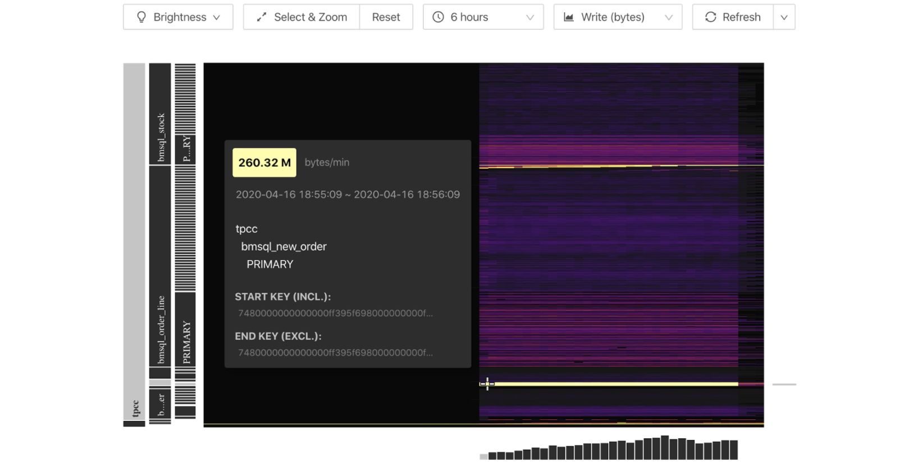
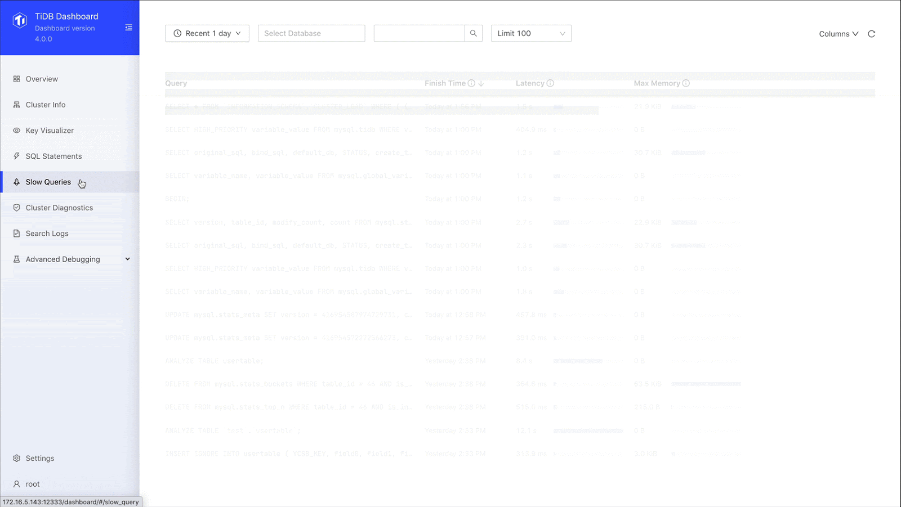
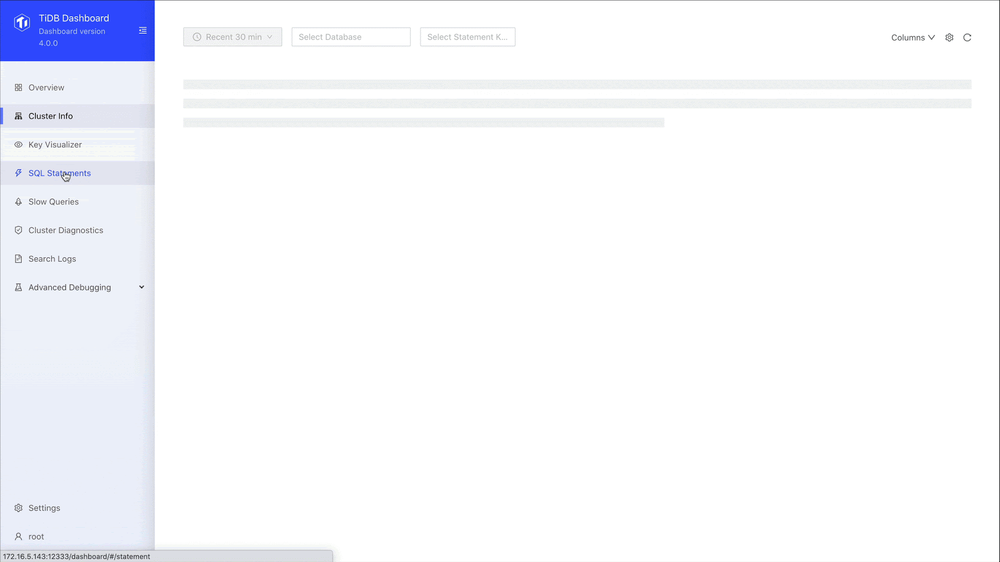
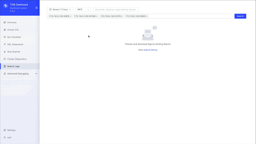

**Industry:** E-commerce

**Author:** Haodong Ji (Head DBA at Zhuan Zhuan)

[Zhuan Zhuan](https://www.crunchbase.com/organization/zhuan-zhuan) is an online used goods trading platform. You can think of us as “the Letgo of China.” Since we launched our platform in 2015, we have grown tremendously. In 2018, we had more than 200 million users, with over 50 million monthly active users on our app and WeChat mini-program. 

In an earlier [post](https://pingcap.com/case-studies/tidb-in-zhuanzhuan), we talked about why we migrated from MySQL to [TiDB](https://docs.pingcap.com/tidb/stable/overview), an open-source, distributed, Hybrid Transactional/Analytical Processing (HTAP) database, and how TiDB helped our database achieve horizontal scaling.

Today, I'll introduce how [TiDB 4.0](https://docs.pingcap.com/tidb/stable/release-4.0-ga)'s new features make TiDB easier to use and reduce our operations and maintenance costs.

## TiDB: more than a horizontally scalable database

When we switched to [TiDB](https://docs.pingcap.com/tidb/stable/overview), we immediately solved two of our database problems:

* **Complex application logic caused by sharding.** Sharding makes our application logic more complex, and multi-dimensional mapping can decrease our overall performance. With TiDB, we don't need to shard or write complicated logic.
* **Complex database operations and maintenance.** TiDB can rapidly scale horizontally. The DBA does not have to migrate data or application traffic. In addition, online Data Definition Language (DDL) operations on large tables have almost no impact.

When we upgraded to [TiDB 4.0](https://docs.pingcap.com/tidb/stable/whats-new-in-tidb-4.0), we solved even more issues. Be sure to click the links below each issue for detailed information on how 4.0 helped us.

* **Clusters were slow to deploy and difficult to manage.**
    [TiUP can deploy a cluster in only one minute](#tiup-can-deploy-a-cluster-in-only-one-minute)
* **Hotspots were hard to find.** Hotspots are fairly common in e-commerce scenarios. In the past, we had to query each node's log separately. Investigating hotspots was slow and costly.
    [Key Visualizer clearly displays hotspots across the entire cluster](#key-visualizer-clearly-displays-hotspots-across-the-entire-cluster)
* **It was hard to view the status of the entire cluster.** Sometimes, we needed to confirm the status of the cluster. Because there are many items to monitor and logs are scattered throughout the cluster, getting status was time-consuming. We couldn't locate problems quickly.
    [TiDB Dashboard efficiently displays cluster-wide information](#tidb-dashboard-efficiently-displays-cluster-wide-information)
* **Extracting data often slowed down our online response** and affected TiKV, TiDB's storage engine.
    [TiFlash extracts data without affecting online performance](#tiflash-extracts-data-without-affecting-online-performance)
* **It was hard to back up and restore very large clusters.** This was an urgent issue for us. We were using logical backup, but it wasn't very effective.
    [Backup & Restore quickly backs up and restores very large clusters](#backup-restore-quickly-backs-up-and-restores-very-large-clusters)
* **Configuring the TiKV thread pool was complicated,** and, as our application changed, we had to update it.
    [TiKV's unified read pool streamlines configuration](#tikvs-unified-read-pool-streamlines-configuration)

## TiUP can deploy a cluster in only one minute

TiDB 4.0 introduces a new component management tool, [TiUP](https://docs.pingcap.com/tidb/stable/tiup-overview), which makes deploying a TiDB environment faster than ever. If you've wanted to deploy TiDB before, but thought it was too complicated or time consuming, TiUP solves that.

For example, we used TiUP to deploy three TiDB instances, three TiKV instances, three Placement Driver instances, and one TiFlash instance in _one minute_. Besides lightning-fast deployment, TiUP also offers a large number of parameters we can use to [check the status](https://docs.pingcap.com/tidb/stable/tiup-component-management#query-the-operating-status-of-a-component) of our cluster. 

## Key Visualizer clearly displays hotspots across the entire cluster

In the early days, troubleshooting hotspots was difficult. We had to look through various logs and meticulously analyze them until we could locate the problem. Now, TiDB 4.0 introduces a new visualization tool, [Key Visualizer](https://docs.pingcap.com/tidb/stable/dashboard-key-visualizer#key-visualizer-page), which quickly and intuitively displays [hotspots](https://docs.pingcap.com/tidb/stable/dashboard-key-visualizer#hotspot) anywhere in our cluster using a graphical [heatmap](https://docs.pingcap.com/tidb/stable/dashboard-key-visualizer#heatmap).

Here is an example:

 Key Visualizer's heatmap 

In the heatmap:

* The x-axis represents time.
* The y-axis represents the key ranges, with mappings between key ranges to tables and indices.
* The colors represent the read or write volume of key ranges. The brighter the color, the higher the read or write volume. 

<iframe src="https://download.pingcap.com/images/blog/key-visualizer.mp4" width="100%" height="auto" frameborder="0" webkitallowfullscreen mozallowfullscreen allowfullscreen></iframe>

 Key Visualizer: quickly troubleshoot database performance issues 

Key Visualizer displays system status graphically, which helps us quickly troubleshoot database performance issues and enables us to [gain deep insights into our applications](https://pingcap.com/blog/observe-distributed-databases-to-discover-unknowns).

## TiDB Dashboard efficiently displays cluster-wide information

As I mentioned earlier, it can be difficult to determine a cluster's status. [TiDB Dashboard](https://docs.pingcap.com/tidb/stable/dashboard-intro#tidb-dashboard-introduction) effectively addresses this issue. TiDB Dashboard is **a graphical interface with** **various built-in widgets that let us easily diagnose, monitor, and manage our clusters**. In a single interface, we can check a distributed cluster's runtime status and manage the cluster, including:

* Quickly finding cluster hotspots
* Analyzing SQL statements' execution performance
* Viewing slow queries
* Generating cluster diagnostic reports
* Searching and exporting logs
* Profiling instances

I think the Dashboard is one of the highlights of the 4.0 release, and it makes an already useful product even better.

 TiDB Dashboard 

### Understanding the overview page

The following figure shows the TiDB Dashboard's [**Overview**](https://docs.pingcap.com/tidb/stable/dashboard-overview#overview-page) page. It displays:

* Database traffic in queries per second (QPS)
* Response latency
* Node status
* Alert-related information

Through the overview, we can quickly find the status of the cluster, quickly locate problems, and use TiDB better. 

### Finding slow queries

TiDB Dashboard also lets us find slow-running queries. As shown on the **[Slow Queries](https://docs.pingcap.com/tidb/stable/dashboard-slow-query#slow-queries-page-of-tidb-dashboard)** page below, we specify the database, the time range, and the number of queries to display. The output includes the query name, execution time, and query description, and you can sort the results. Once we get our list, we can quickly locate the query we're interested in. We no longer need our own extract, transform, load (ETL) process, and we don't need to go to the machine ourselves.

 Slow queries 

### SQL statement analysis

We can drill down to the specific SQL statement and see the SQL statement template, fingerprint ID, statement sample, [query execution plan](https://docs.pingcap.com/tidb/stable/query-execution-plan), and transaction-related metrics. When we used an ETL process, we didn't have a lot of this information. Now, through SQL statement analysis, we can see the execution stages of a slow query and the execution time of each stage. This greatly improves our overall SQL analysis.

 SQL statement analysis 

### Searching logs

TiDB's new log search feature lets us search for logs on all instances in the cluster, preview search results, and export logs, which greatly reduces our labor and development costs. With the **[Search Log](https://docs.pingcap.com/tidb/stable/dashboard-log-search#tidb-dashboard-log-search-page)** page, we can find logs based on the time period, the log level, and instance. We longer have to log on to each machine and go through logs manually. What a time saver.

 Search and export logs 

## TiFlash extracts data without affecting online performance 

In the past, extracting data increased online response times. [TiFlash](https://docs.pingcap.com/tidb/stable/tiflash-overview#tiflash-overview) solves this problem and includes features such as asynchronous replication, consistency, intelligent selection, and calculation acceleration. 

At Zhuan Zhuan, we mainly use TiFlash on shared physical machine hosts and physical isolation. When we add a TiKV node to the new machine, requests are separated. Different requests go to different back-end data nodes, so that when you extract data, it will not affect the overall online performance. Based on the complexity of our application and SQL statements, TiDB automatically chooses to use TiFlash or TiKV to ensure the best performance. If a request is for online data, TiDB chooses TiKV. If a request is for offline data, TiDB chooses TiFlash. This is an intelligent selection mechanism.

 TiDB including TiFlash 
 

## Backup & Restore quickly backs up and restores very large clusters

Prior to TiDB 4.0, we struggled to effectively back up our large data clusters. We used logical backups, which really didn't meet our needs. 

We tested TiDB 4.0's distributed backup and recovery tool, [Backup & Restore](https://docs.pingcap.com/tidb/stable/backup-and-restore-tool#use-br-to-back-up-and-restore-data), and got excellent results. In a 10 Gb network environment, at 120 MB/sec network speed, it took **less than 10 minutes to back up 300 GB of data to the network file system**.

**Under the same speed limit of 120 MB/sec, we restored our data through the network file system in about 12 minutes**. Backup & Restore has greatly reduced our backup and restore time. 

Another key factor is that the speed of backup depends entirely on the number of TiKV instances we have. The more TiKV instances we have, the faster our backup and restore speeds.

## TiKV's unified read pool streamlines configuration

TiDB 4.0 also introduces a new feature, the [unified read pool](https://docs.pingcap.com/tidb/stable/tikv-configuration-file#readpoolunified). Before 4.0, we had to configure and dynamically adjust our read pool storage and Coprocessor, which may affect the application. We found that configuring and managing these components was frustrating.

**The unified read pool merges the storage and Coprocessor into one thread pool.** The SQL query automatically determines whether we use storage or the Coprocessor. This not only improves system usability, but also solves the problem of unevenly distributed resources.

## Future plans

TiDB 4.0 introduced some experimental features, such as TiDB Dashboard, TiFlash, and the unified thread pool, which make TiDB more robust and easier to use than ever. This release has been a great help to us, and we haven't even fully adopted it yet!

In the future, we will fully upgrade to version 4.0. This release promises to streamline database operations and maintenance, which will free up our database team to focus more on innovations.

If you'd like to learn more about our experience with TiDB, you can join the [TiDB community on Slack](https://slack.tidb.io/invite?team=tidb-community&channel=everyone&ref=pingcap-blog).
