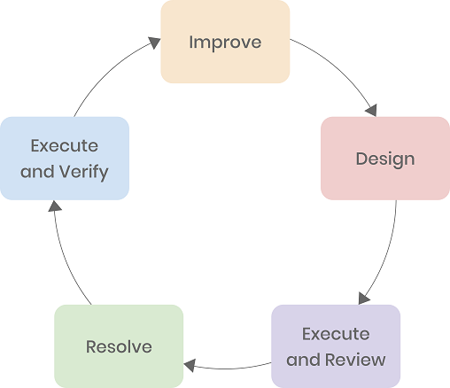

**Author:** Zhaojun Wu (Senior DevOps Engineer at Tencent Interactive Entertainment Group)

**Transcreator:** [Yajing Wang](https://github.com/anotherrachel); **Editor:** Tom Dewan

Interactive Entertainment Group (IEG) is a division of Tencent Holdings that focuses on the development of online video games and other digital content such as live broadcasts. It is well-known for being the publisher of some of the most popular video games.

In this article, I will explain why and how we introduce chaos engineering into our DevOps process. 

For each day, we handle over 10,000,000 total visits, and, during peak hours, we process over 1,000,000 queries per second (QPS). To guarantee players a fun and engaging experience, we launch various daily or seasonal game events. Sometimes, that means we must update the event code over 500 times per day. As our user base grows, the total amount of data quickly multiplies. Currently, the figure stands at 200 terabytes. We have to manage the massive user queries and rapid release iterations, and we managed it well. 

A cloud-native DevOps solution frees our events operator from the growing number of online events. We developed a pipeline that takes care of everything they need, from writing code to launching events in production environments: once new event codes are detected, the operation platform automatically builds images from them and deploys the image to Tencent Kubernetes Engine (TKE). You might be wondering how long this entire automated process takes: only 5 minutes.

Currently, almost all IEG operation services run in TKE. Elastic scaling promises faster capacity expansion and reduction of cloud services thanks to cloud-native technology.

In addition, we expect the iterations to be easier. A best practice is to break down the large, hard-to-maintain service into many "smaller" services that we can maintain independently. "Small" services have less code and simpler logic, with lower handover and training costs. We as developers continue to practice this kind of microservices architecture as part of DevOps initiatives. Yet similar issues persist. As the number of services increases, so does the complexity of making calls between them. **Worse, if one "small" service fails, it could set off a chain reaction that brings all the services down—a microservice dependency hell.**

The thing is, fault tolerance varies by service. Some support downgrading, while others don't. Not to mention that some services are unable to provide timely alerts or lack an effective debugging tool. As a result, debugging services has become a tricky and increasingly pressing issue in our day-to-day work.

But we can't just let it be. What if the unstable performance constantly chases our players away? What if there is a catastrophic failure? 

## Let there be faults

Netflix introduced the idea of chaos engineering. This approach tests the resilience of the system against all kinds of edgy cases by injecting faults in a non-production environment to achieve ideal system reliability. According to [one Gartner article](https://www.gartner.com/smarterwithgartner/the-io-leaders-guide-to-chaos-engineering/), by 2023, 40% of organizations will use chaos engineering to meet their top DevOps objectives, reducing unplanned downtime by 20%.

This is exactly how we avoid the worst-case scenario. Fault injection, in my opinion, is now a must-do in every technical team. In our early test cases, developers would bring down a node before launching a service to see if the primary node automatically switched to the secondary node and if disaster recovery worked. 

**But chaos engineering is more than fault injection.** It is a field that constantly drives new techniques, professional testing tools, and solid theories. That's why we continue to explore it.

IEG officially launched its chaos engineering project over a year ago. We wanted to do this right the first time. The key is to select a chaos engineering tool that supports running experiments in the Kubernetes environment. **After a careful comparison, we believe [Chaos Mesh](https://github.com/chaos-mesh/chaos-mesh) is our best option** because:

* It is a Cloud Native Computing Foundation (CNCF) Sandbox project with a friendly and productive community.
* It does not intrude on existing applications.
* It provides a web UI and a variety of fault injection types, as shown in the image below. 

A comparison of chaos engineering tools

> **Note:**
>
> This comparison is outdated and is intended simply to compare fault injection features supported by Chaos Mesh with other well-known chaos engineering platforms. It is not intended to favor or position one project over another. Any corrections are welcome. 

## Build a chaos testing platform

Our chaos engineering team embedded Chaos Mesh into our continuous integration and continuous delivery pipelines. As shown in the diagram below, Chaos Mesh now plays an important role in our operation platform. We use Chaos Mesh's dashboard API to create, run, and delete chaos experiments and monitor them on our own platform. We can simulate basic system-level faults in Pods, container, network, and IO.

Chaos Mesh embedded in IEG's operation platform

In IEG, **chaos engineering is generally summarized as a closed loop with several key phases**:

1. Improve overall system resilience.

    Build a chaos testing platform that we can modify as our needs change.

2. Design a testing plan. 

    The testing plan must specify the target, scope, fault to be injected, monitoring metrics, etc. Make sure the testing is well-controlled.

3. Execute chaos experiments and review the results.

    Compare the system's performance before and after the chaos experiment.

4. Resolve any issues that may arise.

    Fix found issues and upgrade the system for the follow-up experiment.

5. Repeat chaos experiments and verify performance.

    Repeat chaos experiments to see if the system's performance meets expectations. If it does, design another testing plan.

</img>

Five phases of chaos engineering in IEG

We frequently **test the performance of services under high CPU usage**, for example. We begin by orchestrating and scheduling experiments. Following that, we run experiments and monitor the performance of related services. Multiple monitoring metrics, such as QPS, latency, response success, are immediately visible through the operation platform. The platform then generates reports for us to review, so we can check whether these experiments met our expectations.

## Use cases

The following are a few examples of how we use chaos engineering in our DevOps workflow.

### Finer granularity of fault injection

There is no need to shut down the entire system to see if our games are still available to players. Sometimes we only want to inject faults, say, network latency, into a single game account, and observe how it responds. We are now able to achieve this finer granularity by hijacking traffic and running experiments at the gateway.

### Red teaming

Understandably, our team members grew bored of regular chaos experiments. After all, it's something like telling your left hand to fight against your right hand. Here at IEG, **we integrate a testing practice called red teaming into chaos engineering to ensure that our system resiliency improves in an organic way**. Red teaming is similar to penetration testing, but more targeted. It requires a group of testers to emulate real-world attacks from an outsider's perspective. If I were in charge of IT operations, I would simulate faults to specific services, and check to see whether my developer colleges were doing a good job. If I found any potential faults, well, be prepared for some "hard talk." On the other hand, developers would actively perform chaos experiments and make sure no risk was left behind to avoid being blamed. 

The red teaming process in IEG

### Dependency analysis

It's important to manage dependencies for microservices. In our case, non-core services cannot be the bottleneck for core services. Fortunately, with chaos engineering, we can run dependency analysis simply by injecting faults into called services and observing how badly the main service is affected. Based on the results, we can optimize the service calling chain in a specific scenario.

### Automated fault detection and diagnosis

We are also exploring AI bots to help us detect and diagnose faults. As services become more complex, the likelihood of failure increases. **Our goal is to train a fault detection model through large-scale chaos experiments in production or other controlled environments**.

## Chaos engineering empowers DevOps practices

Currently, on average, more than 50 people run chaos experiments each week, running more than 150 tests, and detecting more than 100 problems in total.

Gone are the days when performing fault injection requires a handwritten script, which can be a tough thing to do for those who are unfamiliar with it. **The benefits of combining chaos engineering with DevOps practices are obvious: within a few minutes, you can orchestrate various fault types by simply dragging and dropping, execute them with a single click, and monitor the results in real-time—all in one platform.** 

Chaos engineering with DevOps ensures efficient fault injection

Thanks to full-featured chaos engineering tools and streamlined DevOps processes, we estimate that the efficiency of fault injection and chaos-based optimization at IEG has been improved at least by 10 times in the last six months. If you were unsure about implementing chaos engineering in your business, I hope our experience can be of some help.
