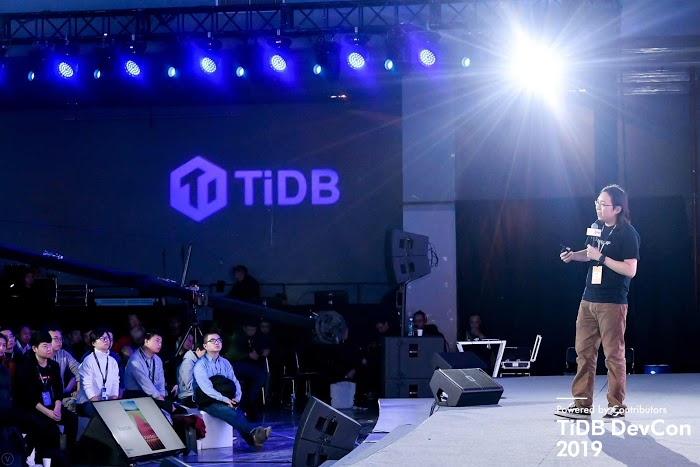

## Google Cloud results

* Accelerates product launch process around the world with widely distributed cloud infrastructure and cross-region networks
* Reduces time to market from one year to three months with flexible cloud tools
* Cuts 25% of operational costs by timely adjusting resources used according to needs with GKE
* Supports highly automated and scalable database as a service while ensuring data security and compliance with local regulations

Database software is an indispensable part of a company's daily operations. It is used not only for storing and compiling records, but also running websites and applications. As enterprises around the world increasingly go digital, the demand for database software continues to surge. From 2021 to 2023, the global database software market is [expected to reach an average annual growth of 12%](https://www.thebusinessresearchcompany.com/report/database-software-market).

To handle their ever-growing amount of data, enterprise database software users have been constantly seeking more reliable, scalable, and easy-to-use products with faster processing speed. Seeing this market need, three former infrastructure engineers at leading internet companies decided to found [PingCAP](https://pingcap.com/) in 2015 to develop new database solutions that can better help enterprises unleash the power of their data.

The company introduced its flagship product, TiDB (Titanium database), an open source, one-stop database platform supporting hybrid transactional and analytical processing, a technology that greatly reduces data processing and retrieval time while allowing real-time data analytics. Featuring rapid data processing, cost-effective scalability and high availability, TiDB has quickly become one of the leading open source database platforms in the world. It was [selected by InfoWorld](https://www.infoworld.com/article/3306454/the-best-open-source-software-for-data-storage-and-analytics.html) in 2018 as one of the best open source software for data storage and has been adopted by more than 1,500 companies across multiple industries and regions.

>"Google Cloud has an extensive network of infrastructure worldwide with a stable connection. This allows us to quickly deploy our service and expand users globally. Instead of spending months building data centers on our own, we can easily set up our service in a new region in less than one week."
-- Queeny Jin, Head of International Marketing and Community, PingCAP

According to Queeny Jin, Head of International Marketing and Community at PingCAP, the team's continuous effort to improve the user experience is what led to the success of TiDB. This is why in late 2019, PingCAP decided to deploy TiDB in a cloud environment to develop TiDB Cloud, a fully managed database as a service (DBaaS) to further simplify database management for its customers.

"By integrating our database service with a cloud platform, we can offer a database solution with all the advantages of cloud services like quick deployment and reliability," explains Jin. "TiDB Cloud lets users launch their database clusters with just a few clicks and spend less time and effort on maintenance work."

Since PingCAP's customers are located around the world, the team needed a cloud platform with stable cross-region networks, widely distributed infrastructure, and advanced technologies to support its highly scalable database service. To that end, it chose to partner with [Google Cloud](https://cloud.google.com/) as one of the public cloud providers for the launch of TiDB Cloud.

## Speeding time to market with flexible cloud tools

For PingCAP, one advantage of using Google Cloud is its ability to shorten the time to market for TiDB Cloud with its flexible cloud tools. As the team can freely choose different combinations of hardware specifications, such as the CPU and internal storage of virtual machines (VMs) on [Compute Engine](https://cloud.google.com/compute), to fit its needs, it was able to effortlessly migrate the existing structure design of its database service to Google Cloud.

As a result, PingCAP successfully reduced the time to market for TiDB Cloud to three months and launched the beta version in June 2020. Jin believes that without the Google Cloud tools, the whole development process could take up to one year.

Currently, PingCAP runs the VM instances of TiDB Cloud on Compute Engine and harnesses [Container Registry](https://cloud.google.com/container-registry) to store Docker images of its database platform. [Cloud DNS](https://cloud.google.com/dns) is used to perform domain name resolution of PingCAP's external and internal systems, while [Cloud Storage](https://cloud.google.com/storage) stores the snapshot copies of its customers' database clusters for data recovery when needed. It also employs [Persistent Disk](https://cloud.google.com/persistent-disk) as storage of its customers' database.

>"Thanks to the highly automated and scalable environment supported by GKE, we're able to cut 25% of operational costs and have less than 10 engineers to manage all the development and operational work."
-- Queeny Jin, Head of International Marketing and Community, PingCAP

## Enhancing operational efficiency in a highly automated and scalable cloud environment

Besides the accelerated development process, the PingCAP team is also impressed by the extent that Google Cloud supports automation to enhance operational efficiency. "Google Cloud is a very developer-friendly ecosystem, which is compatible with many open source tools for us to achieve higher automation in our daily operations," explains Jin.

For example, by leveraging [infrastructure as code tools](https://cloud.google.com/recommender/docs/tutorial-iac) like Terraform, PingCAP is able to automate the creation of its Google Cloud resources. The team can now launch a VM on Google Cloud in less than five minutes via a single command, whereas the same process used to take 30 to 40 minutes before the automation.

PingCAP leverages [Google Kubernetes Engine](https://cloud.google.com/kubernetes-engine) (GKE) to control and monitor its DBaaS. The autoscaling feature of GKE helps the PingCAP team work more efficiently while cutting operational costs. Clusters deployed on GKE scale automatically when the amount of data and transactions grows, so the team saves on resources when demand is low.

"Thanks to the highly automated and scalable environment supported by GKE, we're able to cut 25% of operational costs and have less than 10 engineers to manage all the development and operational work," says Jin. "Moreover, our product deployed on Google Cloud can convey the same feature and provide the same benefits to our customers."

## Ensuring data security and legal compliance around the world

For enterprise database users, data security and legal compliance are among their major concerns when choosing database solutions. Using [Cloud Identity and Access Management](https://cloud.google.com/iam) for access control, PingCAP protects its customers' data from falling into the hands of unauthorized users. Furthermore, it harnesses [Virtual Private Cloud](https://cloud.google.com/vpc) to reinforce data security by separating different customers' data stored on TiDB Cloud.

"Data leak is a serious yet quite common issue around the world," notes Jin. "With the help of Google Cloud, we have been able to prevent any form of data breach for our customers."

With Google Cloud, PingCAP delivers on its vision of making TiDB a trusted database platform for cloud deployment, enabling enterprises to confidently deploy and manage their data while meeting the strictest compliance and security requirements. TiDB Cloud has been certified with SOC 2 Type 2 examination, meeting the most stringent security and compliance requirements.

## Easy collaboration across the company with Google Workspace

Since its launch, PingCAP relies on [Google Workspace](https://workspace.google.com/) to coordinate and execute daily work, which allows its nearly 500 employees around the world to cooperate efficiently without building its own internal work system.

>"We have very high confidence in the technologies of Google Cloud, and its open ecosystem is aligned with our belief in open source platforms. As a result, we're convinced that Google Cloud can continue to help optimize our product along with the growth of our user community."
-- Queeny Jin, Head of International Marketing and Community, PingCAP

## Improving user experience with advanced analytics powered by AI and ML

PingCAP prepares to officially launch TiDB Cloud later in 2021 following months of public preview through its beta release. While adjusting the first-generation product according to customers' feedback, the company is already drawing up plans to optimize user experience in the future.

At the moment, PingCAP provides its customers with real-time analytics of the change of their database with [BigQuery](https://cloud.google.com/bigquery) for faster decision-making. Moving forward, it wants to use the artificial intelligence (AI) and machine learning technologies of Google Cloud to better identify error risks. This allows PingCAP's database users to receive more accurate failure warnings beforehand, which can help enhance the stability and reliability of its database service.

To increase the work efficiency of its marketing department, PingCAP plans to employ [Dialogflow](https://cloud.google.com/dialogflow) to build an AI chatbot that is capable of showcasing products and answering customers' questions. It also plans to further integrate TiDB Cloud with Google Cloud, such as merging bills of the two services, allowing Google Cloud users to seamlessly adopt its database service.

"We have very high confidence in the technologies of Google Cloud, and its open ecosystem is aligned with our belief in open source platforms. As a result, we're convinced that Google Cloud can continue to help optimize our product along with the growth of our user community," concludes Jin.

_This post was originally published on the [Google cloud](https://cloud.google.com/customers/pingcap) website._