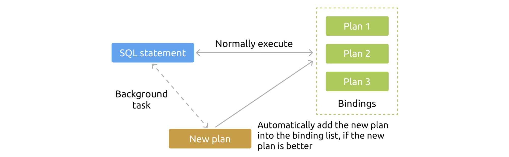

**Authors:** [Kenan Yao](https://github.com/eurekaka), [Haibin Xie](https://github.com/lamxTyler) (Software Engineers at PingCAP), [Ed Huang](https://github.com/c4pt0r) (CTO at PingCAP)

**Transcreator:** [Caitin Chen](https://github.com/CaitinChen); **Editor:** Tom Dewan


The SQL execution plan is a critical factor that affects SQL statement performance. The stability of the SQL execution plan heavily influences the entire cluster's performance. If a relational database's optimizer chooses a wrong execution plan for a query, it usually has a negative impact on the system; for example, operations might take longer to respond or the database might get overloaded.

We've done a lot of work on optimizer stability for [TiDB](https://pingcap.com/docs/stable/), an open-source, distributed, [NewSQL](https://en.wikipedia.org/wiki/NewSQL) database that supports [Hybrid Transactional/Analytical Processing](https://en.wikipedia.org/wiki/HTAP) (HTAP) workloads. However, SQL execution plans are affected by various factors. The execution plan may encounter unanticipated changes. As a result, the execution time might be too long.

Generally, you can address these issues by putting comments in the SQL queries ([optimizer hints](https://pingcap.com/docs/stable/reference/performance/optimizer-hints/)) to instruct the optimizer to select a certain SQL execution plan. But this approach is inconvenient, because you need to modify the SQL text and application code.

[TiDB 4.0](https://pingcap.com/docs/stable/releases/4.0.0-rc.1/) introduces SQL Plan Management (SPM), **a mechanism that narrows down the optimizer's searching space to execution plans that are proven to perform well. SPM avoids performance degradation caused by unanticipated plan changes, and you don't have to change the application code.**

In this post, I'll give an overview of SPM and use an example to demonstrate how SPM helps the optimizer automatically select efficient execution plans.

## Why SQL Plan Management?

We need SPM mainly because the SQL hint approach is not the best way to select an execution plan.

TiDB is a relational, distributed SQL database, and it uses a cost-based optimizer that relies on statistics. As the front-end application changes, the distribution of data may change abruptly. This is especially true for tables with huge volumes of data. Thus, it's quite normal that statistics become out of date. Besides, even if we can maintain up-to-date table statistics, it's still difficult to ensure that the optimizer chooses the best execution plan for all cases, because estimating the cost is complicated. Based on our experience, these issues cause most of the SQL layer problems in the production environment.

To avoid these issues, DBAs often try to find slow queries, rewrite SQL queries, or write comments in query statements (known as SQL hints). In effect, they're telling the optimizer "Don't guess. I understand the characteristics of my application better than you do, so do what I tell you."

However, the hint approach has these problems:

* Some SQL queries might be automatically generated, so you can't modify them. They may be generated by a database access framework such as object-relational mapping (ORM) or a business intelligence (BI) application.
* Even if you can rewrite the application layer's SQL queries, it means modifying the application code, and you must redeploy the system. This may introduce risks into your environment.
* After you've added SQL hints to queries, data distribution might change again later. Even if the optimizer determines that there is a better execution plan, it can't be applied. The existing SQL hints prevent the optimizer from choosing a potentially better plan.

Due to the shortcomings above, TiDB 4.0 introduces a new mechanism, SQL Plan Management, to help DBAs avoid slow queries.

## An overview of SQL Plan Management

**SQL Plan Management is a no-application-intrusion mechanism to constrain the searching space of the optimizer to the execution plans that have been proved to have good performance.**

In TiDB 4.0, SPM supports:

* Manually creating bindings for SQL statements
* Automatically creating bindings for SQL statements
* Automatically evolving bindings

### Manually creating bindings for SQL statements

In TiDB 4.0, you can use `CREATE BINDING` to bind an execution plan to a type of queries. Compared with adding SQL hints, the most obvious advantage of using SPM is that **you don't need to modify the application code**. You can use commands to use a different execution plan in real time, avoiding the trouble of relaunching the applications.

Although you can only bind one execution plan to a query pattern, a query pattern may eventually have multiple plan bindings due to the binding evolution feature described below.

In TiDB 4.0, when an SQL statement is bound with multiple execution plans, the optimizer selects the plan with the lowest cost.

In TiDB 4.0, the `tidb_use_plan_baselines` parameter controls whether to use plan bindings. To ignore all bindings, set the parameter to `off`.

### Automatically creating bindings for SQL statements

Before TiDB 4.0, you could only create bindings manually. But TiDB 4.0 lets you create bindings automatically. You can set the `tidb_capture_plan_baselines` variable to `on` to automatically create bindings for SQL statements that appear multiple times in a certain period of time.

Note that if an SQL statement appears only once, you don't need to create a binding, because it never appears later. TiDB creates bindings for SQL statements that have occurred at least twice.

### Automatically evolving bindings

As statistics or the table schema definition changes, the originally-bound execution plan might be no longer optimal. In TiDB 4.0, bindings can automatically evolve to adapt to changes.

SPM evolves bindings by experimenting with alternative execution plans in the background. If it detects a better execution plan, SPM adds this new plan to the binding list. For the subsequent SQL queries, the optimizer will also take this new plan into consideration.

Note that this feature uses few system resources. SPM performs its "experiments" during a predefined time period, which is usually when network activity is low.


<div class="caption-center"> Binding evolution </div>

To enable automatically evolving bindings, set `set global tidb_evolve_plan_baselines` to `on`.

## How SPM can speed up your queries

Now that we have a basic idea of SPM, let's see how SPM can speed up your queries.

The following table has a list of men and women's first names:

<table>
  <tr>
   <td><strong>No.</strong>
   </td>
   <td><strong>Name</strong>
   </td>
   <td><strong>Gender</strong>
   </td>
   <td><strong>...</strong>
   </td>
  </tr>
  <tr>
   <td>1
   </td>
   <td>Chris
   </td>
   <td>Male
   </td>
   <td>...
   </td>
  </tr>
  <tr>
   <td>2
   </td>
   <td>Lilly
   </td>
   <td>Female
   </td>
   <td>...
   </td>
  </tr>
  <tr>
   <td>3
   </td>
   <td>Mark
   </td>
   <td>Male
   </td>
   <td>...
   </td>
  </tr>
  <tr>
   <td>...
   </td>
   <td>...
   </td>
   <td>..
   </td>
   <td>...
   </td>
  </tr>
</table>

We've built indexes on columns `Name` and `Gender`. To find the man's name Chris, we use the following query:



```sql
SELECT * FROM t WHERE Name = 'Chris' and Gender = 'Male'
```

### Without SQL Plan Management

Normally, the SQL optimizer can get the selectivity of `Name` and `Gender` indexes for this query by sampling or collecting statistics. In our example, the `Name` index should have the lower selectivity most of the time. The optimizer chooses the `Name` index as the access method for this query so it can skip a lot of unnecessary row scans.

However, what happens if we insert a lot of "female Chris" records in a short period of time?

<table>
  <tr>
   <td><strong>No.</strong>
   </td>
   <td><strong>Name</strong>
   </td>
   <td><strong>Gender</strong>
   </td>
   <td><strong>...</strong>
   </td>
  </tr>
  <tr>
   <td>1
   </td>
   <td>Chris
   </td>
   <td>Male
   </td>
   <td>...
   </td>
  </tr>
  <tr>
   <td>2
   </td>
   <td>Chris
   </td>
   <td>Female
   </td>
   <td>...
   </td>
  </tr>
  <tr>
   <td>3
   </td>
   <td>Chris
   </td>
   <td>Female
   </td>
   <td>...
   </td>
  </tr>
  <tr>
   <td>4
   </td>
   <td>Chris
   </td>
   <td>Female
   </td>
   <td>...
   </td>
  </tr>
</table>

Now the selectivity of the `Name` index for the query above becomes pretty high, because there are a lot of "Chris" records. Now, the `Gender` index is more efficient, since there is only one "male Chris" in the table.

If the statistics are not updated in time to reflect these sudden data changes, the optimizer would likely use the `Name` index as an access method for the query. This would result in a slow query.

### With SQL Plan Management

As mentioned above, SPM lets you use a new SQL syntax `CREATE BINDING FOR ...(query) USING ...(query_with_hint)` to bind an execution plan to a type of queries. You can use commands to use a different execution plan in real time, and you don't need to modify the application code. This way, you don't need to relaunch the application.

In the case above, DBAs only need to execute the following command in the database:



```sql
CREATE GLOBAL BINDING FOR
    SELECT * FROM t WHERE Name = 'Chris' and Gender = 'Male'
USING
    SELECT /*+ USE_INDEX(t, gender) */ * FROM t WHERE Name = 'Chris' and Gender = 'Male'
```

### Execution plan evolution

In the example above, the data distribution might change again later, and the SQL optimizer might sense this change and find a better execution plan for the query; namely, using the `Name` index as the access method. But what if this execution plan is not in the binding list?

As we mentioned previously, TiDB 4.0's SPM uses a mechanism called binding evolution to solve this problem. To enable binding evolution, run `SQL> SET GLOBAL tidb_evolve_plan_baselines = on;`.

## Conclusion

Previously, TiDB users could use optimizer hints to instruct the optimizer to select a certain execution plan, but they needed to modify the SQL text and application code. To solve this issue, TiDB 4.0 introduces SQL Plan Management, which lets the optimizer automatically manage execution plans and choose execution plans that are proven to perform well. This approach prevents slowdowns in the database resulting from unexpected plan changes, and, best of all, you don't have to modify the application code.

If you're interested in SPM, you can give it a try in the [TiDB 4.0 release candidate](https://pingcap.com/docs/stable/releases/4.0.0-rc.1/). You're welcome to join the [TiDB Community on Slack](https://slack.tidb.io/invite?team=tidb-community&channel=everyone&ref=blog-en) to give us advice or feedback on your experience.
