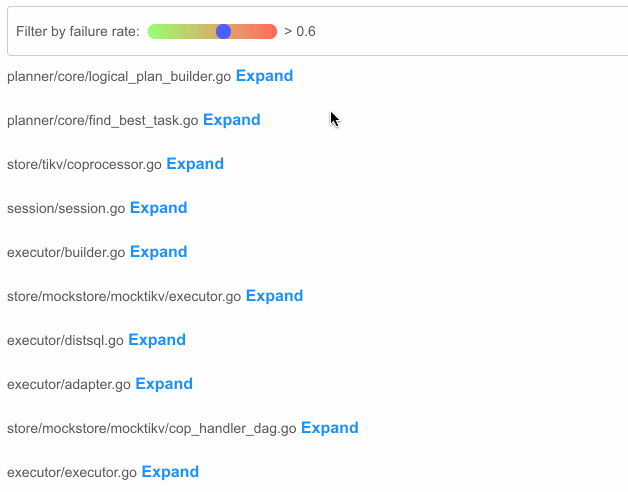
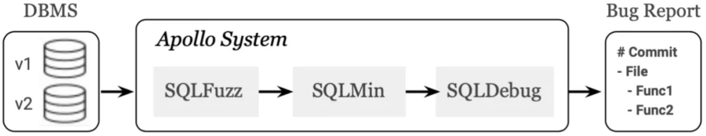
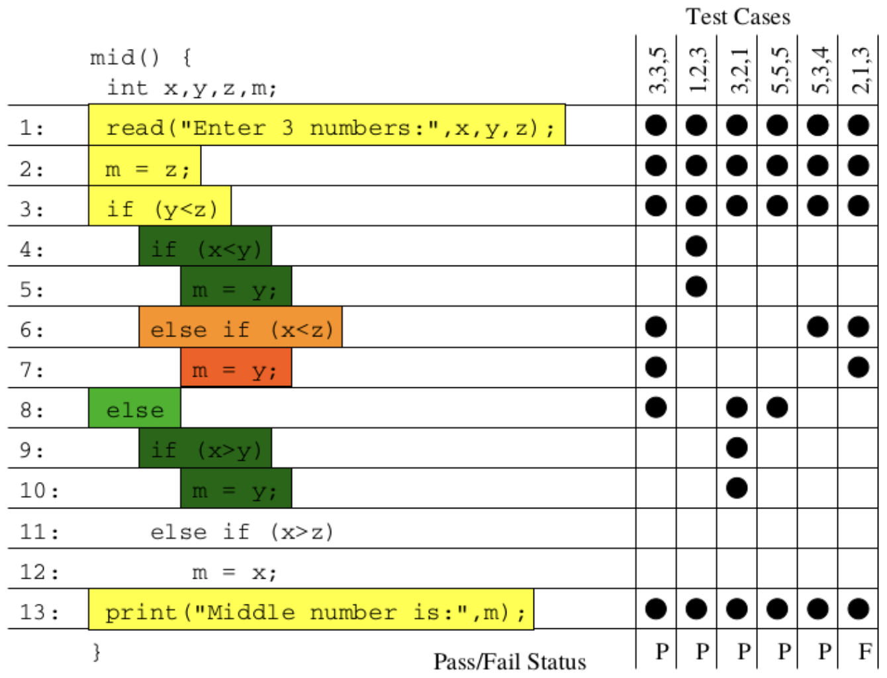
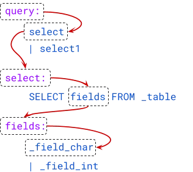
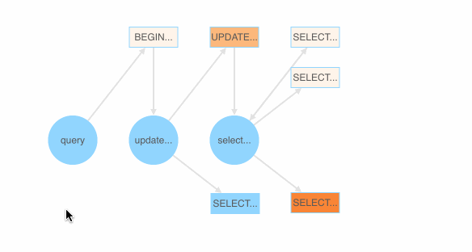
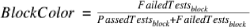
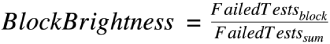
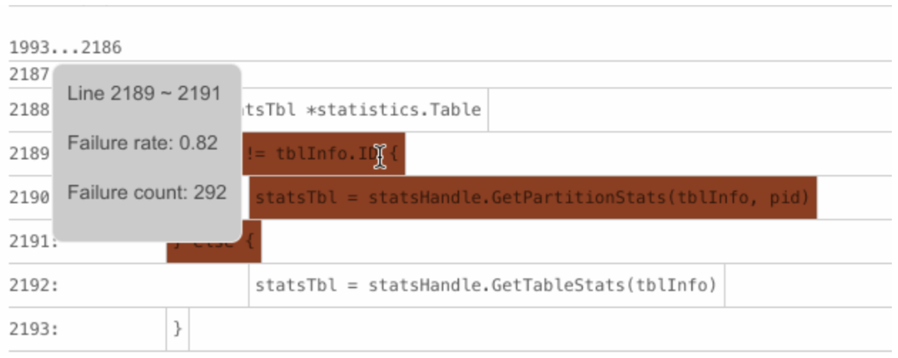
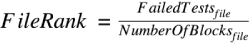
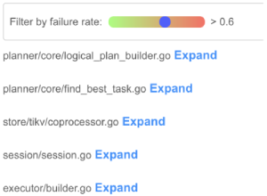

To err is human; to introduce bugs is to be a developer; and to debug is part of everyday life. Debugging is not just about the fix—sometimes it's the drudgery of trying to locate the root cause that kills passion, especially when you have thousands or even millions of lines of code. A former Oracle database developer, who helped maintain Oracle v12.2 and its 25 million lines of C code, [described](https://news.ycombinator.com/item?id=18442637) his struggling life with bugs this way:

* Spend weeks trying to understand the 20 different flags that interact in mysterious ways to cause a bug.
* Find out that his fix causes 100~1000 failed tests.
* Randomly pick some of the tests and dive into the code again. It seems there are 10 more flags that are related to this bug.
* Finally, _after a few weeks or months_, get the combination of flags right and succeed with zero failing tests.

He was clearly frustrated with the situation, and this is something we really want to avoid in our own projects!

Modern computer programs are so large and complex that designing a way to easily locate bugs would greatly improve a developer's quality of life. So, why not build a **bot** to automatically find program bugs? At our recent [TiDB Hackathon 2019](https://pingcap.com/blog/insert-into-tidb-hackathon-2019-values-hack-fun-tidb-ecosystem/), my teammates and I successfully brought this idea to reality, and our project won third prize!


<div class="caption-center"> "Check" out that big check! </div>

## The bug tracking bot we built

At the Hackathon, we built a bot that helps us quickly locate several bugs in TiDB's source code. (BTW, for those who don't know [TiDB](https://pingcap.com/)—it's an open-source distributed SQL database written in Go.) Below, you can see how our bot highlights potentially faulty areas in the code. The higher the failure rate, the darker the color; the higher the failure count, the brighter the block.


<div class="caption-center"> Colored code blocks with their "failure rate" and "failure count" highlighted </div>

This bot was built based on the following techniques:

* **SQL fuzzing** to randomly generate a large number of SQL queries as the test cases for the TiDB database
* **Dynamic binary instrumentation** to instrument TiDB's source code and collect execution traces of these SQL queries
* **Statistical debugging** to analyze TiDB source code's participation in the passed and failed test cases
* **Visualization** to graphically map the potentially faulty lines of code in the source files

The rest of this post describes in detail how we used the above techniques to build our bot. By the end of the article, you'll know the bot's three most important components, and hopefully, find inspiration for your own cool ideas.

We also provide **a simple demo** on [fuzz_debug_platform - TiSqlDebug](https://github.com/fuzzdebugplatform/fuzz_debug_platform). Run the **four commands** and see the heatmaps yourself! Feel encouraged to jump on board and help us at any time!

## How we built the bot?

### Getting inspired

This project was initially inspired by [APOLLO: Automatic Detection and Diagnosis of Performance Regressions in Database Systems](https://www.vldb.org/pvldb/vol13/p57-jung.pdf), a VLDB paper written by researchers from Georgia Institute of Technology (GT) and eBay Inc. We really appreciate their great work. The paper presents a design of the [Apollo](https://github.com/sslab-gatech/apollo) toolchain which detects, reports, and diagnoses performance regressions in database management systems (DBMSs).

This approach can be also applied to finding bugs, so let's understand some of Apollo's basics first.


<div class="caption-center"><a href="https://www.vldb.org/pvldb/vol13/p57-jung.pdf" target="_blank">Apollo system architecture</a></div>

The Apollo system consists of three modules: SQLFuzz, SQLMin, and SQLDebug.

* **SQLFuzz** is the fuzzing engine that sends many randomly generated SQL queries to two different DBMS versions. If a query is significantly slower in the newer version, then SQLFuzz passes it to SQLMin.

* **SQLMin** is the query minimization framework that reduces the size of the passed query while ensuring the reduced query still triggers the performance drop. SQLMin then passes the reduced query to SQLDebug.

* **SQLDebug** is the diagnosis engine that uses dynamic binary instrumentation to collect the execution traces from both DBMS versions. It locates the root cause of the regression using commit bisecting and statistical debugging techniques.

In the end, the Apollo system produces a bug report that includes:

* The git commit that introduced the performance regression
* The source files that contain potentially faulty code
* The line numbers of the functions that caused the regression

But in the real world, analyzing execution traces is very complicated. You have to consider the impact of concurrencies, loops, recursions, and so on. Plus, we only had two days to present our Hackathon project. We needed a simpler way to display our results.

So we found another paper, [Visualization of Test Information to Assist Fault Localization](https://www.cc.gatech.edu/~john.stasko/papers/icse02.pdf). This paper presents a technique that uses varying colors and brightness to visually map the participation of each code block in the passed and failed test cases.


<div class="caption-center"><a href="https://www.cc.gatech.edu/~john.stasko/papers/icse02.pdf" target="_blank">Visually mapped code blocks</a></div>

What's even cooler is that you can apply both automated debugging and visualization techniques to do a lot of other things. I'll share some thoughts in a later section. Before that, let's see how we hacked our way to build this bug-hunting bot.

### The "hack" road

Every time we hack on a project, our team first breaks down our goal into several actionable items, and then focuses our efforts on answering the most difficult questions. For this project, our team asked:

* How do we generate a lot of test cases?
* How do we track the execution of each SQL query?
* How do we visually display the potentially faulty basic blocks?

Here are our answers.

#### Question #1: How do we generate a lot of test cases?

To do an accurate and effective statistical diagnosis, we need to feed the bot a fair amount of test cases. Thus, we need a SQL fuzzing tool that randomly constructs valid SQL queries for testing the TiDB database.

Projects such as [RAGS](https://vldb.org/conf/2007/papers/industrial/p1243-bati.pdf) and [SQLSmith](https://github.com/anse1/sqlsmith) provide a popular SQL fuzzing framework in the DBMS community. For our scenario, we used an open-source stochastic testing framework, [go-randgen](https://github.com/pingcap/go-randgen), to implement SQL fuzzing.

Users first define a grammar file that contains some Backus–Naur form ([BNF](https://en.wikipedia.org/wiki/Backus%E2%80%93Naur_form)) grammars for SQL. go-randgen then starts from the "query" statement and randomly traverses the "SQL grammar tree" in the file to generate a SQL query. This process is shown below as a red line path.


<div class="caption-center"> SQL grammar tree </div>

Also, as shown below, we implemented a SQL fuzzing demonstration page that shows which SQL BNF grammar is most likely to generate a failed SQL query. Each BNF grammar is assigned a color value based on the ratio of the passed and failed test cases (SQL queries) that the grammar appears in.


<div class="caption-center"> Colored BNF grammars for SQL </div>

<div class="trackable-btns">
    <a href="/download" onclick="trackViews('Squashed Bugs, Served Hot and Fresh with Failure Rate Heatmaps', 'download-tidb-btn-middle')"><button>Download TiDB</button></a>
    <a href="https://share.hsforms.com/1e2W03wLJQQKPd1d9rCbj_Q2npzm" onclick="trackViews('Squashed Bugs, Served Hot and Fresh with Failure Rate Heatmaps', 'subscribe-blog-btn-middle')"><button>Subscribe to Blog</button></a>
</div>

#### Question #2: How do we track the execution of each SQL query?

Apollo uses the dynamic instrumentation tool [DynamoRIO](https://www.dynamorio.org/) to track the execution of each SQL query. But we were not sure whether this tool worked for a Golang database and how long it would take, so we had this workaround idea—why not directly instrument the source code before compiling it?

By referring to the implementation of a Golang tool [cover](https://github.com/golang/tools/blob/master/cmd/cover/cover.go), we wrote [tidb-wrapper](https://github.com/fuzzdebugplatform/tidb-wrapper) to instrument TiDB's source code and generate a [wrapped](https://github.com/DQinYuan/tidb-v3.0.0-wrapped) version of it. We then injected an HTTP server into the program.

Injecting an HTTP server is useful when you work with SQL query summaries. A query summary is the hex representation of the 32-bit MurmurHash result of the query, and is used to simplify data transfer.

<!-- markdownlint-disable MD034 -->
For example, if a SQL query's summary is "df6bfbff", we can then browse "http://${tidb-server-ip}:43222/trace/df6bfbff". The HTTP server will print the query's execution traces (including the files and the lines of code) in the JSON format.

```
$ curl http://localhost:43222/trace/df6bfbff | jq
{
  "sql": "show databases",
  "trace": [
    {
      "file": "executor/batch_checker.go",
      "line": null
    },
    {
      "file": "infoschema/infoschema.go",
      "line": [
        [
          113,
          113
        ],
        [
          261,
          261
        ],
       //....
    }
   ],
}
```

In the returned JSON list, each array of the "line" field stores the line numbers at which a basic block starts and ends. A basic block is a code block that cannot be split into smaller branches. It is the smallest "unit" for our statistics.

But how can we identify all the basic blocks in a Golang source file? We found a similar implementation in the Golang source code, and borrowed it and created a library called [go-blockscanner](https://github.com/DQinYuan/go-blockscanner).

Our project focused on diagnosing **correctness bugs** in TiDB, so we configured the bot in a single-thread mode that sends the SQL query to TiDB one at a time. Thus, we can safely consider all the basic blocks executed from the time the `server/conn.go:handleQuery` method is called to the time the HTTP server is accessed as the execution traces of a SQL query.

Once the bot gets the traces from the HTTP server, it offloads the server by removing all the trace information from it.

#### Question #3: How do we visually display the potentially faulty basic blocks?

Now we have all the basic blocks that each test case (SQL query) executes. Next, let's build a visualization model that illustrates the chance that each basic block leads to a failed test case.

We implemented the following metrics for the visualization model:

* **BlockColor**. For each basic block, the color score is determined by dividing the number of failed test cases that have executed the block by **the total number of test cases that have executed the block**. The higher the score, the darker the color.

    

* **BlockBrightness**. For each basic block, the brightness score is determined by dividing the number of failed test cases that have executed the block by **the total number of test cases that have ever failed**. The higher the score, the more failed test cases that the block causes, and the brighter the block.

    

    The BlockBrightness metric is introduced to correct the bias of the BlockColor metric. For example, if **only one failed** test case executes a basic block, the block will get the highest score, `1`, on BlockColor. But most of the time, this block is not the real cause of the bug because only one out of many failed test cases executes the block.

    Thus, BlockBrightness is significant for reducing this kind of noise. Only the basic blocks with a darker color and a higher brightness are those worth investing time to troubleshoot. For example, the following basic block might contain the fault—the BlockColor score is 0.82 (the value of `Failure rate`) and the value of `FailedTests` with the `block` subscript is 292 (the value of `Failure count`).


<div class="caption-center"> A basic block that might contain the fault </div>

* **FileRank**. For each source file, the file rank score is determined by dividing **the total number of failed test cases that execute each basic block** by the total number of basic blocks. The higher the score, the more test cases that a file fails, and the higher the file ranks.

    

    To illustrate, assume there are two basic blocks in `file_1`. Five failed test cases execute the first block `block_1`, and three failed test cases execute the second block `block_2`. The `FileRank` score for `file_1` will be 4 (`(5+3)/2`).

    In the figure below, the files that rank higher are more likely to contain the fault.


<div class="caption-center"> Ranked files </div>

## Limitations

Our limited time in the Hackathon only allowed us to present a prototype for this dream: When we finish the hard work of the day, we don't have to wake up in the middle of the night to find bugs and correct code. We just send a bot to hunt for bugs before going to bed. When we get up in the morning, the bot automatically reports to us where the program's fault is most likely to occur.

But we still have a long way to go. Our bot has the following limitations that require further work:

* The bot does not yet implement the SQLMin module that can reduce environmental noises and irrelevant execution trace analysis. Thus, although our bot's diagnosis for faulty files is relatively accurate, its diagnosis for basic blocks needs improvement. We're currently looking at [Delta Debugging](https://www.st.cs.uni-saarland.de/dd/) to implement SQLMin. If you have any advice, let's discuss it [here](https://github.com/fuzzdebugplatform/fuzz_debug_platform/issues/2)!

* The bot does not yet support concurrently executing SQL queries to the TiDB database. This feature will get us a large number of bug report samples in a short time that will help improve the accuracy of the analysis.

* We need to reduce the impact of the bot's code injection on TiDB performance. One day, maybe this bot's automatic analysis can be enabled in the production environment.

[Let us know](https://github.com/fuzzdebugplatform/fuzz_debug_platform) if you find more issues and limitations!

## What else?

As mentioned earlier, the techniques that our bot uses can do more than just find bugs in DBMSs. You can apply them to build or improve a lot of other things. Here are some of our thoughts:

* Chaos engineering

    Chaos testing platforms such as **[Jepsen](https://github.com/jepsen-io/jepsen)** are widely used to validate the robustness of a distributed system. One limitation of chaos testing is that it's pretty hard to reproduce a problem when it's reported. If we record the execution traces when the program is running, we can narrow down the search using logs and monitoring, and quickly find the fault based on the execution trace analysis.

* Integration with the distributed tracing system

    In 2010, Google introduced its distributed tracing system [Dapper](https://ai.google/research/pubs/pub36356). The community contributed [Open Tracing](https://opentracing.io/) as its open-source implementation. Apache also has a similar project, [Skywalking](https://skywalking.apache.org/). These tracing systems usually track the calling relationship between user requests across multiple services and use visualization to assist in troubleshooting.

    However, the granularity of the tracing system stays at the service level. If we pass `trace_id` and `span_id` as annotations to code blocks for instrumentation, is it possible that we can directly drill into the code and see exactly which lines of code are executed on the interface of the tracing system? Does it sound cool?

Potential applications also include test coverage count and performance issue diagnosis. There are tons of cool stuff that you can do. Let's team up together at [fuzz_debug_platform](https://github.com/fuzzdebugplatform/fuzz_debug_platform) and set our imaginations free!
