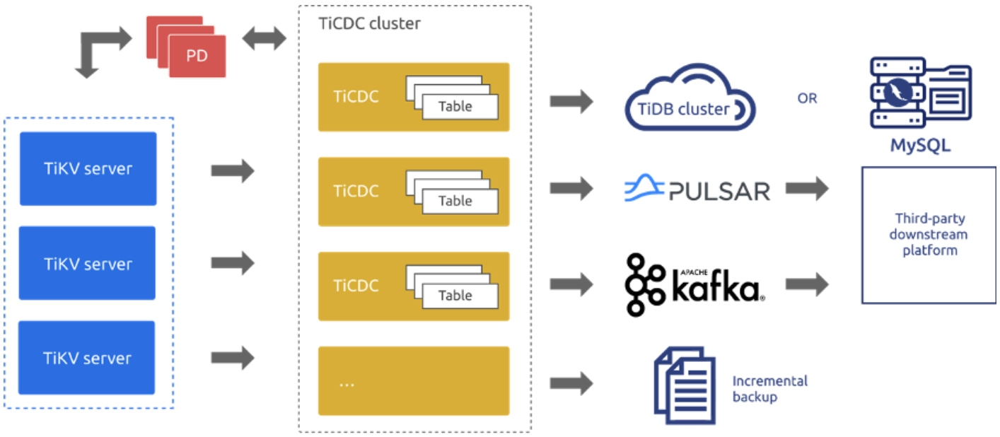
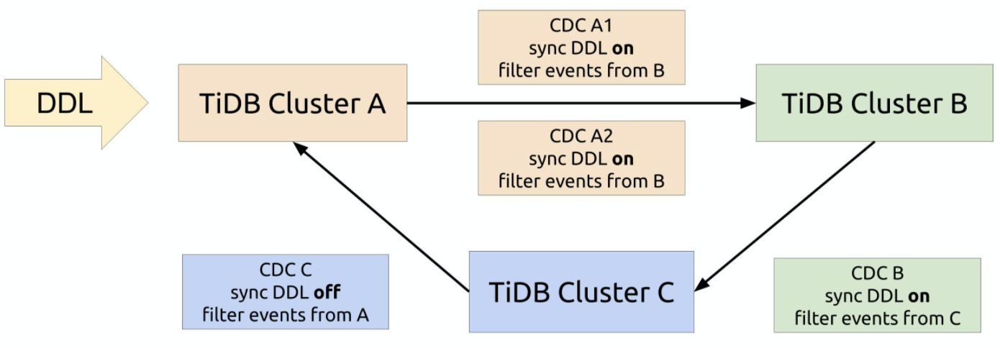

**Author:** PingCAP

**Editors:** [Caitin Chen](https://github.com/CaitinChen), Tom Dewan

[TiDB 4.0](https://docs.pingcap.com/tidb/dev/release-4.0-ga) introduces [TiCDC](https://pingcap.com/docs/dev/ticdc/ticdc-overview/) as TiDB's [change data capture](https://en.wikipedia.org/wiki/Change_data_capture) framework. It's an open-source feature that replicates TiDB's incremental changes to downstream platforms by subscribing to change logs in TiKV (TiDB's storage engine). It can restore data to a consistent state with any upstream timestamp Oracle (TSO) and provides the [TiCDC Open Protocol](https://pingcap.com/docs/dev/ticdc/ticdc-open-protocol/) to support other data consumers that subscribe to TiKV's data changes.

With **high data reliability** and **horizontal scalability** features, TiCDC provides **high-availability replication** services for [100 TB clusters with only milliseconds of latency](https://pingcap.com/blog/replication-latency-in-milliseconds-for-100-tb-clusters). In [TiDB 4.0.6](https://docs.pingcap.com/tidb/dev/release-4.0.6), TiCDC reaches general availability (GA), and you can use it in your production environment.

In this post, we'll walk you through TiCDC's features, application scenarios, and real-world case studies.

 TiCDC architecture 

## TiCDC's features

TiCDC supports these features:

* **Data high availability**

    TiCDC captures change logs from TiKV, which is highly available. This guarantees high availability of data. Even if TiCDC unexpectedly shuts down, when you restart it, it can still normally capture data.

* **Horizontal scalability**

    Multiple TiCDC nodes can form a cluster. You can evenly schedule replication tasks to different nodes. When you have massive data, you can add nodes to mitigate replication pressure.

* **Automatic failover**

    When a TiCDC node in the cluster fails, the replication task on that node is automatically scheduled to the remaining TiCDC nodes.

* **Multiple downstream systems and multiple output formats**

    TiCDC supports replicating data to MySQL-compatible databases, Kafka, and Pulsar. It supports output formats such as [Apache Avro](http://avro.apache.org/), [Maxwell](http://maxwells-daemon.io/), and [Canal](https://github.com/alibaba/canal).

## TiCDC's application scenarios

### Two data centers in the active-standby topology

The database is the core of enterprise IT, and it should run stably and have good disaster recovery capability to ensure application continuity.

Considering the importance of applications and managing costs, some users want the core database to meet the disaster recovery requirement of the active and standby data centers (DCs). Using the TiCDC-based disaster recovery solution for the TiDB active and standby DCs is an ideal choice. Based on TiCDC's data replication feature, this solution is useful when two DCs are far apart and have high latency. It can perform one-way data replication between TiDB clusters in two DCs to ensure that transactions are eventually consistent and achieve second-level recovery point objectives (RPOs).

### Ring replication and multi-active

You can use TiCDC to achieve ring replication between three TiDB clusters and thus establish a multi-DC disaster recovery solution for TiDB. If the power fails at a DC, you can switch your application to a TiDB cluster in another DC. Eventually, your transactions will be consistent, and you will get second-level RPO. To distribute application access pressure, you can switch routing at the application layer at any time. You can balance the load by switching traffic to a TiDB cluster that's not busy. This ensures data high availability and makes your cluster more tolerant of disasters.

 TiCDC ring replication 

### Data subscription

TiCDC provides real-time, high-throughput, and stable data subscription services for downstream data consumers. To meet users' needs for applying and analyzing various types of data in big data scenarios, TiCDC uses the Open Protocol to connect with heterogeneous ecosystems including MySQL, Kafka, Pulsar, Flink, Canal, and Maxwell. TiCDC is a good solution for log collection, monitoring data aggregation, streaming data processing, online and offline analysis.

## Case studies

### Xiaohongshu

[Xiaohongshu](https://en.wikipedia.org/wiki/Xiaohongshu) is a popular social media and e-commerce platform in China. The Xiaohongshu app allows users to post and share product reviews, travel blogs, and lifestyle stories via short videos and photos. By July 2019, it had over 300 million registered users.

[Xiaohongshu uses TiDB](https://pingcap.com/case-studies/how-we-use-a-scale-out-htap-database-for-real-time-analytics-and-complex-queries) for their core applications in multiple scenarios, including:

* Report analysis
* During a large promotion, providing real-time data to a large display screen
* Logistics warehousing
* An e-commerce data hub
* Content security review and analysis

In the content security review and analysis scenario, TiDB in the upstream records security review data in real time, which is written by online applications, to implement real-time data monitoring and analysis.

When TiCDC analyzes review data, it extracts TiDB's real-time stream data and sends it downstream to Flink for real-time calculation and aggregation. The calculation results are written back to TiDB for review data analysis, manual efficiency analysis, and management.

Xiaohongshu calls TiCDC's internal API (which is defined by [sink interface](https://pkg.go.dev/github.com/pingcap/ticdc@v0.0.0-20210728071617-f2526c1e9802/cdc/sink)) to customize their sink. They use the Canal Protocol to send data to Flink to connect to the existing application system. This significantly reduces the costs of refactoring the application system.

TiCDC's **efficient data replication** and **support for heterogeneous big data ecologies** have laid a solid foundation for the real-time processing of Xiaohongshu application data.

### Autohome

[Autohome](http://ir.autohome.com.cn/investor-overview) is the leading online destination for automobile consumers in China. It's the most visited auto website in the world. It's goal is to make buying a car easier and more enjoyable.

Authome has run TiDB for more than two years, and it's used in important applications such as forum replies, resource pools, and friend management. For a big sales promotion on August 18, 2020, Autohome deployed TiDB in three DCs across two cities to serve applications like a bargain rush, [red packets](https://en.wikipedia.org/wiki/Red_envelope), and a lucky draw. TiCDC replicates TiDB cluster data to the MySQL database in the downstream in real time. The MySQL database is used as a backup in case of failures to improve the applications' capacity to tolerate disasters. TiCDC's replication latency is within seconds, which satisfies the real-time requirements for online sales promotion applications.

Smart recommendation is Autohome's important application, and its underlying storage is the resource pool. The resource pool receives and gathers all kinds of information. After it processes data, data is used for applications like homepage recommendations, product displays, and search. Before Autohome used TiDB, the resource pool used MySQL as the storage layer, and used MySQL binlog to send data to [Elasticsearch](https://en.wikipedia.org/wiki/Elasticsearch) for use in search results. Due to MySQL's performance and capacity bottlenecks, after Autohome switched to TiDB, they used TiCDC instead of MySQL binlog to replicate heterogeneous data. TiCDC features **high availability**, **low latency**, **and support for large-scale clusters**, which guarantee applications are running stably.

In addition, Autohome has used TiCDC as a base to develop an interface that outputs log data to Kafka to replicate massive heterogeneous data. It is running in the production environment and has been running stably for more than two months.

### Haier Smart Home

[Haier](https://en.wikipedia.org/wiki/Haier) is a world-leading provider of solutions to better life. The Haier Smart Home app is its official mobile interactive experience portal, providing global users with full-process smart home services, a full-scenario smart home experience, and one-stop smart home customization solutions.

Haier Smart Home's IT technology facilities are built on [Alibaba Cloud](https://en.wikipedia.org/wiki/Alibaba_Cloud). Its core application has these database requirements:

* Support for the MySQL protocol
* Elastic scalability based on distributed transactions with strong consistency
* Close integration with various big data technology ecosystems

[TiDB 4.0](https://docs.pingcap.com/tidb/stable/release-4.0-ga) meets all these requirements, so it's the ideal choice for Haier Smart Home.

Haier Smart Home uses TiCDC to replicate user information and user posts to Elasticsearch for near real-time searches. Currently, the user table has nearly 10 million rows of data, and its data volume has reached 1.9 GB. In addition, Kafka consumes about 3 million messages per day. TiCDC also provides stable and efficient data replication for smart recommendation's big data services. Based on the unified TiCDC Open Protocol with row-level data change notification, TiCDC makes it easier for Haier Smart Home departments to analyze data. The smart recommendation feature is under development.

### Zhihu

[Zhihu](https://en.wikipedia.org/wiki/Zhihu) which means "Do you know?" in classical Chinese, is the Quora of China: a question-and-answer website where all kinds of questions are created, answered, edited, and organized by its community of users.

[Zhihu uses TiDB as their core database](https://pingcap.com/case-studies/lesson-learned-from-queries-over-1.3-trillion-rows-of-data-within-milliseconds-of-response-time-at-zhihu) in the Moneta application (which stores posts users have already read). It outputs logs to Kafka via the TiCDC Open Protocol for massive message processing.

As Zhihu's business volume grew, they encountered problems caused by the limitations of Kafka's architecture and historical version implementation. In the future, Zhihu's infrastructure will be cloud-native, and Pulsar supports native geo-replication, which is more in line with Zhihu's cloud-native infrastructure trend. Therefore, Zhihu replaced Kafka with Pulsar in some applications.

Zhihu developed code on TiCDC's core module. (See pull requests [#751](https://github.com/pingcap/ticdc/pull/751) and [#869](https://github.com/pingcap/ticdc/pull/869) on GitHub.) To replicate TiCDC's data to Pulsar, Zhihu connected TiCDC's sink to Pulsar. With the help of Pulsar's geo-replication, TiCDC's consumers can subscribe to change events regardless of their location. In addition, the Pulsar cluster can quickly scale nodes and rapidly recover from failures. Thanks to this, TiCDC's consumers can get real-time data.

So far, the application of Pulsar and TiCDC has achieved ideal results. Zhihu will migrate more applications from Kafka to Pulsar. In the future, Zhihu will use Pulsar to replicate TiDB data across clusters.

## Give TiCDC a try

Does TiCDC sound like something that could help you? You can quickly deploy TiCDC via [TiUP](https://docs.pingcap.com/tidb/stable/tiup-overview#tiup-overview) and run `cdc cli` to create replication tasks to replicate real-time writes to TiDB, Pulsar, or Kafka downstream. For details, see [Manage TiCDC Cluster and Replication Tasks](https://docs.pingcap.com/tidb/stable/manage-ticdc#manage-ticdc-cluster-and-replication-tasks).

If you are using [TiDB 4.0.5](https://docs.pingcap.com/tidb/dev/release-4.0.5) or earlier, [upgrade TiCDC using TiUP](https://docs.pingcap.com/tidb/stable/manage-ticdc#upgrade-ticdc-using-tiup).

We'd like to thank everyone who has [contributed](https://github.com/pingcap/ticdc/graphs/contributors) to TiCDC. Your effort has made this release possible.
