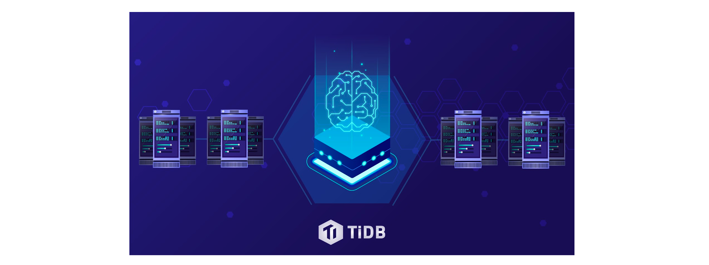
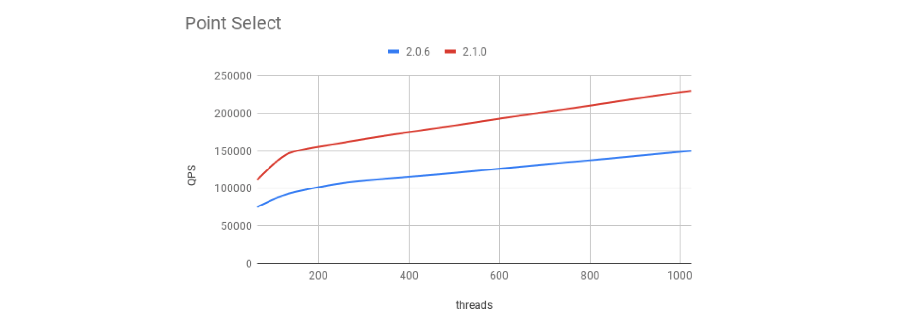
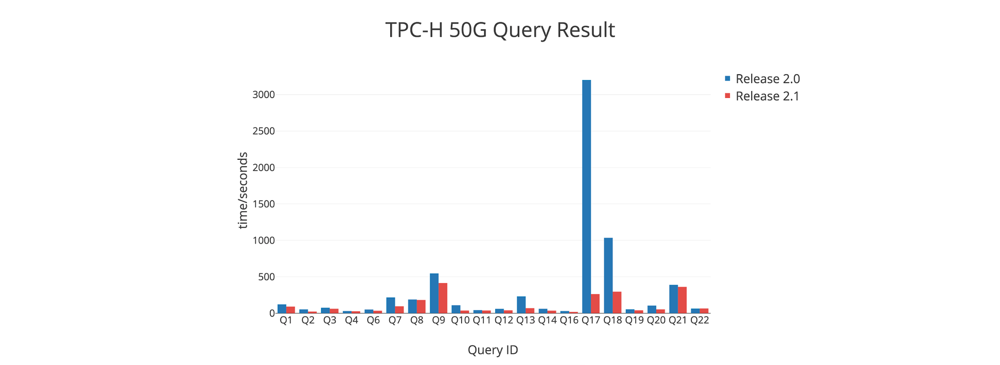

Today, we are proud to announce that TiDB 2.1 is ready for General Availability. TiDB is an open-source NewSQL Hybrid Transactional and Analytical Processing (HTAP) database -- [one of the most popular](https://github.com/pingcap/tidb) and active database products on GitHub. It is designed to provide elastic horizontal scalability, strong consistency, and high availability. TiDB is MySQL-compatible and serves as a single relational database solution for both OLTP (Online Transactional Processing) and OLAP (Online Analytical Processing) workloads.

## From 2.0 to 2.1

Since we [launched TiDB 2.0](https://pingcap.com/blog/tidb-2-0-announcement/) back in April 2018, we've seen an incredible pace of adoption. [Hundreds of companies](https://pingcap.com/success-stories/) now use TiDB in production, serving millions of users in industries from banking, fintech, and insurance, to food delivery, ridesharing, and gaming. The largest cluster has more than 100 nodes storing 100+ TB of data. Workloads range from pure OLTP, to pure OLAP, to a hybrid mixture of both. In addition, some customers are taking advantage of TiDB's modular architecture by just using [TiKV](https://github.com/tikv/tikv), the distributed transactional key-value store (now a [Cloud Native Computing Foundation member project](https://www.cncf.io/blog/2018/08/28/cncf-to-host-tikv-in-the-sandbox/)) to unify data storage.

We've also launched [TiDB Academy](https://pingcap.com/tidb-academy/), a series of self-paced technical training courses and certifications on TiDB and distributed databases, and [TiDB Cloud](https://pingcap.com/tidb-cloud/), to enable more customers to easily use TiDB in any cloud environment, either as a fully-managed service delivered by PingCAP or on a public marketplace.

What's exciting isn't just the rate of adoption, but also the multitude of real-world scenarios that TiDB is exposed to and must navigate with resilience and grace. In the last few months, TiDB has had to handle challenges like cross-data center disaster recovery, six-figure throughput requirement, [massive traffic spike on Singles' Day](https://twitter.com/pingcap/status/1061679993040834560) (one of the largest online shopping holidays in the world), hardware and network failures, and more.

In short, the PingCAP team has seen a lot of unpredictable unknowns as we supported TiDB users, and the technology is battle-tested than ever before. These experiences shaped what we built in 2.1, so TiDB would always have your back and help you handle an unpredictable world.

## What's New in TiDB 2.1

There are many new features, improvements, and enhancements in 2.1. To check out the full list, please see the [official 2.1 GA release notes](https://pingcap.com/docs/releases/2.1ga/), but here are some major highlights:

### Smarter Optimizer

The optimizer is the brain of the database. In 2.1, we've made significant improvements to make TiDB's brain, its cost-based optimizer (CBO), smarter so it knows how to speed up more complex queries without human intervention. For example, the new CBO can make smarter index choices on Index Join, along with optimizations on outer table and correlated subquery, to speed up complex queries automatically.  

We also added additional knobs that you can turn manually as “hint”, for Join, UPDATE, DELETE, and other queries, so even if the CBO does not generate a good query plan, you can intervene to keep performance up to par and consistent.

### Faster Executor

TiDB 2.1 includes major improvements to the execution of certain physical plans to increase performance, especially for hash aggregation and projection, by adding multi-thread execution. We also re-architected the aggregation framework to support vectorized computation.

Because of these improvements, TiDB 2.1 performances much better in OLAP scenarios than 2.0, as shown in our latest TPC-H benchmark in the “Performance Benchmark” section below. This performance boost further strengthens TiDB's capabilities as an HTAP database.

    <a href="/download" onclick="trackViews('TiDB 2.1 GA: Battle-Tested to Handle an Unpredictable World', 'download-tidb-btn-middle')"><button>Download TiDB</button></a>
    <a href="https://share.hsforms.com/1e2W03wLJQQKPd1d9rCbj_Q2npzm" onclick="trackViews('TiDB 2.1 GA: Battle-Tested to Handle an Unpredictable World', 'subscribe-blog-btn-middle')"><button>Subscribe to Blog</button></a>

### New and Improved Raft

The Raft consensus protocol inside TiKV is at the core of how TiDB ensures strong consistency and high availability of your data. Thus, constantly improving Raft has always been a high priority. In 2.1, we have incorporated three new Raft features:

- Raft PreVote -- this feature pre-checks the likelihood of certain members of a Raft group becoming a Leader before voting takes place, which reduces performance fluctuation and improves stability when a TiKV node enters or returns to a cluster.
- Raft Learner -- a Raft Learner node is a non-voting member of a Raft group. By adding a Learner first before other voting members are added, this feature improves data safety and availability, especially in a cross-data center deployment.
- Raft Region Merge -- automatically merge many small regions into one larger region to reduce cost of cluster management, and improve overall performance and stability for large-scale clusters. Note: this feature is available in 2.1 but not enabled by default.

### Dynamic Statistics Update

Timely update of the latest statistics to TiDB's CBO is very important for generating the correct query plan. That's why in 2.1, we added dynamic statistics update based on query feedback.

Here's how it works in brief: when TiDB first generates a query plan, it will do so based on existing statistics generated from previous queries to estimate the amount of data involved in the query to be processed. After this query is processed, TiDB will measure how much data was actually involved. Depending on the difference between the estimate and the actual, TiDB will automatically update the system, including both the histogram and the CM-sketch. Based on our internal testing, for a table with no previous statistics available, it takes about 10 rounds of queries worth of updates, before TiDB can generate the most optimal and efficient query plan consistently.

Besides dynamic statistics update, 2.1 also adds additional support for auto analyze (see details in [our documentation](https://pingcap.com/docs/sql/statistics/#automatic-update)), so depending on the ratio of the number of modified rows to the total number of rows, TiDB can automatically execute ANALYZE to update the statistics of that table.

### Concurrent DDL

In TiDB, all DDL is online. In previous versions, however, every DDL operation is serialized, even if DDL is performed on different tables with no relations to each other. That's not ideal when you are doing Add Index on table A and also want to create table B, but table B creation must wait until Add Index on table A is finished.

In 2.1, we have revamped TiDB's online DDL process to completely separate Add Index with other DDL operations, so they can be executed concurrently. In TiDB, Add Index usually takes quite a long time, while other DDL operations can be completed within a few seconds, so with this improvements, most DDL operations no longer have to wait to be executed.

### Readable EXPLAIN and EXPLAIN ANALYZE

EXPLAIN is a very important tool for debugging and diagnosing queries. Before 2.1, TiDB generally followed MySQL's EXPLAIN format, but as queries become more complex, this format became less useful, because it doesn't easily show each layer of subqueries to help with diagnosing issues.

In 2.1, we improved TiDB's EXPLAIN to display information in each layer of operation of a complex query in a format that's more readable at a glance, so users can quickly spot, troubleshoot, and identify potential problems in their queries. This [section of our documentation](https://pingcap.com/docs/sql/understanding-the-query-execution-plan/) explains how the new EXPLAIN works in more detail.

In addition, users can now also use EXPLAIN ANALYZE to see additional execution statistics while a query is being executed, to investigate every operation's execution time and the amount of data involved. With these improvements, debugging and diagnosing query issues in TiDB is easier than ever before.

### Hotspot Scheduling

Hotspot formation is one of the biggest enemies to a performant distributed database. It is also one of the most unpredictable -- you never know when and how hotspots could form to create bottlenecks in your system.

Thus, in this new version we did a lot of work to make TiDB smarter at detecting hotspot formation more quickly by aggregating additional system metadata to be monitored continuously. We also further optimized TiDB's ability to execute hotspot scheduling policy -- breaking up and distributing hotspots with more efficiency and lower system cost. Lastly, 2.1 also makes available an interface where users can manually break up Regions in specific TiKV nodes to remove hotspots, which can be useful in extreme situations where the system cannot respond quickly enough to remove hotspots automatically.  

### More Efficient Garbage Collection

In 2.1, we further optimized garbage collection (GC) in TiDB. The new optimization reduced GC's affect on online write performance, while increasing the speed in storage recovery. Based on our internal testing, when deleting a 1TB table in TiDB 2.1, it takes about 10 seconds to recover 99% of the storage space.

## Performance Benchmarks, No Benchmark-eting

We loathe benchmark-eting. It's misleading to users and customers to cherry-pick workloads and scenarios only for the purpose of making your product look good against competition. That's why we only use and release industry benchmarks between older and newer versions of TiDB that are reproducible to demonstrate that TiDB is indeed getting better.

### OLTP with Sysbench

In order to improve performance on typical OLTP workloads, which is what many of our users have, we engineered many optimizations in TiDB's parser and cost-based optimizer to speed up Point Select operations. When you access your data via Unique Key or Primary Key using 2.1, you will see a 50% performance improvement over 2.0. You can find the details and reproduce [the benchmark here](https://pingcap.com/docs/v2.1/benchmark/sysbench-v3/).

### OLAP with TPC-H

As a HTAP database, constantly improving in TiDB's performance on OLAP workloads is always a high priority. In 2.1, we've made significant strides in this direction.

Back when we released 2.0 in April, we published a TPC-H Scale 50 benchmark [comparing 2.0 with 1.0](https://github.com/pingcap/docs/blob/master/benchmark/benchmark-tpch.md), which showed improvements on all queries, including ones that couldn't even run on 1.0. However, query 17 and 18 were quite slow.

Now with 2.1 ready for GA, we compared it with 2.0 using the same benchmark and observed significant performance improvements on query 17 and 18 (see graph below, Y-axis is performance time per second, so lower the better), as well as improvements on all other queries across the board. This performance boost is due to improvements in TiDB's CBO and executor, plus optimization in TiKV's range scan capabilities.

## Ecosystem Tools

At PingCAP, we don't just love building database, we love building tools as well. There are three tools in the TiDB ecosystem that we'd like to highlight:

- [TiDB Lightning](https://pingcap.com/docs/tools/lightning/overview-architecture/): makes importing data from a different database to TiDB very fast (currently around 100GB per hour on production-grade hardware). This tool is commonly used to facilitate initial migration to TiDB.
- [TiDB Binlog](https://pingcap.com/docs/v3.0/reference/tidb-binlog/overview/): supports downstream data synchronization, to either a TiDB cluster, MySQL slaves, or another data warehouse. This tool is often used to create hot backups as well.
- [TiDB DM (Data Migration)](https://pingcap.com/docs/dev/reference/tools/data-migration/overview/): provides full data migration and binlog replication from MySQL and MariaDB to a TiDB cluster, including merging sharded tables and data transformation during a migration process to avoid conflicts.

With these three tools in hand, you can easily migrate in and out of TiDB from your existing database, which reduces the amount of work and worry you might have when testing, evaluating, and eventually adopting TiDB for your production environment.

## Ode to Open Source

TiDB 2.1 simply would not be possible with the help and support of an increasingly vibrant TiDB open source community. We firmly believe that for TiDB to become a core infrastructure technology that can help its users handle an unpredictable world, the open source way is the only way forward to achieve that goal. And our community has more than validated our belief, with bug fixes, issue reports, and valuable contributions in every corner of this release.

Since the 2.0 release in April, we celebrated our [200 contributors milestone](https://pingcap.com/blog/tidb-community-200-contributors/) in the TiDB repo and welcomed 87 new contributors in different repos in the entire TiDB platform, including one from Tencent [who contributed 76 PRs](https://github.com/pingcap/tidb/commits?author=spongedu); he is now our newest TiDB committer.

We've made design documents for both [TiDB](https://github.com/pingcap/tidb/wiki/Design-Documents) and [TiKV](https://github.com/tikv/rfcs) public, as well as specific feature development processes publicly available via GitHub Issue and Project, to encourage community participation. We will also open up the planning discussion of certain features to the community via video conference to better incorporate community input.

We are forever grateful and indebted to our open source community for always fueling our spirit with your encouragement, critique, contribution, and patience. TiDB would not be what it is today without you. And we can't wait to take it to new heights with you, together.

## Wrapping Up

Phew! That's a long post and a lot of features and updates, each one probably deserving of its own blog post. Rest assured, our team is preparing deep dives on all of them, so stay tuned.

One more thing, if you are an existing 2.0 user, make sure you check out the [official 2.1 GA release notes](https://pingcap.com/docs/releases/2.1ga/) for tips and guidance on upgrading to the best TiDB yet. Thank you.
