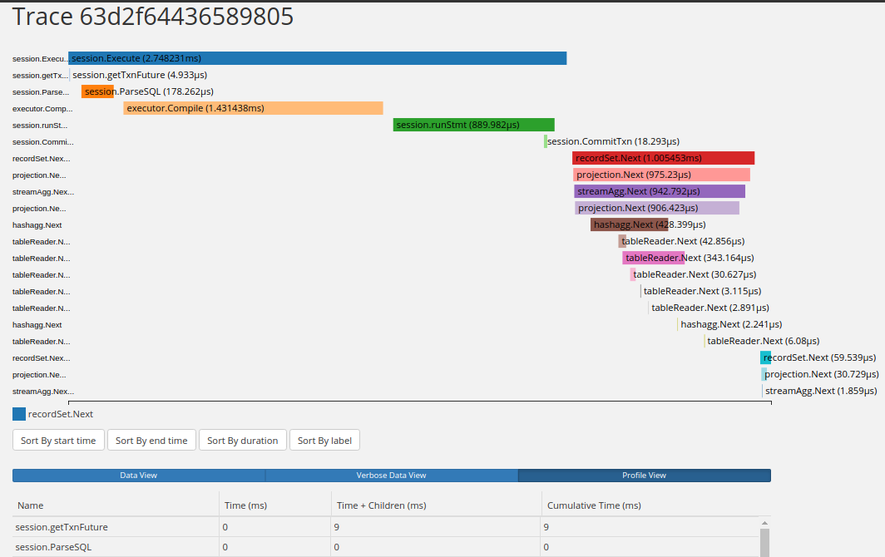

Author: Li Shen, VP of Engineering at PingCAP

Last weekend, PingCAP hosted the second annual TiDB DevCon in Beijing, with a packed crowd of more than **700** developers, customers, and contributors. Among the many announcements that were made on TiDB’s core product, roadmap, and ecosystem was the release of TiDB 3.0 beta. Here’s a rundown of the highlights.  

## TiDB 3.0 Beta: Key New Features

TiDB is an open-source NewSQL Hybrid Transactional and Analytical Processing (HTAP) database with MySQL compatibility – one of the most popular and active database products on GitHub. It is designed to provide elastic horizontal scalability, strong consistency, and high availability. In TiDB’s previous [2.1 GA release](https://www.pingcap.com/blog/tidb-2.1-ga-Battle-tested-to-handle-an-unpredictable-world/) in November 2018, we made major improvements in areas like our cost-based optimizer, query plan executor, Raft implementation (including pre-vote, learner and region merge), and concurrent online DDL. You can read about the details of that release in our [announcement post](https://www.pingcap.com/blog/tidb-2.1-ga-Battle-tested-to-handle-an-unpredictable-world/). 

As our team brainstormed and roadmapped TiDB’s future, taking in valuable suggestions from hundreds of companies using TiDB in production, we arrived at a common theme: not only should TiDB deliver “SQL at scale,” it should also deliver “stability at scale.” To achieve this end, we decided to build the following improvements in TiDB 3.0:

**Multi-thread Raftstore:** As you may know, the consensus algorithm that underpins TiDB’s strong consistency and high availability characteristics is Raft. As a distributed database serves more production traffic, concurrency increases and Raft becomes a bottleneck that can impact performance due to limitations in Raft’s original design. Thus, we built a new implementation where multiple Raft communication threads can be processed concurrently, leading to improved performance. Based on our internal testing, in TiDB with multi-thread raftstore `INSERT` performance increases as concurrency increases. We will release additional benchmark information soon for those interested in reproducing what we see. 

**Batch Message in gRPC:** We use gRPC extensive inside the TiDB platform to execute communications between its various components, i.e. TiDB server, TiKV, Placement Driver, etc. While gRPC is easy to use and feature rich, it does create performance bottlenecks. To improve performance, we batch gRPC messages that are going to the same destination in a queue, with a timer that detects whether the receiver side is busy. If not, send the message immediately, and only triggers batch message when the receiver is too busy. 

**Query Tracing:** One of our big goals in 3.0 besides bringing stability at scale is improving usability, and one important element of the usability is diagnosing and debugging queries. Even though we improved the readability of EXPLAIN and EXPLAIN ANALYZE in [TiDB 2.1](https://www.pingcap.com/blog/tidb-2.1-ga-Battle-tested-to-handle-an-unpredictable-world/), there’s more we can do to make DBAs', architects', and DevOps' lives easier. Thus, we implemented Query Tracing, which is a much more clear, visual, and intuitive way to identify which part(s) of a query is slow or causing issues, making diagnosis and debugging a breeze.

 *Query Tracing screenshot* 

Of course, these aren’t the only new features. TiDB 3.0 beta also includes the following, which we will write more about in the future: 

- Window Functions
- Views
- Table Partitioning (Hash/Range Partition)
- Restore Dropped Table
- TitanDB Storage Engine (Experimental)
- Distributed Garbage Collection

We will write more deep dive blog posts on each of these developments soon. And while we don’t recommend that users deploy 3.0 beta in production, we are working hard with the help of the TiDB community to bring 3.0 to GA status by mid-2019. For details of the current release, please see our [release notes](https://www.pingcap.com/docs/releases/3.0beta/). 
