**Author:** Max Liu (CEO at PingCAP)

**Transcreator:** [Caitin Chen](https://github.com/CaitinChen); **Editor:** Tom Dewan


TiDB is an open-source, distributed, [Hybrid Transactional/Analytical Processing](https://en.wikipedia.org/wiki/HTAP) (HTAP) database built by [PingCAP](https://pingcap.com/) and its open-source community. At [TiDB DevCon 2020](https://pingcap.com/community/devcon2020/), the TiDB community's annual technical conference, more than 80 developers, TiDB users, and partners online from all over the world shared their first-hand development and practical experience with TiDB. The topics covered finance, telecommunications, e-commerce, logistics, video, information, education, medical care, and many other industries. At the meeting, we showed [TiDB 4.0](https://docs.pingcap.com/tidb/stable/release-4.0-ga)'s general availability (GA) technical details and its performance in a production environment. More than 3,000 people signed up to watch the live broadcast and exchanged their ideas in the group.

This post is based on the keynote speech Max Liu, CEO at PingCAP, gave at this conference. The slides are [here](https://www.slideshare.net/PingCAP-TiDB/tidb-devcon-2020-opening-keynote).

&nbsp;

Last year, at TiDB DevCon 2019, we released [TiDB 3.0 Beta](https://pingcap.com/blog/tidb-3.0-beta-stability-at-scale). Today, at TiDB DevCon 2020, I'm so excited to show you [TiDB 4.0 GA](https://docs.pingcap.com/tidb/stable/release-4.0-ga)'s cutting-edge features and functionalities.

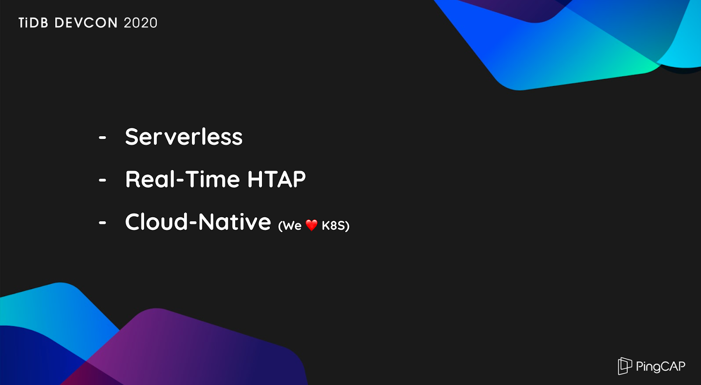
<div class="caption-center"> TiDB 4.0 highlights </div>

I've always believed that, in this day and age, databases should be more real-time, more flexible, and easier to use. TiDB 4.0, an elastic, cloud-native, real-time HTAP database, is exactly that kind of database, because it provides:

* Serverless TiDB
* Real-time HTAP
* Cloud-native TiDB

They are the most exciting and appealing characteristics to TiDB users. They distinguish TiDB from other databases.

## Serverless TiDB

[Serverless computing](https://en.wikipedia.org/wiki/Serverless_computing) is a very important concept in the field of cloud services. If you use a large-scale TiDB cluster, you might want to reduce costs. Now, with serverless capabilities, TiDB 4.0 can automatically scale in or out in Kubernetes based on your application load.

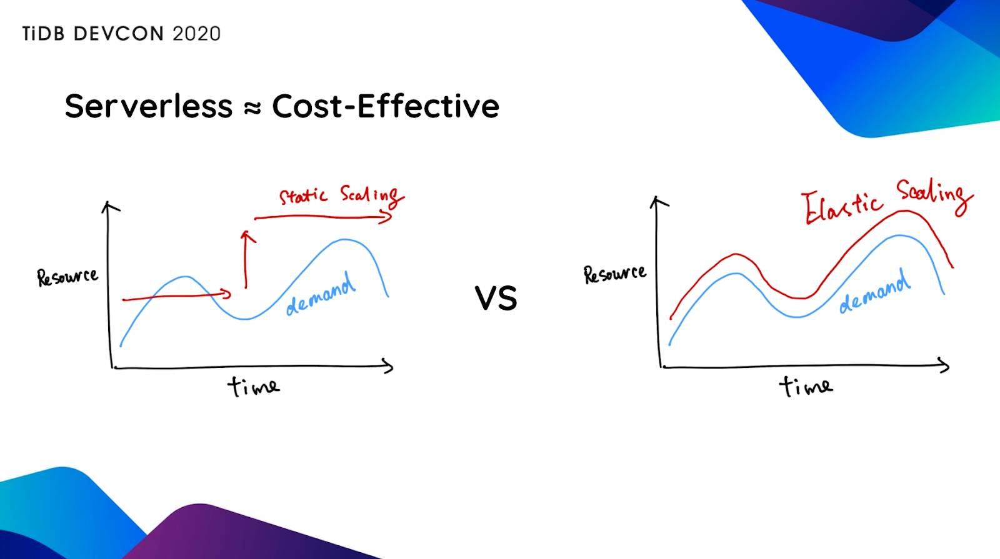
<div class="caption-center"> Serverless TiDB </div>

Serverless TiDB brings you these advantages:

* **Being automatically elastically scalable on the cloud reduces costs.** In the past, when you wanted to launch a system, the first task was capacity planning: assessing how many servers you needed. However, even the best plans can be inaccurate in practice. For example, you may have prepared 50 servers, but after the system ran in the production environment for a month, you found that 5 machines were enough. This led to a lot of wasted resources. Now, the entire system can elastically scale in the cloud, ensuring the most efficient use of your database resources.
* More importantly, TiDB's elastic scaling means that **you never need to provision system resources according to your application's peak load**. For example, when you have two load peaks in the morning and evening, you provision to peak capacity for 24 hours. But in fact, each peak lasts for only about 2 hours. That is to say, your application peaks are a total of 4 hours but you pay for 24 hours of peak capacity resources. Now with serverless TiDB, you can save resources and costs during off-peak hours. You can save about 70% of the costs, or even more.

In addition, TiDB can automatically scale based on your application needs to handle unpredictable workloads. For example, no one knows when a commodity will be hot. If you give the system permission to automatically scale based on the actual situation, this may be "life-saving" for a business, since human intervention is often too slow and too late.

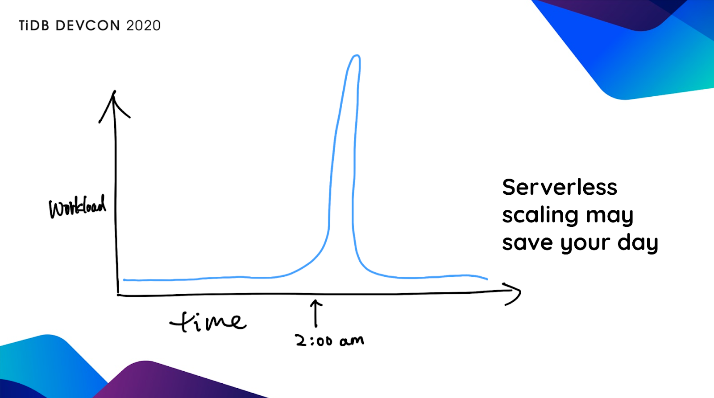
<div class="caption-center"> Serverless scaling </div>

## Real-time HTAP analytics

In TiDB 4.0, we introduce [TiFlash](https://docs.pingcap.com/tidb/v4.0/tiflash-overview), an extended analytical engine and columnar store for TiDB. A TiDB database that incorporates TiFlash lets you perform real-time HTAP analytics.

### Why real-time HTAP analytics?

In today's world, everyone wants everything to be faster and simpler. But if you still use a database in the traditional way to gain insights from large volumes of data, you can't meet this "faster, simpler" demand. This is because in the traditional way, you need to go through a series of complicated processes to extract the changing information, events, and logs from the database and then analyze the data. In this process, a long delay often occurs. Working with outdated information can mean poor decisions and economic losses.

TiFlash is seamlessly integrated with TiDB, and it inherits TiDB's easy-to-maintain characteristics, such as online data definition language (DDL), seamless scalability, and automatic fault tolerance. And TiFlash can be synchronized with the row-store engine automatically in real time.

With TiFlash, TiDB 4.0 can be at least 10 times faster than TiDB 3.0 in scenarios with a large number of complex data analytics, and you never need to worry about data inconsistency. **No matter whether TiFlash processes simple Online Transactional Processing (OLTP) workloads or complex Online Analytical Processing (OLAP) workloads, it always guarantees data consistency and freshness. It also can automatically scale in or out.**

### A case for real-time HTAP analytics

Now let's see an example. Look at the architecture diagram below. Almost all companies with a certain scale of data used this architecture. I know a TiDB user who once built a complex system like this architecture in a scenario with only dozens of TB of data. He did this just to be able to deal with OLTP workloads and make a report query. In this process, he had to connect to Kafka and an extract, transform, load (ETL) tool, reserialize the report query results, and then store the results in a storage system such as HBase. Is there a method to simplify the entire architecture?

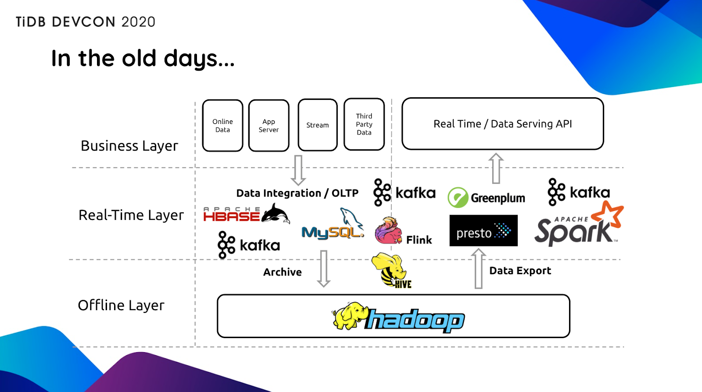
<div class="caption-center"> A complex architecture </div>

When we recommended TiDB 4.0 to them, they accepted and deployed it in their production environment. As shown in the diagram below, we put TiDB in the middle layer, and the system complexity was greatly reduced.

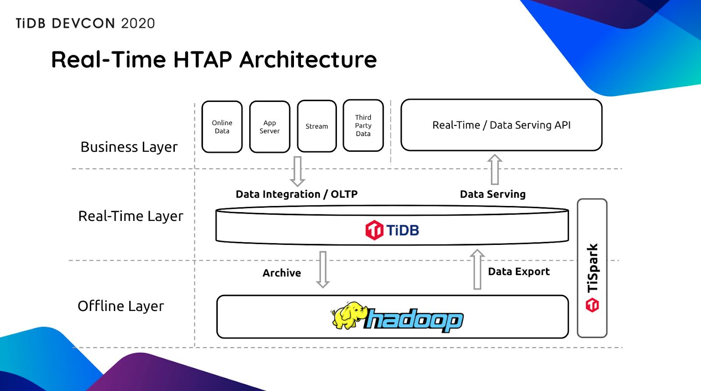
<div class="caption-center"> TiDB's real-time HTAP architecture </div>

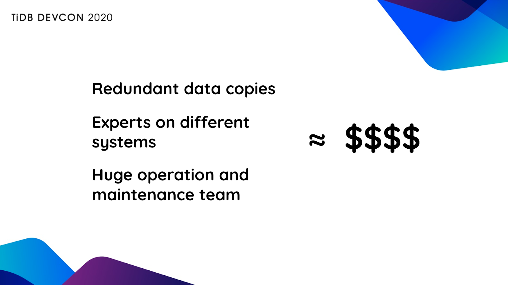
<div class="caption-center"> The TiDB HTAP architecture saves costs </div>

From the user's perspective, it doesn't matter whether a workload is a long or short query. To save costs, improve development efficiency, and create more value, users just want to get query results as soon as possible and reduce operation complexity as much as possible.

## Cloud-native TiDB

We're thrilled to release the beta version of [TiDB Cloud](https://pingcap.com/products/tidbcloud), the fully-managed TiDB service delivered by [PingCAP](https://pingcap.com/). TiDB Cloud is the easiest, most economical, and most resilient way to unlock the full power of TiDB in the cloud, allowing the users to deploy and run TiDB clusters with just a few clicks.

Two years ago, we began to develop TiDB Cloud. Today, it can seamlessly "dance in the cloud."

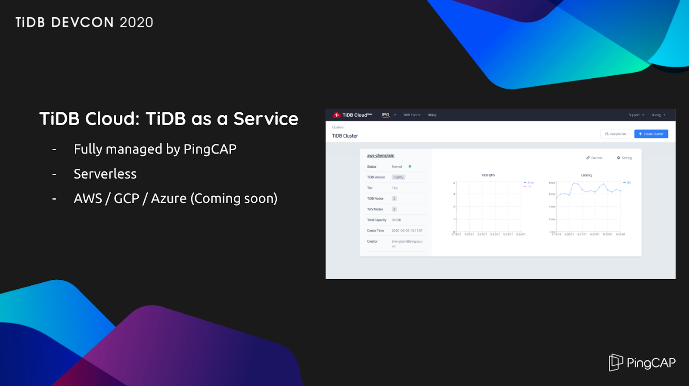
<div class="caption-center"> TiDB Cloud </div>

If you don't want to install or maintain TiDB, you can [try TiDB Cloud](https://tidbcloud.com/signup). Currently, TiDB Cloud supports two cloud platforms, Amazon Web Services (AWS) and Google Cloud Platform (GCP). If you're using AWS or GCP, you can easily use TiDB with just a few clicks. It's truly an "out of the box" solution. We're also developing TiDB Cloud to make it support other cloud platforms.

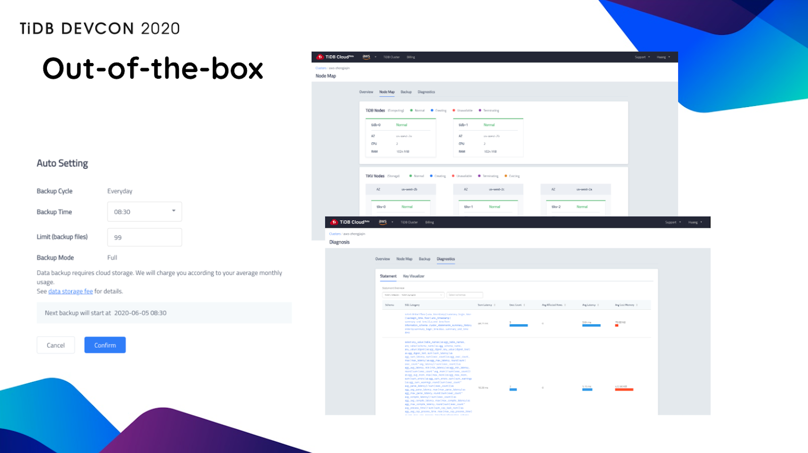
<div class="caption-center"> Out-of-the-box TiDB Cloud </div>

In TiDB 4.0, we introduce more than 70 new features. To learn more about them, you can read [TiDB 4.0 GA, Gearing You Up for an Unpredictable World with a Real-Time HTAP Database](https://pingcap.com/blog/tidb-4.0-ga-gearing-you-up-for-an-unpredictable-world-with-real-time-htap-database).

## TiDB Dashboard, a visual troubleshooting tool

TiDB 4.0 introduces [TiDB Dashboard](https://docs.pingcap.com/tidb/stable/dashboard-intro), a graphical interface with various built-in widgets that let you easily diagnose, monitor, and manage your clusters. In a single interface, you can check a distributed cluster's runtime status and manage the cluster.

Even if you're an inexperienced DBA, you can solve most cluster problems in the graphical interface. In TiDB Dashboard, you can identify hotspots and slow queries in the system and observe application load. With TiDB Dashboard, you can locate most of your system problems within 10 seconds!

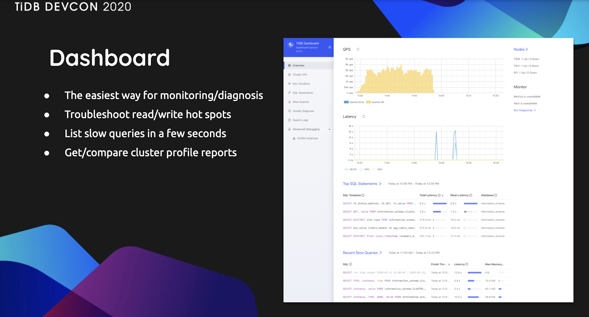
<div class="caption-center"> TiDB Dashboard </div>

## TiDB performance: faster and faster

Performance is always an "exciting" issue. Compared with version 3.0, [TiDB 4.0's TPC-C performance improved by about 50%, and TPC-H performance increased by about 100%](https://pingcap.com/blog/how-we-improved-tpcc-performance-50-percent-and-tpch-performance-100-percent). For aggregate queries, compared with version 3.0, TiDB 4.0's performance improved by 10 times—and in many scenarios even more.

These achievements are attributed to contributions from the TiDB open-source community. At the end of 2019, we launched the TiDB Challenge Program, an on-going community effort to bring TiDB to a new level of stability, performance, and usability. A total of 165 participants joined in this campaign, including 23 teams and 122 individual developers. We'd like to thank them for helping us shape TiDB into a competitive product in the database industry.

## TiUP: get a TiDB cluster up in only one minute

Some users told us TiDB could be challenging to install. It could take them from several hours to an entire day to deploy the system. Now, this is about to change. TiDB 4.0 introduces [TiUP](https://pingcap.com/docs/stable/how-to/deploy/orchestrated/tiup/), a component manager that streamlines installing and configuring a TiDB cluster into a few easy commands. With TiUP, you can [get your cluster up in just one minute](https://pingcap.com/blog/get-tidb-cluster-up-in-only-one-minute)! To deploy a 15-node production cluster, it takes only 45 seconds. Whatever your need or experience level, TiUP will get your cluster up and running quickly with a minimal learning curve.

```shell
curl https://tiup-mirrors.pingcap.com/install.sh | sh  && tiup playground nightly --monitor
```

## Security matters!

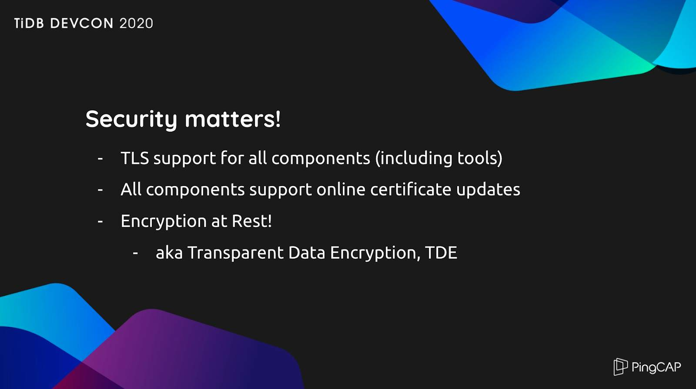
<div class="caption-center"> TiDB security </div>

Not only are more enterprises using TiDB, they are using TiDB in more critical scenarios. There's a lot of focus on data security, so we provide security features to meet the security and privacy compliance requirements of each country.

In TiDB clusters (including the ecosystem tools), data is encrypted both in-flight and at-rest. Neither PingCAP nor any other cloud vendor can violate the data privacy or security of TiDB users. When TiDB runs in the cloud, no one can see the database, and no one can intercept the data from the communication process.

## TiDB 4.0 is ready for production

You might wonder: is TiDB 4.0 _really_ ready for production? Let's see a real-world case.

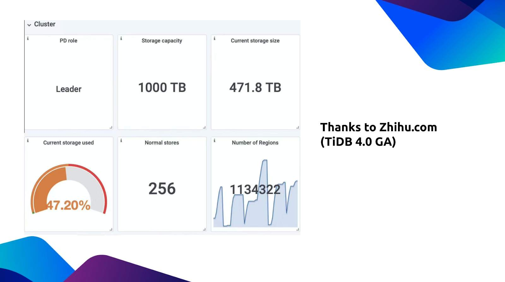
<div class="caption-center"> TiDB 4.0 in Zhihu </div>

[Zhihu](https://en.wikipedia.org/wiki/Zhihu), which means "Do you know?" in classical Chinese, is the Quora of China: a question-and-answer website where all kinds of questions are created, answered, edited, and organized by the community of its users. It is [China's biggest knowledge sharing platform](https://walkthechat.com/zhihu-chinas-largest-qa-platform-content-marketers-dream/).

Last year, Zhihu adopted TiDB in their Moneta application (which stores posts users have already read), and they published a [post](https://pingcap.com/case-studies/lesson-learned-from-queries-over-1.3-trillion-rows-of-data-within-milliseconds-of-response-time-at-zhihu) that showed how they kept their query response times at milliseconds levels despite having over 1.3 trillion rows of data.

Recently, Zhihu upgraded to TiDB 4.0. Their cluster has a capacity of 1 PB, and they've stored 471 TB of data in the cluster.

I was shocked when I first saw this, not only because of the data scale, but also shocked and moved by Zhihu's confidence in 4.0. **They upgraded to TiDB 4.0 only four days after the GA release.** When we saw this, our confidence grew stronger. TiDB not only supports such a large data scale, but more importantly, it has greatly improved the Moneta application's computing capability and reduced the system latency.

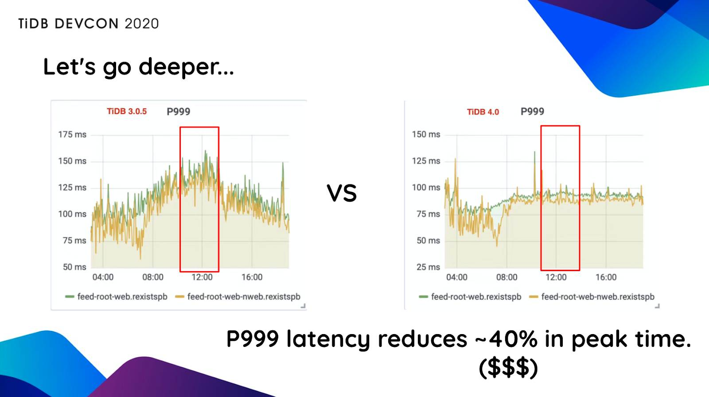
<div class="caption-center"> Reduced latency </div>

As we can see in these diagrams, compared with TiDB 3.0, TiDB 4.0 has reduced latency by 40%. In other words, if Zhihu maintains the same latency as before, they can reduce their costs by 40%.

## Why is TiDB so popular?

In the last year, we were often asked, "Why is TiDB so popular?"

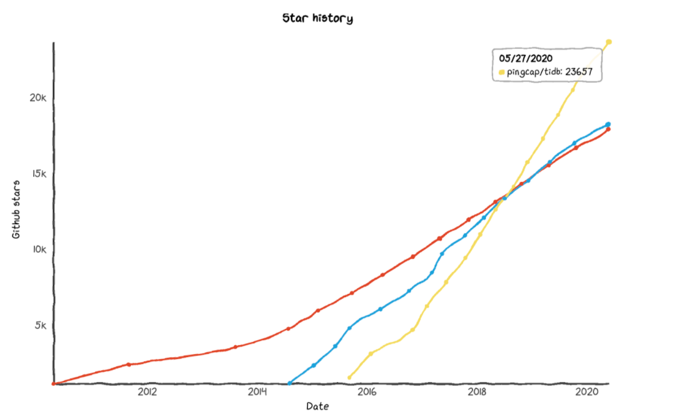
<div class="caption-center"> The TiDB project's stars on GitHub </div>

We're grateful for the success of TiDB around the world and thrilled that our customers find TiDB so valuable. But the credit doesn't entirely belong to PingCAP. We gladly share it with the open-source community. After all, PingCAP is just part of that community. It's because of developers around the world—like Square, Azure, and Zoom in the United States and Dailymotion in France—who give us their feedback, file pull requests, and contribute code, that we can shape TiDB into what it is today and build TiDB's active open-source community.

When 4.0 was released, we made a word cloud to show the organizations that contribute to TiDB. We discovered that many organizations continually contribute to the TiDB community:


<div class="caption-center"> TiDB contributors' organizations </div>

At the same time, what surprises me is the community's creativity. For example, TiDB Contributor Dongpo Liu visualized the [top 100 contributors](https://hi-rustin.github.io/Ti2020/) like this:

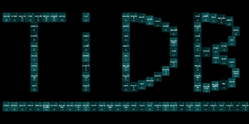
<div class="caption-center"> TiDB's top 100 contributors </div>

If you want to learn more about TiDB, you can attend online or offline training courses through [PingCAP University](https://university.pingcap.com).

You might be ambitious and want to write a distributed database of your own. No problem. Our [Talent Plan](https://github.com/pingcap/talent-plan) program offers courses in how to build a distributed database's computing and storage layers step by step. There will be tutors from all over the world to help you review your code or tasks.

## Bonus: Chaos Mesh®

Finally, let's talk about our experience in chaos engineering. There is a common understanding in the software field that all foreseeable accidents will eventually occur. We must accept the fact that complex systems are unavoidable, and we must do our best to keep them stable and resilient. Today, the complexity of the entire system is not only limited to the database, but extends to all parts of the business, and ultimately settles in the quality of services the system provides to users.

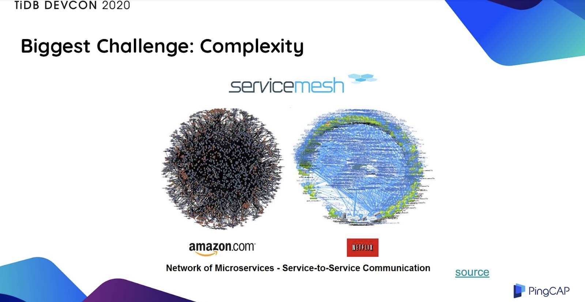
<div class="caption-center"> Amazon's and Netflix's microservices </div>

The figure above graphically represents the connections within Amazon's and Netflix's microservices. These connections are actually much more complicated than spider webs. Therefore, we need a system to simulate all possible faults, let the faults happen continuously, and take precautions to enhance the robustness of the system.

Therefore, when we were developing TiDB, we built a system called **[Chaos Mesh®](https://github.com/chaos-mesh), a cloud-native Chaos Engineering platform that orchestrates chaos experiments in Kubernetes environments. It features all-around fault injection methods for complex systems in Kubernetes, covering faults in the Pod, the network, the file system, and even the kernel**.

For example, Chaos Mesh can simulate a disk failure. In our test environment, if the disk breaks every minute, the network is isolated every minute. Although this situation rarely occurs in reality, if it does, it causes a catastrophic failure.

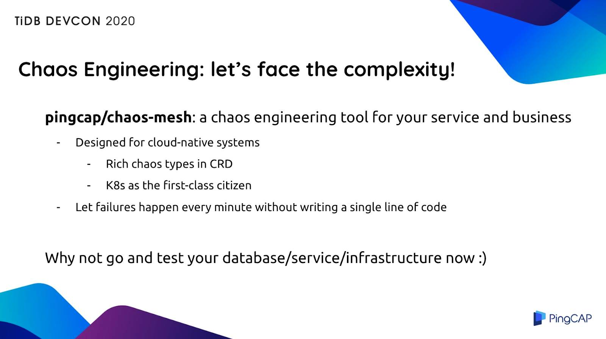
<div class="caption-center"> Chaos Mesh® designed for cloud-native systems </div>

When we're developing TiDB, we use Chaos Mesh to test TiDB. TiDB 4.0 received very good feedback from test users, partly due to Chaos Mesh's "crazy and brutal" tests on TiDB. We invite you to use Chaos Mesh to test and improve your own systems.

## Conclusion

TiDB is no longer just a database product. It has become the cornerstone of many systems. Before you use it, you can refer to other people's [experiences or solutions](https://pingcap.com/case-studies). We'll be posting more articles about [TiDB DevCon 2020](https://pingcap.com/community/devcon2020/), so stay tuned.

You're welcome to [try TiDB](https://docs.pingcap.com/tidb/v4.0/release-4.0-ga), join our [community on Slack](https://slack.tidb.io/invite?team=tidb-community&channel=everyone&ref=pingcap-blog), and send us your feedback.
