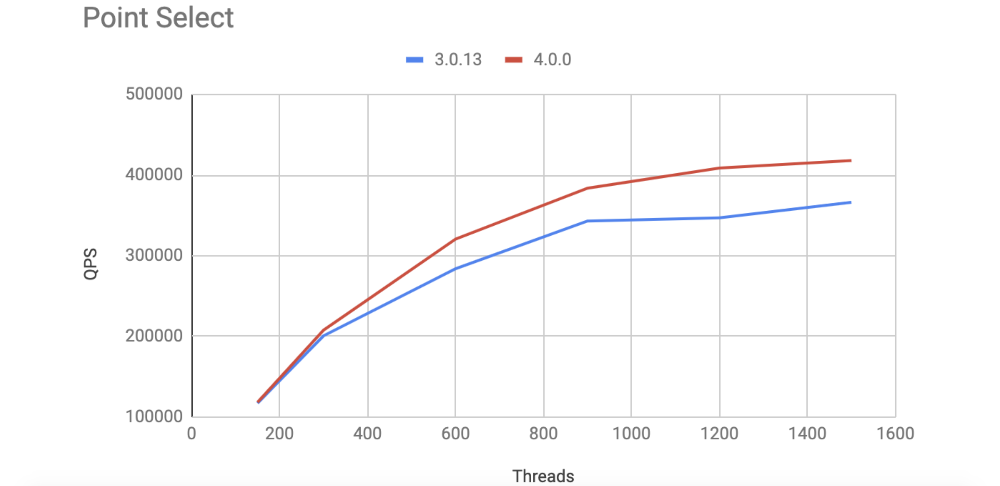
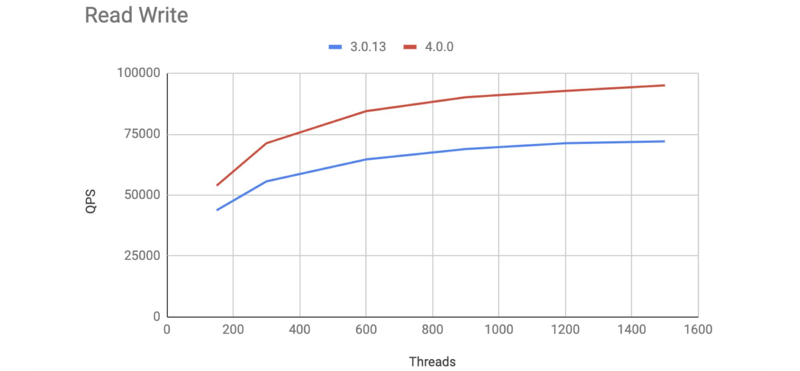

**Author:** Siddon Tang (Chief Architect at PingCAP)

Today, I'm proud to announce that TiDB 4.0 has reached general availability (GA). TiDB is an elastic, real-time Hybrid Transactional/Analytical Processing (HTAP) database, and, best of all, it's now ready for the cloud.

The first half of 2020 has seen a world of uncertainty and unpredictability, and it's high time for IT technology to keep up, especially for databases because it's the foundation of every business in the world. In a previous post, our CTO Ed Huang shared his thoughts about the [future of databases](https://pingcap.com/blog/future-of-database-unified-infrastructure-to-adapt-intelligently/). We believe that the future of the database is about unification, adaptiveness, and intelligence. As you may have seen in our [TiDB 4.0 preview](https://pingcap.com/blog/tidb-4.0-preview-easier-to-use-production-ready-htap-database/), our new release is a big step closer to achieving that vision. 

TiDB 4.0 has made great progress in its stability, ease of use, performance, and cloud-native services. New features in version 4.0 also let TiDB support more application scenarios and many of our users have been testing and adopting the 4.0 version in their production environments. Now we believe the TiDB 4.0 GA version has become the right database solution to prepare you for the unpredictable world.

## What can TiDB 4.0 do for you?

TiDB 4.0 is a real-time HTAP, truly elastic, cloud-native database, which meets your application requirements in various scenarios. In fact, TiDB 4.0 can do the work of three different databases:

* If your application data is correlated, and you need to guarantee atomicity, consistency, isolation, durability (ACID) compliance while your storage capacity is expected to be in a controllable range, TiDB can perform like **a traditional relational database**.
* If your application data is scattered in the system and not correlated, and if you need to scale your storage capacity but don't require ACID compliance, TiDB can perform like **a NoSQL database**.
* If you need to do real-time data analytics and associate multiple tables to do aggregation operations, TiDB can perform like **an analytical database**.

## Real-time HTAP analytics

TiDB 4.0 is a one-stop solution for both Online Transaction Processing (OLTP) and Online Analytical Processing (OLAP) applications to process HTAP workloads. Even if you are not sure whether your application is OLTP or OLAP, you can efficiently run your application on TiDB.  

[TiFlash](https://docs.pingcap.com/tidb/v4.0/tiflash-overview) is an extended analytical engine and columnar store for TiDB. **A TiDB database that incorporates TiFlash lets you perform real-time HTAP analytics**.

 TiDB in the HTAP architecture with TiFlash 

TiFlash offers you:

* Strong consistency in real time. TiDB replicates updated data to TiFlash in real time to ensure that TiFlash processes the latest (not just fresh) data.
* Automatic storage selection. TiDB intelligently determines whether to select row storage or column storage to cope with various query scenarios without your intervention.
* Flexibility and workload isolation. Both row and column stores scale separately.

## Serverless TiDB

[Serverless computing](https://en.wikipedia.org/wiki/Serverless_computing) is a very important concept in the field of cloud services. In TiDB 4.0, we not only support real-time HTAP analytics in the cloud, but also implement the first version of an elastic scheduling mechanism. This turns TiDB into a truly serverless database in the cloud.

Now, you only need to deploy your TiDB cluster in the cloud (or your own Kubernetes cluster) with the minimum cluster topology and to configure rules. For example, one rule could be that when TiDB CPU usage exceeds 50%, a TiDB node is automatically added. Then, based on your own application load, TiDB will automatically:

* Auto-scale. When the service peak comes, TiDB automatically adds or reduces instances to meet the number of service requests.
* Automatically split hot [Regions](https://pingcap.com/docs/dev/glossary/#regionpeerraft-group) (the basic unit for data storage in TiDB's storage engine) with high read loads.
* Isolate hotspots. TiDB moves hot application data to a separate instance to ensure that it does not affect other applications.

This feature is new in TiDB 4.0. We believe it will be the cornerstone of many product possibilities in the future.

## TiDB 4.0 achieves faster performance

Compared with version 3.0, TiDB 4.0 has achieved a significant performance boost. For OLTP scenarios, the Sysbench and TPC-C benchmarks have improved by 30% to 50%. For OLAP scenarios, the TPC-H performance has increased by about 100% on average over a set of 22 queries. In addition, TiFlash greatly enhances TiDB's real-time analytics capabilities without affecting OLTP tasks.

**TiDB versions to compare:**

TiDB 3.0.13 vs. TiDB 4.0.0

**Hardware configuration:**

<table>
  <tr>
   <td><strong>Component</strong>
   </td>
   <td><strong>EC2 type </strong>
   </td>
   <td><strong>Instance count</strong>
   </td>
  </tr>
  <tr>
   <td>Placement Driver (PD)
   </td>
   <td>AWS m5.xlarge
   </td>
   <td>3
   </td>
  </tr>
  <tr>
   <td>TiKV
   </td>
   <td>AWS i3.4xlarge
   </td>
   <td>3
   </td>
  </tr>
  <tr>
   <td>TiDB
   </td>
   <td>AWS c5.4xlarge
   </td>
   <td>3
   </td>
  </tr>
</table>

### Sysbench benchmark

We ran Sysbench tests on 16 tables, each with 10 million rows of data. For more detailed information on the system configurations and the tests we ran, see the [Sysbench Performance Test Report](https://pingcap.com/docs/stable/benchmark/benchmark-sysbench-v4-vs-v3/).

The tests showed that compared with version 3.0, TiDB 4.0's Point Select performance increased by about 14%, and read-write performance increased by 31%.

 TiDB 3.0 vs. 4.0 for Point Select performance (higher is better) 

 TiDB 3.0 vs. 4.0 for read-write performance (higher is better) 

### TPC-C benchmark

In the TPC-C test, we found that TiDB 4.0 performed about 50% better. For test details, see the [TiDB TPC-C Performance Test Report](https://pingcap.com/docs/stable/benchmark/v4.0-performance-benchmarking-with-tpcc/).

 TiDB 3.0 vs. 4.0 for TPC-C benchmarks (higher is better) 

### TPC-H benchmark

We ran TPC-H queries on TiDB 3.0.13 and TiDB 4.0 to compare their OLAP capabilities. For test details, see the [TiDB TPC-H Performance Test Report – v4.0 vs. v3.0](https://pingcap.com/docs/stable/benchmark/v4.0-performance-benchmarking-with-tpch/).

Because TiDB 4.0 introduces [TiFlash](https://pingcap.com/docs/stable/tiflash/tiflash-overview/) to strengthen TiDB's HTAP capabilities, our test objects were:

* TiDB 3.0.13 that only read data from TiKV
* TiDB 4.0 that only read data from TiKV
* TiDB 4.0 that automatically read data from TiKV or TiFlash through cost-based query optimization

The test results showed that **TiDB's query performance notably improved—[about 100% on average](https://pingcap.com/blog/how-we-improved-tpcc-performance-50-percent-and-tpch-performance-100-percent/#tpc-h-performance-improved-by-100)**. 

 TiDB 3.0 vs. 4.0 for TPC-H benchmarks (lower is better) 

## TiDB 4.0 is smarter and more secure  

TiDB 4.0 also has many new features and improvements, in terms of security, ecosystem, and features.

### Data security

* TiDB supports Transport Layer Security (TLS) and can dynamically update the certificate online.
* TiDB supports encryption at rest, to ensure data reliability and security.

### TiDB ecosystem

* TiDB 4.0 introduces [TiUP](https://github.com/pingcap/tiup), a component manager that streamlines installing and configuring a TiDB cluster into a few easy commands. With TiUP, [you can get your cluster up in just one minute](https://pingcap.com/blog/get-tidb-cluster-up-in-only-one-minute/)! For details, see [Deploy a TiDB Cluster Using TiUP](https://pingcap.com/docs/stable/production-deployment-using-tiup/).

* It's difficult to troubleshoot issues in a distributed database because system information is scattered among different machines. TiDB 4.0 offers [TiDB Dashboard](https://pingcap.com/docs/stable/dashboard/dashboard-intro/), a graphical interface with various built-in widgets that lets you easily diagnose, monitor, and manage your clusters. You can read these blog posts to learn more:
    
    * [TiDB Dashboard: Easier Troubleshooting for Distributed Databases](https://pingcap.com/blog/easier-troubleshooting-for-distributed-databases/)
    * [Key Visualizer: Observe Distributed Databases to Discover the Unknowns](https://pingcap.com/blog/observe-distributed-databases-to-discover-unknowns/)

* As users store more and more data in TiDB, quickly backing up and restoring data becomes a big challenge. In TiDB 4.0, we provide [Backup & Restore](https://github.com/pingcap/br) (BR), a distributed backup and restore tool that offers high backup and restore speeds—1 GB/s or more for 10 TB of data. BR already supports backup to [AWS S3](https://en.wikipedia.org/wiki/Amazon_S3) and will soon support [backup to Google Cloud Storage](https://github.com/pingcap/br/issues/89). To get more details, see our [BR documentation](https://pingcap.com/docs/stable/br/backup-and-restore-tool/) and [blog post](https://pingcap.com/blog/back-up-and-restore-a-10-tb-cluster-at-1-gb-per-second/).

* In TiDB 4.0, we introduce a new TiDB [change data capture](https://en.wikipedia.org/wiki/Change_data_capture) framework, [TiCDC](https://pingcap.com/docs/dev/ticdc/ticdc-overview/). This open-source feature replicates TiDB's incremental changes to downstream platforms. For more details, see [TiCDC: Replication Latency in Milliseconds for 100+ TB Clusters](https://pingcap.com/blog/replication-latency-in-milliseconds-for-100-tb-clusters/).

### Other features and improvements

* Previously, the transaction size in TiDB was limited to 100 MB. But TiDB 4.0 sets the transaction size limit to 10 GB. Now you can easily process large amounts of data in a single transaction without having to consider batch processing. For details, see [Large Transactions in TiDB](https://pingcap.com/blog/large-transactions-in-tidb/). 
* TiDB 4.0 has officially adopted pessimistic locking as its default transaction model. With pessimistic locking, TiDB 4.0 is better compatible with MySQL, and it's also more convenient for you to migrate your application from MySQL to TiDB. For more details, see [TiDB Pessimistic Transaction Model](https://pingcap.com/docs/stable/pessimistic-transaction/) and [Pessimistic Locking: Better MySQL Compatibility, Fewer Rollbacks Under High Load](https://pingcap.com/blog/pessimistic-locking-better-mysql-compatibility-fewer-rollbacks-under-high-load/).
* During TiDB's long runtime, as data changes, the optimizer may select a wrong index and then, slow queries may occur. This affects the application's normal operation. To solve this problem, TiDB 4.0 introduces [SQL Plan Management](https://pingcap.com/docs/stable/sql-plan-management/) (SPM), a mechanism that narrows down the optimizer's searching space to execution plans that are proven to perform well. SPM avoids performance degradation caused by unanticipated plan changes, and you don't have to change the application code. To learn more, see [SQL Plan Management: Never Worry About Slow Queries Again](https://pingcap.com/blog/sql-plan-management-never-worry-about-slow-queries-again/).

## Try us out!

This post shows only a few of the highlights in TiDB 4.0. For a full list of features and improvements, check out the [TiDB 4.0 GA Release Notes](https://pingcap.com/docs/stable/releases/release-4.0-ga/). If you're running an earlier version of TiDB and want to try 4.0, read [Upgrade TiDB Using TiUP](https://pingcap.com/docs/stable/upgrade-tidb-using-tiup/). You're also welcome to join our [community on Slack](https://slack.tidb.io/invite?team=tidb-community&channel=everyone&ref=pingcap-blog) and send us your feedback.

This release is a big step forward for TiDB on its way to becoming "the database of the future." We'd like to thank all our contributors and TiDB users who have helped us shape TiDB into what it is today.
