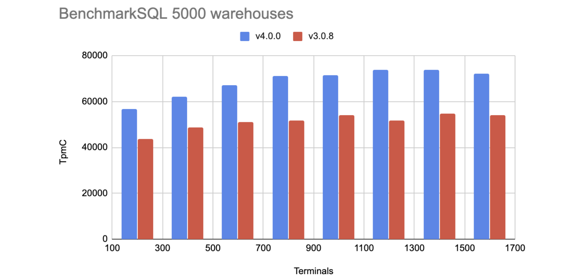
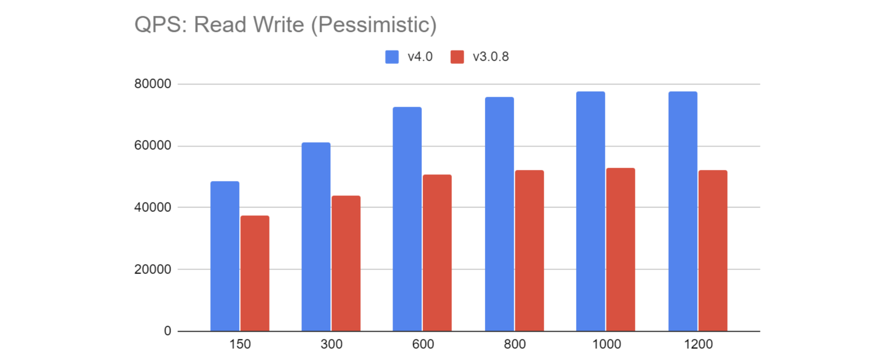

In a previous post, our CTO Ed Huang shared his thoughts about the [future of databases](https://pingcap.com/blog/future-of-database-unified-infrastructure-to-adapt-intelligently/). We're glad that we've always been on the journey to "building a better database." It has been more than nine months since we released [TiDB 3.0](https://pingcap.com/blog/tidb-3.0-announcement/). On April 8, PingCAP's fifth anniversary, we released the [first release candidate (RC) for our landmark TiDB 4.0](https://pingcap.com/docs/stable/releases/4.0.0-rc/). With a set of groundbreaking tools that makes TiDB easier to use than ever, TiDB 4.0 enhances its [Hybrid Transactional/Analytical Processing](https://en.wikipedia.org/wiki/Hybrid_transactional/analytical_processing) (HTAP) capabilities and continues to solve issues for large-scale, distributed SQL databases.

In this post, I'll walk you through TiDB 4.0's highlights across its deployment, use, operations and maintenance, ecosystem, and cloud services. You're welcome to join us in [TiDB Community Slack](https://join.slack.com/t/tidbcommunity/shared_invite/enQtNzc0MzI4ODExMDc4LWYwYmIzMjZkYzJiNDUxMmZlN2FiMGJkZjAyMzQ5NGU0NGY0NzI3NTYwMjAyNGQ1N2I2ZjAxNzc1OGUwYWM0NzE) to give us advice or feedback on your user experience.

## Get a TiDB cluster up using TiUP in only one minute

**"How long does it take to deploy a TiDB cluster on a single machine? "** Previously, we actually had a hard time answering this question, but now we can proudly say, "**Just one minute**."

Why is it so fast? It's because **TiDB 4.0 will introduce [TiUP](https://github.com/pingcap-incubator/tiup), a component manager that streamlines installing, configuring, and managing a TiDB cluster into a few easy commands.**

### Quickly deploy a TiDB cluster for testing

To install a TiDB cluster for testing on a single machine, you only need to perform two steps:

1. Install TiUP. On your terminal, run the following command:

    ```
    curl --proto '=https' --tlsv1.2 -sSf https://tiup-mirrors.pingcap.com/install.sh | sh
    ```

2. Start a TiDB cluster on a single machine. Run `tiup playground`.

Then, you can connect a MySQL client to the TiDB cluster to begin your testing.

### Quickly deploy a TiDB cluster for production use

**"How long does it take to deploy a 10-node TiDB cluster for production?"** The answer is also "**One minute**."

To deploy a TiDB cluster in a production environment:

1. Prepare the deployment topology. You can refer to this [example](https://github.com/pingcap-incubator/tiup-cluster/blob/master/topology.example.yaml) of a TiUP cluster.

2. Deploy a TiDB cluster. Run the tiup-cluster command. This example deploys a TiDB v4.0.0-rc cluster named "test."

    ```
    tiup cluster deploy test v4.0.0-rc topology.yaml  -i ~/.ssh/id_rsa
    ```

Now you can operate and maintain this cluster. For example, to start the cluster, you can run `tiup cluster start test`.

What's more, you can use TiUP to manage TiDB ecosystem components and tools, like [TiFlash](https://pingcap.com/docs/stable/reference/tiflash/overview/). You can also add components or tools in TiUP.

## A one-stop solution for both OLTP and OLAP workloads

Perhaps you're not sure whether your application scenario is [online analytical processing](https://en.wikipedia.org/wiki/Online_analytical_processing) (OLAP) or [online transaction processing](https://en.wikipedia.org/wiki/Online_transaction_processing) (OLTP), and you just want quick results from a single system for your application. This requirement seems challenging, but we're one step closer to getting it done.

**TiDB 4.0 offers a one-stop solution for both OLTP and OLAP—TiDB plus [TiFlash](https://pingcap.com/docs/stable/reference/tiflash/overview/)—to handle HTAP workloads.**


<div class="caption-center"> TiDB in the HTAP architecture with TiFlash nodes </div>

In this HTAP framework, TiDB processes OLTP workloads while TiFlash processes OLAP workloads.

Compared with traditional [extract, transform, load](https://en.wikipedia.org/wiki/Extract,_transform,_load) (ETL) pipelines or other HTAP solutions, we have these advantages:

* Strong consistency. Updated data in TiDB is replicated to TiFlash in real time to ensure that TiFlash processes the latest data.
* TiDB can intelligently determine whether to select row storage or column storage to cope with various query scenarios without user intervention.

## Observe the system to discover the unknowns

Before TiDB 4.0, it could be difficult to efficiently troubleshoot system problems.

Database administrators (DBAs) needed to understand TiDB's basic architecture, get familiar with thousands of TiDB monitoring metrics, and gain experience in the field to ensure that when they encountered similar problems next time, they could fix them more quickly.

Now, you can say goodbye to that big learning curve. **TiDB 4.0 provides [TiDB Dashboard](https://github.com/pingcap-incubator/tidb-dashboard) with a variety of built-in tools that let DBAs more easily diagnose, monitor, and manage the cluster**.


<div class="caption-center"> TiDB Dashboard </div>

We've always believed that a picture is worth a thousand words and that we can directly observe many problems in a visual interface. TiDB Dashboard offers:

* Key Visualizer (KeyViz). It lets you observe your read and write volume over time so that you can quickly diagnose whether the system has read or write hotspots.
* SQL statement analysis. It lets you quickly know which SQL statement is using too many system resources.
* Cluster diagnostics. It automatically analyzes the current status of the cluster and creates a diagnostic report identifying the cluster's potential risks.

## Fast backup and restore for 100+ TB data clusters

TiDB 4.0 provides users with a complete set of ecological tools, such as TiUP, the deployment and maintenance tool mentioned above, [TiDB Data Migration](https://pingcap.com/docs/tidb-data-migration/stable/), the data migration tool, and [TiDB Lightning](https://pingcap.com/docs/stable/reference/tools/tidb-lightning/overview/), the data import tool. These tools easily integrate TiDB with other ecosystems of users and offer users more high-value services.

This section covers two new tools that we introduce in TiDB 4.0: [Backup & Restore](https://github.com/pingcap/br) and [TiCDC](https://github.com/pingcap/ticdc).

### Backup & Restore for full backup and restore

Although TiDB uses three replicas by default to ensure high availability of data, many users, especially those in the financial and securities industries, hope that they can back up their data on a regular basis. If TiDB clusters are small, we can use traditional backup tools. But when the cluster data grows to tens or even hundreds of terabytes, we need to consider another way.

**TiDB 4.0 provides [Backup & Restore](https://pingcap.com/docs/v3.1/reference/tools/br/br/) (BR), a distributed backup and restore tool, which offers high backup and restore speeds for TiDB clusters and stores the data in your shared storage or AWS S3 on the cloud**. The larger the cluster size and the more TiKV instances, the faster BR's backup speed. In our test, BR backs up and restores a cluster with 10 TB of data at 1+ GB/s.

### TiCDC for incremental replication

In addition to the full backup tool BR, TiDB 4.0 also provides [TiCDC](https://pingcap.com/docs/stable/reference/tools/ticdc/overview/#ticdc-overview), an incremental replication tool that directly subscribes to TiDB's data changes and replicates data at the second or even the millisecond level.

## Serverless TiDB

We always hope that **users can use TiDB imperceptibly** and that **they only need to focus on their applications**. TiDB is a database resource for users, who can use it on demand. [Serverless computing](https://en.wikipedia.org/wiki/Serverless_computing) is a very important concept in the field of cloud services.

Before TiDB 4.0, to ensure that a TiDB cluster could withstand peak application requests, users would plan the entire cluster size from the beginning. However, most of the time these resources were underutilized. It's very hard to predict the resources you'll need.

But now TiDB 4.0, based on Kubernetes, has implemented **an elastic scheduling mechanism, which makes TiDB a truly serverless architecture on cloud**.

Now, you only need to deploy a TiDB cluster in the minimum cluster topology. Then, based on your own application load, TiDB will automatically:

* Auto-scale. When the service peak comes, TiDB will automatically add or reduce instances to meet the number of service requests.
* Automatically split hot [Regions](https://pingcap.com/docs/dev/glossary/#regionpeerraft-group) (the basic unit for data storage in TiDB's storage engine) with high read loads.
* Isolate hotspots. TiDB moves hot application data to a separate instance to ensure that it does not affect other applications.

Sounds cool, right? You can start a TiDB cluster for very little cost, and then pay as you go. Your future costs depend on your application and the resources it uses. You can directly experience this on the upcoming TiDB database as a service (DBaaS) cloud platform.

## Benchmarks for TiDB 4.0

You've had an overview of TiDB 4.0's core features. Now let's take a look at its performance by comparing TiDB 4.0.0 with TiDB 3.0.8 in the following tests.

### TPC-C benchmarks

In the TPC-C test:

* The testing cluster: a TiDB DBaaS cluster on AWS
* TiDB instances: two 16-core 32 G c5.4xlarge
* TiKV instances: three 16-core 122 G i3.4xlarge
* The x-axis represents the number of threads running on the clients during the test, and the y-axis represents the number of orders completed per minute.

The results:


<div class="caption-center"> TPC-C benchmarks </div>

### TPC-H 10 G benchmarks

In the TPC-H 10 G test:

* TiDB instances: two 16-core 32 G c5.4xlarge
* TiKV instances: three 16-core 122 G i3.4xlarge
* The x-axis represents 22 different queries, and the y-axis represents query execution time in seconds. The less time, the higher performance.

The results:


<div class="caption-center"> TPC-H 10 G benchmarks </div>

### Sysbench benchmarks

In the Sysbench test:

* The stress testing program created 16 different MySQL tables, each with 10,000,000 entries.
* Three TiKV instances deployed on three 16-core 62 G virtual machines
* A TiDB instance deployed on a 40-core 189 G server
* The x-axis represents the number of threads running on the testing clients, and the y-axis represents the number of SQL requests executed by TiDB per second.

The results:


<div class="caption-center"> Sysbench benchmarks </div>

## Try us out!

This post describes only a few of the highlights in TiDB 4.0. For more features, see [TiDB 4.0 RC Release Notes](https://pingcap.com/docs/stable/releases/4.0.0-rc/).

We hope you find TiDB 4.0 as exciting as we do, and that you'll try our release candidate. This release is also a big step forward for TiDB on its way to becoming "the future database." Our way ahead is challenging but also promising. On this adventurous journey, we'd like to thank our contributors and TiDB users. Without you, we couldn't have come so far. We believe that TiDB will grow more robust to power more enterprises in the future.
