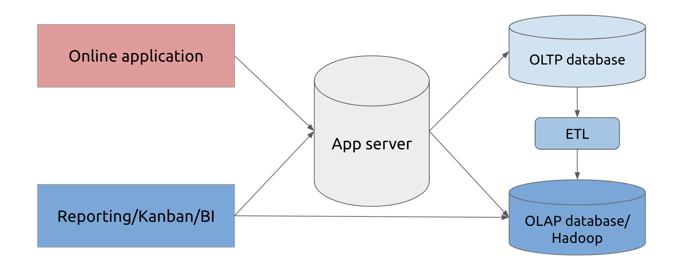
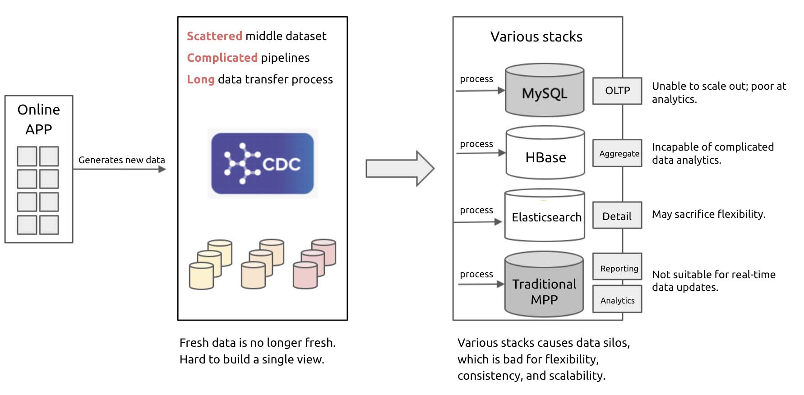
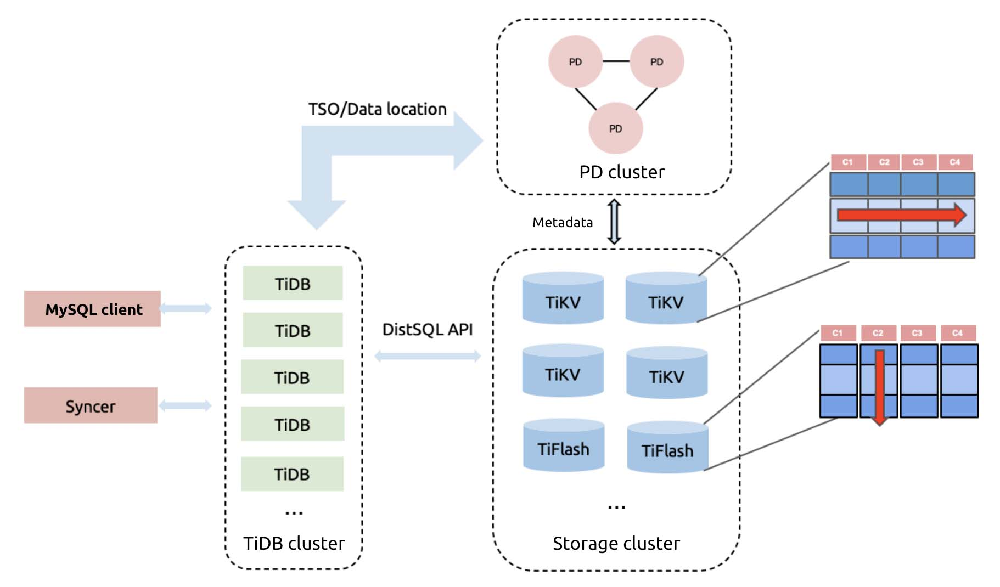
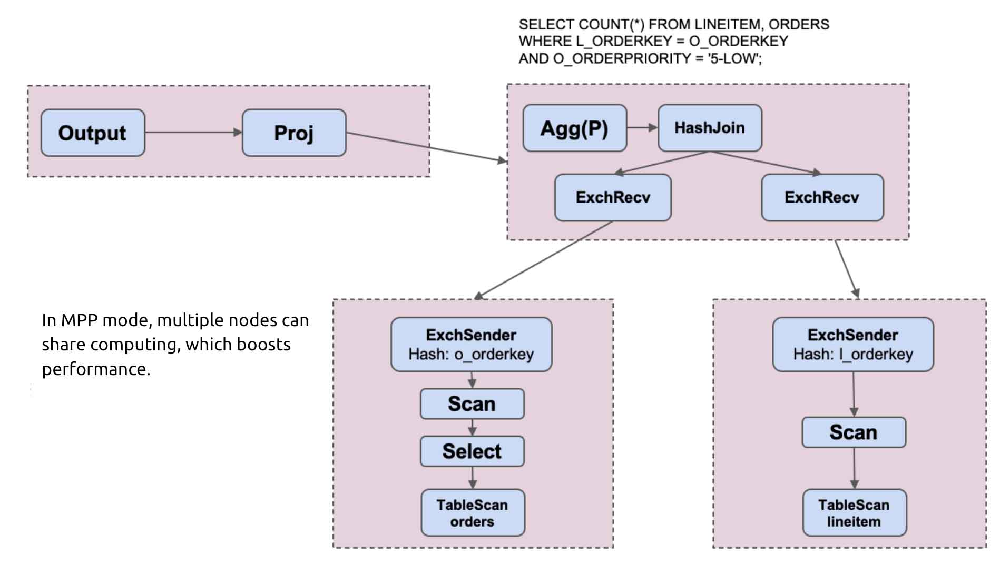
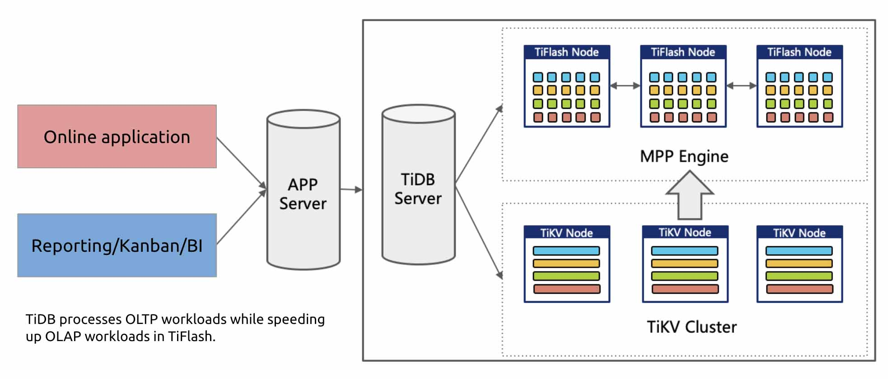
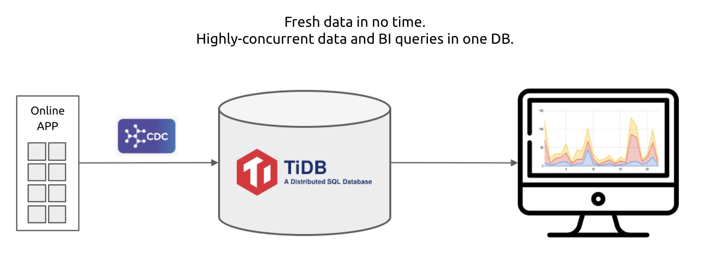
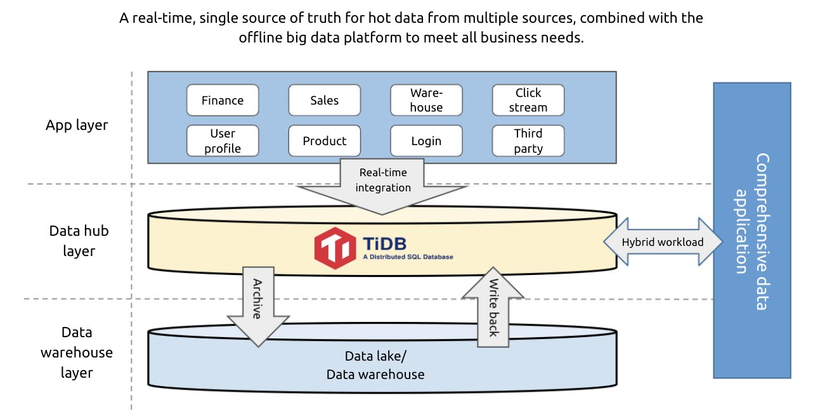

**Author:** [Shawn Ma](https://github.com/ilovesoup) (Tech Lead of the Real-time Analytics team at PingCAP)

**Transcreator:** [Ran Huang](https://github.com/ran-huang); **Editor:** Tom Dewan

**Many companies need to analyze large-scale data in real time**. It allows them to identify potential risks, efficiently allocate their resources, and serve their customers quickly. However, the more data you hold in your DBMS, the longer it takes to retrieve and process data. As you amass more data over time, it's harder and harder to process it in real time.

To deliver a better one-stop Hybrid Transactional/Analytical Processing (HTAP) service, TiDB, an open-source, distributed SQL database, has released [version 5.0](https://docs.pingcap.com/tidb/stable/release-5.0.0). In this article, I will cover:

* [Why the current tech stack fails to meet business demands](#the-current-tech-stack-cant-keep-up)
* [What's new in TiDB 5.0's HTAP architecture](#the-evolution-of-tidbs-htap-architecture)
* [How TiDB 5.0 serves different scenarios in one stack](#tidb-50-one-stack-to-serve-all-scenarios)

## The current tech stack can't keep up

Organizations are aching for massive, real-time data processing; however, it's not that simple. It's actually a tough job.

Some companies can simply throw more resources at the issue. An Internet company can assign a large team of engineers to build and maintain a sophisticated data system, but a traditional company can hardly do that.

To make matters worse, the current big data stack can't keep up. As businesses evolve at an incredible speed and data increases exponentially, the existing big data tools often fail to meet business requirements.

### A lack of seamless big data architecture

One of the reasons it's hard to query and analyze big data in real time is that **it's hard to build a seamless connection between the foreground application and the offline data warehouse**.

In a hybrid workload scenario, the company's ERP, CRM, and MES systems need to access data in various patterns, which can't be simply classified as Online Transactional Processing (OLTP) or Online Analytical Processing (OLAP). If the company used to run their applications on a standalone database, when the data volume skyrocketed, they had no choice but to refactor their application architecture—using a significant amount of time and human resources.

For example, online transactional data may be sent to the OLTP database, and then part of it is transferred to the offline data warehouse for data reporting. That leads to a complicated data transfer process:

* First, the app server needs to connect with the OLTP database and OLAP database (data warehouse) at the same time.
* The OLTP database and OLAP database are connected by ETL pipelines.
* Sometimes the online application needs to cooperate with both the app server and the big data stack.

A traditional hybrid workload scenario

In a stream computing scenario, applications often need to send logs to the backend server to perform log and behavior analysis. When traditional businesses use stream computing, the front end is usually an OLTP database, which transfers logs of "delete" or "update" operations downstream via the Change Data Capture (CDC) component. Under the traditional architecture, the technology stack can't handle these logs well. The downstream data processing needs different data storage to deal with different types of data requests:

* If you want to receive the CDC logs and implement real-time "delete" and "update" in the downstream database, you can try MySQL, but it may not scale out freely to store your massive data.
* If you need horizontal scalability and data manipulation, you may consider NoSQL databases. However, they're usually not capable of complicated data analytics.
* Elasticsearch is also an option. But note that Elasticsearch is essentially a search engine rather than a database; using it for aggregation might sacrifice its flexibility.
* Traditional Massively Parallel Processing (MPP) databases are good for analytical workloads, but they are designed for batch processing and data warehousing. They're not a good fit for real-time data updates.

A traditional stream computing scenario

To sum up, neither the data transfer process nor the downstream databases have a mature plan for real-time data analytics. To address this issue, data architects combine technologies to meet the demands of applications, resulting in complicated data architectures. Data is siloed among various stacks, and it's hard to guarantee data freshness and consistency.

### Enterprises seek an ideal solution

Before the Internet wave arrived, most enterprises were already carrying out the last-gen digital transformation, in which databases played an important role. Standalone databases could process various data access requests and satisfy most business needs. No complex components were needed.

Fast forward to the big data era. Similarly, **traditional enterprises prefer a one-size-fits-all approach to accomplish their digital transformation**. Existing big data technologies, like Hadoop, are quite mature solutions, but they can't provide the same user experience as classic databases. Thus, **many companies are looking for an ideal alternative.**

At a minimum, the ideal alternative to the current big data tech should:

* Scale out to hold the growing dataset.
* Handle different workloads for different applications.
* Be as simple and secure as classic databases and easy to use and maintain.

## The evolution of TiDB's HTAP architecture

TiDB introduced its HTAP capabilities in [version 4.0](https://docs.pingcap.com/tidb/v4.0/whats-new-in-tidb-4.0#storage-engine). It was a hybrid storage architecture consisting of TiKV, a row-based storage engine, and TiFlash, a columnar storage engine. The two storage engines used TiDB as a shared SQL layer and implemented the same privilege management. The optimizer chose either engine based on the cost of the execution plan.

This architecture provided a high-performance storage system, but it lacked the computing power to handle large-scale, complicated queries. TiDB 4.0 was like a tiny-headed bear, whose body (the outstanding storage performance) outgrew its head (the computing power):

A tiny-headed bear

In TiDB 5.0, things are different. With its new MPP architecture, TiFlash is now more than a TiDB storage node: it's a fully-functioning analytical engine. TiDB still acts as a single SQL entrance, and the optimizer chooses the most efficient query execution plan based on cost, but now it has one more option: the MPP engine.

  <a href="/download" onclick="trackViews('TiDB 5.0: A One-Stop HTAP Database Solution', 'download-tidb-btn-middle')"><button>Download TiDB</button></a>
  <a href="https://share.hsforms.com/1e2W03wLJQQKPd1d9rCbj_Q2npzm" onclick="trackViews('TiDB 5.0: A One-Stop HTAP Database Solution', 'subscribe-blog-btn-middle')"><button>Subscribe to Blog</button></a>

### Dive into TiDB 5.0

As shown in the TiDB 5.0 architecture below, the storage cluster is the storage engine for the whole TiDB cluster, including TiKV and TiFlash.

TiDB 5.0's HTAP architecture

Different storage structures usually respond to different types of workloads:

* For OLTP workloads, the query usually reads or updates a few rows at a time. This type of query is best served in row-based storage.
* For OLAP workloads, which include reporting and business intelligence (BI), the query usually selects a few columns in a wide table and filters or aggregates data in those columns, without touching other columns. This type of query is best served in columnar storage.
* In addition, the columnar storage engine can work with the vectorized engine to speed up BI and analytical queries.

In TiDB's MPP mode, TiFlash complements TiDB's computing capabilities. When dealing with OLAP workloads, TiDB steps back to be a master node. The user sends a request to TiDB server, and all TiDB servers perform table joins and submit the result to the optimizer for decision making. The optimizer assesses all the possible execution plans (row-based, column-based, indexes, single-server engine, and MPP engine) and chooses the optimal one.

TiDB's MPP mode

The following diagram shows how the analytical engine breaks down and processes the execution plan in TiDB's MPP mode. Each dotted box represents the physical border of a node.

A query execution plan in MPP mode

For example, in the upper right corner, a query needs to join two tables and sort the results by a given order. This query is divided into an execution plan in which two nodes carry out the scan operations. One node scans the left table, and the other scans the right table. The two nodes do their "join" work independently according to the join condition, and the relevant data for the join are allocated together in each node. Data that belong to the same shard go to one node (or one group of nodes), and each node performs local computation. Finally, the results from each node are merged and returned to the client. **This is the benefit of the MPP mode: large-scale queries like JOIN can be executed in parallel by multiple nodes.**

### TiDB MPP vs. Greenplum vs. Spark

As shown in our benchmarks below, MPP significantly boosts TiDB 5.0 performance:

TiDB vs. Greenplum vs. Spark

In a TPC-H 100 GB environment on three nodes, on a table of over 100 million records, we tested how much time different queries took. TiDB 5.0, Greenplum 6.15.0, and Apache Spark 3.1.1 were tested with the same hardware resources.

As you can see from the chart above, TiDB shows faster performance. **On average, TiDB is 2x to 3x faster than Greenplum and Apache Spark. For some queries, TiDB is 8x faster.**

## TiDB 5.0: one stack to serve all scenarios

Compared with TiDB 4.0, TiDB 5.0 is a complete HTAP database platform providing OLTP and OLAP services in a single interface—just like a classic database.

In TiDB 5.0, the only thing you need to do is write your SQL. The nit-picky details are out of sight and out of mind. Whether it's a read or write request, whether it's OLTP or OLAP workload, TiDB processes it in the most efficient way possible and returns the result.

### Hybrid workload scenario

When faced with hybrid workloads, TiDB can efficiently handle both OLTP and OLAP requests. From a user perspective, all your data go to one place. The app server receives all types of requests and sends them to the TiDB server, which dispatches the requests to different storage engines. The architecture is simple and elegant:

TiDB in the hybrid workload scenario

### Stream computing scenario

Stream computing is also a pressing demand. Big data tools provide mature solutions for real-time log stream analytics. But if you need to delete or update data or need table join, TiDB is an ideal choice in the current database market.

First, TiDB is a true HTAP distributed database. You can connect it to Oracle as a replication destination or to MySQL as a replica using Kafka or other data pipelines. Also, if the application needs to process data, you can switch it back to the traditional database architecture.

Second, TiDB is also an OLTP database that responds to creates, reads, updates, and deletes (CRUD) in real time. With its hybrid storage engines, TiDB can process both point queries and aggregation queries.

TiDB in the stream computing scenario

### Data hub scenario

If your company has more than one data source in the foreground—financing, ERP, sales, warehouses, click stream, user profile—each of them may store their data in their own database. To achieve a real-time, single source of truth for hot data, **you can integrate the data into TiDB via CDC or Kafka, building a data hub layer**.

A data hub is a layer between the application and the data warehouse. It stores data in only a period of time, while a data warehouse stores all historical data. A data hub tends to store hot data for real-time queries or processes highly-concurrent requests, while offline data warehouses and data lakes often provide less fresh data for reporting and BI queries.

TiDB in the data hub scenario

After you integrate TiDB into your data platform, it acts as a central hub for all your data. Despite an existing offline data warehouse or a Hadoop platform, you can position TiDB among the application layer, Hadoop layer, and data warehouses, to store and manage real-time data. As your business becomes more complicated and you enforce stricter data security standards, TiDB will also become a unified data central hub for data relations and lifecycle management to support your long-term growth.

## Towards a one-stop data service ecosystem

With the MPP engine and [new enterprise-grade features](https://docs.pingcap.com/tidb/stable/release-5.0.0#new-features), TiDB 5.0 is now more than a distributed database: it's a one-stop data service ecosystem. "One stack to serve all."

But PingCAP doesn't build this ecosystem alone; it is built and maintained by the TiDB community at large. **In this milestone release, 538 contributors participated in the development by submitting 12,513 pull requests on GitHub.** [Zhihu](https://www.crunchbase.com/organization/zhihu), for example, contributed multiple big data components and tools that brought value to large-scale applications.

We believe that open and transparent collaboration breathes infinite possibilities into TiDB. Thanks to our contributors, we've taken another step towards an ultimate one-stop data service ecosystem.
