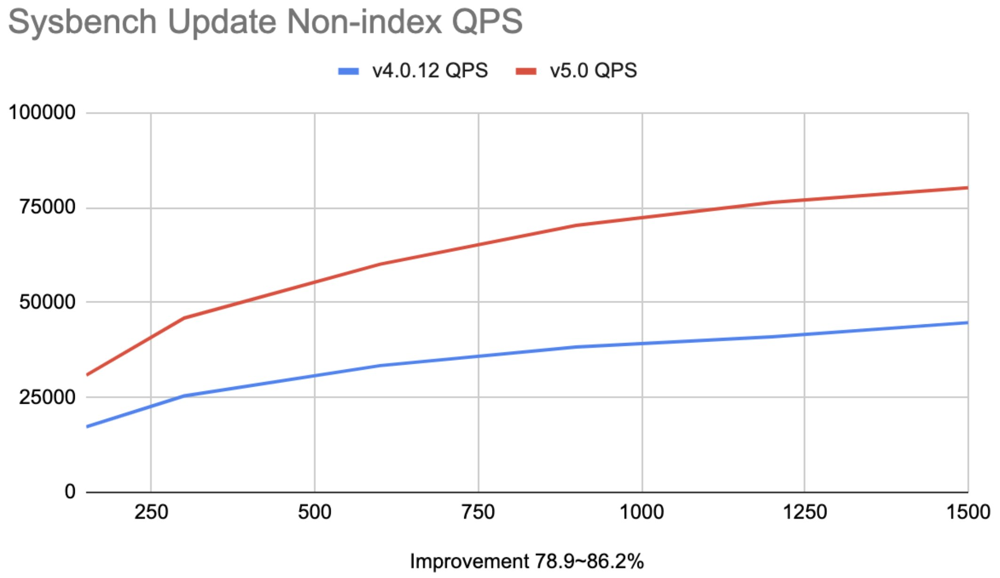
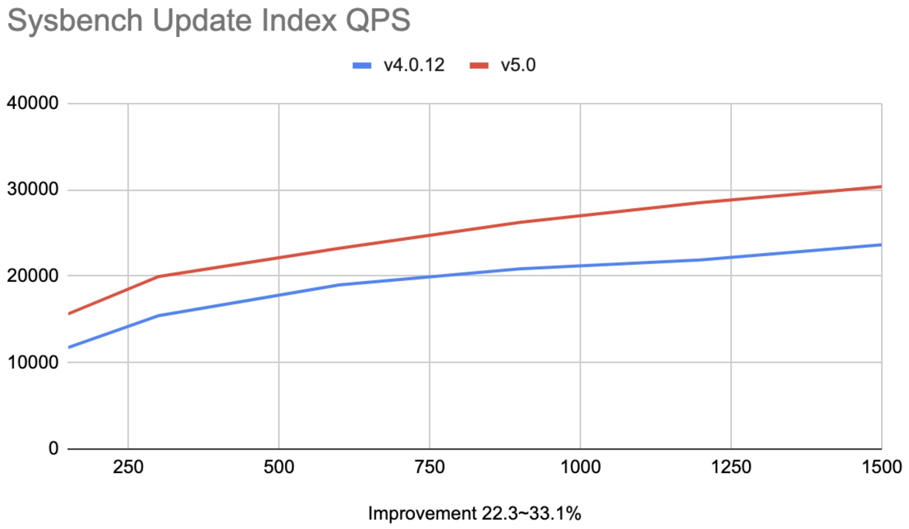
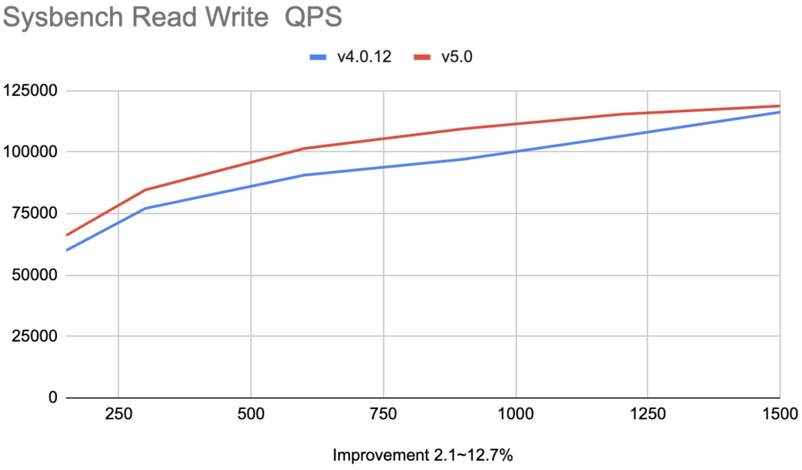
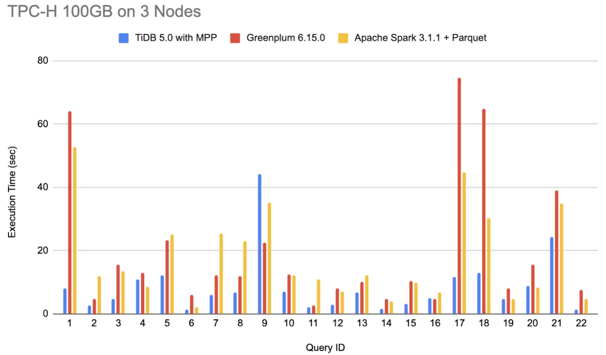
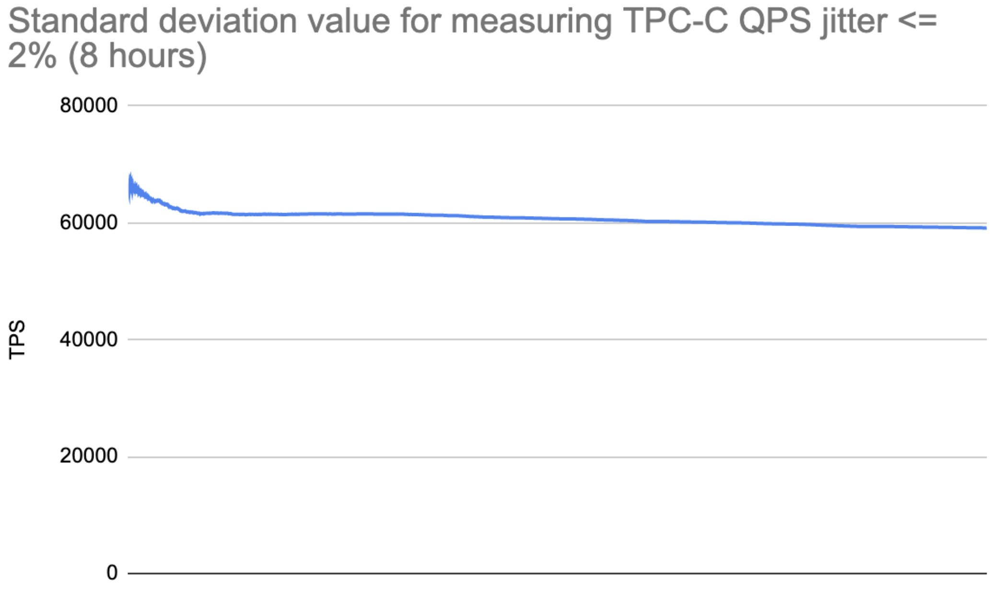

**Author:** PingCAP

**Transcreator:** [Caitin Chen](https://github.com/CaitinChen); **Editor:** Tom Dewan

Today, we are proud to announce that [TiDB 5.0](https://docs.pingcap.com/tidb/v5.0/release-5.0.0) has reached general availability (GA). This release marks a significant milestone in our commitment to providing our customers with an open-source, elastic, Hybrid Transactional/Analytical Processing (HTAP) database for mission-critical applications and providing a single and real-time source of truth. Version 5.0 introduces:

* **Remarkable improvements in performance and stability**. TiDB 5.0 has more powerful [OLTP capabilities](https://docs.pingcap.com/tidb/v5.0/release-5.0.0) for mission-critical applications.
* **A Massively Parallel Processing (MPP) architecture.** This architecture, based on TiDB's analytical engine, [TiFlash](https://docs.pingcap.com/tidb/v5.0/tiflash-overview), is now available in TiDB. **It enables users to perform real-time interactive business intelligence (BI) analytics.** It provides a one-stop data service solution for fast-growing businesses and data-driven innovation scenarios and accelerates TiDB's entry into more large-scale enterprises' digital scenarios. 
* **Safer and easier:** The Raft Joint Consensus algorithm introduced in TiDB 5.0 improves the system availability during Raft membership change. Data desensitization is also supported to avoid leaking sensitive information. TiDB 5.0 offers multiple data migration and data sharing tools, which facilitate data importing, exporting, and recovering. Enhanced [`EXPLAIN`](https://docs.pingcap.com/tidb/v5.0/sql-statement-explain) and [`EXPLAIN ANALYZE`](https://docs.pingcap.com/tidb/v5.0/sql-statement-explain-analyze) statements help users more efficiently diagnose query performance problems. TiDB 5.0 makes it easier than ever before for enterprises to build and scale applications on TiDB and enables enterprises to build a converged, simplified, and reliable distributed database platform.

## High performance with multiple groundbreaking metrics

Compared with version 4.0, TiDB 5.0 has achieved a noteworthy performance boost. By introducing [clustered indexes](https://docs.pingcap.com/tidb/v5.0/clustered-indexes), [async commit](https://docs.pingcap.com/tidb/v5.0/system-variables#tidb_enable_async_commit-new-in-v50), and [Coprocessor Cache](https://docs.pingcap.com/tidb/v5.0/coprocessor-cache#coprocessor-cache), **it has improved the sysbench and TPC-C benchmarks by 20% to 80% in OLTP scenarios.** The following are the metrics in some general performance test scenarios:

**Hardware configuration**

* For TPC-C benchmark details, see [this report](https://docs.pingcap.com/tidb/v5.0/v5.0-performance-benchmarking-with-tpcc).
* For sysbench benchmark details, see [this report](https://docs.pingcap.com/tidb/v5.0/v5.0-performance-benchmarking-with-tpcc).

**Workload**

16 tables, each with 10 million rows of data

**Benchmark results**

 TiDB 4.0 vs. TiDB 5.0 for sysbench update non-index benchmarks (higher is better) 

 TiDB 4.0 vs. TiDB 5.0 for sysbench update index benchmarks (higher is better) 

 TiDB 4.0 vs. TiDB 5.0 for sysbench read-write benchmarks (higher is better) 

 TiDB 4.0 vs. TiDB 5.0 for TPC-C benchmarks (higher is better) 

Besides, TiDB 5.0 has improved its performance in OLAP scenarios by introducing the [TiFlash MPP](https://docs.pingcap.com/tidb/v5.0/use-tiflash) computing model. For a TPC-H performance test, the TiDB MPP engine's overall performance is 2 to 3 times that of Greenplum 6.15.0 or Apache Spark 3.1.1. For certain queries, the MPP engine's performance is even 7 times higher.

**Hardware configuration**

* For TPC-H benchmark details, see [this report](https://docs.pingcap.com/tidb/v5.0/v5.0-performance-benchmarking-with-tpch).

**Workload**

16 tables, each with 10 million rows of data

**Benchmark results** 

 TiDB 4.0 vs. TiDB 5.0 for TPC-H benchmarks (lower is better) 

## Stability

In TiDB 5.0, we've optimized I/O, network, CPU, and memory resources usage in the TiDB scheduling process, resulting in great improvement in stability. This significantly reduces queries per second (QPS) and query latency jitters caused by resource preemption. In our TPC-C test, the standard deviation value for measuring TPC-C QPS jitter was less than 2%.

**Hardware configuration**

See [this report](https://docs.pingcap.com/tidb/v5.0/v5.0-performance-benchmarking-with-tpch#hardware-prerequisite).

**Benchmark result**

 Standard deviation value for measuring TPC-C QPS jitter 

## Use TiDB more easily and efficiently

### Maintain your cluster more easily

In TiDB 5.0, [TiUP](https://docs.pingcap.com/tidb/v5.0/tiup-overview) checks the environment with a single command line. It offers repair suggestions and automatically repairs environmental problems. We've optimized the operation logic so that you can more quickly deploy standard TiDB clusters in the production environment. 

In this release, TiUP upgrade is application-unaware. During the upgrade process, the performance jitter is within 10 to 30 seconds.

When you upgrade TiDB, to avoid performance jitter, you can enable the baseline capturing feature to let the system automatically capture and bind the latest execution plan and store it in the system table. After TiDB is upgraded, you can export the bound execution plan and decide whether to delete the binding.

### Tune SQL performance more efficiently

TiDB 5.0 supports [invisible indexes](https://docs.pingcap.com/tidb/v5.0/sql-statement-create-index). When you tune performance or select optimal indexes, you can use SQL statements to set an index to be `Visible` or `Invisible` to the optimizer. This avoids performing resource-consuming operations, such as `DROP INDEX` and `ADD INDEX`.

The enhanced [`EXPLAIN`](https://docs.pingcap.com/tidb/v5.0/sql-statement-explain) and [`EXPLAIN ANALYZE`](https://docs.pingcap.com/tidb/v5.0/sql-statement-explain-analyze) statements provide more detailed query execution information to help you more efficiently diagnose query performance issues.

When you find the root cause of the SQL performance issue and want to force the optimizer to choose a certain query plan, you can use the [SQL binding feature](https://docs.pingcap.com/tidb/v5.0/sql-plan-management) to bind the optimized query plan to the SQL statement to be executed. TiDB 5.0 supports SQL binding for data manipulation language (DML) queries, for example, `INSERT`, `DELETE`, and `UPDATE` statements.

## Enhanced ecosystem tools

TiDB has multiple data migration, data import, and data sharing components, so you can use it in a heterogeneous environment.

### Data migration tools are more cloud-native

In TiDB 5.0, it is not only easier but also faster to export and import data on cloud.

The Dumpling data export tool supports [using Amazon S3](https://docs.pingcap.com/tidb/v5.0/dumpling-overview#export-data-to-amazon-s3-cloud-storage) (and other S3-compatible storage services) as the target storage. This can be used to export data from TiDB and MySQL (including MariaDB and Aurora-MySQL). TiDB Lightning, our data import tool, supports importing data from S3 into TiDB directly. The data could be the output of Dumpling and [the snapshot data of AWS Aurora-MySQL](https://docs.pingcap.com/tidb/v5.0/migrate-from-aurora-using-lightning). This gives you more options for migrating data to TiDB.

[TiDB Lightning](https://docs.pingcap.com/tidb/v5.0/tidb-lightning-overview) optimizes its data import performance. Testing with TiDB Cloud's [AWS T1.standard](https://pingcap.com/products/tidbcloud/) configurations (or the equivalent) and 1 TB of TPC-C data, the results showed that the speed improved by 40%, from 254 GiB/h to 366 GiB/h.

### Data sharing

[TiCDC provides integration with Confluent Platform](https://docs.pingcap.com/tidb/v5.0/integrate-confluent-using-ticdc). It uses the Kafka Connectors protocol to replicate TiDB's data changes to other relational or non-relational databases, such as Kafka, Hadoop, and Oracle. This helps users stream TiDB data to other systems. The solution is [verified by Confluent](https://www.confluent.io/hub/pingcap/ticdc).

TiCDC supports [replicating data across multiple TiDB clusters](https://docs.pingcap.com/tidb/v5.0/manage-ticdc#cyclic-replication), allowing you to quickly recover backup data from disasters. TiCDC also allows you to aggregate data among multiple TiDB clusters.

## Enhanced enterprise-grade features

### High availability and fault tolerance

TiDB 5.0 introduces the Raft Joint Consensus algorithm. During [Raft](https://docs.pingcap.com/tidb/v5.0/glossary#regionpeerraft-group) membership changes, this algorithm combines the add member and delete member operations into a single operation and sends the operation to all members. This improves the system availability during Raft membership change. During the change process, Raft group members are in an intermediate state. If any modified member fails, the system is still available.

### Security

To meet security compliance requirements, TiDB supports desensitizing data, such as IDs and credit card numbers in logs. This avoids leaking sensitive information.

## Try us out!

This post only shows a few of highlights in TiDB 5.0. For a full list of features, check out [What's New in TiDB 5.0](https://docs.pingcap.com/tidb/v5.0/release-5.0.0). If you're interested, you can [download TiDB 5.0](https://pingcap.com/download/) and give it a try. You're also welcome to join our [community on Slack](https://slack.tidb.io/invite?team=tidb-community&channel=everyone&ref=pingcap-blog) and send us your feedback.

We'd like to give special thanks to the members of our TiDB community—both developers and users—who have contributed to the TiDB ecosystem. Since TiDB 4.0 was released, 538 contributors have submitted 12,513 pull requests to help us improve TiDB and achieve our 5.0 milestone. We have always been fully committed to the open source community and we believe the open community, the open ecosystem and the open minds will continue to enable and empower TiDB to evolve. 
