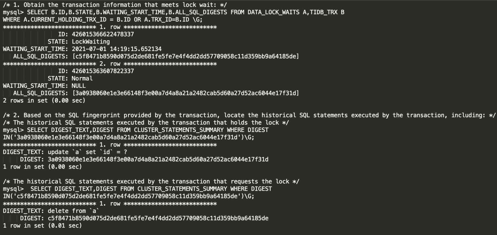

**Author:** PingCAP

**Transcreator:** [Caitin Chen](https://github.com/CaitinChen), [Ran Huang](https://github.com/ran-huang); **Editor:** Tom Dewan


Since it was released, [TiDB 5.0](https://docs.pingcap.com/tidb/stable/release-5.0.0) has been widely used in production across industries, including finance, internet and new economy, and logistics. It is well received by various users:

* At [58 Finance](https://www.crunchbase.com/organization/58-finance) and [Anjuke](https://www.crunchbase.com/organization/anjuke-com), TiDB serves complex reads and join queries for data warehouse reporting. For multi-table join queries, TiDB 5.0 performs better than TiDB 4.0 by 90%.
* [NetEase](https://en.wikipedia.org/wiki/NetEase) Games tested TiDB 5.0 and found it was more stable than TiDB 4.0, with no noticeable jitter.
* [Autohome](https://www.crunchbase.com/organization/autohome) uses TiDB 5.0 for join and aggregation queries. TiDB 5.0's massively parallel processing (MPP) engine performs 20~50 times better than MySQL.

"User feedback keeps us moving forward," says Edward Huang, PingCAP co-founder and CTO. "As our mission is to continuously improve the user experience of developers and DBAs, every TiDB release aims to solve user pain points. Since TiDB 5.0, we have shortened the release cycle and adopted a more flexible and agile release train model. We believe that the real-world use scenarios are the best architects. Every feature request from real users has the opportunity to be delivered in the next release within two months."

Today, we are proud to announce our [TiDB 5.1 release](https://docs.pingcap.com/tidb/v5.1/release-5.1.0). **This release features more stable latency, optimized MPP performance and stability, and more convenient maintenance.** Based on TiDB 5.1, developers and DBAs can more easily build mission-critical applications at any scale.

## TiDB 5.1 highlights

Our new release supports the Common Table Expression of the ANSI SQL99 standard. You can write more concise and easier-to-maintain SQL code. It helps you easily deal with complex application logic and develop applications more efficiently.

MPP is faster and more stable and helps you make real-time decisions more quickly. TiDB 5.1 supports partitioned tables in MPP mode and optimized function expressions and operators. These features improve TiDB's real-time analytic performance by more than 10 times. With enhanced memory management and load balancing, TiDB is faster and more efficient for analytical queries.

When large amounts of writes suddenly flow to the database, when the cluster needs scaling in or scaling out, or when online data is imported or backed up, TiDB 5.1's long-tail query latency becomes more stable. TiDB can reduce query latency for different workloads by 20%–70%. TiDB has greatly increased its query stability under high workloads—especially for mission-critical applications in the financial industry that require low latency.

The new release also supports changing column types to be more compatible with MySQL. It introduces Stale Read mode, which scatters read hotspots in read-write separation scenarios to significantly improve read throughput. It introduces new system tables to quickly locate lock conflicts in high-concurrency transactions. It optimizes the statistical information analytical engine to make the optimizer more accurately select an index. This guarantees efficient and stable application queries.

TiBD 5.1 makes it easier to operate and maintain large clusters, and it further reduces DBA's workload. TiDB 5.1's cluster scaling and data migration speeds have increased by about 40%. This improves the reliability of large-scale cluster operation and maintenance and reduces the backup and recovery time of large-scale clusters. By optimizing the auto-recovery mechanism after the change data capture (CDC) data link is temporarily interrupted, TiDB improves the reliability of data replication.

## Common Table Expression: write SQL statements more efficiently

In financial transaction scenarios, due to application complexity, you may sometimes write a single SQL statement of up to 2,000 lines. The statement probably contains a lot of aggregations and multi-level subquery nesting. Maintaining such an SQL statement can be a developer's nightmare. Now, **TiDB 5.1 supports the Common Table Expression (CTE) of the ANSI SQL99 standard and recursion**. This helps developers and DBAs more efficiently write SQL statements for complex application logic and makes the code easier to maintain.


<div class="caption-center">Common Table Expression</div>

## Enhanced real-time analytic capabilities

### Improved MPP performance and stability

To help you make fast business decisions, **TiDB 5.1 has comprehensively enhanced the TiFlash MPP engine's calculation capabilities**:

* MPP supports partitioned tables. Combined with application logic, it reduces the resources consumed by massive data queries and analytics and improves query speed.
* TiDB supports more commonly-used SQL functions and optimizes operators so that queries can make better use of the MPP engine to accelerate calculations.
* TiDB provides a convenient switch for the forced MPP mode. Users can decide whether to enable the MPP mode.
* TiDB optimizes the cluster load balancing and distribution mechanism to eliminate hotspots. This improves the comprehensive capacity of the system.
* The engine memory usage issue is fixed to provide a smoother and stabler experience.

### More stable under high workloads

**TiDB 5.1 improves query and analytics stability under heavy load pressure.** In financial business scenarios, heavy-pressure batch data processing is run every day to generate the latest marketing reports. This helps business decision-making. Batch processing has extremely high continuity requirements, with zero tolerance for mistakes. Targeting this use case, TiDB 5.1 optimizes TiDB's request retry mechanism and TiKV's request processing mechanism. This significantly reduces the [`Region Unavailable` error](https://docs.pingcap.com/tidb/stable/troubleshoot-tiflash#some-queries-return-the-region-unavailable-error) caused by untimely TiFlash data replication under heavy load pressure.

### Seamless integration with TiSpark

**TiSpark 5.1 can read and write tables with clustered indexes, without any extra performance overhead**. This optimization is completely transparent to users. You can upgrade to the latest TiSpark version and enjoy seamless integration between TiSpark and TiDB.

## Reduced read and write latency jitter

For applications that require low latency, P99 and P999 of the database may experience jitter when:

* Large amounts of write traffic is generated online.
* TiDB is scaled out or scaled in.
* Statistical tasks are performed in the background.
* Data is imported into an online database, or data is backed up from an online database.

These situations can impact long-tail queries.

TiDB 5.1 strengthens the management of disk read and write links and restricts the use of disk resources by background tasks. **These enhancements greatly reduce the interference of the scenarios above to online applications and improve the efficiency and stability of the read and write links**.

The following results are measured with TPC-C benchmarking in an AWS EC2 r5b.4xlarge instance mounted with EBS gp3 disks:

* When the operating cluster scales in TiKV from six nodes to three nodes, P99 is reduced by **20%** and P999 reduces by **15%**.
* When 200 GB data is imported into TiDB online, P99 reduces by **71%** and P999 reduces by **70%**.

## More flexible application development

### Support for changing column types

Data from multiple upstream MySQL clusters are often aggregated into a single TiDB cluster via binlog. Previously, TiDB didn't support changing column types. If the table column type was changed in the upstream MySQL cluster, the data replication between MySQL and TiDB was interrupted. **TiDB 5.1 adds support for Data Definition Language (DDL) statements that change column types.** This solves the issue above and makes TiDB more compatible with MySQL.

### Stale Read (experimental feature)

[Stale Read](https://docs.pingcap.com/tidb/v5.1/stale-read) is suited for scenarios with frequent reads and few writes and that tolerate data staleness. For example, when a Twitter user sends a tweet, the system receives thousands or even millions of read requests. A slight delay in seeing the tweet is acceptable. This scenario brings huge concurrent read pressure to the database and may cause read hotspots. Read hotspots can cause uneven load distribution among nodes and make the overall throughput a bottleneck.

**Stale Read allows TiDB to read historical data of a specified time from any replica. The replica doesn't have to be the Leader. **Therefore, Stale Read significantly reduces the load pressure on the node and nearly doubles the overall throughput.

```sql
/* for example, you can enable Stale Read by setting the current transaction to query data from five seconds ago */
> SET TRANSACTION READ ONLY AS OF TIMESTAMP NOW() - INTERVAL 5 SECOND;
> SELECT * FROM T;
```

### Quickly locate lock conflict (experimental feature)

The application logic needs to handle concurrent transactions carefully. Once a table lock occurs, it can have a huge impact on the online application. DBAs need to quickly locate the cause of the lock to ensure that the application returns to normal.

TiDB 5.1 introduces [Lock View](https://docs.pingcap.com/tidb/v5.1/troubleshoot-lock-conflicts#use-lock-view-to-troubleshoot-issues-related-to-pessimistic-locks). **Lock View allows DBAs to quickly locate the transaction and SQL statement that cause the table lock, making it much easier to resolve lock conflict issues.**

The following shows how you can use Lock View to quickly locate the transaction and SQL statement that cause the locked table:


<div class="caption-center">Lock View</div>

### Faster and more accurate statistical analysis

As an application's data continues to change, the table's statistics can become outdated. In turn, the optimizer execution plans are less accurate and queries are slower. DBAs run the `ANALYZE` operation to rebuild the table statistics.

TiDB 5.1 optimizes the performance of the `ANALYZE` sampling algorithm. **It can now, on average, generate statistics 50% faster.** This release also introduces a new statistical data type that allows the optimizer to more accurately select indexes.

## Strengthened reliability for large-scale cluster maintenance and data transmission

### Optimized backup for large numbers of tables

**This release optimizes the backup for large numbers of tables. For a database with 50,000 tables, the full backup time is reduced by 60~70%.**

TiDB 5.1 also introduces a new metadata file organization of the backup module (known as "v2"). This lowers memory consumption by reducing the data amount in single writes and avoids abnormal exits in environments with 8 GB of memory or less.). Users can enable "v2" by specifying `--backupmeta-version=2` when launching BR.

### Strengthened reliability for large-scale cluster maintenance

The larger a TiDB cluster, the longer it takes to perform maintenance operations such as scaling the cluster, upgrading hardware, and migrating nodes.** TiDB 5.1 significantly enhances the performance of data migration during scaling.** Test results showed:

* In a 100-node cluster, TiDB 5.1 reduces the time for migrating all data across data centers by 20%.
* TiDB 5.1 reduces the time for taking a node offline or migrating data from a node by about 40%.

### Optimized memory usage

**TiDB 5.1 optimizes memory usage and reduces the risk of out of memory (OOM) conditions**:

* The window function `row_number` only occupies a fixed size of memory—regardless of the data size
* The read operation on partitioned tables is optimized to use less memory.
* The storage layer now includes a configurable memory limit. When the limit is reached, the system releases cache to reduce memory usage.
* Writes in TiFlash now use 80% less memory.

### More reliable CDC replication links

**TiCDC 5.1 provides reliable data replication links without manual intervention.** In case of environment disturbance or hardware failure, TiCDC ensures that the replication continues. Even if the replication is interrupted, TiCDC automatically retries it according to the situation.

## Acknowledgements

Thanks to Xiaomi, Qihoo 360, Zhihu, iQiyi, Li Auto, Sina, Huya TV, Xiaodian, KY Express, EMAR Online, and all our community developers. Their invaluable and continuous help in designing, developing, and testing TiDB 5.1 helps us improve release after release.
