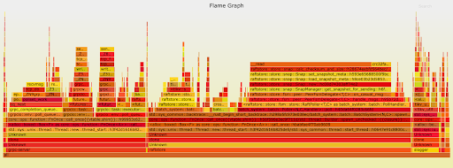

**Author:** PingCAP

**Transcreator:** [Yajing Wang](https://github.com/anotherrachel); **Editors:** Tom Dewan, [Calvin Weng](https://github.com/dcalvin)

TiDB 5.3 is now generally available. TiDB 5.3 makes significant advances in real-time Hybrid Transactional and Analytical Processing (HTAP) capabilities and overall system stability, with improvements in data migration, high availability, and ease of use.  

This post only highlights a few of the features in TiDB 5.3. For a full list of features and improvements, check out the [TiDB 5.3 Release Notes](https://docs.pingcap.com/tidb/stable/release-5.3.0).

## TiDB 5.3 highlights

* **More scalable Online Transactional Processing (OLTP**) enabled by optimized Timestamp Oracle service (TSO) allocation. This reduces the latency of transactions and improves the scalability of the Placement Driver (PD) service.  
* **Increased efficiency and faster HTAP** with TiFlash improvements, allowing TiDB to handle high traffic events more efficiently.
* **Easier and faster data migration** with improvements to TiDB Data Migration (DM) and TiDB Lightning.
* **Easier to operate at a massive scale with:**
    * Experimental support for Continuous Profiling. With this feature, developers can inspect flame graphs to dive deeper into performance anomalies.
    * Support for creating local or global temporary tables to simplify business logic and reduce operational costs.

  <a href="/download" onclick="trackViews('TiDB 5.3: Delivering Enhancements for Data Intensive Applications', 'download-tidb-btn-middle')"><button>Download TiDB</button></a>
  <a href="https://share.hsforms.com/1e2W03wLJQQKPd1d9rCbj_Q2npzm" onclick="trackViews('TiDB 5.3: Delivering Enhancements for Data Intensive Applications', 'subscribe-blog-btn-middle')"><button>Subscribe to Blog</button></a>

### Strengthened Timestamp Oracle for more scalable OLTP

The Timestamp Oracle (TSO) service, managed by the Placement Driver (PD) component, provides a globally unique timestamp for TiDB to implement distributed transactions. As clusters get larger, processing timestamps can become a potential bottleneck for the scalability of distributed database systems.

To ensure the TSO service allocates timestamps with lower latency, TiDB 5.3 adds two configuration items: 

* `tidb_enable_tso_follower_proxy` determines whether to enable Follower Proxy. When the value is set to `On`, the Follower node will batch forward the TSO requests. 
* `tidb_tso_client_batch_max_wait_time` controls the maximum time that a PD client waits when batch processing TSO requests. The value can be adjusted according to the remote procedure call (RPC) overhead.

These new items are especially helpful if you have:

* Large-scale clusters with over 100 TB of data or over 1 million queries per second (QPS)
* Medium-sized clusters that require unlimited scalability as your business rapidly grows and the data volume surges

We tested these features with sysbench. We found that at 512 threads, the cluster's overall QPS throughput doubled after optimization. 

### Transactional and analytical processing at scale

TiDB 5.3 further optimizes the performance and stability of TiFlash.  Overall read and write performance improves by 50%–100% in HTAP scenarios for finance and logistics industries with super high data throughput and concurrency. CPU and memory consumption have also been considerably reduced. This is especially important in big data-related scenarios, such as big sales days for e-commerce platforms, which impose stringent requirements on data freshness due to skyrocketing data scale.

TiFlash:

* Enhances the columnar storage engine to balance cluster resource usage; this reduces write amplification and query failures
    * Adjusts the underlying file structure and I/O model
    * Optimizes the plan to access copies and file blocks on different nodes
* Enhances the massively parallel processing (MPP) engine to retrieve data faster 
    * Pushes more functions and operators down to the MPP engine
    * Fixes the potential process timeout when writing or updating a large number of transactions to the storage layer
    * Improves the readability of alert messages
* Supports clusters scaled up to over 200 nodes with better resource isolation
* Lowers operation and maintenance costs
    * Improves data checking to handle data corruption caused by hardware failures
    * Fixes issues related to restarting the node
    * Improves alert messages and logging performance

### Easier and faster data migration 

TiDB Data Migration (DM) lets you efficiently migrate your data from a MySQL-compatible database to TiDB. You can use TiDB as a downstream read-only secondary database to handle intensive front-end queries. This approach reduces the impact on the application. Efficient data replication can guarantee that transactions are successfully processed, helping businesses unlock real-time business insights from data.

To achieve lower latency, DM makes the following optimizations in TiDB 5.3:

* Compacts multiple updates on a single row into one statement
* Merges batch updates of multiple rows into one statement

When you use TiDB as a secondary database, DM can perform well under heavy workloads. According to real-world test cases, when DM replicated an estimated 300,000 QPS, it reduced replication latency to less than one second 99% of the time.

### Import data in parallel

TiDB Lightning is a tool used for the fast, full import of large amounts of data into a TiDB cluster. Although it performs well when importing large amounts of data, when the data volume reaches dozens of terabytes, it can sometimes lag behind. 

In TiDB 5.3, TiDB Lightning supports importing data in parallel, which greatly extends its capacity to import up to 100 terabytes of data. 

It supports multiple data sources, such as CSV, SQL text data, and data exported from MySQL sharded tables.

According to test results, the largest single table that can be efficiently imported is 20 TB–30 TB. However, there is no upper limit for the total amount of data that can be imported from multiple tables. 

Based on internal testing data, some best practices are:

* Deploy one to eight TiDB Lightning instances for single tables to ensure overall performance.
* Import 2–5 TB of data on each TiDB Lightning instance. You can adjust this amount depending on your hardware—especially the disk capacity.

Test results showed that a total of 20 TB MySQL sharded tables can be imported to TiDB within eight hours. A single TiDB Lightning instance can import data at up to 250 GB/hour,  which is eight times faster than the earlier version.

## Operate easier at scale 

### Get performance analysis at a glance

For complex, distributed systems, developers frequently need to investigate performance bottlenecks and quickly identify the root cause of the problem. Profiling gives developers a fuller understanding of the application's performance over time, allowing them to identify issues and make optimizations that will improve user experiences and system stability and reduce operational costs.

Continuous Profiling is an advanced method that takes snapshots of the internal running state of the database with negligible performance loss. Think of it as a CT scan for your database.  

Continuous Profiling returns the results to developers for closer and deeper analysis. The results contain both historical and current data. As shown in the figure below, results are displayed as a flame graph on the TiDB Dashboard.

Flame graph showing resource overhead

TiDB's Continuous Profiling:

* Reduces fault diagnosis time by at least 50% when the database goes down unexpectedly
* Provides daily cluster inspection and performance analysis to identify potential risks and ensure the clusters' stability
* Helps locate performance bottlenecks more intuitively, making fault diagnosis easier for customers of all skill levels

### Easier maintenance with temporary tables

This release also introduces temporary tables to manage transient, intermediate data. Temporary tables store subsets of data only for a certain period of time. Instead of creating tables and then dropping tables repeatedly, DBAs can store the intermediate data temporarily and then execute queries on temporary tables to reduce unnecessary table management overhead. When sessions end, the corresponding temporary tables will be automatically cleaned and recycled.

You can use TiDB temporary tables to simplify your business logic. For example, you can:

* Cache an application's temporary data. When calculation completes, the data is dumped to the ordinary table, and the temporary table is automatically released.
* Perform multiple data manipulation language (DML) operations on the same temporary data in a short period of time.
* Import and update intermediate temporary data in batches.

Users can create a temporary table using the `CREATE [GLOBAL] TEMPORARY TABLE` statement. The maximum size of a single temporary table can be specified with the `tidb_tmp_table_max_size` variable. 

TiDB 5.3 offers local temporary tables and global temporary tables.

* Local temporary table
    * A local temporary table is visible only to the current session, and the table definition is not persistent. 
    * Users can create local temporary tables with the same name in different sessions.
    * The data of a local temporary table is visible to all transactions in the session. When the session ends, the local temporary table is automatically dropped.
* Global temporary table
    * A global temporary table is visible to all sessions, and the table definition is persistent.
    * The data of a global temporary table is visible only in the current transaction. When the transaction ends, the data is automatically cleared.

## Summary

TiDB 5.3 enhances the observability of the system, extends the scalability of the distributed database, ensures low latency of data replication, greatly improves the efficiency of full data import, and optimizes the stability of real-time analysis. This release is a significant step forward in making TiDB the standard for enterprise-level HTAP databases.

As Tang Liu, Chief Architect of PingCAP, comments: "The quest for an HTAP database is not about revolutionizing traditional databases or advancing transactional and analytical capabilities. For TiDB, the end of this quest is to build an open ecosystem that will support the consumption of data services and unify data management in real-time. We want to help users achieve digital transformation with innovative yet practical insights."

This release would not be possible without the commitment and support of our contributors and users. We'd like to thank everyone who helped us along the way. Thank you for your feedback: you motivate us to make TiDB more stable and more accessible with each iteration. We are confident that TiDB will continue to excel and become a basic software that everyone loves. 

## Try it out!

If this is the first time you have heard about TiDB, you can [download TiDB 5.3](https://en.pingcap.com/download) and give it a try. For more information, you can check our [documentation](https://docs.pingcap.com/tidb/stable/quick-start-with-tidb) and [case studies](https://en.pingcap.com/case-studies).

If you're running an earlier version of TiDB and want to try 5.3, read [Upgrade TiDB Using TiUP](https://pingcap.com/docs/stable/upgrade-tidb-using-tiup/?_ga=2.236713537.1135899370.1636279003-816238449.1627369092). 

You're also welcome to join our [community on Slack](https://slack.tidb.io/invite?team=tidb-community&channel=everyone&ref=pingcap-blog) and share your thoughts with us.
