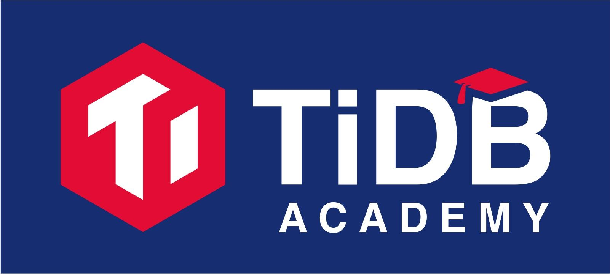

**Author**: Morgan Tocker, Senior Product and Community Manager

TiDB Academy

Today, we are excited to launch TiDB Academy, a series of technical training courses and certifications on TiDB and distributed databases in general, taught by our senior technical team. At PingCAP, we firmly believe it's our responsibility to deliver transparency and share knowledge to our customers and community, not just handing you a mysterious "black box" to use. As the world of database technology moves toward a cloud-native, NewSQL direction, learning how to properly use distributed databases like TiDB will become increasingly important and valuable for IT professionals; that's why we built TiDB Academy.

These courses are designed to help practitioners and professionals -- DBAs, DevOps, System Architects -- understand the architecture, design choices, strengths, and trade-offs of TiDB, from the team who built it. I'm the instructor for the first course, called "Distributed Database with TiDB for MySQL DBAs". We chose this topic first because, as a MySQL-compatible NewSQL database, TiDB's most common use case is enhancing the productivity and complementing the capabilities of MySQL DBAs. Thus, during this course you will find me often explaining TiDB concepts by using a direct comparison to MySQL, leveraging my own [15-plus years](https://www.linkedin.com/in/morgantocker/) of MySQL product experience and the expertise of other PingCAP engineers, many of whom were former MySQL DBAs themselves.

This self-paced course is full of hands-on exercises and labs, so you can get your fingers dirty and your mind working, as you explore the inner workings of TiDB. Taking the course is free, and there's a certification exam you can take for a small fee to validate your newly acquired skill as a TiDB and distributed database expert! This course is available now to enroll, and the first certification exam will be on December 1, 2018.

As a teaser, you will learn (among many other topics):

* Architectural Design: how TiDB's different components support hybrid transactional and analytical processing (HTAP) workloads;

* Horizontal Scaling: how TiDB can elastically scale while using its transactional model to keep data strongly consistent and highly available;

* Online DDL: how TiDB's DDL algorithm and implementation makes online schema change a breeze.

If you have any questions about this first course, or the TiDB Academy in general, you can reach our teaching staff anytime: [academy@pingcap.com](mailto:academy@pingcap.com). Happy learning!
