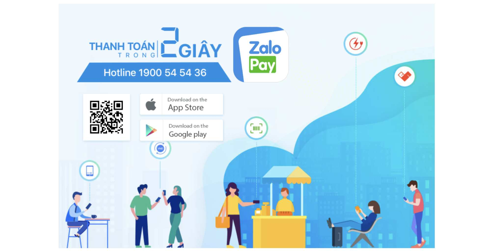
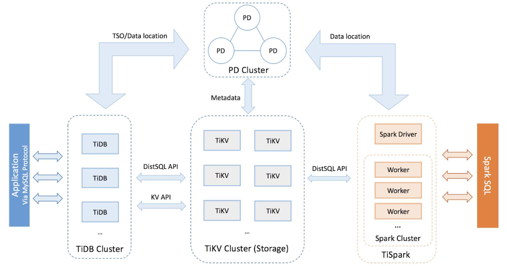
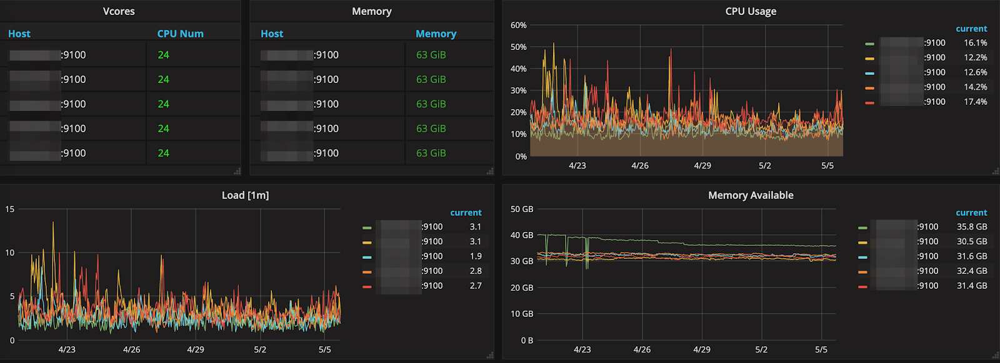
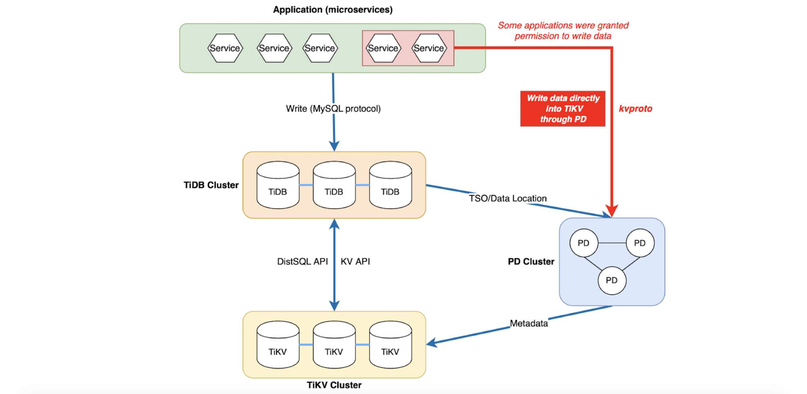

**Industry:** Mobile Payment

**Author:** Tan To Nguyen Duy (DevOps Engineer at VNG Corporation)

**Editors:** [Caitin Chen](https://github.com/CaitinChen), Tom Dewan

## Introducing ZaloPay

ZaloPay is a mobile payment application serving user's daily life and business needs, firstly launched in 2017. It is relatively competitive compared to MoMo, GrabPay by Moca, ViettelPay, etc.

Similar to AliPay which is one of three tenets of the “iron triangle” (aka e-commerce and logistics). GrabPay is as an enabler on the Grab ecosystem and WeChat Pay is on a social media platform.

In turn, Zalo is a key product of the Vietnamese conglomerate VNG. ZaloPay is built on the top of [Zalo](https://zalo.me/), the most popular messenger app in Vietnam which was launched in 2012, with > 100M active users so far.

ZaloPay ranked as the 3rd payment application of the year at the 2018 Tech Awards ceremony held by [VnExpress](https://e.vnexpress.net/) newspaper (The most common newspaper in Vietnam). While competitors MoMo took the top spot, followed by ViettelPay, in the recent time, the rising reign of GrabPay by Moca, VinID powered by VinGroup, AirPay by SEA,... making the game more intense.

## What is TiDB?

[TiDB](https://docs.pingcap.com/tidb/v4.0/overview) is developed and supported primarily by [PingCAP](https://pingcap.com/) Ltd. and licensed under [Apache 2.0](https://www.apache.org/licenses/LICENSE-2.0).

TiDB ("Ti" stands for Titanium) is an open-source NewSQL database that supports Hybrid Transactional and Analytical Processing (HTAP) workloads. It is MySQL compatible and features horizontal scalability, strong consistency, and high availability.

### Horizontal Scalability

> _TiDB expands both SQL processing and storage by simply adding new nodes. This makes infrastructure capacity planning both easier and more cost-effective than traditional relational databases which only scale vertically._

### MySQL Compatible Syntax

> _TiDB acts like it is a MySQL 5.7 server to your applications. You can continue to use all of the existing MySQL client libraries, and in many cases, you will not need to change a single line of code in your application. Because TiDB is built from scratch, not a MySQL fork, please check out the list of known compatibility differences._

### Distributed Transactions with Strong Consistency

> _TiDB internally shards tables into small range-based chunks that we refer to as "regions". Each region defaults to approximately 100MiB in size, and TiDB uses a Two-phase commit internally to ensure that regions are maintained in a transactionally consistent way._

### Cloud Native

> _TiDB is designed to work in the cloud -- public, private, or hybrid -- making deployment, provisioning, operations, and maintenance simple. The storage layer of TiDB, called TiKV, became a Cloud Native Computing Foundation member project in 2018. The architecture of the TiDB platform also allows SQL processing and storage to be scaled independently of each other in a very cloud-friendly manner._

### Minimize ETL

> _TiDB is designed to support both transaction processing (OLTP) and analytical processing (OLAP) workloads. This means that while you may have traditionally transacted on MySQL and then Extracted, Transformed and Loaded (ETL) data into a column store for analytical processing, this step is no longer required._

### High Availability

> _TiDB uses the Raft consensus algorithm to ensure that data is highly available and safely replicated throughout storage in Raft groups. In the event of failure, a Raft group will automatically elect a new leader for the failed member, and self-heal the TiDB cluster without any required manual intervention. Failure and self-healing operations are also transparent to applications._

## Why we choose TiDB over other databases?

Here is a comparison of the strongest candidate - MySQL - with TiDB (reference [DB-Engines](https://db-engines.com/))

<table>
  <tr>
   <td>Name
   </td>
   <td>MySQL
   </td>
   <td>TiDB
   </td>
  </tr>
  <tr>
   <td>Description
   </td>
   <td>Widely used open source RDBMS
   </td>
   <td>TiDB is an open source distributed Hybrid Transactional/Analytical Processing (HTAP) database that supports MySQL and Spark SQL syntaxes.
   </td>
  </tr>
  <tr>
   <td>Primary database model
   </td>
   <td>Relational DBMS
   </td>
   <td>Relational DBMS
   </td>
  </tr>
  <tr>
   <td>Secondary database models
   </td>
   <td>Document store
   </td>
   <td>Document store
   </td>
  </tr>
  <tr>
   <td>Implementation language
   </td>
   <td>C and C++
   </td>
   <td>Go, Rust
   </td>
  </tr>
  <tr>
   <td>License
   </td>
   <td>OpenSource
   </td>
   <td>OpenSource
   </td>
  </tr>
  <tr>
   <td>Server operating systems
   </td>
   <td>FreeBSD, Linux, OS X, Solaris, Windows
   </td>
   <td>Linux
   </td>
  </tr>
  <tr>
   <td>Initial Release
   </td>
   <td>1995
   </td>
   <td>2016
   </td>
  </tr>
  <tr>
   <td>Developer
   </td>
   <td>Oracle
   </td>
   <td>PingCAP Ltd.
   </td>
  </tr>
  <tr>
   <td>Data scheme
   </td>
   <td>Yes
   </td>
   <td>Yes
   </td>
  </tr>
  <tr>
   <td>Typing
   </td>
   <td>Yes
   </td>
   <td>Yes
   </td>
  </tr>
  <tr>
   <td>XML Support
   </td>
   <td>Yes
   </td>
   <td>No
   </td>
  </tr>
  <tr>
   <td>Secondary indexes
   </td>
   <td>Yes
   </td>
   <td>Yes
   </td>
  </tr>
  <tr>
   <td>SQL
   </td>
   <td>Yes
   </td>
   <td>Yes
   </td>
  </tr>
  <tr>
   <td>APIs and other access methods
   </td>
   <td>ADO.NET, JDBC, ODBC, Proprietary native API
   </td>
   <td>JDBC, ODBC, Proprietary protocol
   </td>
  </tr>
  <tr>
   <td>Supported programming languages
   </td>
   <td>Ada, C, C#, C++, D, Delphi, Eiffel, Erlang, Haskell, Java, JavaScript (Node.js), Objective-C, Ocaml, Perl, PHP, Python, Ruby, Scheme, TCL
   </td>
   <td>Ada, C, C#, C++, D, Delphi, Eiffel, Erlang, Haskell, Java, JavaScript (Node.js), Objective-C, Ocaml, Perl, PHP, Python, Ruby, Scheme, TCL
   </td>
  </tr>
  <tr>
   <td>Server-side scripts (Stored procedure)
   </td>
   <td>Yes
   </td>
   <td>No
   </td>
  </tr>
  <tr>
   <td>Trigger
   </td>
   <td>Yes
   </td>
   <td>No
   </td>
  </tr>
  <tr>
   <td>Partitioning methods
   </td>
   <td>Horizontal partitioning, sharding with MySQL Cluster or MySQL Fabric
   </td>
   <td>Horizontal partitioning (by key range)
   </td>
  </tr>
  <tr>
   <td>Replication methods
   </td>
   <td>Primary-primary replication, primary-secondary replication
   </td>
   <td>Uses Raft consensus algorithm to ensure data replication with strong consistency among multiple replicas.
   </td>
  </tr>
  <tr>
   <td>MapReduce
   </td>
   <td>No
   </td>
   <td>Yes
   </td>
  </tr>
  <tr>
   <td>Consistency concepts
   </td>
   <td>Immediate Consistency
   </td>
   <td>Immediate Consistency
   </td>
  </tr>
  <tr>
   <td>Foreign keys
   </td>
   <td>Yes
   </td>
   <td>No
   </td>
  </tr>
  <tr>
   <td>Transaction concepts
   </td>
   <td>ACID
   </td>
   <td>ACID
   </td>
  </tr>
  <tr>
   <td>Concurrency
   </td>
   <td>Yes
   </td>
   <td>Yes
   </td>
  </tr>
  <tr>
   <td>Durability
   </td>
   <td>Yes
   </td>
   <td>Yes
   </td>
  </tr>
  <tr>
   <td>In-memory capabilities
   </td>
   <td>Yes
   </td>
   <td>No
   </td>
  </tr>
  <tr>
   <td>User concepts
   </td>
   <td>Users with fine-grained authorization concept
   </td>
   <td>Users with fine-grained authorization concept. No user groups or roles
   </td>
  </tr>
</table>

Every product and service has its own specific requirement to develop. After comparing the figures above, we decided to choose TiDB

## How does TiDB work?

TiDB architecture has four main components:

* TiDB Server: Sitting on top of the construction, TiDB server is responsible for the communication interface between users and the database engine server, including receiving the SQL requests, processing the SQL related logics, locating the TiKV address for storing and computing data through Placement Driver (PD), and exchanging data with TiKV.
* TiKV Server: TiKV is a distributed transactional Key-Value engine that plays a significant role in this - storing data. TiKV uses the Raft protocol for replication to ensure data consistency and disaster recovery. Region is the basic unit of storing data in TiKV.
* PD Server: PD is the abbreviation for Placement Driver. By embedding etcd, PD uses the Raft consensus algorithm, which allows PD to support distribution, fault-tolerance, and redundancy. PD is used for storing metadata, scheduling, load-balancing, and allocating the transaction ID.
* TiSpark: Is built for running Apache Spark on top of TiDB/TiKV. This layer provides a method to answer complex OLAP queries. With TiSpark, TiDB can integrate with big data ecosystem support OLTP and OLAP scenarios.

## What can TiDB do on ZaloPay Platform infrastructure?

The E-Wallet gambling of the giants in technologies is more intensive than ever before. As the business is booming, we have to be careful in all of our decisions to make our infrastructure an example to be followed by other teams. To be steady enough to serve the booming business, millions of users, we have to make many difficult decisions and make a lot of changes in the backend and infrastructure. As our businesses are growing so fast day by day, we can easily spot that our infrastructure is the biggest obstacle in our development. Luckily for us, almost the technical things in our roadmap were carefully chosen from the very beginning. Taking database systems for instance, we do not migrate anything to the new database system. In our search for the database solutions for ZaloPay, we found TiDB. TiDB is implemented in Go and Rust, matching our product implementation. Further, the PingCAP team is committed to the open source community, friendly to work with and is very responsive. For these reasons, we bet our database on TiDB. At ZaloPay, we use TiDB as a core database to store most of the payment transaction data, billing, config data, and customer data of many services dots (such as billing, travelling, and f&b integration). At the present time, we have more than 20 nodes in our production system, storing a lot of significant data. We're running TiDB and our other product on-premise (bare machine). In the future, we're planning to add more and more automation solutions for our product as it can catch up with the new technology trend as well as our business. Here is one of our cluster statistics:

## Lesson learned while using TiDB

Because we don't have much experience with TiDB, we made a significant miscalculation. At our development/sandbox/staging environment, some applications were granted permission to write data directly into the TiKV cluster to use KV resources. As shown in the figure, the application and TiDB are both writing data into the TiKV cluster, which is not endorsed. Other applications could easily break TiDB data (called Regions). Many Regions were shattered, and could not be retrieved. TiKV then went into a downright panic, and the TiDB server couldn't reach TiKV. We tried to recover it in many ways but couldn't. Then we're finding the way to reach the PingCAP support staff. Thankfully, PingCAP engineers came to our aid. I was introduced to the TiDB VPE (Vice President of Engineering) and many Senior Engineers on TiKV/TiDB Team, all of whom gave us invaluable help. PingCAP actually takes every user's data seriously! TiDB uses the DistSQL API and KV API. Do not use these two APIs together in the same cluster; otherwise, they might corrupt each other's data. The VP of Engineering said that they will provide a mechanism to prevent users from mix-using the two APIs in a single cluster in the future.

## Recommendation for other TiDB users

TiDB acts as a MySQL 5.7 server and supports MySQL protocol and a majority of MySQL syntax. You can use all of the existing MySQL client's libraries. In many cases, you won't need to change a single line of code in your application.

But, as you may already know, "act like" isn't the same meaning as "totally like" Because TiDB is built from scratch, not a MySQL fork, a new TiDB user might not carefully read the whole documentation, thinking that TiDB syntax is completely like MySQL syntax. Sometimes, you may meet up with some unexpected limitations with it when you do complex queries, or when you use interface tools for MySQL native like MySQL Workbench... or when you try to backup and restore TiDB with mysqldump (which isn't recommended). ... If you encounter any issues, take a look at [toolkits](https://docs.pingcap.com/tidb/v4.0/ecosystem-tool-user-guide) (Mydumper, Syncer, Loader, TiDB Lighting,...) that PingCAP has optimized for TiDB.

TL;DR: TiDB server acts like MySQL 5.7 server, but is not entirely equivalent with MySQL. Just make sure you know what you are doing when you use tools or run SQL queries (which run well with MySQL). Also check out the list of [known compatibility differences](https://docs.pingcap.com/tidb/v4.0/mysql-compatibility). If necessary, use PingCAP's optimized [toolkits](https://docs.pingcap.com/tidb/v4.0/ecosystem-tool-user-guide) to interact with TiDB.

## Postscript

We would like to thank again PingCAP members, who have wholeheartedly helped us learn about and work with TiDB. _This article refers to many original documentations from PingCAP, Wikipedia, DB-Engines, and others..._

_This post was originally published on [Tan To Nguyen Duy's blog](https://tantnd.me/posts/tidb-at-zalopay-infrastructure-and-lesson-learned/)._
