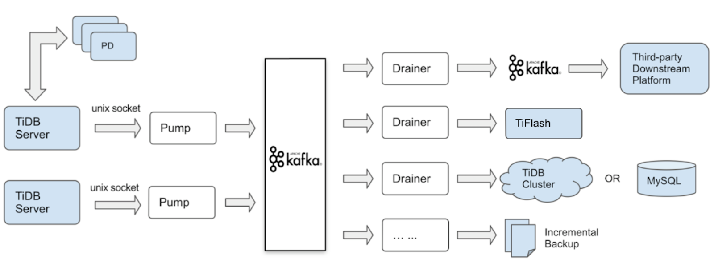
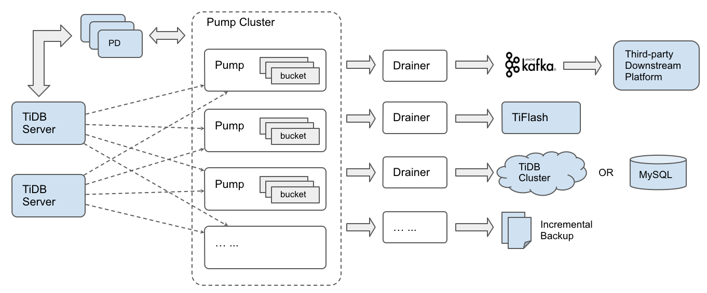
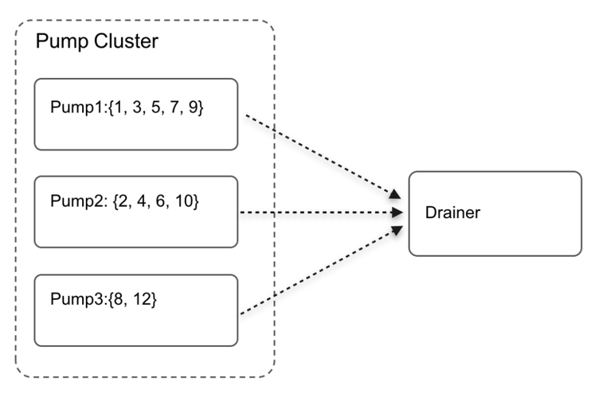

TiDB-Binlog is a tool used to collect the logical changes made to a TiDB cluster and provide incremental backup and replication.

TiDB-Binlog is similar in functionality to MySQL master-slave replication, which relies on persisting a logical set of changes into a binary log. The main difference is that since TiDB is a distributed database, the binlog generated by each TiDB instance needs to be merged and sorted according to the time of the transaction commit before being consumed downstream.

You can use the TiDB-Binlog to asynchronously replicate between TiDB clusters across a WAN, or to subscribe to TiDB data changes and feed other systems (such as an external cache or fulltext index).

A common real-life use case is using TiDB-Binlog to replicate data from one TiDB cluster in one data center (DC) to another TiDB cluster in a different data center, both in the same city or close geographical proximity (e.g. an Availability Zone). This scenario guarantees cross-DC availability of your data with high performance since the physical distance between the two DCs is short.

## Architecture evolution

The first version of TiDB-Binlog was released more than two years ago. Among the multiple versions of TiDB-Binlog, the Kafka-based version was widely used. The architecture was as follows:


<center> *The architecture of the Kafka version of TiDB-Binlog* </center>

The Kafka version of TiDB-Binlog consisted of the following two components:

- Pump

    Pump was a daemon that run on the background of each TiDB host. Its main function was to record the binlog files generated by TiDB in real time and write them to Kafka sequentially.

- Drainer

    Drainer collected binlog files from Kafka, converted them, in the commit order of TiDB transactions, into SQL statements compatible with the specified database or data with the specified format, and then synchronized the data to the target database or wrote the data sequentially to the file.

The Kafka architecture worked as follows:

1. TiDB needed to be bound to Pump, which meant the TiDB instance could only send the generated binlog to a specified Pump instance.
2. Pump wrote the binlog to a local file and then wrote them asynchronously to Kafka.
3. Drainer read the binlog from Kafka, sorted the binlog, parsed the binlog, and then synchronized the generated SQL statements or data in the specified format to the downstream.

This Kafka-based version of TiDB-Binlog had a few issues:

- The TiDB load was unbalanced. Some TiDB instances undertook more applications and generated more binlog than others. The corresponding Pump instances also had a high load, which led to a high delay in data synchronization.

- Relying on Kafka clusters increased the operations and maintenance cost. In addition, the size of a single row of binlog generated by TiDB could reach up to 2GB (for example, deleting or writing data in batches), so you needed to configure the message size of Kafka. However, Kafka was not suitable for the scenario where a single row of data is large.

- Drainer needed to read, sort, and parse the binlog in Kafka, and then synchronized the data to the downstream. Apparently, Drainer had a lot of work to do, but it was a standalone node, so Drainer often became the bottleneck of data synchronization.

To resolve these issues, we refactored TiDB-Binlog into the following architecture:


<center> *The architecture of the latest (cluster) version of TiDB-Binlog* </center>

This version of TiDB-Binlog no longer uses Kafka to store the binlog. Although it still keeps both the Pump and Drainer components, the functionality has been adjusted as follows:

- Pump records the binlog generated by TiDB in real time, and sorts the binlog according to the commit time of the transaction, and then provides it to Drainer for consumption.

- Drainer collects and merges the binlog from each Pump instance, and then converts the binlog into SQL statements or data in the specified format, and finally pushes the data to the downstream.

This version has the following advantages:

- Multiple Pump instances form a cluster that can be scaled horizontally, and each Pump instance can deal with the application load in balance.
- TiDB distributes the binlog to each Pump instance through the built-in Pump Client. Even if some Pump instances break down, the application in TiDB will not be affected.
- A simple internal KV storage is implemented in Pump to store the binlog, making it easy to manage the binlog data.
- The original binlog sorting logic is moved from Drainer to the scalable Pump, which improves the overall synchronization performance.
- Drainer no longer needs to read a batch of binlog into memory for heap sorting. It only needs to read the binlog of each Pump instance in turn, merge and sort the binlog. This can save a lot of memory usage and make memory control easier.

Since the biggest characteristic of this version of TiDB-Binlog is that multiple Pump instances constitute a cluster, we call this version: **the cluster version**.

## Implementation

Now, I’ll introduce the implementation principles of the cluster version of TiDB-Binlog.

### Binlog

TiDB uses the 2PC (two-phase commit) algorithm for transactions. A successful transaction writes two binlog records, including one Prewrite binlog record and one Commit binlog record. If the transaction fails, it will write a Rollback binlog record.

#### Binlog structure definition

The binlog structure is defined as below:

```
# Binlog records all transaction changes and can be used to build SQL statements.
message Binlog {
    # The binlog types, including Prewrite, Commit, Rollback, and so on.
    optional BinlogType  tp = 1 [(gogoproto.nullable) = false];

    # The “start_ts” in the Prewrite, Commit, and Rollback types of binlog, used to record the ts when a transaction starts.
    optional int64  start_ts = 2 [(gogoproto.nullable) = false];

    # “commit_ts” records the ts when a transaction ends, and only records it in the Commit type of binlog.
    optional int64  commit_ts = 3 [(gogoproto.nullable) = false];

    # “prewrite_key” is recorded only in the Prewrite type of binlog.
    # It is the primary key of a transaction, used to query whether the transaction is committed.
    optional bytes  prewrite_key = 4;

    # “prewrite_value” is recorded in the Prewrite type of binlog, used to record the change of each row of data.
    optional bytes  prewrite_value = 5;

    # “ddl_query” records the DDL statements.
    optional bytes  ddl_query = 6;

    # “ddl_job_id” records the job ID of DDL statements.
    optional int64  ddl_job_id = 7 [(gogoproto.nullable) = false];
}
```

For more details about binlog and the data structure definition, see ([binlog.proto code](https://github.com/pingcap/tipb/blob/master/proto/binlog/binlog.proto)): 

```
syntax = "proto2";

package binlog;

import "gogoproto/gogo.proto";

option (gogoproto.marshaler_all) = true;
option (gogoproto.sizer_all) = true;
option (gogoproto.unmarshaler_all) = true;

enum MutationType {
    Insert = 0;
    Update = 1;
    DeleteID = 2; // Obsolete field.
    DeletePK = 3; // Obsolete field.
    DeleteRow = 4;
}

// TableMutation contains mutations in a table.
message TableMutation {
    optional int64 table_id      = 1 [(gogoproto.nullable) = false];

    // The inserted row contains all column values.
    repeated bytes inserted_rows = 2;

    // The updated row contains old values and new values of the row.
    repeated bytes updated_rows  = 3;

    // Obsolete field.
    repeated int64 deleted_ids   = 4;

    // Obsolete field.
    repeated bytes deleted_pks   = 5;

    // The row value of the deleted row.
    repeated bytes deleted_rows  = 6;

    // Used to apply table mutations in original sequence.
    repeated MutationType sequence = 7;
}

message PrewriteValue {
    optional int64         schema_version = 1 [(gogoproto.nullable) = false];
    repeated TableMutation mutations      = 2 [(gogoproto.nullable) = false];
}

enum BinlogType {
    Prewrite = 0; // has start_ts, prewrite_key, prewrite_value.
    Commit   = 1; // has start_ts, commit_ts.
    Rollback = 2; // has start_ts.
    PreDDL   = 3; // has ddl_query, ddl_job_id.
    PostDDL  = 4; // has ddl_job_id.
}

// Binlog contains all the changes in a transaction, which can be used to reconstruct SQL statement, then export to
// other systems.
message Binlog {
    optional BinlogType    tp             = 1 [(gogoproto.nullable) = false];

    // start_ts is used in Prewrite, Commit and Rollback binlog Type.
    // It is used for pairing prewrite log to commit log or rollback log.
    optional int64         start_ts       = 2 [(gogoproto.nullable) = false];

    // commit_ts is used only in binlog type Commit.
    optional int64         commit_ts      = 3 [(gogoproto.nullable) = false];

    // prewrite key is used only in Prewrite binlog type.
    // It is the primary key of the transaction, is used to check that the transaction is
    // commited or not if it failed to pair to commit log or rollback log within a time window.
    optional bytes         prewrite_key   = 4;

    // prewrite_data is marshalled from PrewriteData type,
    // we do not need to unmarshal prewrite data before the binlog have been successfully paired.
    optional bytes         prewrite_value = 5;

    // ddl_query is the original ddl statement query, used for PreDDL type.
    optional bytes         ddl_query      = 6;

    // ddl_job_id is used for PreDDL and PostDDL binlog type.
    // If PreDDL has matching PostDDL with the same job_id, we can execute the DDL right away, otherwise,
    // we can use the job_id to check if the ddl statement has been successfully added to DDL job list.
    optional int64         ddl_job_id     = 7 [(gogoproto.nullable) = false];
}

```

In TiDB, `ts` (TSO, Timestamp Oracle) is a globally unique time service provided by Placement Driver (PD). It is converted from the physical time and the logic time. `start_ts` is the starting timestamp value of a transaction. `commit_ts` is the commit timestamp value of a transaction. 

When a transaction is started, TiDB requests a timestamp from PD as the transaction `start_ts`. When the transaction is committed, TiDB requests a timestamp again from PD as the transaction `commit_ts`. This `commit_ts` is used to sort the binlog in Pump and Drainer.

The TiDB-Binlog format is row-based logging (RBL), which stores the change of each row of data. The data change is recorded in the `prewrite_value` field, and the data in this field mainly consists of serialized data arrays with the following `TableMutation` structure:

```
# The data change in the TableMutation storage table
message TableMutation {
    # The table ID that uniquely identifies a table
    optional int64 table_id = 1 [(gogoproto.nullable) = false];

    # Saves the data of each inserted row
    repeated bytes inserted_rows = 2;

    # Saves the data of each row both before and after the modification
    repeated bytes updated_rows  = 3;

    # Deprecated
    repeated int64 deleted_ids = 4;

    # Deprecated
    repeated bytes deleted_pks   = 5;

    # The data of deleted rows
    repeated bytes deleted_rows  = 6;

    # Records the sequence of data changes
    repeated MutationType sequence = 7;
}
```

#### Storing data changes to binlog

I’ll use an example to explain how binlog stores data changes.

Assume that the table schema is:

```sql
create table `test` (`id` int, `name` varchar(24), primary key `id`)
```

Execute the following SQL statements in order:

```sql
begin;
insert into test(id, name) values(1, "a");
insert into test(id, name) values(2, "b");
update test set name = "c" where id = 1;
update test set name = "d" where id = 2;
delete from test where id = 2;
insert into test(id, name) values(2, "c");
commit;
```

Then the following `TableMutation` data is generated:

```
inserted_rows:
1, "a"
2, "b"
2, "c"

updated_rows:
1, "a", 1, "c"
2, "b", 2, "d"

deleted_rows:
2, "d"

sequence:
Insert, Insert, Update, Update, DeleteRow, Insert
```

From the above results, we can see that the order of data modification types saved in `sequence` is right the execution order of SQL statements. Detailed modification data is saved to the corresponding variable. 

Before replicating the binlog data to the downstream, Drainer needs to convert the above data back into SQL statements.

When writing binlog, TiDB sends a writing data request to TiKV and a Prewrite binlog record to Pump concurrently. If one of the two requests fails, the transaction will fail. After Prewrite succeeds, TiDB sends a commit message to TiKV , and then asynchronously sends a Commit binlog record to Pump. Since TiDB sends requests to TiKV and Pump in Prewrite phase at the same time, as long as the time that Pump handles the Prewrite binlog request is less than or equal to the time that TiKV executes Prewrite, enabling binlog will not affect the transaction delay.

### Pump Client

We already know that multiple Pump instances compose a cluster and handle the requests of writing binlog. Then we need to ensure that TiDB can distribute the writing binlog requests to each Pump instance as evenly as possible. In addition, we also need to identify the unavailable Pump instances and timely obtain the information of newly added Pump instances in the cluster. This is implemented in Pump Client.

Pump Client is integrated into TiDB in the form of a package. See [Pump Client code](https://github.com/pingcap/tidb-tools/tree/v2.1.0/tidb-binlog/pump_client).

<div class="trackable-btns">
    <a href="/download" onclick="trackViews('TiDB Tools (I): TiDB-Binlog Architecture Evolution and Implementation Principles', 'download-tidb-btn-middle')"><button>Download TiDB</button></a>
    <a href="https://share.hsforms.com/1e2W03wLJQQKPd1d9rCbj_Q2npzm" onclick="trackViews('TiDB Tools (I): TiDB-Binlog Architecture Evolution and Implementation Principles', 'subscribe-blog-btn-middle')"><button>Subscribe to Blog</button></a>
</div>

#### Pump status definition

Pump Client maintains the Pump cluster information, which mainly comes from the Pump status information stored in PD. The status information ([status code](https://github.com/pingcap/tidb-tools/blob/v2.1.0/tidb-binlog/node/node.go)) is defined as below:

```
type Status struct {
    # The unique identifier of the Pump/Drainer instance
    NodeID string `json:"nodeId"`

    # The Pump/Drainer service address
    Addr string `json:"host"`

    # The Pump/Drainer state. Optional values are: “online”, “pausing”, “paused”, “closing”, “offline”.
    State string `json:"state"`

    # Whether Pump/Drainer is alive. (Currently, this field is not used.)
    IsAlive bool `json:"isAlive"`

    # The Pump score, which is calculated according to elements such as the load of the node, the disk usage, and the size of the stored data.
    # According to the score, Pump Client can choose the appropriate Pump instance to send binlog. (To be implemented)
    Score int64 `json:"score"`

    # The Pump label. TiDB and Pump can be grouped based on the label.
    # TiDB sends binlog only to the Pump instance with the same label. (To be implemented)
    Label *Label `json:"label"`

    # Pump: the timestamp of the biggest binlog commit that is saved.
    # Drainer: the timestamp of the biggest consumed binlog commit
    MaxCommitTS int64 `json:"maxCommitTS"`

    # The timestamp that the state information update time corresponds to
    UpdateTS int64 `json:"updateTS"`
}
```

#### Sending binlog to available Pump instances

Based on the information that Pump reports to PD and the actual situation of the writing binlog requests, Pump Client divides the Pump instances into two types: the available Pump instances and the unavailable Pump instances.

The methods that Pump Client uses to divide Pump instances are as follows:

- During initialization, Pump Client gets the information of all Pump instances from PD, adds the Pump instances with the “online” state to the list of available Pump instances, and adds other Pump instances to the unavailable node list.

- Pump sends a heartbeat to PD at regular intervals and updates its own state. Pump Client monitors the status information in PD reported by Pump, and timely updates the Pump information maintained in the memory. If the state is changed from non-online to “online”, then this Pump instance is added to the available Pump instance list; otherwise, it is added to the unavailable node list.

- When TiDB writes binlog to Pump, if the Pump instance still fails to write the binlog after retrying multiple times, Pump Client will add this Pump instance to the unavailable list.

- Pump Client sends the probe request of writing empty binlog to the online Pump instance in the unavailable Pump list. If the result is successfully returned, this Pump instance is re-added to the available Pump list.

Through the above measures, the Pump Client can update the maintained Pump cluster information in time to ensure that the binlog is sent to available Pump instances.

#### Distributing binlog writing requests evenly

After ensuring that the binlog is sent to available Pump instances, another problem is how to guarantee that Pump Client distributes binlog writing requests evenly to each Pump instance. To solve it, we provide the following three routing strategies currently:

- Range

    Pump Client selects the Pump instance and sends the binlog to it in order, which means Pump Client selects the first Pump instance for the first time and then selects the second Pump instance for the second time.

- Hash 

    Pump Client hashes the `start_ts` of the binlog and then selects the Pump instance corresponding to the hash value.

- Score

    According to the weighted average algorithm, Pump Client selects the Pump instance based on the scores reported by Pump. (to be implemented)

It should be noted that the above strategies are only for the Prewrite binlog. For the Commit binlog, Pump Client will send it to the Pump instance selected by the corresponding Prewrite binlog. This is because Pump needs to provide Drainer with the complete binlog of a successfully executed transaction, namely both the Prewrite binlog and the Commit binlog. So it does not make sense to send the Commit binlog to other Pump instances.

Pump Client uses the `WriteBinlog` interface in [pump.proto](https://github.com/pingcap/tipb/blob/master/proto/binlog/pump.proto) to submit writing binlog requests to Pump, and gRPC is used to send these requests.

### Pump

Pump is mainly responsible for handling writing binlog requests, maintaining binlog data, and providing the ordered binlog for Drainer.

We abstract Pump into a simple KV database. The Key is the start timestamp of binlog (`start_ts`, Prewrite binlog) or the commit timestamp of binlog (`commit_ts`, Commit binlog), while the Value is the binlog metadata. The binlog data is stored in the data file. Drainer obtains the binlog it needs just like querying a database.

Pump uses the built-in LevelDB to store the binlog metadata. When Pump receives the request of writing binlog, it will first write the binlog data to the file in the appending way, and then save to LevelDB the binlog timestamp, type, data length, saved file, and the location information in the file. If it is a Prewrite binlog, `start_ts` is used as the Key; if it is Commit binlog, `commit_ts` is used as the Key.

When Drainer requests the binlog after a specified timestamp from Pump, Pump queries the metadata of the corresponding binlog in LevelDB. If the current data is the Prewrite binlog, Pump needs to find the corresponding Commit binlog before going ahead; if the current data is the Commit binlog, Pump continues to move forward.

There is a problem here. As mentioned in the the [binlog](#binlog) section, if TiKV successfully writes data and Pump successfully receives the Prewrite binlog, then the transaction is committed successfully. However, if some anomalies occur before TiDB sends the Commit binlog to Pump (such as TiDB exits abnormally or the TiDB process is forcibly terminated) and as a result, Pump does not receive the Commit binlog, then the Commit binlog corresponding to certain Prewrite binlog cannot be found in Pump.

So we handled this problem in Pump. If one piece of Prewrite binlog cannot find the corresponding Commit binlog within the transaction timeout limit (ten minutes by default), `prewrite_key` in the binlog data will be used to query in TiKV whether the transaction has been committed. If the commit is successful, TiKV will return the `commit_ts` of this transaction. Otherwise, Pump will discard this piece of Prewrite binlog.

The binlog metadata provides the file and location of the data store, which can be used to obtain data by reading the specified location of the binlog file. Because binlog data is basically written to the file in order, Pump only needs to read the binlog file sequentially, which ensures that Pump performance will not be affected by frequent file read operations. Finally, Pump transfers the binlog data to Drainer with `commit_ts` as the sorting criteria. The interface that Drainer requests binlog data from Pump is `PullBinlogs` in [pump.proto](https://github.com/pingcap/tipb/blob/master/proto/binlog/pump.proto), which transfers binlog data in the form of gRPC streaming.

It is worth mentioning that there is a fake binlog mechanism in Pump. Pump periodically (three seconds by default) writes a piece of binlog with empty data to the local storage. Before generating binlog, Pump will get a timestamp from PD as the `start_ts` and `commit_ts` of this binlog. This type of binlog is called fake binlog.

### Drainer

Drainer obtains and merges binlog from each Pump instance, parses the binlog and generates SQL statements or data in the specified format, and then synchronizes the data to the downstream.

To get the binlog data from each Pump instance, Drainer needs to maintain the Pump cluster information, get information of the newly added Pump instance in time, and identify the unavailable Pump instance. This function is similar to that of the Pump Client. Drainer also uses the Pump status information stored in PD to maintain the Pump information. Also note that if a new Pump instance is added, this Pump instance must notify Drainer that it is online, to ensure no data loss.

For example, Pump1 and Pump2 already exist in the cluster, and Drainer reads the data of Pump1 and Pump2 and merges them:



The binlog stored by Pump1 is `{1, 3, 5, 7, 9}`, and the binlog stored by Pump2 is `{2, 4, 6, 10}`. Drainer gets the binlog from the two Pump instances. Assuming that the binlog `{1, 2, 3, 4, 5, 6, 7}` have been read so far and the position of the processed binlog is 7, at this time, Pump3 joins the cluster and reports its online information to PD. It takes some time for Dainer to obtain the information from PD that Pump3 goes online. Let’s assume that Pump3 directly provides the writing binlog service without notifying Drainer and writes the binlog `{8, 12}`. During this period, Drainer continues to read the binlog of Pump1 and Pump2 and doesn’t recognize Pump3 until it has read the binlog `{9}`. Then Drainer adds Pump3 to the merging and sorting list. At this time, the binlog `{8}` of Pump3 is lost. To avoid this issue, Pump3 needs to notify Drainer that it goes online. After receiving the notification, Drainer will add Pump3 to the merging and sorting list and returns a successful feedback to Pump3, and only then can Pump3 provide the writing binlog service.

Drainer merges and sorts the binlog in the way described as above and advances the position of synchronization. However, the following issue might be encountered: Drainer cannot continue to merge and sort the binlog when a certain Pump receives no binlog data during a period of time for some special reasons. This is just like we walk with two legs but one of them cannot move, so you cannot keep moving forward. To avoid this issue, we introduce the fake binlog mechanism mentioned above. Pump generates a fake binlog every specified time. Even if some Pump instances receives no binlog data, we can still ensure that the binlog is merged and sorted normally.

Drainer merges and sorts all the binlog data in Pump according to `commit_ts` and passes the binlog to the data parsing and synchronization module in Drainer. The table schema information is not stored in the binlog file, so Drainer needs to maintain the structure information of all schemas and tables. When Drainer is started, it requests information about all historical DDL jobs from TiKV, filters these DDL jobs, and uses the DDL statements before the `initial-commit-ts` specified by Drainer (or the `commit_ts` saved in the checkpoint) to build the structure information of schemas and tables in memory. In this way, Drainer gets a snapshot of the schemas and tables corresponding to different timestamps. When reading the binlog of the DDL type, Drainer updates the schema and table information; when reading the binlog of the DML type, Drainer generates SQL statements according to the schema and table information.

After generating SQL statements, Drainer will synchronize them to the downstream. To improve the speed of Drainer synchronization, multiple goroutines are used in Drainer to execute SQL statements. When generating the SQL statement, Drainer uses the value of the primary key or unique key as the key of this SQL statement, and sends this SQL statement to the corresponding goroutine by hashing the key. When each goroutine collects enough SQL statements or exceeds a certain amount of time, the batch of SQL statements will be committed to the downstream in a transaction.

However, some SQL statements are related. If these SQL statements are allocated to different goroutines, the execution order of SQL statements cannot be guaranteed, resulting in inconsistent data. For example,

```sql
SQL1: delete from test.test where id = 1;

SQL2: replace into test.test (id, name ) values(1, "a");
```

After executing the SQL statements in order, the `id = 1` row exists in the table. If the two SQL statements are allocated to goroutine 1 and goroutine 2 respectively, and goroutine 2 executes the SQL statement first, then the `id = 1` row no longer exists in the table.

To avoid this issue, Drainer introduces the conflict detection mechanism. If the detection shows the two SQL statements conflict (modifying the same row of data), the subsequent SQL statement will not be sent to the goroutine, but a job of the Flush type is generated and sent to all goroutines. Each goroutine will execute the cached SQL statement right away once it encounters a Flush job. Then this conflicting SQL statement is sent to the corresponding goroutine.

The following example illustrates the mechanism of conflict detection:

```sql
SQL1: update itest set id = 4, name = "c", age = 15 where id = 3;     key: 3, 4

SQL2:  update itest set id = 5, name = "b", age = 14 where id = 2;   key：5, 2

SQL3：delete from itest where id = 3;                                               key: 3
```

The SQL statements are shown above and `id` is the primary key of the table. The conflict detection mechanism in Drainer works as follows to guarantee data consistency:

1. Drainer sends SQL1 to the specified goroutine. At this time, all keys are `[3,4]`.
2. The `[5, 2]` SQL2 keys have no conflict with `[3,4]`  keys. Drainer sends SQL2 to the specified goroutine. At this time, the keys are `[3, 4, 5, 2]`;
3. The `[3]` SQL3 key conflicts with `[3]` in keys. Drainer sends a Flush job to all goroutines, SQL1 and SQL2 are executed, and the keys are cleared.
4. Drainer sends SQL3 to the specified goroutine and meanwhile updates keys to `[3]`.

## Conclusion

As an important tool in the TiDB ecosystem, TiDB-Binlog is being used more and more often by our customers. It’s a key focus of our development team and we’ll continue to improve its reliability, stability, and usability.
