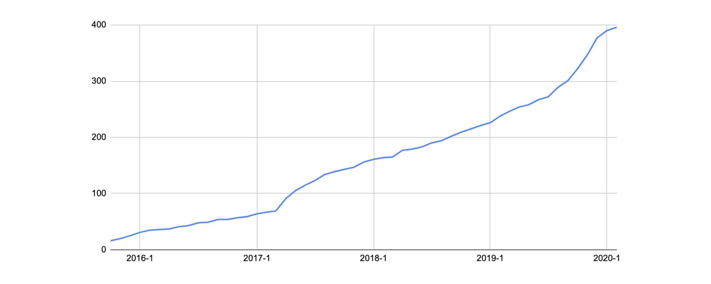

Dear TiDB contributors:

Not long after we celebrated our 300th contributor milestone in September 2019, a new record, [400th contributor](https://github.com/pingcap/tidb/graphs/contributors), is just created in our TiDB repository!

Ever since writing the first line of code of TiDB in May 2015, I have witnessed this open-source distributed database project transforming from infancy to puberty, now growing fast into adulthood. I have enjoyed the glorious moments when its storage layer, [the TiKV project](https://tikv.org/), was upgraded to a [CNCF Incubating Project](https://www.cncf.io/blog/2019/05/21/toc-votes-to-move-tikv-into-cncf-incubator/) and when its ecosystem tools hit their major releases. I am also pleased to see TiDB continuously polished and adopted in the production environments of hundreds of users, helping them scale and grow their business without worrying about their database infrastructure. All these honors and achievements belong to the TiDB community, to our beloved contributors ([Have you landed on the TiDB planet?](https://pingcap.com/tidb-planet/)) and our following distinguished committers:

* Kai Li ([GitHub ID: kayaklee](https://github.com/kayaklee)), Head of Database Team, [Meituan-Dianping](https://en.wikipedia.org/wiki/Meituan-Dianping)
* Di Wu ([GitHub ID: foxmailed](https://github.com/foxmailed)), Head of Database Middleware/Distributed Database, [Toutiao.com](https://www.toutiao.com/)
* Yulai Li ([GitHub ID: blacktear23](https://github.com/blacktear23)), Architect, [SpeedyCloud](http://www.speedycloud.cc/)
* Chuan Du ([GitHub ID: spongedu](https://github.com/spongedu)), Senior Engineer, [Tencent Cloud](https://intl.cloud.tencent.com/)
* Jun-Seok Heo ([GitHub ID: dbjoa](https://github.com/dbjoa)), Samsung Electronics | Cloud Database Engineering

 TiDB contributor growth 

Let's take a look back upon the highlights that have shaped TiDB since September 2019:

* [@iamzhoug37](https://github.com/iamzhoug37) (from Meituan-Dianping) supported SQL binding, which enables the optimizer to choose the correct execution plan without modifying user SQL statements when statistics are outdated.
* [@hailanwhu](https://github.com/hailanwhu) (from [Wuhan University](https://en.wikipedia.org/wiki/Wuhan_University)) supported the Index Merge operator, which enables TiDB SQL Optimizer to choose more than one index to retrieve data from the storage layer. This improved the performance and robustness of query execution.
* [@pingyu](https://github.com/pingyu) (from [Tencent](https://en.wikipedia.org/wiki/Tencent)) improved the performance of the window operator by introducing a shuffle operator. Now, he is working on integrating this operator to the whole TiDB SQL Engine layer to make it achieve better [hybrid transaction and analytical processing](https://en.wikipedia.org/wiki/Hybrid_transactional/analytical_processing) (HTAP) performance.
* The TiDB community vectorized [432 built-in functions](https://github.com/pingcap/tidb/pulls?utf8=%E2%9C%93&q=is%3Apr+is%3Amerged+sort%3Aupdated-desc+label%3Acontribution+%22vectorize%22+) by 79 contributors, among which [@tsthght](http://github.com/tsthght) (from Meituan-Dianping) finished 45. Also, 22 rules were implemented to the new [Cascades Planner](https://github.com/pingcap/tidb/projects/16) by 11 contributors, and [@SeaRise](https://github.com/SeaRise) (from [Huya](https://en.wikipedia.org/wiki/Huya_Live)) finished 5 among them.

For those who love hacking in the open-source distributed system projects, we made it our mission to make sure this is where you belong by enriching your contribution journey:

* [a series of training courses](https://github.com/pingcap/talent-plan) on writing distributed systems in Go and Rust
* [meticulously defined community roles to make you feel belonging and recognized with a clear growth path](https://pingcap.com/blog/tidb-community-upgrade/)
* an [upgraded community structure](https://pingcap.com/blog/tidb-community-upgrade/#new-community-structure)with Special Interest Groups (SIG), Working Groups (WG) to facilitate contributions and project development
* diversified community activities [TiDB Hackathon 2019](https://pingcap.com/blog/insert-into-tidb-hackathon-2019-values-hack-fun-tidb-ecosystem/), [TiDB DevCon](https://pingcap.com/blog/tidb-devcon-2018-recap/), [Paper Reading](https://pingcap.com/community-cn/paper-reading/), and the ongoing [TiDB Usability Challenge program](https://pingcap.com/community/tidb-usability-challenge/)
* with more to come!

While this achievement is worth celebrating, we know there is still lots of work ahead. In addition to making TiDB faster, easier to use, and a real HTAP platform, we want to begin 2020 by striving for a diversified community full of innovative ideas, collaborations, and engagements. We hope you will enjoy the self-governing, active, global TiDB community we are committed to building.

Linus Torvalds once said, "In open source, we feel strongly that to really do something well, you have to get a lot of people involved." Whether you want to use TiDB to unleash the power of data or to have fun hacking with other fellow contributors, join us today on our [community Slack channel](https://pingcap.com/tidbslack).

Enjoy!

With sincerity and gratitude,

Ed
