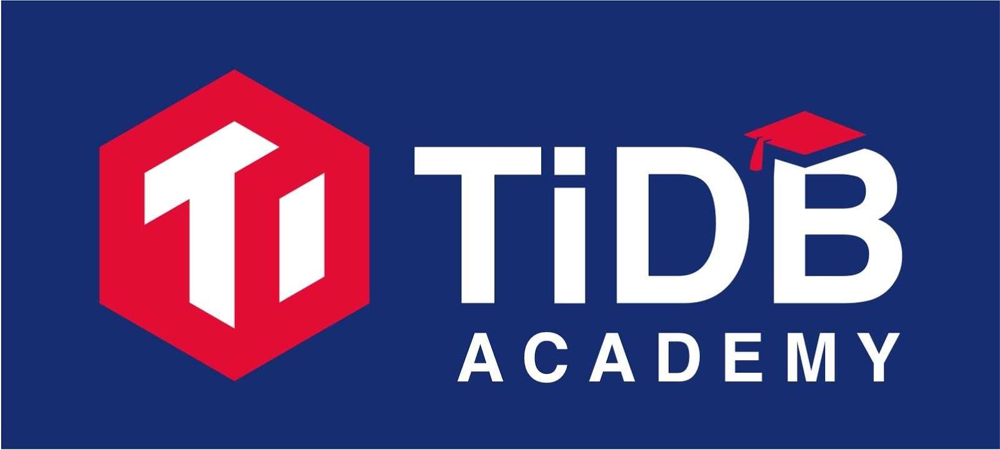

Last November, we [launched TiDB Academy](https://pingcap.com/blog/tidb-academy-announce/), a series of online, self-paced technical training courses on TiDB and distributed database concepts in general. The first course is called "Distributed Database with TiDB for MySQL DBAs", taught by me!

Since we launched, hundreds of people have signed up from around the world to take the course and are looking to officially certify their new knowledge and skills.

Today, I am excited to announce that the official [TiDB Certification](https://prod.examity.com/PingCAP/) is now available in beta!

This is an online exam which consists of 45 multiple choice questions weighted according to the following topics:

- 20% - Architecture
- 10% - TiDB Data Migration
- 20% - Placement Drive (PD)
- 30% - TiDB server
- 20% - TiKV

If you plan on taking the exam, reading the [TiDB Manual](https://pingcap.com/docs/) as a study guide would be helpful, in addition to taking the [TiDB Academy](https://pingcap.com/tidb-academy) courses and doing all the lab exercises. All exams are live proctored by our testing partner Examity. To sit for an exam, you will need a webcam and valid government identification (e.g., passport, driver's license, etc.).

Because the exam is in beta, you won't immediately receive your score (as either pass or fail) until the exam completes the beta period. This is a common industry practice for many technical exams, where the beta period is partially used to evaluate the quality of our questions before a final outcome is determined for the exam taker.

While in beta, **the exams are heavily discounted: only $50!**

The exam is ready for you to sign up and take [HERE](https://prod.examity.com/PingCAP/), and if you have any questions, just email our teaching staff at: [academy@pingcap.com](mailto:academy@pingcap.com). Good luck!
