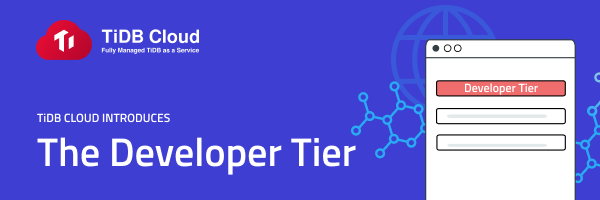

We are excited to announce the Developer Tier of TiDB Cloud, a fully-managed TiDB service by PingCAP. With the TiDB Cloud Developer Tier, users can run a TiDB cluster for free for one year on Amazon Web Services. This gives developers time to build and test applications on TiDB Cloud, and properly evaluate what TiDB has to offer. TiDB Cloud handles all the behind-the-scenes database management such as infrastructure management, cluster deployment, and backup management, so developers can focus on creating great applications.

As Shen Li, PingCAP VP explains: "If you're thinking about using TiDB or TiDB Cloud, we're giving you a full year to try it out. Take your time: make sure it's compatible with all your applications and workloads. When the time comes, it will be easier for you to make a decision. If you're a CTO, the free year will give you the confidence to know you're making the right choice. With the Developer Tier, developers can experiment with TiDB Cloud on their own schedule. We want to make it easier for you to adopt TiDB and put it to work in your mission critical applications."

## Why TiDB Cloud?

TiDB Cloud makes deploying, managing, and maintaining your TiDB clusters even simpler with a fully managed cloud instance that you control through an intuitive dashboard. You'll be able to easily deploy on Amazon Web Services or Google Cloud to quickly build mission critical applications.

By scaling TiDB Cloud nodes for compute and storage separately, you'll be able to provision your databases for the optimal amount — no longer wasting expensive resources. TiDB Cloud allows developer, DevOps and DBA teams with little or no training to handle once-complex tasks such as infrastructure management and cluster deployment.

TiDB Cloud also simplifies deployment, scaling, and recovering from outages through its cloud-native, distributed architecture that eliminates the need for manual sharding and complex failover schemes. Overall, this frees up your time to focus on making better applications for your customers.

## Get the full power of TiDB

TiDB is the leading open-source, MySQL compatible, distributed NewSQL database in the industry that supports Hybrid Transactional and Analytical Processing (HTAP), which allows business to run real-time analytical queries. It also features horizontal scalability, strong consistency, and high availability. TiDB lets you:

* Control scaling - Scale the performance or storage separately to best suit your needs.
* Ensure business continuity - High availability and reliability for your mission critical applications through ACID-compliant cluster deployment.
* Remove bottlenecks - Scalable multi-master that scales without restrictions with read and write capability on every node.
* Query without losing performance - Our high concurrency allows thousands of users to query data at the same time without losing performance.
* Eliminate complex data migration - No data migration between transactional and analytical workloads by storing all data in a single database.
* Run real-time analytical queries - Run real-time operational analytics queries with our hybrid transactional-analytical processing (HTAP) capabilities.

TiDB has been growing for the past six years and is now deployed in production by over 1,500 companies worldwide. Open source since day one, TiDB has donated two projects to the Cloud Native Computing Foundation (CNCF) and currently has over 400 contributors to its [Github repository](https://github.com/pingcap/tidb).

## Get Started Today

Ready to give [TiDB Cloud](https://tidbcloud.com/signup) a try? Choose from one of our public preview options:

* **Developer Tier**: Quickly check out TiDB without having to manage your clusters.
* **Proof of Concept**: Test your mission critical applications with help from our dedicated technical support.
* **On Demand**: Get access to the full benefits of TiDB along with our fully managed service.

Learn more about TiDB Cloud with our [Quick Start Guide](https://docs.pingcap.com/tidbcloud/public-preview/tidb-cloud-quickstart) and [blog post](https://pingcap.com/blog/tidb-cloud-managed-sql-at-scale-on-aws-and-gcp). Make sure to follow us on [Twitter](https://twitter.com/PingCAP) to stay updated on TiDB Cloud news!
