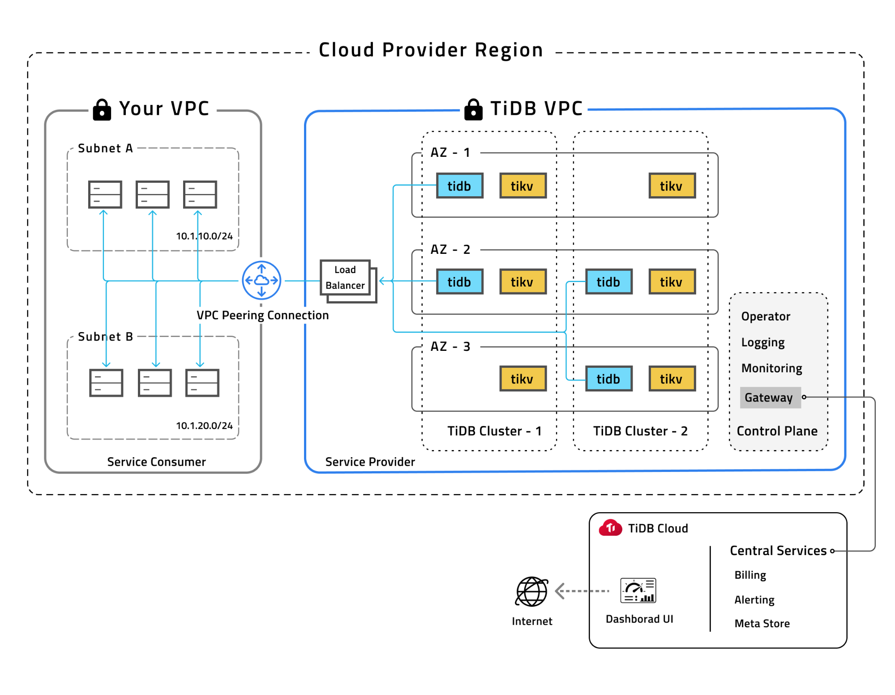

**Author:** [Ken Liu](https://github.com/iamxy) (PM of TiDB Cloud)

**Transcreator:** [Coco Yi](https://github.com/yikeke); **Editor:** Tom Dewan

This June, we [announced](https://pingcap.com/blog/announcing-tidb-as-a-service-fully-managed-tidb-offering/) the beta release of [TiDB Cloud](https://pingcap.com/products/tidbcloud), the fully managed database service provided by PingCAP. TiDB Cloud offers fully managed [TiDB](https://docs.pingcap.com/tidb/stable/overview), the horizontally scaling, distributed SQL database that processes both transactional and analytical queries well. Our goal is to empower your applications with a reliable database service that **responds fast even during traffic peaks** and **provides real-time analytics on market changes** while **minimizing your operational costs**.

Try [TiDB Cloud](https://tidbcloud.com/signup) if this sounds like what you're looking for. **We're offering a 14-day free trial with 24/7 expert support.**

In this article, I'll walk you through what TiDB Cloud offers.

## Scalable and transactional, also good at analytics

TiDB Cloud is built to bring everything great about TiDB to the cloud. Among all things, two features stand out the most—horizontal scalability and Hybrid Transactional/Analytical Processing (HTAP) capability.

TiDB's horizontal scalability and MySQL compatibility have led many former Aurora and MySQL users to choose TiDB as their data backbone.

With TiDB Cloud, scaling your database out or in could not be easier. When your application traffic surges or drops, you can simply add or remove nodes from your cluster with just a few clicks.

More than that, TiDB is also awesome at analytics.

TiDB adopts a [modular architecture](https://pingcap.com/blog/how-tidb-htap-makes-truly-hybrid-workloads-possible#modular-architecture) that separates the SQL computing engine from the storage engine. This makes it a lot easier to independently develop a row store engine (the [TiKV](https://tikv.org/) servers, with data in row format) and a column store engine (the [TiFlash](https://docs.pingcap.com/tidb/stable/tiflash-overview) servers, with data in column format). Then we use standby [Raft Learner](https://etcd.io/docs/v3.3.12/learning/learner/#raft-learner) nodes to glue row and column formats together.

With row stores, you get fast write speed; with column stores, you aggregate large volumes of data very quickly and get fast query speed. **Now you get both in a single TiDB database.**

TiDB Cloud will soon support HTAP (through TiFlash) in September. Stay tuned: you won't want to miss that.

## Fully managed is more than simple

With TiDB Cloud's UI, you can deploy a cluster with only a few clicks. Simply pick your cloud provider and region, the number of computing and storage nodes, and you spin up a commercial-grade cluster!

In this demo video, we create a cluster in just one minute:

<iframe id="youtube-video" title="Create a Cluster in TiDB Cloud" src="https://www.youtube.com/embed/C1Ec1Yfp-EU?rel=0" frameborder="0" allowfullscreen="allowfullscreen" mozallowfullscreen="mozallowfullscreen" msallowfullscreen="msallowfullscreen" oallowfullscreen="oallowfullscreen" webkitallowfullscreen="webkitallowfullscreen"></iframe>

After your cluster is set, you can leave the rest to us. As your database service provider, we take care of day-to-day operations, including monitoring alerts, tuning, upgrades, and backups. **Your team can focus on developing business applications, rather than doing tedious, boring database operations.**

Also, our global expert support is available 24/7 so that you can rest assured that your business is always on.

## Secure for sensitive data

TiDB Cloud offers enterprise-grade security by deploying clusters in dedicated Virtual Private Cloud (VPC) networks. Each tenant on TiDB Cloud has its own isolated network, and your application service and the TiDB database service use independent VPC networks as well. Connecting to your database requires VPC peering to ensure data and connection security.

 Isolated and secured deployments guaranteed by dedicated VPC networks 

Transport Layer Security (TLS) encryption is always enabled for all deployments on TiDB Cloud. Connections between TiDB clients and servers are encrypted, as are connections between all TiDB component nodes. Encrypting data on disk (also known as "at rest") is also enabled by default for all your persisted data and backups.

As a Software as a Service (SaaS) provider, we take data security seriously. We've established strict information security policies and procedures required by the Service Organization Control (SOC) 2 Type 1 compliance. This ensures that our customers' data is secure, available, and confidential.

## Flexible and highly available architecture

TiDB Cloud is cloud-agnostic. You can deploy your database to AWS or GCP. If you need TiDB in a different cloud, let us know and we will work with you to bring it there.

TiDB Cloud ensures the high availability of your application data. Each time TiDB writes or updates your data, it replicates to at least three replicas in different availability zones (AZs) in the cloud. TiDB uses the Raft distributed consensus algorithm to guarantee strong consistency. Even if one AZ fails, your data is still available, and the service stays on.

 Highly available, managed TiDB database survives an AZ outage 

Also, you can easily configure automatic and ad hoc backups and restore your cluster from a backup on the UI.

To guarantee uptime for your production clusters, we also include a [service-level agreement](https://docs.pingcap.com/tidbcloud/beta/service-level-agreement) (SLA). If we don't meet the uptime as stipulated in the SLA, you'll be compensated for any excess downtime you experience.

## Summing it up

The benefits of the fully managed database service brought by TiDB Cloud are:

- No in-house administrative team required and no hardware costs
- Deploy and scale with a few clicks on the UI
- Highly scalable and MySQL-compatible
- Encryption in transit and at rest
- Highly-available, performance-tuned database service
- Automatic and ad hoc backups
- 24/7 expert support

## Start your first free cluster now!

[Sign up](https://tidbcloud.com/signup) now to start your 14-day free trial on TiDB Cloud.

For more guidance, check out the [TiDB Cloud documentation](https://docs.pingcap.com/tidbcloud/beta) or [email us](mailto:info@pingcap.com). We're glad to help with any issues during your trial.
