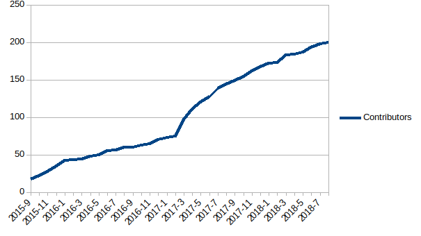

Dear TiDB Contributors:

As you might’ve noticed, TiDB recently added its 200th contributor. As CEO and co-founder of PingCAP who began building TiDB three years ago, I would like to thank the entire TiDB community for helping us reach this important milestone!

*TiDB development started in 2015.  In August 2018, we welcomed our 200th contributor!*

Here are a few of my favorite contributions to highlight:

* [@dbjoa](https://github.com/dbjoa) (from Samsung Electronics) [contributed](https://github.com/pingcap/tidb/commits?author=dbjoa) [plan cache for prepared statements](https://github.com/pingcap/tidb/pull/3956), resulting in a performance gain of 27%!

* [@spongedu](https://github.com/spongedu) (from Tencent, and previously Alibaba) has [contributed](https://github.com/pingcap/tidb/commits?author=spongedu) over 80 (!) pull requests to TiDB and TiKV.

* Seeing new contributors progress from fixing a small bug to developing new features.  [@bb7133](https://github.com/bb7133) first [improved an error message](https://github.com/pingcap/tidb/pull/6683) in May 2018, and by August added [propagate more filters in PropagateConstant](https://github.com/pingcap/tidb/pull/7276). He is interested in the SQL optimizer and will contribute more in this area.

While this achievement is worth celebrating, we know there are still lots of work ahead. Pull requests can be reviewed quicker, issues resolved faster, and documentation written clearer to make using and contributing to TiDB easier and more productive. We appreciate your patience, as we continue to improve the way we manage and grow the TiDB community.

Your contributions--beyond just code, comments, and bug reports--tell an important story of how to prioritize the needs of a fast-growing open-source community and usebase, while managing the development of a system as complex as a distributed database. They inspire us to get up every morning with energy, passion, and focus on always doing what’s best for the community. 

So thank you again on behalf of everyone at PingCAP. You have helped make TiDB what it is today, and will continue to shape what TiDB will be tomorrow.

With gratitude,

Max 

