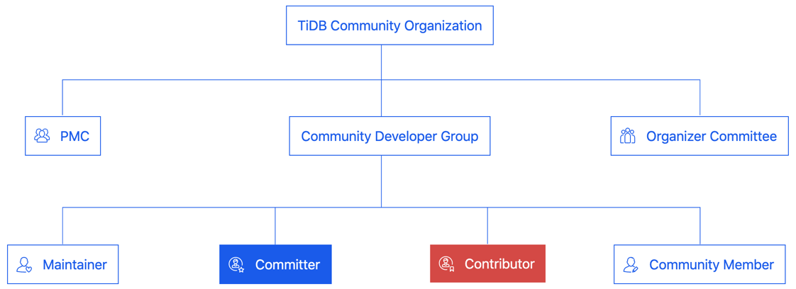
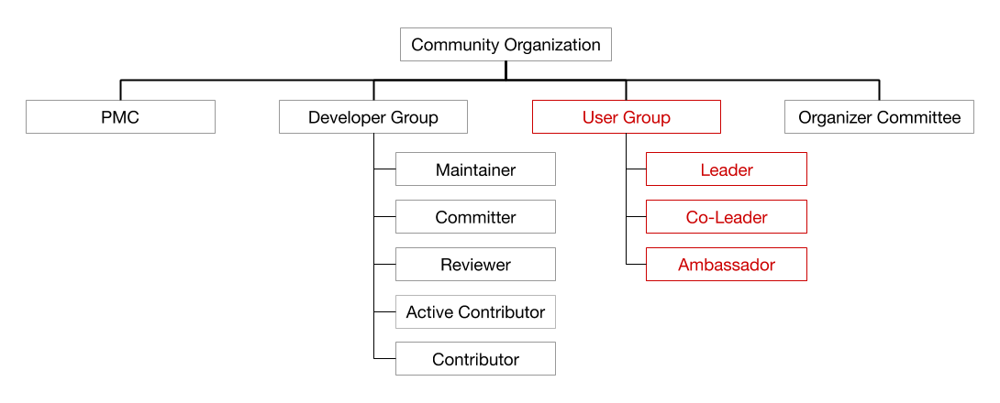
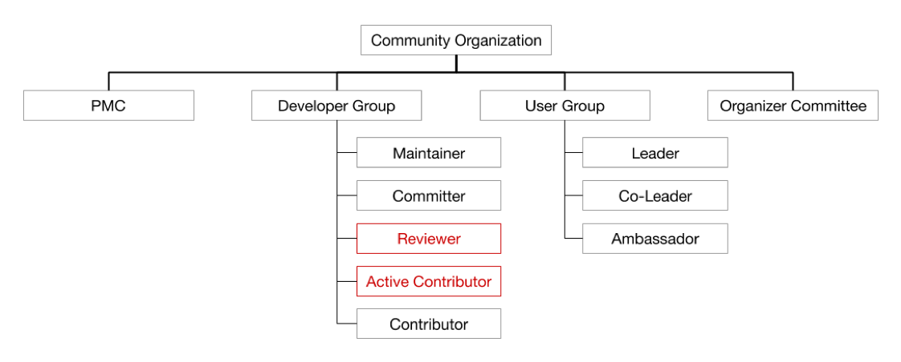
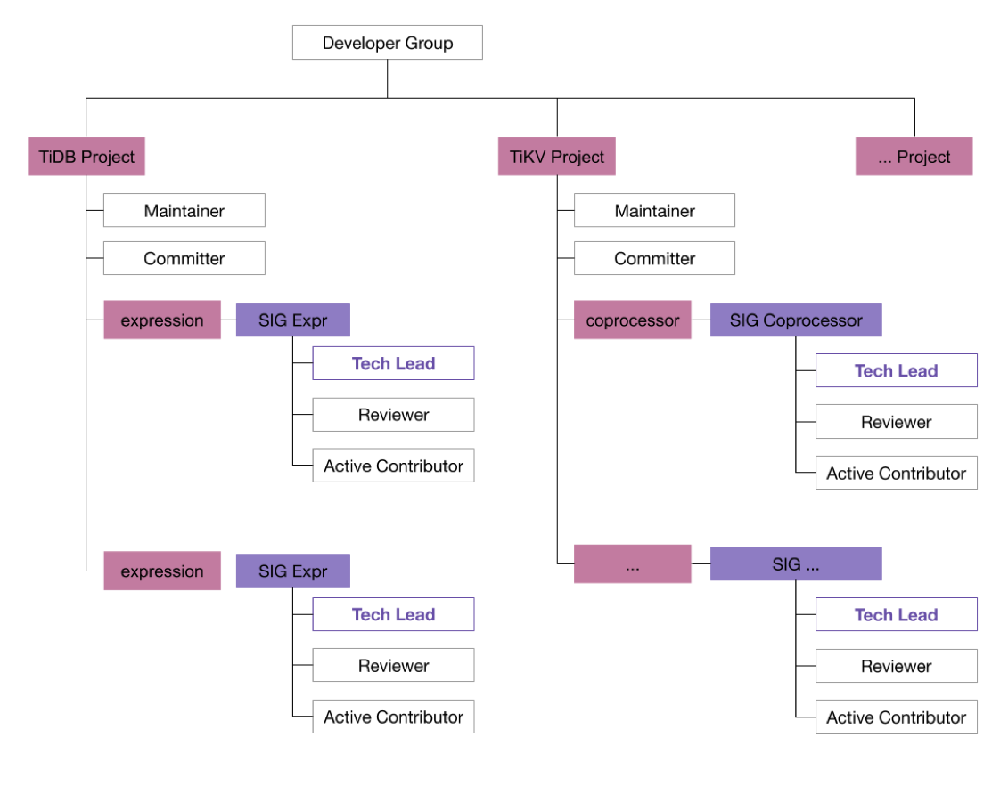

Years of development has seen the TiDB community gradually grow into maturity. As the community expands, some shortcomings begin to loom out of the current community structure. After a series of reflections and summaries, we decided to upgrade and adjust the current community organization structure, with more community roles and community organizations introduced to better stimulate the vitality of the community and maintain a positive and healthy community environment.

## Organization structure of the old community

This is what the community organization structure used to be:

*Figure 1. Old community structure*

The old community was mainly geared towards the TiDB Developer Group. The main roles are Maintainer, Committer, Contributor, etc., among which:

* Committer: Recommended by Maintainer or Project Management Committee (PMC) as a Contributor who has made a significant contribution to TiDB. Must have completed at least one feature or fixed a major bug.

* Maintainer: The planner and designer of the project, with the right to merge branches into the master, generated from Committer. A Maintainer should:

    - Demonstrate good judgment and sense of responsibility for the health of the subprojects
    - Set up the technical direction directly or by delegating the responsibilities
    - Make or approve design decisions for the subprojects

The TiDB user community has played an important role in product polishing and upgrading. However, it was obscured in the old community structure. In addition, the responsibilities for the roles in the developer community and the relationship between roles are relatively simple. Therefore, we decided to include the TiDB user community in the new community structure while providing the TiDB developer community with clearly defined roles, rights, and responsibilities. At the same time, some new roles and new organizations have been introduced. Let's take a closer look.

## New community structure

### Change 1: Include the TiDB user community

As TiDB becomes maturer, the TiDB user community is growing stronger. The feedback and practical experience gained from users have an important role to play in the improvement and application of TiDB products. Therefore, we would like to take this opportunity to officially include the TiDB User Group (TUG) in the new community structure, so that users and developers can communicate and interact better, thereby promoting healthy development of the TiDB community.

*Figure 2. New community structure - User Group*

The TiDB User Group (TUG) is an independent, non-profit, third-party organization sponsored and managed by TiDB users to enhance communication and learning among the community. The operation forms of TUG include, but are not limited to, online Q&A and technical article sharing, offline technical salons, visits to famous companies, official interactive events and so on. TUG members can learn cutting-edge technical knowledge, publish technical insights, and jointly build TiDB projects through online and offline activities.

### Change 2: Active Contributor and Reviewer

*Figure 3. New community structure - Active Contributor and Reviewer*

The above picture reflects the second change in this community structure upgrade - the roles of Reviewer and Active Contributor will be introduced to the developer community.

An Active Contributor is a contributor who contributes more than 8 pull requests (PRs) within a year. A Reviewer is generated from Active Contributors and has the right and obligation to review PRs for sub-modules of TiDB or TiKV. These roles will be covered in more details later when we introduce the Special Interest Group.

### Change 3: Special Interest Group

Let's take a closer look at the developer community structure diagram:

*Figure 4. New community structure - Special Interest Group*

The above diagram shows the overall structure of the developer community from a vertical angle, reflecting the third change in this community architecture upgrade - the introduction of the Special Interest Group (SIG).

An SIG mainly leads the development and maintenance of a TiDB/TiKV module and is responsible for the quality of the module's code. Active Contributors that meet the requirements will be invited to an SIG. Developers in the SIG will receive continuous guidance from Tech Leads while they optimize and improve the module, and meanwhile exercise their technical skills. Community developers can gradually grow from the initial Active Contributor to the community-recognized Reviewer, Committer, and even Maintainer through SIGs. In general, each SIG will organize meetings periodically to discuss about the recent progress and the problems encountered. All meeting discussions are open to the community, so that interested community members can participate.

For reference, see our [Expression Special Interest Group](https://github.com/pingcap/community/tree/master/special-interest-groups/sig-expr) in operation.

In addition, this picture also reflects the relationship between community roles and SIGs. Let's take a closer look at the community roles in an SIG:

1. Active Contributor
    + Must be a Contributor with at least 8 PRs merged to the master branch within 1 year.
    + To join an SIG, a Contributor needs to contribute more than 8 PRs to the module that the SIG is responsible for within 1 year, so that he/she can be invited to join the SIG for targeted learning and contributions.

2. Reviewer
    + Must belong to an SIG; has the obligation to review PRs.
    + Generated from Active Contributors. When an Active Contributor has significant contributions to the module and is nominated by 2 or more Committers, he/she will be invited to be a Reviewer of the module.
    + Has valid sign-off (approval with Looks Good To Me, or LGTM) for code reviews of the module

        > **Note:**
        >
        > TiDB requires at least 2 LGTMs for each PR to be merged into the development branch.

3.  Tech Lead
    + The organizer of the SIG; responsible for the day-to-day operations including organizing meetings, answering questions, etc.
    + Tech Leads are responsible for the management and growth of the SIG. For now, the role is taken by PingCAP members, but is hopefully extended to community developers in the future.

There are another two roles:

1. Committer
    + A senior community developer generated from Reviewers.
    + When a Reviewer has very significant contributions to the module, or has the Reviewer role in other modules in while maintaining the current role then he has met the conditions to be a Committer in depth or breadth. This, together with nominations from 2 or more Maintainers, he/she can become a Committer.

2. Maintainer
    + A developer deeply involved in daily operations of the TiDB community; generated from Committers, with write access to the code repository.

> The detailed definitions and rights and responsibilities of the above community roles can be viewed [here](https://pingcap.com/community/developer-group/).

### Change 4: Working Group

*Figure 5. New community structure - Working Group*

The fourth change is the introduction of the Working Group (WG) in the developer community structure. A WG is formed by community developers who gather together to accomplish a specific goal with PingCAP members. To achieve the goal, some WGs may span over multiple SIGs, and some WGs may only focus on something specific in a specific SIG.

Each WG has its life cycle. Once the goal is completed, the group will be disbanded. The only goal of WG operations and management is to ensure that the goals set by the group are completed at the right time. In general, the working group hold periodic meetings to summarize the current project progress and determine the plans for next steps.

For reference, see our [Vectorized Expression Working Group](https://github.com/pingcap/community/blob/master/working-groups/wg-vec-expr.md) in operation.

## Conclusions and future work

In general, this community structure upgrade has the following improvements:

- Introduced TiDB User Group.

- Introduced the community roles of Active Contributor and Reviewer.

- Introduced Special Interest Group (SIG).

- Introduced Working Group (WG).

In terms of community operations, we will continue our efforts in the following aspects:

- Improve the mentoring mechanism for community members to advance, so that community members can grow from Contributor to Committer or Maintainer with clear paths to follow.

- Make community operations more systematic.

- Make community classmates feel more belonging and strengthen communications with members from other communities.

In the future, we will successively open more SIGs and WGs. More database-related materials will be continuously distributed in SIGs to help members gradually participate in the development of TiDB. We hope more and more members can join us and make TiDB the de-facto standard of open source distributed relational databases!
