On January 20th, 2018, a chilly Saturday in the middle of the winter, more than 200 coders, hackers, and techies streamed into Garage Café, a chic coffee shop in the heart of Beijing’s techhub, Zhongguancun. They weren’t there to get coffee. They weren’t there to stay warm. They were there to be part of TiDB DevCon 2018, a technology party for the developers, by the developers.

*TiDB DevCon 2018 attendees signing-in on the event banner*

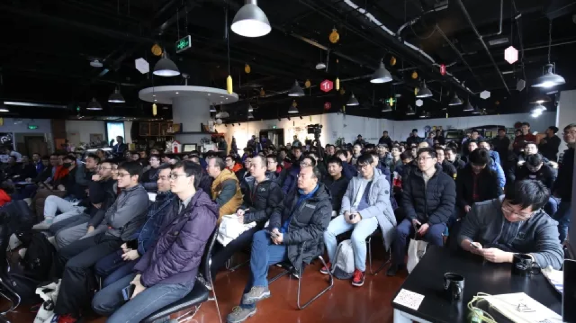

*A packed audience at TiDB DevCon 2018*

At this party, the team behind TiDB announced exciting news, shared the project’s latest development, and unveiled the future plans of the TiDB project. Here are some important news and highlights:

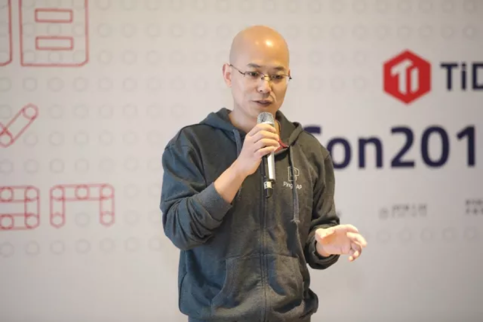

*PingCAP co-founder and CEO, Max Liu, giving the opening address at TiDB DevCon 2018*

<!-- TOC -->

- [Team](#team)
- [Community](#community)
- [Partners](#partners)
- [TiDB 1.1 Alpha Release](#tidb-11-alpha-release)
  - [Performance & latency](#performance-latency)
  - [TiDB Lightning](#tidb-lightning)
- [Tools and Ecosystem](#tools-and-ecosystem)
  - [TiDB deployment](#tidb-deployment)
  - [Import & Export Tools](#import-export-tools)
    - [TiDB Syncer](#tidb-syncer)
    - [TiDB Binlog](#tidb-binlog)
    - [TiDB Lightning](#tidb-lightning)
  - [Wormhole--Enterprise synchronization tool](#wormhole--enterprise-synchronization-tool)
  - [TiDB Insight](#tidb-insight)
  - [Monitoring & Alerting](#monitoring-alerting)
- [2018 Roadmap](#2018-roadmap)

<!-- /TOC -->

## Team

The team behind TiDB, PingCAP, grew from 35 members in 2016 to almost 90 members in 2017.

## Community

* Github stars on the TiDB project (TiDB and TiKV combined) reached 14000+ in January 2018, almost doubled its number in January 2017.
    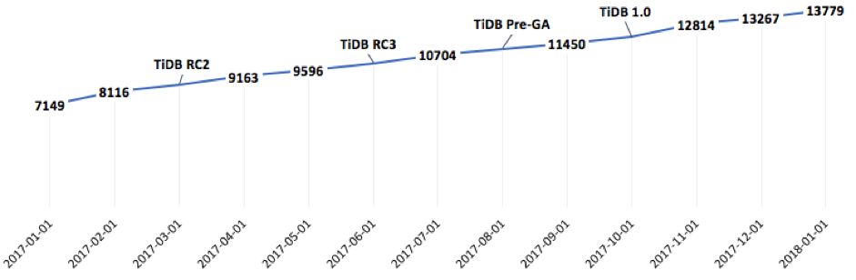
* Number of contributors reached 213, an increase of 126%.
* More than 200 users are running TiDB in production environments, 50 times more than 2016.
* Three distinguished TiDB contributors were recognized as TiDB committers. For more information about how to join the TiDB community, see [TiDB Community repo](https://github.com/pingcap/community) and [How to become a TiDB committer](https://github.com/pingcap/community#how-do-i-become-a-committer).
    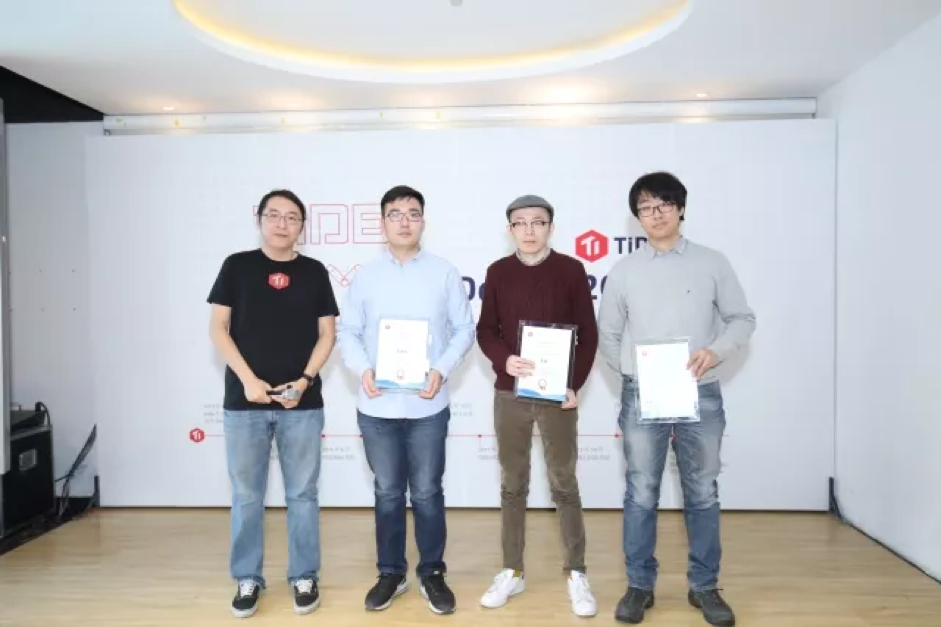
    
    *PingCAP co-founder & CTO, Ed Huang (left), recognizing three distinguished TiDB contributors as TiDB committer*
    
## Partners

Designed to be a cloud-native HTAP database, TiDB has been fully integrated and available on [UCloud](https://www.ucloud.cn/) and [Tencent Cloud](https://cloud.tencent.com/product/tidb). Close partnerships with other public cloud vendors will be announced soon. Stay tuned!

Some of TiDB’s largest customers, [Mobike](https://www.crunchbase.com/organization/mobike), [Toutiao](https://www.crunchbase.com/organization/toutiao), [SpeedyCloud](https://www.crunchbase.com/organization/speedycloud), [Qunar.com](https://www.crunchbase.com/organization/qunar-com), [Ele.me](https://www.crunchbase.com/organization/ele-me), also shared their use cases and best practices:

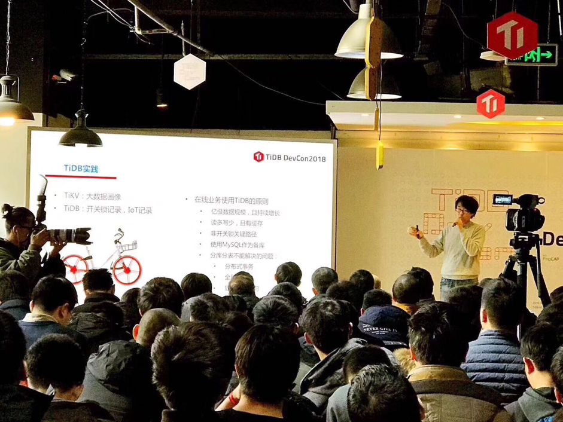

*A Senior Manager of the databse team at [Mobike](https://www.crunchbase.com/organization/mobike), sharing their best practices of TiDB*

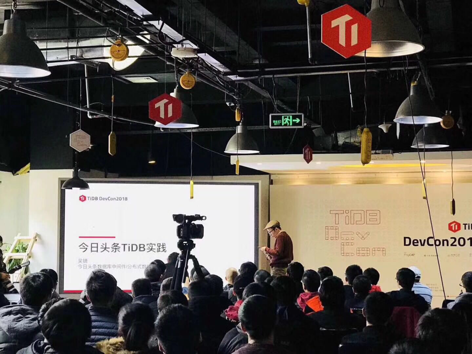

*Tech Lead of the Database Middleware and Distributed Database Team at [Toutiao](https://www.crunchbase.com/organization/toutiao), sharing their best practices of TiDB*

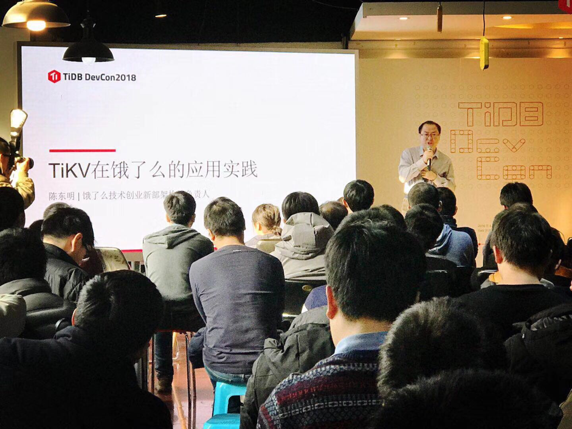

*Tech lead of the architecture team in the Technical Innovation department at [Ele.me](https://www.crunchbase.com/organization/ele-me), sharing their use case with TiDB*

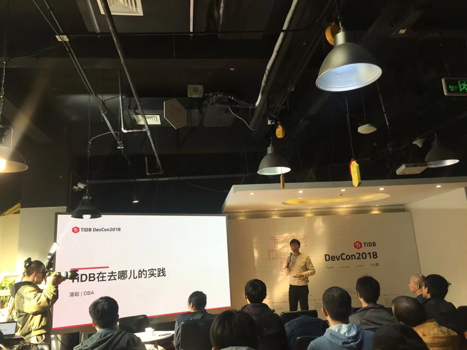

*Senior Database Administrator at [Qunar.com](https://www.crunchbase.com/organization/qunar-com), sharing their best pratices of TiDB*

*Senior Database Architect at [SpeedyCloud](https://www.crunchbase.com/organization/speedycloud), sharing their query cache in TiDB*

## TiDB 1.1 Alpha Release

On January 19th, one day before DevCon, [TiDB 1.1 Alpha](https://www.pingcap.com/blog/2018-01-19-11-alpha/) was released with the following improvements:

### Performance & latency

* Average QPS of TiDB increased by 50%.
* To support requirement from [Toutiao](https://www.crunchbase.com/organization/toutiao), [TiDB 1.1 Alpha](https://www.pingcap.com/blog/2018-01-19-11-alpha/) is able to scale auto-increment ID and achieve 16x speed improvement for queries like  `alter table t shard_row_id_bits = 4` and is also able to handle millions of TPS.
* Read QPS speed of TiKV improved by 2x.
* Counting table is now 70% faster than the previous version.
* Hash-join is 3 times faster than the previous version.
* Some complex queries using index are now more than 10x faster than the previous version.
* Cost based optimizer (CBO) is smarter.
* Loading data using the following statement is now 15x faster:
`load data local infile 'output.csv' into table xxx;`

### TiDB Lightning

With TiDB Lightning, it takes less than 5 hours to import 1 TB of raw SQL file from MySQL to TiDB--10x faster than before.

## Tools and Ecosystem

### TiDB deployment

Deploying a TiDB cluster is much easier than ever before. Developers can use Docker Compose to launch a local TiDB cluster with one command on their laptops and play around with it. Moreover, the container-based components of TiDB managed by a special software named tidb-operator can be simply deployed and maintained on a Kubernetes environment in production.

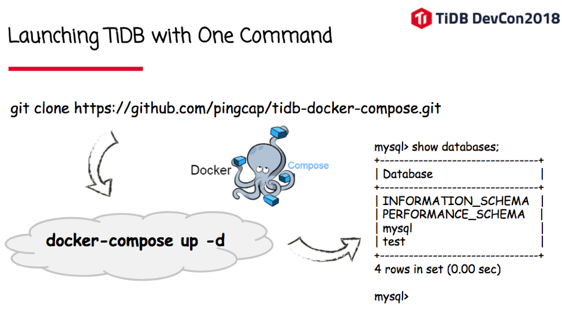

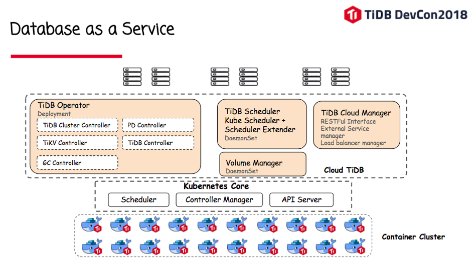

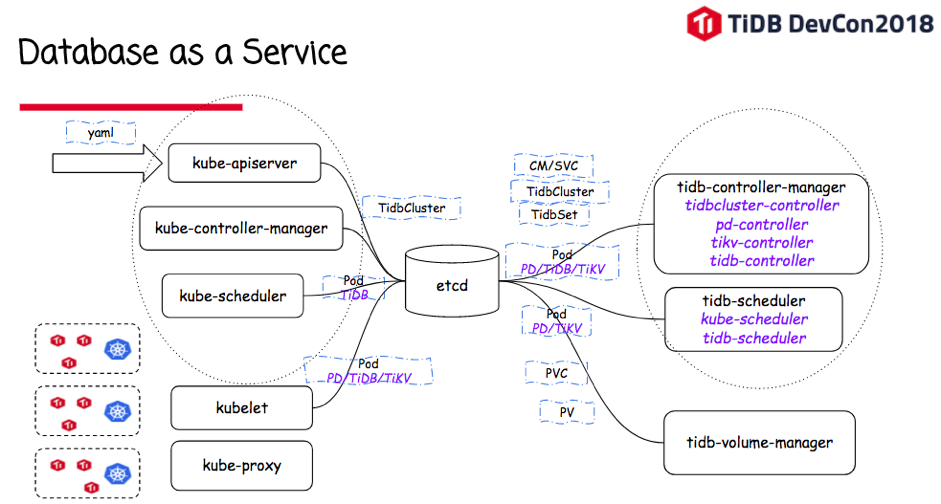

### Import & Export Tools

#### TiDB Syncer

TiDB Syncer is a smart tool to migrate data from MySQL to TiDB in real-time. It poses as a MySQL slave and listens to the changes of master by parsing the MySQL Binary Logs, and replaying the changes sequentially on the TiDB instance.

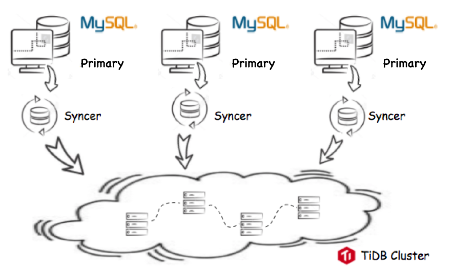

*TiDB Syncer*

#### TiDB Binlog

TiDB Binlog is a tool designed to help users to synchronize data to downstream database in real-time. For example, users can use TiDB binlog to synchronize data from one TiDB instance to another as a Hot-backup cluster. In addition, TiDB Binlog can also be used for other purposes, such as incremental backup,  message triggering and subscription or driving stream computing and analytics.

*Binlog*

#### TiDB Lightning

Lightning is a high-speed data importing tool, customized for TiDB:

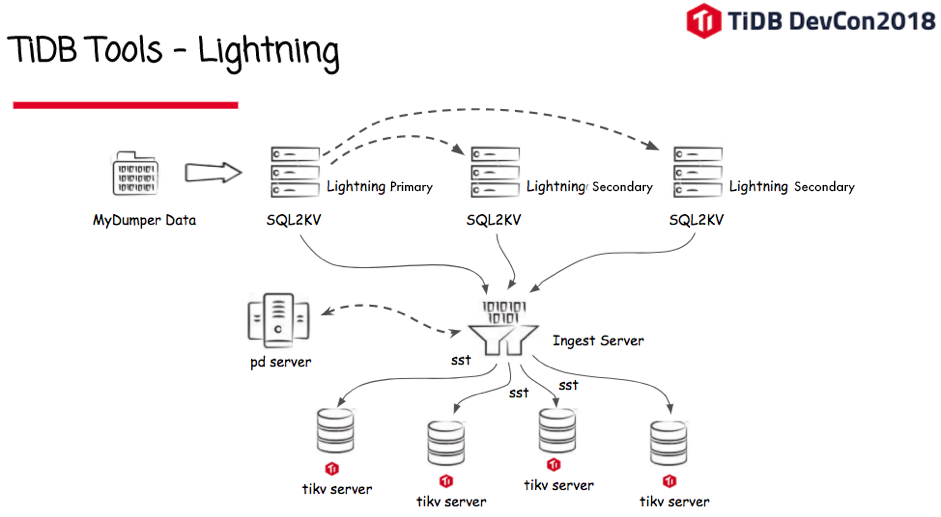

*TiDB Lightning*

### Wormhole--Enterprise synchronization tool

Wormhole is an enterprise edition tool for data synchronization. It contains the following features:

* Web UI dashboard
* Multi-source and destination configuration
* Distributed scheduling
* Sharding source supported
* Pre-checking
* Lightweight ETL in real-time
* Cloud DB integration with:
    * AliCloud RDS
    * TencentCloud CDB

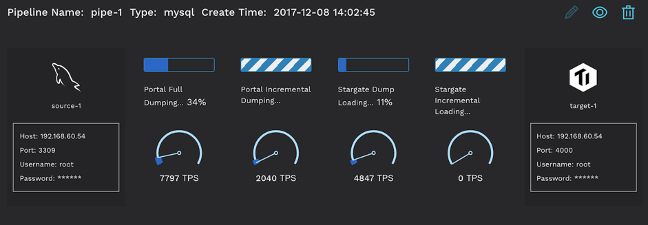

*Wormhole--Enterprise synchronization tool*

### TiDB Insight

TiDB Insight provides users with a real-time visualization and overview into the region distribution, leader regions status, hotspots, region & leader transfer, traffic flow, and the health of the entire cluster.

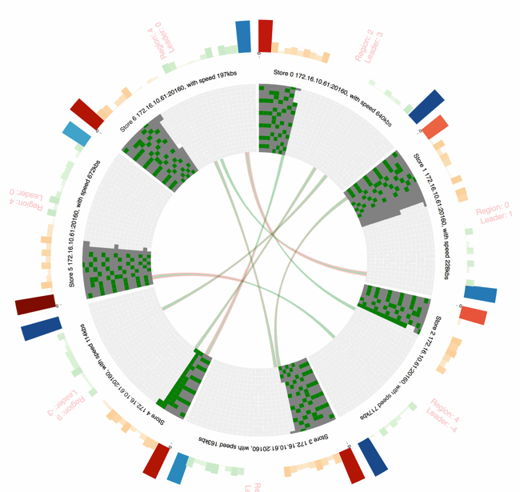

*TiDB Insight*

### Monitoring & Alerting

The TiDB monitoring system collects metrics from TiDB cluster and is integrated with Grafana to visualize data. Alerts are defined based on Prometheus's flexible query language. And the alerting system can keep users informed of any abnormal status in their TiDB cluster via email, SMS, Slack messages, or other customized ways.

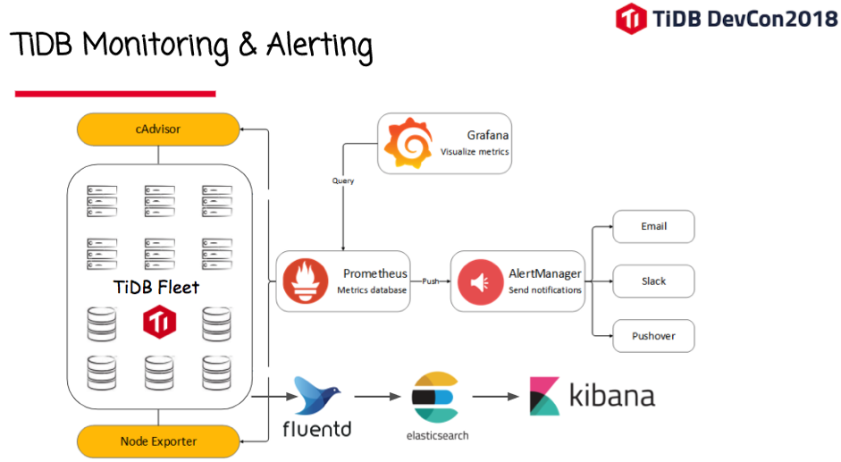

*TiDB Monitoring & Alerting*

## 2018 Roadmap

After recapping all the news and developments from an exciting and productive 2017, PingCAP co-founder and CEO, Max Liu, unveiled TiDB’s 2018 roadmap. 

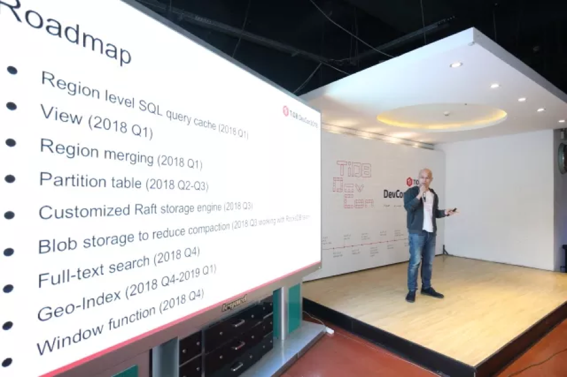

*PingCAP co-founder and CEO, Max Liu, sharing TiDB’s 2018 roadmap*

* Region level SQL query cache (2018 Q1)
* View (2018 Q1)
* Region merging (2018 Q1)
* Partition table (2018 Q2-Q3)
* Customized Raft storage engine (2018 Q3)
* Blob storage to reduce compaction (2018 Q3 working with RocksDB team)
* Full-text search (2018 Q4)
* Geo-Index (2018 Q4-2019 Q1)
* Window function (2018 Q4)

Last but not least, we want to thank all the attendees for braving the cold to participate in the first (but definitely not the last) TiDB DevCon, all the speakers from our customer companies to share their use cases and best practices, and all the amazing contributors to the vibrant and growing TiDB community. We know you have big hopes for 2018; we won’t let you down.  

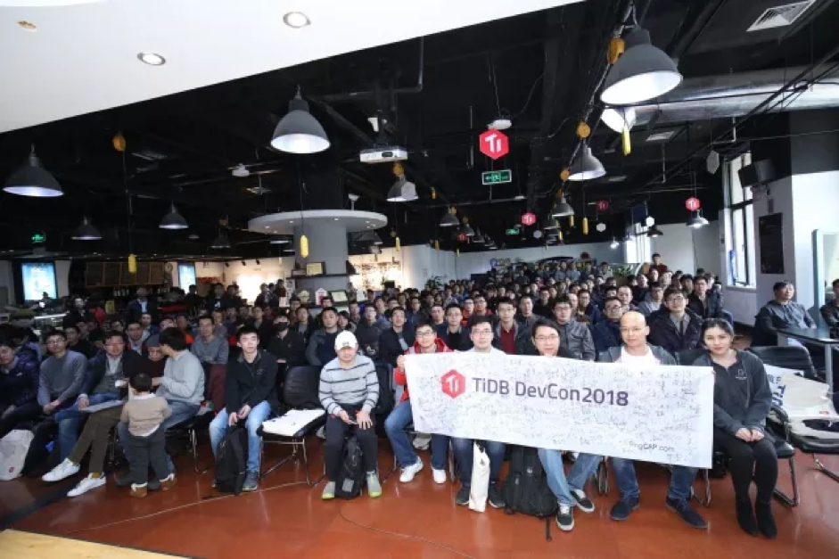

*DevCon 2018 Group Photo*
