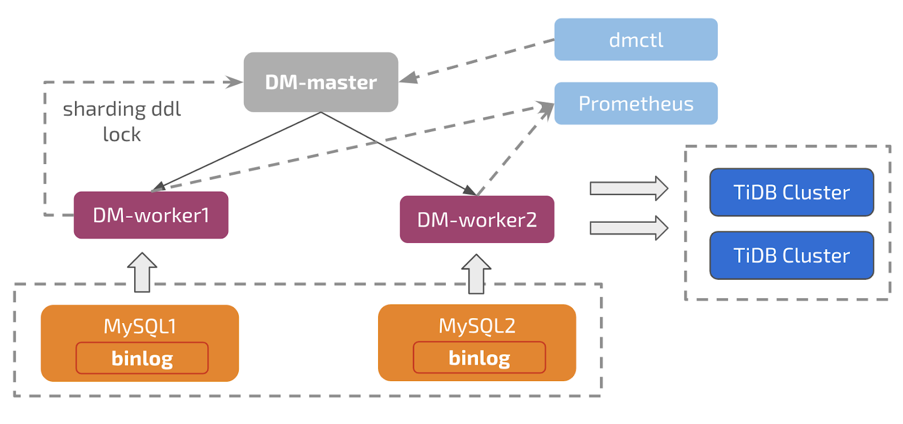
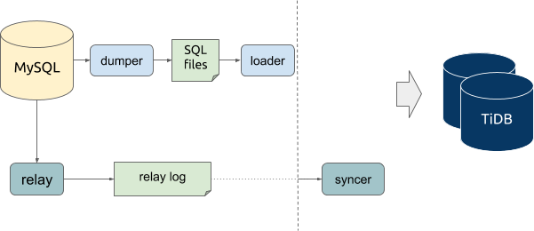
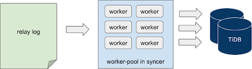
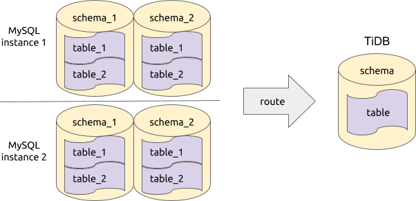
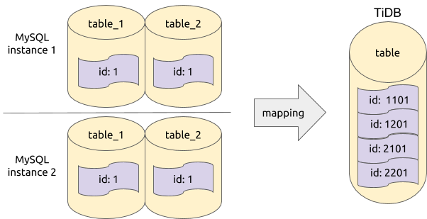
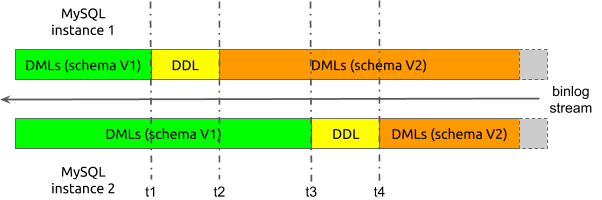
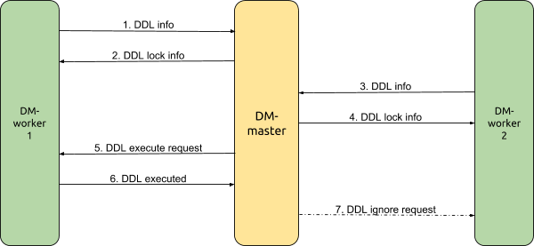
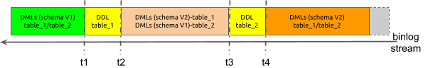

TiDB Data Migration (DM) is an integrated data transfer and replication management platform that supports full data migration or incremental data replication from MySQL or MariaDB instances into a TiDB cluster.

A common real-life use case is using TiDB DM to connect sharded MySQL or MariaDB to TiDB, treating TiDB almost as a secondary, then run analytical workloads on this TiDB cluster to fulfill real-time reporting needs. TiDB DM provides good support if you need to manage multiple data replication tasks at the same time or need to merge multiple MySQL/MariaDB instances into a single TiDB cluster.

## Architecture design

TiDB DM consists of three components: DM-master, DM-worker, and dmctl. It supports migrating the data of multiple upstream MySQL instances to multiple downstream TiDB clusters. The architecture design is as follows:



- DM-master:

  - Managing the whole TiDB DM cluster, maintaining the topology information of the TiDB DM cluster, and monitoring the running state of each DM-worker instance;
  - Splitting and delivering the data replication tasks, and monitoring the running state of data replication tasks;
  - Coordinating DM-workers to execute or skip the DDL statements when incrementally replicating data;
  - Providing a unified portal for the management of data replication tasks.

- DM-worker:

  - Executing the specific replication tasks of full backup data and incremental data, with each DM-worker corresponding to a unique upstream MySQL instance;
  - Fetching the upstream MySQL binlog and persisting the binlog data to the local storage;
  - Dumping the full backup data of upstream MySQL instances in the format of SQL files and loading them to the downstream TiDB; or parsing the persistent binlog in the local storage and replicating it to downstream TiDB cluster;
  - Orchestrating the data replication subtasks split by DM-master and monitoring the running status of subtasks.

- dmctl

  - The command line tool used to manage both the TiDB DM cluster and data replication tasks after connecting to DM-master.

## Implementation principles

Now, I'll introduce TiDB DM's implementation principles in detail.

### Data migration process

A single TiDB DM cluster can perform multiple data replication tasks simultaneously. For each task, it can be split into multiple subtasks undertaken by many DM-worker nodes. Each DM-worker node is responsible for replicating the data of the corresponding upstream MySQL instance.

The following diagram shows the data migration process of a single subtask of data replication on each DM-worker node.



In the whole process, the upper data flow is the full backup migration and the lower data flow is the incremental data replication.

In each DM-worker node, dumper, loader, relay, syncer (binlog replication) and other processing units perform the specific data replication step to complete a specific data replication subtask.

- For full backup migration:

    1. Dumper dumps the table schema and data from the upstream MySQL instance to SQL files.
    2. Loader loads these SQL files and then replicates these files to the downstream TiDB.

- For incremental data replication:

    1. Relay is used as a secondary of the upstream MySQL to fetch the binlog that is persisted in the local storage as the relay log.
    2. Syncer reads and parses the relay log to build SQL statements, and then replicates these SQL statements to the downstream TiDB.

This process is similar to the primary-secondary replication in MySQL. But the main difference is in TiDB DM, the persisted relay log in the local storage can be used simultaneously by multiple syncer units of different subtasks, which avoids multiple tasks' repeatedly fetching the binlog from the upstream MySQL.

### Concurrency model

In order to accelerate data migration, TiDB DM applies the concurrency model in part of the process of both full backup migration and incremental data replication.

**For full backup migration**

1. Dumper calls Mydumper, a data exporting tool, to implement data exporting. For the corresponding concurrency model, see [Mydumper source code](https://github.com/pingcap/mydumper).

2. Loader is used to load the data. For the corresponding concurrency model, see the following diagram:

    

During the data exporting process with Mydumper, a single table can be split into multiple SQL files with `--chunk-filesize` and other parameters. Each of these SQL files corresponds to a static snapshot data of the upstream MySQL at a specific moment and no correlation exists between two SQL files. So when importing the data with loader, you can directly start multiple worker goroutines in a loader unit and each worker goroutine reads to-be-imported SQL files independently and concurrently and applies them into downside streaming. That's to say, loader loads data concurrently at the level of the SQL file. In task configuration,TiDB DM controls the number of worker goroutines with the `pool-size` parameter in the loader unit.

**For incremental data replication**

1. When fetching the binlog from the upstream MySQL to persist it in the local storage, the binlog can only be handled serially because the upstream MySQL generates and sends the binlog in a stream.

2. When importing the data using syncer, you can import data concurrently under limited conditions. The corresponding model architecture is as follows:

    

Syncer reads and parses the local relay log in a stream, which is executed serially. When syncer parses the binlog events and builds the to-be-synchronized jobs, it delivers the jobs to different to-be-synchronized job channels after hash computing based on the primary key, index and other information of the corresponding row.

At the other end of the channel, the worker goroutine concurrently fetches the job from the corresponding channel and replicates the job to the downstream TiDB.

That's to say, Syncer imports data concurrently at the level of the binlog event. In task allocation, TiDB DM controls the number of worker goroutines with the worker-count parameter in the syncer unit.

However, some limitations exist in this process as follows:

- For the DDL operation, the downstream table schema will change so the replication process can only start after all the DML events corresponding to the previous table schema have been successfully replicated.

    1. In TiDB DM, a specific flush job is sent to each job channel after DDL events are obtained from the parsed binlog event.
    2. When each worker goroutine meets a flush job, it replicates all the previously fetched jobs to the downstream TiDB.
    3. When all the jobs in job channels are replicated to the downstream TiDB, the DDL event replication starts.
    4. After all the DDL events are replicated, DML event replication starts.

    In other words, DDL and DML events are not replicated concurrently, and the DML events before and after the DDL operation are not replicated concurrently either.

- For the DML operation, the conflict exists when multiple DML statements possibly concurrently modify the data of the same row, even the primary or the same unique key, which leads to the failure of some DML operations. If these DML events are replicated concurrently, data inconsistency might occur. Detection and resolution of DML event conflicts in TiDB DM is similar to those in TiDB Binlog. For more details of the specific principles, see [TiDB Binlog Architecture Evolution and Implementation Principles](https://pingcap.com/blog/tidb-binlog-architecture-evolution-and-implementation-principles/).

### Replicating data from merged tables

When handling a large amount of data using MySQL, manual sharding is commonly used. After data has been replicated to TiDB, logically merging tables needs to be done.

This section introduces some features of TiDB DM for supporting replicating data from merged tables as follows.

#### Table router

Let's start with an example as shown in the diagram below:



In this example, there are two MySQL instances in the upstream; each instance has two schemas and each schema has two tables; there are eight tables in total. After we replicate the data to the downstream TiDB, the eight tables should be merged and replicated into one table.

To replicate these tables with different names from different schemas of different instances to the same table, data of different tables should be routed to the same downstream table according to the predefined rules. In TiDB DM, these rules are `router-rule`s.

For instance, the router rule for the above example is:

```
name-of-router-rule:
    schema-pattern: "schema_*"
    table-pattern: "table_*"
    target-schema: "schema"
    target-table: "table"
```

- `name-of-router-rule`: the rule name, specified by the user. When a same rule needs to be applied to multiple upstream instances, you can define only one rule that can be referenced by different instances.
- `schema-pattern`: the pattern that matches the upstream schema name. It supports wildcard characters (such as "*") as the suffix. In this example, `schema_*` matches both the two schemas.
- `table-pattern`: the pattern that matches the upstream table name. Its usage is similar to that of `schema-pattern`. In this example, `table_*` matches both the two tables.
- `target-schema`: the name of the target schema. The data matched will be routed into this schema.
- `target-table`: the name of the target table. The data that matches the schema name and table name are routed to this table in the `target-schema`.

Now let's take a look at the internals of TiDB DM:

1. We build the trie structure based on `schema-pattern`/`table-pattern` and store the rules in the trie nodes.
2. If there is any SQL statement that needs to be synchronized to the downstream, we can query `trie` to obtain the corresponding rules via the schema name and table name in the upstream, and replace the original schema name and table name in the SQL statement based on the rules.
3. After executing the replaced SQL statements to the downstream TiDB, the router replication based on table names are completed. For the detailed implementation of the router rules, see [table-router pkg source code](https://github.com/pingcap/tidb-tools/tree/master/pkg/table-router) in TiDB-Tools.

<div class="trackable-btns">
    <a href="/download" onclick="trackViews('TiDB Tools (III): TiDB DM Architecture Design and Implementation Principles', 'download-tidb-btn-middle')"><button>Download TiDB</button></a>
    <a href="https://share.hsforms.com/1e2W03wLJQQKPd1d9rCbj_Q2npzm" onclick="trackViews('TiDB Tools (III): TiDB DM Architecture Design and Implementation Principles', 'subscribe-blog-btn-middle')"><button>Subscribe to Blog</button></a>
</div>

#### Column mapping

With the table router feature, we can implement the basic function of replicating data from sharded tables. But in a database, auto-increment columns are widely used as the primary keys. If multiple primary keys of the sharded tables in the upstream generate their numbers automatically and independently, a conflict between primary keys might occur and result in the data mismatch after merging and synchronizing them into the downstream. Let's see another example as follows:



In this example, there are four tables that need to be merged and replicated into the table in the downstream TiDB. Each table has a record in the `id` column whose value is 1. Suppose that this `id` column is the primary key of the table. During the replication process, as some update operations use the `id` column as the condition to confirm records that need to be updated, it might make the latter replicated data overwrite the data that has been replicated and thus result in some data loss.

Therefore, during the data replication process, the column mapping function is developed to convert the data of related columns based on specified rules, so as to avoid the data conflict and loss.

For instance, the column mapping rule for MySQL instance 1 is:

```
mapping-rule-of-instance-1:
    schema-pattern: "schema_*"
    table-pattern: "table_*"
    expression: "partition id"
    source-column: "id"
    target-column: "id"
    arguments: ["1", "schema_", "table_"]
```

- `mapping-rule-of-instance-1`: the rule name which is specified by the user. Because different upstream MySQL instances need to be converted into different values, each MySQL instance usually applies a unique rule.
- `schema-pattern`/`table-pattern`: the matching pattern of the upstream schema name and table name which is the same as the configuration of router-rules.
- `expression`: the name of the expression that does the data conversion. Currently, the common expression is "partition id". For details, see what follows in the passage.
- `source-column`: the name of the source column that inputs the data into the conversion expression. "id" indicates that this expression will be applied on the column named "id" in the table. Temporarily we only support the data conversion from a single source column.
- `target-column`: the name of the target column into which the conversion expression outputs the data. Its usage is similar to that of `source-column`. Temporarily we only support the data conversion to a single target column, and the target column must exist.
- `arguments`: the arguments of the conversion expression. The number and meanings of arguments depend on the specific expression.

Currently, `partition id` is the mainly supported conversion expression. It resolves the conflicts caused by merging and replicating data from different tables by adding the binary prefix to values of the `bigint` type. `partition id` includes three arguments:

- MySQL instance ID: it identifies the source MySQL instance and is specified by the user. For example, "1" indicates that the data that matches this rule comes from MySQL instance 1, and this ID will be converted to a binary value and added to the conversion result as a part of prefix.
- Prefix of the schema name: it identifies the source schema. For example, when "schema_" is applied to `schema_2`, it indicates that the remaining part after removing the prefix (i.e. the number "2") will be added to the conversion result as a part of prefix in a binary form.
- Prefix of the table name: it identifies the source table. For example, when "table_" is applied to `table_3`, it indicates that the remaining part after removing the prefix (i.e. the number "3") will be added to the conversion result as a part of prefix in a binary form.

Each argument has the following binary distribution in the conversion result (the number of bits that each part occupies by default):


Suppose that the original data is "123" before conversion and the arguments are set up as above, then the conversion result is:

```
1<<(64-1-4) | 2<<(64-1-4-7) | 3<<(64-1-4-7-8) | 123
```

In addition, the three arguments can all be set as an empty string (""), which means that this part will not be added to the conversion result and occupy extra bits. For example, if you set them up as ["1", "", "table_"], then the conversion result is:

```
1 << (64-1-4) | 3<< (64-1-4-8) | 123
```

For the detailed implementation of the column mapping, see [column-mapping pkg source code](https://github.com/pingcap/tidb-tools/tree/master/pkg/column-mapping) in TiDB-Tools.

#### Sharding DDL

With the table router and column mapping function, we can replicate DML statements from sharded tables in a smooth manner. But in the process of incrementally replicating data, if DDL statements are executed on the upstream sharded tables that are waiting for merging, then an error might occur. Let's see a simple example of executing DDL statements on the sharded tables.



In this example, we simplify the replication process, in which there are only two MySQL instances in the upstream and each instance has only one table. Suppose that during the replication, we mark the schema version of two sharded tables as `schema V1`, and mark the schema version after executing DDL statements as `schema V2`.

Now, suppose that the binlog data received from the two upstream sharded tables has the following time sequence in the synchronization process:

1. When the replication starts, the two sharded tables can only receive the DML events from `schema V1`.
2. At point `t1`, the sharding DDL events on instance 1 are received.
3. From point `t2` on, the two sharded tables receive the DML events from `schema V2` on the instance 1; but on instance 2, they are still receiving the DML events from `schema V1`.
4. At point `t3`, the sharding DDL events on instance 2 are received.
5. From point `t4` on, the two sharded tables receive the DML events from `schema V2` on instance 2 as well.

Suppose that we do no operation to the DDL of the sharded tables during data replication. When the DDL of Instance 1 is replicated to downstream, the table structure of downstream will be changed to `schema V2`. But DM-worker still receives the DML of `schema V1` during the period between `t2` and `t3`. When DM-worker tries to replicate the DML of `schema V1` to downstream, the inconsistency between the DML and the table structure may lead to error and data cannot be replicated correctly. Let's look at the example above again to see how we handle the DDL replication when merging tables in TiDB DM.



In this example, DM-worker-1 replicates the data from MySQL Instance 1 and DM-worker-2 replicates the data from MySQL Instance 2. DM-master coordinates the DDL replication among multiple DM-workers. After DM-worker-1 receives DDL, simplified procedures of DDL replication are as follows:

1. DM-worker-1 receives the DDL from MySQL Instance 1, pauses its own replication task including the DDL and DML, and sends the DDL information to DM-master.
2. DM-master checks which DDL replication needs to be coordinated based on the DDL information that it just received, creates a lock for the DDL, returns the DDL lock information to DM-worker-1 and at the same time marks DM-worker-1 as the owner of this lock.
3. DM-worker-2 continues the DML replication until it receives the DDL from MySQL Instance 2 at t3, pauses its own replication task including the DDL and DML statements, and sends the DDL information to DM-master.
4. Based on the DDL information that it just received, DM-master checks that a lock related to this DDL already exists, and directly returns the lock information to DM-worker-2.
5. Based on 1) the configuration information with which the task begins, 2) information of the sharded tables in the upstream MySQL instance, 3) deployment topology information and other information, DM-master checks that it has already received the DDL of all upstream sharded tables to be merged, requests the owner of the DDL lock (DM-worker-1) to execute DDL to the downstream.
6. DM-worker-1 verifies the DDL execution request based on the DDL lock information received at step 2; executes the DDL to downstream, and returns the results to DM-master. If the execution is successful, DM-worker-1 continues to replicate subsequent (from the binlog at t2) DML.
7. DM-master receives a response from the lock owner that the DDL is successfully executed, requests all other DM-workers that wait for the DDL lock to ignore the DDL and to continue to replicate subsequent (from the binlog at t4) DML.

As for the sharding DDL replication within one TiDB DM, we can generalize some characteristics from the above procedures:

- Based on the information of task configuration and the TiDB DM cluster topology configuration, we build a logical sharding group in DM-master that coordinates DDL replication. The group members are the DM-workers of each sub-task into which the task is divided.
- After receiving DDL from binlog event, each DM-worker sends the DDL information to DM-master.
- DM-master creates or updates the DDL lock based on the DDL information from DM-worker and sharding group information.
- If all members of the sharding group receive a specific DDL, this indicates that all DML of the upstream sharded tables before the DDL execution is replicated; that the DDL can be executed and subsequent DML can be replicated.
- After being transformed by table router, the DDL of the upstream sharded tables should be consistent with the DDL to be executed in downstream. Therefore, this DDL only needs to be executed once by the DDL owner and all other DM-worker can ignore this DDL.

From the above characteristics, we can see some functional restrictions as follows:

- The upstream sharded table must execute the same DDL ("same" meaning they are the same after transformation by table router) in the same sequence. For example, in Table 1, Row a is added before Row b while in Table 2, Row b is added before Row a. The different sequences are not allowed for DDL execution.
- Within a logical group, all upstream sharded tables that correspond to DM-workers should execute DDL. For example, when the upstream sharded table that corresponds to DM-worker-2 does not execute DDL, the other DM-workers that have already executed DDL will pause the replication and wait for DM-worker-2 to receive DDL from its corresponding upstream.
- Latency will increase during the data replication due to the waiting.
- When the incremental replication begins, all upstream sharded tables must be consistent in structure. Only this will ensure that DML from different tables can be replicated to an established structure in downstream and that the DDL of the subsequent sharded tables can be correctly matched and replicated.

In the example above, there is only one sharded table to be merged in the upstream MySQL instance that corresponds to each DM-worker. But in actual scenarios, there may be multiple sharded tables to be merged in a MySQL instance, and one such scenario is where we introduce table router and column mapping in the above section. With this scenario, the replication of sharding DDL becomes more complex. Assume that in a MySQL instance there are 2 tables to be merged, `table_1` and `table_2`. See the following figure：



Because data comes from the same MySQL instance, all the data is obtained from the same binlog flow. In this case, the time sequence is as follows:

1. Both sharded tables receive the DML of `schema V1` when replication begins.
2. At `t1`, it receives the DDL of `table_1`.
3. During the period between `t2` and `t3`, the data received includes the DML of `table_1` `schema V2` and the DML of `table_2` `schema V1`.
4. At `t3`, it receives the DDL of  `table_2`.
5. From `t4` on, both tables receive the DML of `schema V2`.

If we do no special operation to DDL during the data replication, when the DDL of `table_1` is replicated to downstream and changes the table structure of downstream, the DML of `table_2` `schema V1` will not be replicated as normal. Therefore, within a single DM-worker, we have created logical sharding groups which are similar to those within a DM-master. But the group members are the different sharded tables in the same upstream MySQL instance.

But when DM-worker coordinates the replication among sharding groups within a DM-worker, the coordination is not entirely the same as that performed by DM-master. The reasons are:

- When DM-worker receives the DDL of  `table_1`, it can not pause the replication and must continue parsing binlog to get the DDL of the following `table_2`, namely continuing parsing from `t2` to `t3`.
- During the period of binlog parsing from `t2` to `t3`, the DML of `schema V2` of `table_1` cannot be replicated to downstream until sharding DDL is replicated and successfully executed.

In TiDB DM, a simplified replication process of sharding DDL within the TiDB DM worker is as described below:

1. When receiving the DDL statement for `table_1` at `t1`, the DM-worker records the DDL information and the current position of the binlog.
2. Resume parsing the binlog between `t2` and `t3`.
3. Ignore the schema V2 DML statement if it belongs to `table_1`. Replicate the schema V1 DML statement normally to downstream if it belongs to `table_2`.
4. When receiving the DDL statement for `table_2` at `t3`, the DM-worker records the DDL statement and the current position of the binlog.
5. Based on information of the replication task configurations and the upstream schema and table, the DM-worker identifies whether DDL statements for all sharded tables in the MySQL instance have been received. If all DDL statements have been received, replicate them to downstream, execute, and change the structures of downstream tables.
6. Set the parse starting point of the new binlog stream to be the point saved in step 1.
7. Resume parsing the binlog stream from `t2` to `t3`.
8. Replicate the schema V2 DML normally to downstream if it belongs to `table_1`. Ignore the schema V1 DML that belongs to `table_1`.
9. When the parse reaches binlog position saved in step 4, the DM-worker knows that all DML statements that have been ignored in step 4 have been re-replicated to downstream.
10. Resume normal replication from the binlog position of `t4`.

As you can see, TiDB DM mostly uses a two-level sharding group for coordination and control when handling replication of sharding DDL. Here is the simplified process:

1. Each DM-worker independently coordinates the DDL replication for the corresponding upstream sharding group made of multiple sharded tables within the MySQL instance.
2. After receiving the DDL statements for all sharding tables of the DM-worker, the DM-worker sends DDL related information to the DM-master.
3. The DM-master coordinates the DDL replication for the sharding group made of DM-workers.
4. After receiving the DDL information from all DM-workers, the DM-master requests the DDL lock owner (a specific DM-worker) to execute the DDL.
5. The DDL lock owner executes the DDL and provides the result to the DM-master. Then the owner starts to re-replicate the DML statements that have been ignored during the internal coordination of DDL replication.
6. After detecting that the DDL lock owner has successfully executed the DDL statement, the DM-master requests all other DM-workers to continue with replication.
7. All other DM-workers respectively start to re-replicate the DML statements that have been ignored during the internal coordination of DDL replication.
8. After finishing re-replicating the DML statements that have been ignored, all DM-workers resumes normal replication.

### Data replication filtering

During data replication, sometimes it is not necessary to replicate all upstream data to downstream. This is a scenario where we could use certain rules to filter out the unwanted part of the data. In TiDB DM, we support two replication filters that apply to different levels.

#### Block and allow list

TiDB DM allows you to configure inclusive/exclusive replication of a specific part of tables or schemas for processing units including Dumper, Loader, and Syncer.

For example, if we only want to export data from tables t1 and t2 in the test schema, we can configure the following rule for the dumper unit:

```
name-of-dump-rule:
    extra-args: "-B test -T t1,t2"
```

- `name-of-dump-rule`: name of the rule specified by the user. Multiple upstream instances can share a common rule by referencing the rule name.
- `extra-args`: an extra parameter for the dumper unit. Mydumper configuration options that are not explicitly defined in the dumper unit must be passed in through this parameter. The format is consistent with Mydumper.

For more information on support for the block and allow list, see Mydumper parameters and its [source code](https://github.com/pingcap/mydumper).

The corresponding rule of table and schema block and allow list rule for Loader and Syncer is block-allow-list. Assuming you only want to replicate data from tables t1 and t2 from the test schema, you can configure the rule as below:

The corresponding rule of table and the block and allow list rule for Loader and Syncer is block-allow-list. Assuming you only want to replicate data from tables `t1` and `t2` from the test schema, you can configure the rule as below:

```
name-of-bwl-rule:
    do-tables:
    - db-name: "test"
      tbl-name: "t1"
    - db-name: "test"
      tbl-name: "t2"
```

Only part of the configuration options are used in the sample above. For complete configuration options and their definitions, see the [user documentation](https://docs.pingcap.com/tidb-data-migration/dev/feature-overview/#black-and-white-lists) for this feature. The rule used in TiDB DM is similar to the primary-secondary filter rule in MySQL, so you can also refer to [Evaluation of Database-Level Replication and Binary Logging Options](https://dev.mysql.com/doc/refman/5.7/en/replication-rules-db-options.html) and [Evaluation of Table-Level Replication Options](https://dev.mysql.com/doc/refman/5.7/en/replication-rules-table-options.html).

For the Loader unit, after getting the schema name and table name by parsing the SQL file name, it identifies the configured block and allow list rule. If the result indicates no replication is required, the entire SQL file will be ignored. For the Syncer unit, after getting the schema name and table name by parsing the binlog file, it identifies the configured block and allow list rule. If the result indicates no replication is required, the corresponding binlog event data will be ignored.

#### Binlog event filtering

During an incremental data replication, sometimes you may want to filter out specific types of binlog event. There are two typical scenarios:

- Do not empty data in downstream tables when executing `TRUNCATE TABLE` in upstream
- Do not drop merged tables in downstream when executing `DROP TABLE` in upstream sharded tables

TiDB DM allows you to filter by binlog event types. For the `TRUNCATE TABLE` and `DROP TABLE` filter scenarios mentioned above, configure the rule as below:

```
name-of-filter-rule:
​    schema-pattern: "test_*"
​    table-pattern: "t_*"
​    events: ["truncate table", "drop table"]
​    action: Ignore
```

The matching pattern of the rule is similar to [table routing](https://docs.pingcap.com/tidb-data-migration/dev/feature-overview/#table-routing) and [column mapping](https://docs.pingcap.com/tidb-data-migration/dev/feature-overview/#column-mapping). For detailed configurations, see the user documentation for the feature.

To implement this, after getting the schema name, table name, and binlog event type, the TiDB DM processing unit will identify the configured rule, and decide whether to filter based on the action configuration. For detailed implementation of the filter function, see [binlog-filter pkg](https://github.com/pingcap/tidb-tools/tree/master/pkg/binlog-filter) under TiDB-tools.

## Conclusion

As an integrated data transfer and replication management platform, TiDB DM plays an important role in the TiDB ecosystem. It works well in providing the full data migration and the incremental data replication services, and gains more and more popularity among customers. In the future, it will still be a key focus of our development team and we are expecting more contributors to join us to improve its reliability, stability, and usability together.
