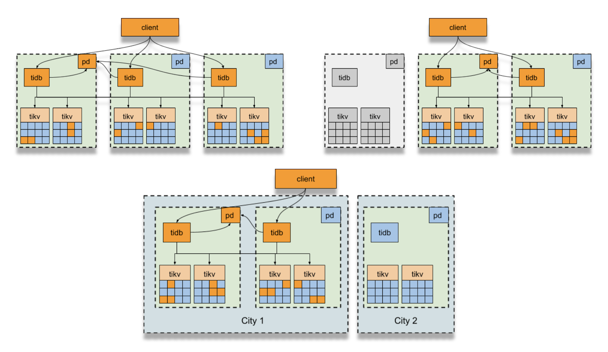
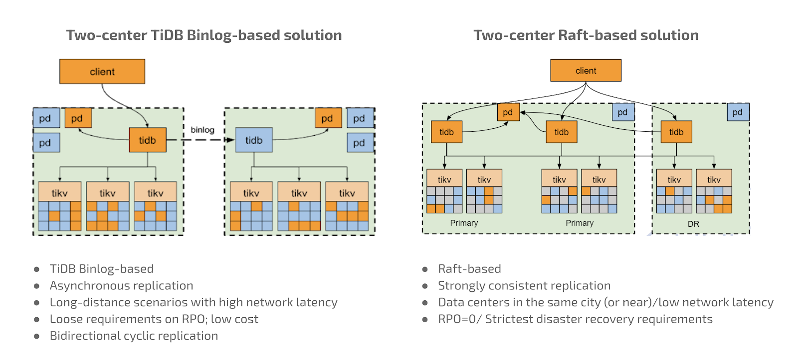
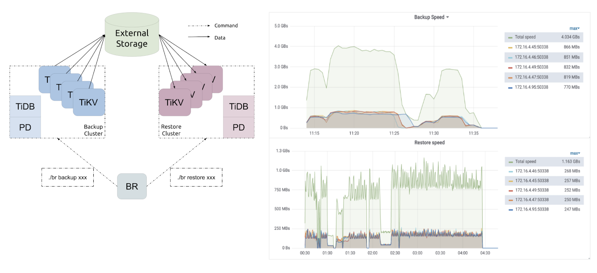

**Author:** [Jun Yu](https://github.com/hashbone) (Solution architect at PingCAP)

**Transcreator:** [Ran Huang](https://github.com/ran-huang); **Editor:** Tom Dewan

For financial companies, especially in the banking, securities, and insurance industries, a major IT concern is how to prevent or respond to failures: hardware failures, network failures—any sudden failure that may affect the business. A core component of these businesses is the back-end database. It must operate safely and ensure data security without exceptions. To achieve this level of business continuity, the database service must be highly available. However, high availability alone is not enough. We must consider the business impact caused by disasters in the server room, the data center, or even the whole city. For this reason, disaster recovery technologies and solutions for incidents came into being.

Let's take a look at how different types of databases handle high availability and disaster recovery. By understanding their limitations, we can see why [TiDB](https://docs.pingcap.com/tidb/stable), an open-source, distributed SQL database, is an excellent choice for the financial industry.

## Centralized databases: stable, but cannot scale

Traditionally, businesses have used centralized databases such as Oracle, IBM's DB2, and others. These databases have developed high availability and disaster recovery solutions, including:

* Oracle Real Application Clusters (RAC)
* IBM PowerHA System Mirror
* Veritas Cluster Server (VCS)
* Red Hat Cluster Suite (RHCS)

These technologies share a common approach: they create a primary-secondary instance, share the database files, and put them on high-end data storage. A centralized architecture is relatively stable, but it has limitations. When data processing and concurrent requests reach massive levels, the database cannot scale horizontally. Further, traditional databases are not a complete solution; they rely heavily on vendor components to achieve high availability and disaster recovery.

## Open-source databases: issues with availability and disaster recovery

Open-source databases, such as MySQL and PostgreSQL (PG), also have high-availability solutions. For example, a common use of MySQL is to establish a primary-secondary architecture through its Binlog replication. Then, outside the database, users adopt a SwitchManager-like tool such as Master High Availability Manager (MHA). PG also has solutions such as Postgres Automatic Failover (PAF), Replication Manager (repmgr), and Patroni.

However, in terms of availability and disaster recovery, MySQL and PG solutions also have issues. For example, the following solutions face significant challenges in multi-node, cross-regional scenarios:

* Asynchronous replication
* Enhanced semi-synchronous replication
* Customized MySQL and PG replication schemes

These challenges are especially true in disaster recovery scenarios. If you use the independent SwitchManager failover mechanism and your sites are more than 1,000 kilometers apart, can you ensure the reliability of disaster recovery? No one can really be sure.

Further, primary-secondary mechanisms do not fully use system resources. Also, while these mechanisms may improve availability, they may:

* Have significant performance losses
* Encounter complex conflicts in multi-write scenarios
* Be unable to scale the whole cluster

## Distributed databases: backup and disaster recovery can be difficult to adapt

Distributed databases are complex, and it's hard for them to achieve high availability and disaster recovery.

A typical Internet application has a large number of visitors and a high data volume, but its application logic is relatively simple. But banking, insurance, and securities scenarios have very complicated application logic. For these industries, the traditional high availability and disaster recovery solutions must adapt to the applications, and vice versa. For example, in the deployment of [three data centers in two cities](https://docs.pingcap.com/tidb/dev/three-data-centers-in-two-cities-deployment), adapting solutions and applications is a major headache.

*Any* system based on a traditional disaster recovery plan—even if it's a distributed system—may not be able to ensure data safety. Whether a disaster occurs at the server, rack, or data center level, a company must minimize the impact on its business. A good solution must also be efficient and, where possible, automated. When a disaster occurs, IT staff may need to intervene, but their response can be slow. Therefore, a solution should minimize any human bottlenecks.

## TiDB's financial-level backup and disaster recovery methods

We have developed and tested TiDB for several years, and our ability to backup and recover a distributed database now meets the requirements of a financial-grade production environment. TiDB backup and disaster recovery has the following components:

* Multi-Raft high availability mechanism
* Multi-center disaster recovery plan
* Two-center disaster recovery plan
* Data backup plan
* A distributed database testing system

### Raft: the core mechanism of TiDB disaster recovery

The core mechanism of TiDB disaster recovery is Raft, a consensus algorithm based on logs and state machines. Using Raft as our base, we implemented TiDB's Multi-Raft mechanism, which can reliably manage data (and replicas of data). TiDB automatically divides the data and organizes it into multiple [Regions](https://docs.pingcap.com/tidb/dev/glossary#regionpeerraft-group). TiDB then automatically stores the Regions in different storage nodes and creates Raft replicas on the nodes.

Multi-Raft can generate three (or more) data replicas on different nodes, hosts, server rooms, and data centers. You can dynamically decide how many replicas to create.

When data changes occur in TiDB, the majority of these replicas can achieve consensus. That is to say, a multi-data-center TiDB cluster with disaster recovery can minimize the impact of any host, rack, server room, or data center failure. Thanks to the Multi-Raft mechanism and TiDB's high availability scheduling mechanism, your application is minimally affected. Meanwhile, TiDB strictly guarantees that your data is safe.

We also optimized the Raft consensus algorithm itself. We enhanced Raft's cross-data-center and cross-regional operation and maintenance, and added new features such as Lazy Peer, Learner, and Joint consensus.

### The strongest multi-center, multi-active disaster recovery solution

For data centers that are far apart, we believe the best disaster recovery solution is a **three-center architecture**. In this configuration, we have two data centers in the same city, which are connected by optical fibers. Then, we connect them with another data center in a faraway city. If one data center fails, the other two immediately fail over and continue to provide normal database services.

A multi-center, multi-active disaster recovery plan

### TiDB's two-center disaster recovery solution

Considering the cost and the critical level of the business to be protected, many users will make a trade-off and choose to deploy the clusters in only two data centers. However, if the two centers are far apart—for example one is in San Francisco and the other is in Seattle— the network can have very large latency. One solution is to lease high-grade, low-latency lines, but this is very expensive. How do we address this issue in TiDB?

We offer an alternative: [TiDB Binlog](https://docs.pingcap.com/tidb/stable/tidb-binlog-overview)/[TiCDC](https://docs.pingcap.com/tidb/stable/ticdc-overview) (Change Data Capture) mode. This approach is ideal for cost-conscious users who have slightly lower service or data protection requirements. The two-center TiDB Binlog/TiCDC solution uses asynchronous replication, which can adapt to the long distance between two centers. Network latency is relatively large, sometimes greater than 30-40 milliseconds. Users who adopt this scheme have relatively loose requirements for their Recovery Point Objective (RPO). When a disaster occurs, we can minimize data loss through various internal mechanisms. This approach also is flexible and works well with a variety of network topologies, including bidirectional [cyclic replication](https://docs.pingcap.com/tidb/dev/manage-ticdc#cyclic-replication).

Some users who adopt the two-center plan need strong data consistency. Therefore, we have developed a two-center Raft-based disaster recovery solution which can achieve strong consistency. The data centers must be in the same city (or within 50-100 KM of each other) and have a relatively good network connection. This solution can guarantee an RPO of 0, which means no data loss. The following figure shows the topology of the two-center, Raft-based approach:

Two-center disaster recovery solutions

In addition to failover and switchover, we also provide a complete backup plan for the data itself. Users can select full backup, incremental backup, traditional log-based logical backup, or point-in-time recovery (PITR).

### A high-performance distributed backup mechanism in the storage layer

Last year, we launched [Backup & Restore](https://docs.pingcap.com/tidb/stable/backup-and-restore-use-cases) (BR), our high-performance distributed data backup and recovery tool, which directly implements backup and recovery from TiKV, TiDB's storage engine layer.

BR can fully use the network bandwidth, and, in a 10 Gbps network, its backup speed can range from 400MB/s to more than 1GB/s.

The figure below shows some BR test results. As you can see, the backup speed reaches as high as 4 GB/s, and recovery speed exceeds 1 GB/s. As the number of nodes increases, for a fixed amount of data, the backup and recovery performance increases almost linearly:

A high-performance distributed backup and restore solution

### Testing: the key to reliability, consistency, and security

As good as all these disaster recovery solutions are, unless they are thoroughly tested, customers won't adopt them. TiDB releases have passed extremely strict and complex distributed database tests. We designed and developed [Chaos Mesh®](https://chaos-mesh.org/), our own test platform based on Chaos Engineering, and open-sourced it. It helps users better detect the availability and robustness of distributed systems.

During TiDB's development, we ran a complete set of tests for reliability, consistency, and security, including:

* Automated fault injection
* Jepsen consistency verification
* TLA+ verification for some of the most important algorithms
* Automated application load simulation and integration tests

We believe that all software has bugs. But an advanced, complete, and powerful product testing and verification system is an important way to guarantee quality.

## Conclusion

We spent years making TiDB stronger, safer, and more reliable, and our investment has paid off. We can provide complete, reliable, financial-level distributed database services for banking, insurance, securities, and other financial customers.
