**Authors:** [Jinpeng Zhang](https://github.com/zhangjinpeng1987) ([TiKV](https://tikv.org/) maintainer), [Bokang Zhang](https://github.com/Connor1996) (TiKV committer)

In the cloud, databases are often deployed across more than one availability zone (AZ). That way, if one AZ fails, the database service can continue uninterrupted. However, cloud service providers charge more for cross-AZ traffic, so we might have to spend a fortune on clusters with heavy traffic. In extreme cases, these charges can **make up 30%~40% of the total hardware cost**.

Can we do something to lower this expense? Now we can. At [TiDB Hackathon 2020](https://pingcap.com/community/events/hackathon2020/), our team focused on reducing cross-AZ traffic for [TiDB](https://docs.pingcap.com/tidb/stable/) on the cloud. After a 24-hour Hackathon, we **reduced cross-AZ read traffic by 89%** and **write traffic by 15%**.

In this article, I'll show you our whole journey through TiDB Hackathon 2020. You will learn about:

* How cross-AZ traffic occurs
* How to optimize read traffic
* How to optimize write traffic
* Our future work
* Our team and expertise

## How cross-AZ traffic occurs

Our project aimed at reducing cross-AZ traffic for TiDB on the cloud. TiDB is a cloud-native, distributed SQL database. Normally, when we deploy TiDB on the cloud, to ensure service availability when a single AZ goes down, we need to position three replicas on three AZs. As replicas communicate and sync data with each other, cross-AZ data transfer takes place.

Because cloud providers charge extra fees for cross-AZ data transfer, a large amount of cross-AZ traffic might bring you a large bill—sometimes taking up 30%~40% of the hardware cost. To reduce that cost, we need to minimize cross-AZ traffic.

The TiDB architecture separates computing from storage. The storage layer is [TiKV](https://docs.pingcap.com/tidb/stable/tikv-overview), a distributed transactional key-value storage engine, and the computing layer is TiDB. Applications send requests to TiDB, which parses SQL statements, generates execution plans, and fetches data from TiKV.

TiDB uses the [Raft](https://en.wikipedia.org/wiki/Raft_(algorithm)) consensus algorithm to guarantee data consistency between replicas. By default, three replicas form a Raft group, in which the elected Leader provides the read and write service, and the Followers replicate data from the Leader.

Usually, TiDB transfers data across AZs for three reasons:

* Read operations. TiDB needs to read data from a TiKV node in another AZ.

    
    
 A cross-AZ read operation 

* Write operations. TiDB needs to replicate data from a TiKV node in another AZ.

    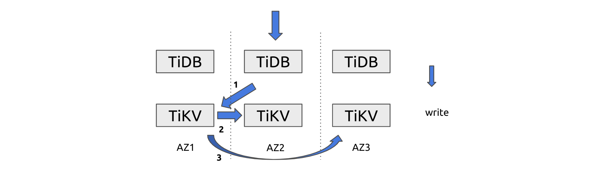
    
 A cross-AZ write operation 

* Remote Procedure Calls (RPCs). An RPC message that is not compressed may increase the traffic. But if we enable compression, there will be noticeable performance loss.

If we can address these three situations, we can reduce cross-AZ traffic.

## Optimize read operations

The read-intensive workload is a common scenario. To reduce cross-AZ read traffic, we wanted to **optimize queries that have a large result set**.

### Adaptive location-based replica range scan

Because the Leader replica provides all the read service, if a range scan operation needs to read a range of data whose Leader replica sits in another AZ, a large amount of cross-AZ traffic occurs. To reduce this type of traffic, we can actively make TiDB read data from the Follower replica in the local AZ. In addition, to make sure the Follower replica has the latest data, it sends a `ReadIndex` RPC to the Leader to obtain the latest commit index of the current Raft group.

The approach above can greatly reduce cross-AZ traffic caused by RangeScan. For RangeScan queries, an extra RPC adds very little traffic. A RangeScan request may have 100 times more traffic than PointGet, but its CPU consumption is much smaller—probably 4 times. Therefore, if we can compel the large queries to read data from a local replica, it would greatly reduce cross-AZ data transfer, while putting only small pressure on the local TiKV node.

Therefore, we developed the following strategy. **When the TiKV node in the same AZ has idle resources, TiDB sends queries with a large result set to TiKV in the local AZ as much as possible**.

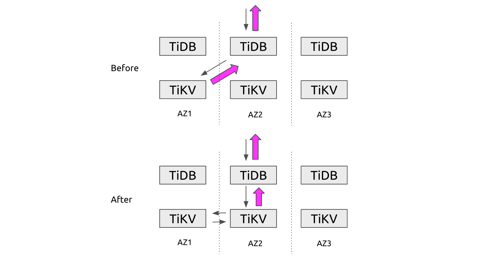

 Adaptive location-based replica range scan 

When TiDB generates the execution plan, it estimates the size of the result set based on statistics. If TiDB finds that the local TiKV instance is available, it will send the requests to the local TiKV.

Meanwhile, TiDB monitors the load of the local TiKV Coprocessor to avoid insufficient resources affecting the service quality. When the local TiKV Coprocessor has a high load, TiDB falls back the queries to the Leader replica to prevent severe hotspots.

Moreover, we considered the PD scheduling mechanism. PD should not schedule data when there's no bottleneck.

### The difference with follower read

Our plan looks similar to the current [follower read](https://docs.pingcap.com/tidb/stable/follower-read/) mechanism, which improves the throughput of the whole system by balancing the load among multiple followers, but it has some key differences:

* The current TiDB follower read doesn't solve the cross-AZ traffic issue, because when follower read is enabled, PointGet requests will also choose follower read, which may increase the consumption of PointGet requests.
* Users have to manually set the configuration, which is a burden on their maintenance team.
* Even if follower read is enabled, the read traffic is still randomly distributed among three AZs, because the traffic routing is unaware of the location.

### Test results

We accomplished the cross-AZ traffic optimization within 24 hours. As shown in the following diagram, in our test topology, a single machine simulates an AZ. A TiDB instance and a TiKV instance are deployed on each machine (AZ). Cross-machine traffic is regarded as cross-AZ traffic.

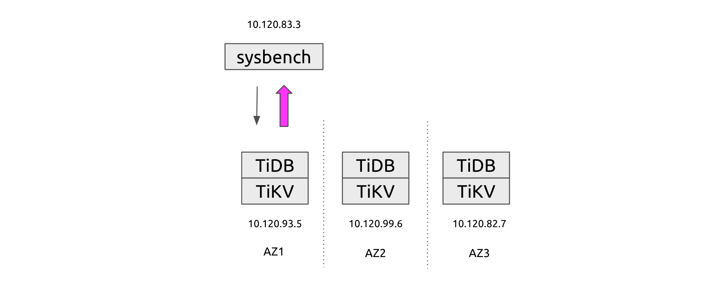

 The test cluster topology 

We constructed a scan operation to test the traffic reduction. As you can see, the cross-AZ traffic dropped significantly.

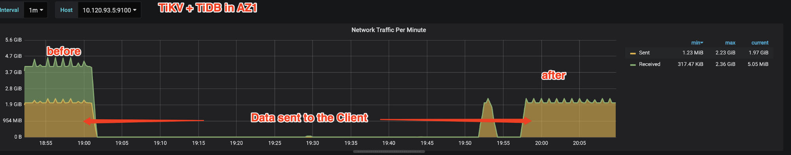

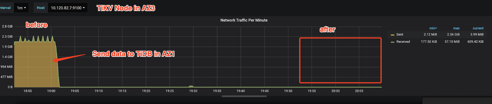

 Cross-AZ traffic reduction in a scan operation 

We also tested it with sysbench's `oltp-read-only` mode, which showed an 89% reduction in cross-AZ traffic.

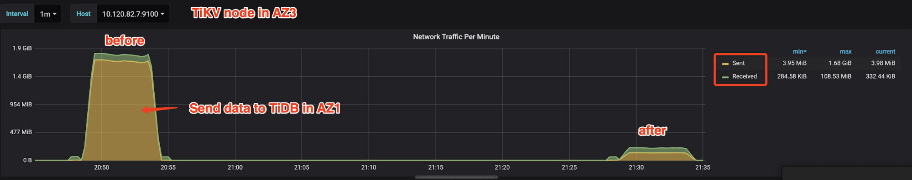

 Cross-AZ traffic reduction in sysbench's `oltp-read-only` 

So far, we haven't done much with load monitoring and PD scheduling interference. Before going into production, we have more work to do, such as applying the latency-based strategy into the monitoring.

You can check the TiDB-related code [here](https://github.com/zhangjinpeng1987/tidb/pulls?q=is%3Apr+is%3Aclosed).

## Optimize write operations

We also tried two ways to limit write traffic across different AZs: Raftlog delta encoding and intelligent locality.

### Raftlog delta encoding

In Raft logs, the data in the same range is likely to have highly similar prefixes, such as a table-id or a [timestamp oracle](https://tikv.org/deep-dive/distributed-transaction/timestamp-oracle/) (TSO). Our plan is to encode these similar data in the Raft command:

* Keys in the same Region share the same prefix, which can be deduced from the region range. In TiDB, an eight-byte table-id is also a common prefix.
* For locally sorted data, such as TSO, adjoining data have a common prefix, so we can compress the prefix. This is yet to be completed.
* The column family (CF) has a fixed name, so we can use an integer to identify it rather than a string.

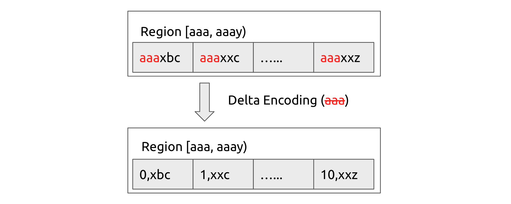

 Raftlog delta encoding 

In the sysbench batch insert testing, this optimization reduced data replication traffic across AZs by about 15%, with almost no overhead. Feel free to check out [our code](https://github.com/tikv/tikv/compare/master...Connor1996:delta-compression).

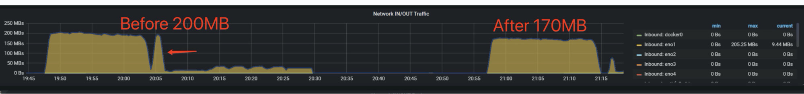

 Reduce data replication traffic by 15% 

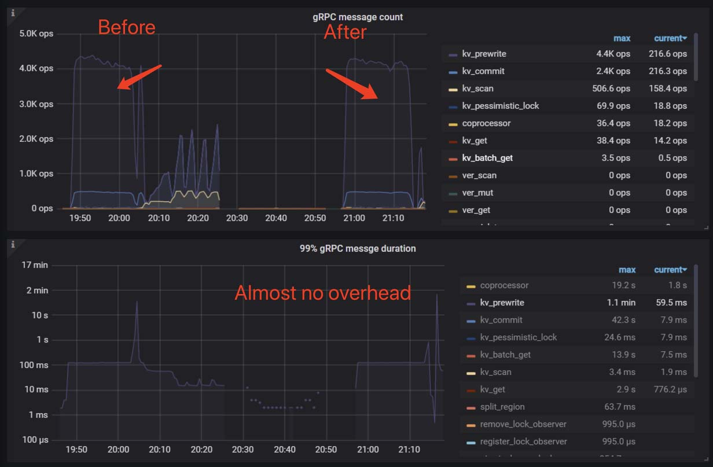

 Reduce cross-AZ traffic with almost no overhead 

### Data and location affinity

We also worked on data location affinity. Imagine a situation where app 1 mainly operates on table a, b, and c, and app 2 mainly operates on table d, e, and f. By transferring the Leaders of the related data to the corresponding AZ, we can reduce cross-AZ data transfer from three times to two.

As shown below, if the Leader is in AZ1 but the write-in data often comes from AZ2, during the write operation, cross-AZ data transfer would occur three times. But if we transfer the Leader to AZ2 based on data affinity, data transfer is reduced to twice.

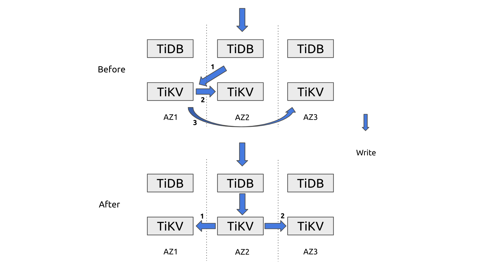

 Cross-AZ data transfer reduced from three times to two 

In our design, we add location labels to requests that are sent to TiKV. TiKV determines the affinity between the data table and the locations and reports that information to PD. According to statistics, PD transfers the related Leader to the AZ with the closest affinity.

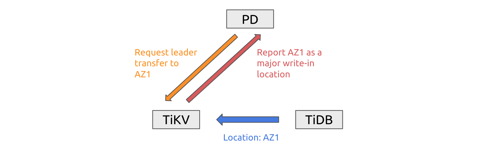

 Intelligent locality 

A bonus of this implementation is that cross-AZ PointGet requests can also turn into in-AZ requests.

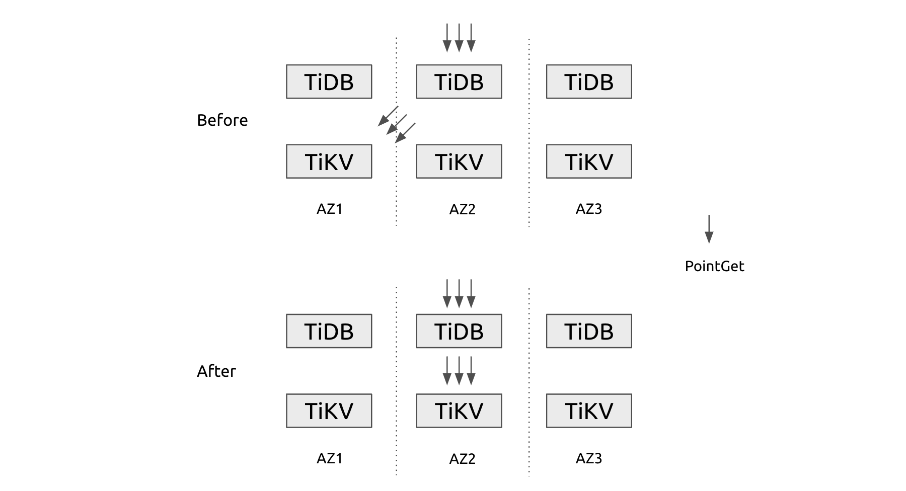

 Improved local AZ PointGet 

Our code is across all stacks: [pd](https://github.com/PatrickNicholas/pd/commits/2020-hackathon), [tikv](https://github.com/tikv/tikv/compare/master...Connor1996:delta-compression), [kvproto](https://github.com/pingcap/kvproto/pull/710), and [tidb](https://github.com/zhangjinpeng1987/tidb/pull/8).

#### Limitations

However, during our test, we found the following problems:

* When data is written to a single TiDB node, the intended Leader transfer often conflicts with other load balancing rules, such as the hot region scheduling strategy. To determine the priority of different rules, we need a global view to make the trade-off.
* When data is written to a small number of [Regions](https://docs.pingcap.com/tidb/dev/glossary#regionpeerraft-group), the optimization is not significant.
* If multiple AZs have a roughly balanced write load, our optimization might trigger an unnecessary Leader switch. We don't know if it's a bug, either.
* Data and location affinity only reduce traffic for cases where different apps write from different AZs, which is not common. Maybe it is more useful for cross-region databases.

## Future work

To sum up, our team has **reduced cross-AZ read traffic by 89% and reduced the data replication Raftlog size by 15%**, with hardly any overhead. For scenarios whose application data has typical characteristics, we expect to reduce cross-AZ data transfer by 33%.

This is our plan for future improvements:

<table>
  <tr>
   <td><strong>Feature</strong>
   </td>
   <td><strong>Future improvement</strong>
   </td>
  </tr>
  <tr>
   <td>Adaptive location-based replica range scan
   </td>
   <td>
<ul>

<li>Improve the mechanism for monitoring the local TiKV load, such as <strong>adding a latency-based strategy.</strong>

<li>Make the feature production-ready.
</li>
</ul>
   </td>
  </tr>
  <tr>
   <td>Raftlog Delta Encoding
   </td>
   <td>
<ul>

<li><strong>Apply the encoding to TSO.</strong>
</li>
</ul>
   </td>
  </tr>
  <tr>
   <td>PD scheduling
   </td>
   <td>
<ul>

<li>Take cross-AZ traffic into consideration.
</li>
</ul>
   </td>
  </tr>
</table>

## Our team and expertise

I ([Jinpeng Zhang](https://github.com/zhangjinpeng1987)) am a maintainer of [TiKV](https://tikv.org/), [a graduated CNCF project](https://www.cncf.io/announcements/2020/09/02/cloud-native-computing-foundation-announces-tikv-graduation/). Before the Hackathon began, I recruited three team members from the TiDB community:

* [Chuan Mao](https://github.com/PatrickNicholas), who works on distributed storage systems at ByteDance
* [Boyang Chen](https://github.com/abbccdda), an expert in Kafka and streaming systems at Confluent
* [Bokang Zhang](https://github.com/Connor1996), a TiKV developer at PingCAP

Due to COVID-19, we participated in this Hackathon online. Honestly speaking, the feelings and vibe at home were less exciting than the previous events. If you have an opportunity to take part in an on-site TiDB Hackathon, don't miss it!

Also, if you're interested in other TiDB events, join [the TiDB community on Slack](https://slack.tidb.io/invite?team=tidb-community&channel=everyone&ref=pingcap-blog).

_At TiDB Hackathon 2020, many excellent, interesting projects were born. We'll be telling you about them in future [blog posts](https://pingcap.com/blog/tag/Hackathon). Stay tuned._
