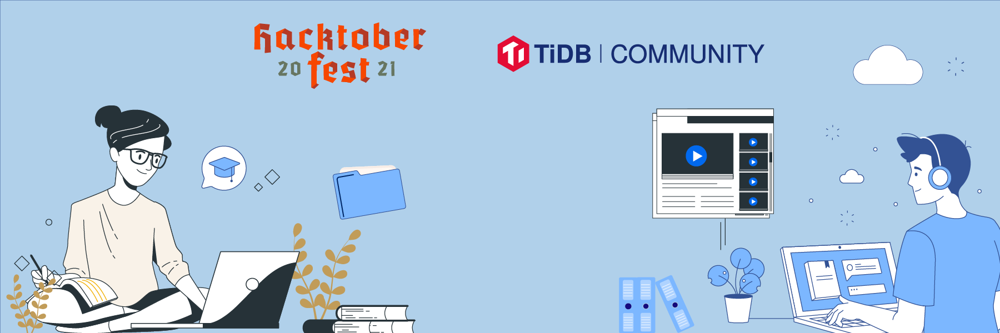

**Author:** TiDB community

**Editor:** [Mila Wu](https://github.com/milasuperstar)

Happy [Hacktoberfest](https://hacktoberfest.digitalocean.com/) 2021! We are excited to announce that [TiDB](https://github.com/pingcap/tidb) will be participating in the 8th annual Hacktoberfest hosted by DigitalOcean. During the month of October, anyone is welcome to join in on this global celebration of open-source by contributing changes, and earn one of 55,000 custom-made Hacktoberfest T-shirts! 

## What is TiDB?

[TiDB](https://pingcap.com/products/tidb) is an open-source, distributed SQL database that supports both Hybrid Transactional and Analytical Processing (HTAP) workloads. It is MySQL compatible and features horizontal scalability, strong consistency, and real-time Online Analytical Processing (OLAP).

As a dedicated and firm advocate and practitioner of open source, TiDB is proud to be back at Hacktoberfest, together with its sibling projects, [TiKV](https://github.com/tikv/tikv), a distributed key-value storage, and [Chaos Mesh](https://github.com/chaos-mesh/chaos-mesh), a cloud-native chaos engineering platform, joining more than [82,500 repositories](https://github.com/topics/hacktoberfest) from around the world.

## Why Hacktoberfest?

If you find distributed databases, cloud-native, real-time analytics fascinating, or are trying to get more involved in the open-source world, think no more. This one's for you!

Hacktoberfest is your golden opportunity to learn something new, practice your skills, contribute a change, and make new friends - whether you are trying to come up with a project for school, or looking into a potential career path. The open-source communities are packed with tools, resources, and any additional assistance you might need.

## Quick start

Here's a quick run-through of how to be part of Hacktoberfest 2021, and you can check out a detailed how to be part of Hacktoberfest on the [official website](https://hacktoberfest.digitalocean.com/resources/participation):

1. Sign up for [Hacktoberfest](https://hacktoberfest.digitalocean.com/) anytime between Oct 1 and Oct 31.
2. Join the [TiDB community](https://join.slack.com/t/tidbcommunity/shared_invite/zt-9vpzdqh2-8LsybcK0US_nqwvfAjSU5A) Slack, just in case you have any questions, or need help.
3. Start creating and submitting your PRs! Here are some top tips: 
    a. Check out the [TiDB Contribution Guide](https://github.com/pingcap/community/blob/master/contributors/README.md) before making contributions.
    b. Have a go at any [issue](https://github.com/pingcap) labeled with `Good first issue`. Note that these are the ones that we think might be good for those new to open source or TiDB, so it only serves as a starting point!

## Some notes

* To get a shirt, you must make 4 approved PRs on opted-in projects between October 1-31 in any time zone. If a repository has no "Hacktoberfest" topic set, please reach out to us or mention Hacktoberfest in your PR so we can set repository topics.
* No spams please (e.g. creating a PR just for the sake of it and not adding any value in any way)! Our maintainer will mark a PR as invalid if it's determined to be spam, which does NOT count towards your PR total.
* Note that if our maintainer reports behavior that's not in line with the [code of conduct](https://github.com/pingcap/tidb/blob/master/CODE_OF_CONDUCT.md), you will be ineligible to participate.

Good luck and hack away! 
