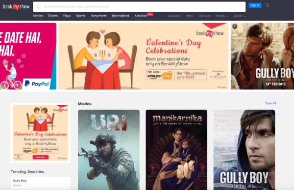

Since 2007, BookMyShow has made it easy for entertainment-seekers in India to buy tickets for movies, sporting events, plays, concerts, and more. As India's largest e-commerce site for booking entertainment tickets online, it has a total user base of [more than 50 million in over 650 cities and towns](http://www.forbesindia.com/article/leaderboard/bookmyshow-eyes-the-big-picture/49657/1), and holds a lion's share of the market in the country's online ticketing space, processing millions of transactions a week. 

 BookMyShow homepage 

## Challenge

To serve its users reliably, the company embraced microservices in recent years. But having all of those microservices meant that BookMyShow needed a seamless way for all of them to send their data over to its Big Data Platform. The company's 6-person Data Operations team was tasked with building a highly sustainable data pipeline and warehouse, as well as providing operational and maintenance support for BookMyShow's Big Data related infrastructure. 

Consistency was a priority, as the site gets regular updates for records in its transactions. The team was using [Galera](http://galeracluster.com/), but it wasn't able to meet their needs. One of the major problems they faced with Galera was its master-master architecture and replication scheme, which requires each node to have a full copy of the data. This approach makes scaling both the reads and writes capacity, and resource utilization in general, inefficient once the data size reaches multiple terabytes. Due to this difficulty, one engineer was fully dedicated to operating and monitoring Galera - a big cost for a small team of engineers.

The BookMyShow team experienced a particularly bad episode of split-brain with Galera, where the two masters were completely out sync. It took the whole team 2-3 days of dedicated effort to do recovery. The team knew then they needed a better solution.

## Evaluation and Migration

The initial list of options was TiDB, Greenplum, and Vitess. After undertaking a lot of research on the basis of papers, blogs, and case studies, the BookMyShow team decided to spend their engineering time evaluating TiDB and Greenplum, since both promised a solution to the problems the firm had encountered with Galera.

TiDB quickly emerged as the winner because it was easy to set up, deploy, and inject a lot of data into a cluster within a short time. "I was actually in charge of setting up and evaluating Greenplum and before I could figure out how to deploy it, my teammate who was responsible for evaluating TiDB was finished with deployment and already pushing a lot of data," recounted one of the members of the engineering team.

During the initial migration phase to TiDB, the BookMyShow team used Apache Spark to stream historical data into its TiDB cluster, which was fast and easy. 

    <a href="/download" onclick="trackViews('BookMyShow.com: More Uptime, 30% Less Operational Cost with TiDB', 'download-tidb-btn-middle')"><button>Download TiDB</button></a>
    <a href="https://share.hsforms.com/1e2W03wLJQQKPd1d9rCbj_Q2npzm" onclick="trackViews('BookMyShow.com: More Uptime, 30% Less Operational Cost with TiDB', 'subscribe-blog-btn-middle')"><button>Subscribe to Blog</button></a>

## Result and Advice

BookMyShow's current architecture streams transactional data in near real-time from MS SQL to TiDB using Kafka. It currently has about 5TB of data in TiDB, and expects to reach 10TB soon. 

And for good reason: With TiDB, BookMyShow has experienced increased uptime and availability, since TiDB automatically partitions and distributes data across the cluster. Meanwhile, operational and maintenance cost has been reduced by 30%. No engineer needs to be fully dedicated to database operations anymore. The only time the engineering team needs to work on TiDB is when there's a certain slow query performance and when capacity needs to be scaled out to store more data as the business grows.
 
> ***"Operational and maintenance cost has been reduced by 30%. No engineer needs to be fully dedicated to database operations anymore."***

One of the biggest advantages for BookMyShow from using TiDB has been the fact that it effectively leverages RocksDB underneath, which gives a significantly improved performance as compared to any network-partitioned SQL engine. Since TiDB implements the [Raft](https://raft.github.io/) consensus algorithm and automates data replication and distribution, we need not worry about data partitioning and replication for failure tolerance.

The BookMyShow engineering team did have a few suggestions for future TiDB users and the PingCAP team. Firstly, it initially experienced some bad performance after a custom configuration of the data partition (or Region) size in TiKV and the number of gRPC connections. (BookMyShow currently uses a larger Region size than the 96MB default.) While the issue with performance was resolved after contacting the PingCAP team for help, more information and improved documentation on the performance impact of these critical configurations would be helpful. 

Secondly, while a TiDB deployment installs a Grafana dashboard with all the system's metrics streamed from Prometheus, the BookMyShow team has had difficulty figuring out which of the many metrics is relevant to troubleshoot specific performance issues. There was simply too much information with no guidance on the dashboard. Having more descriptions of important metrics in Grafana would go a long way in helping other TiDB users monitor and troubleshoot performance issues in their clusters more easily.

Overall, integration went well at BookMyShow, thanks to the attentiveness of the PingCAP team and quick responses to issues over email and on GitHub. "The TiDB open source community is very active," said the engineer from BookMyShow. "So it helped us a lot with our adoption."

With TiDB, gone are the days of stress and worry about the state and capacity of its database infrastructure. The engineering team can now rest easy, as BookMyShow's many millions of users can continue to make plans to watch movies and shows without any hassle.
