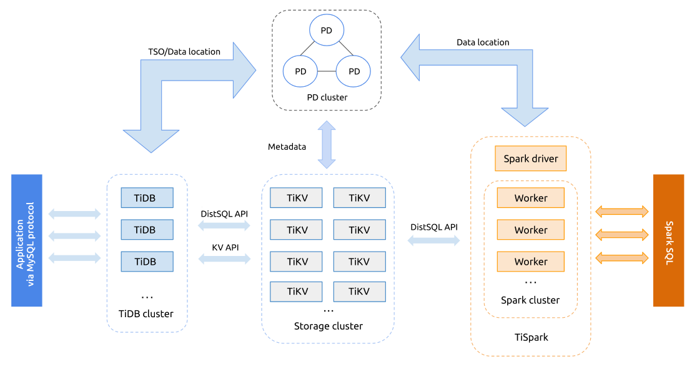
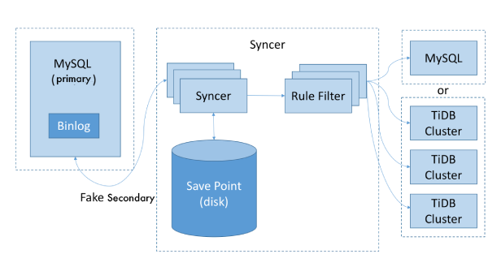

**Industry:** Media and Entertainment

**Author:** Boshuai Zhu (Senior Infrastructure Engineer at iQiyi)

[iQiyi](https://en.wikipedia.org/wiki/IQiyi), formerly Qiyi, is the Netflix of China: the country's [largest online video-on-demand platform](https://www.thewrap.com/paramount-signs-licensing-deal-with-chinas-largest-online-video-platform-iqiyi/). With "Always Fun, Always Fine" as our brand's motto, we are committed to providing users with high-resolution, authentic media content including movies, TV dramas, variety shows, documentaries, animations and travel programs. On March 29, 2018, our company IPO'ed on the NASDAQ and raised $2.25 billion.

Since our business has grown rapidly, our data size has also soared. This has placed enormous pressure on our backend system, especially the MySQL cluster. We experienced the suffocating pain of tackling immense data until we found [TiDB](http://bit.ly/tidb_repo_publication), a MySQL-compatible NewSQL hybrid transactional and analytical processing ([HTAP](https://en.wikipedia.org/wiki/Hybrid_transactional/analytical_processing_(HTAP))) database, built and supported by PingCAP. Finally, we can properly manage our data.

Currently, the TiDB cluster is deployed in the internal system of our database cloud team. With the April 2018 release of its 2.0 version, TiDB has proven to be much more mature, with increased system stability and query efficiency. In this post, we will share why we chose TiDB, how we are using it, and the lessons we learned working closely with the PingCAP team.

## Why We Chose TiDB

Before TiDB, MySQL was our main database solution for the production environment. The business developed so quickly that our data size rocketed and many bottlenecks occurred in the MySQL cluster. For example:

- A standalone MySQL instance only supported a limited data volume. Consequently, we had to delete obsolete data to keep the database running.
- The number of rows within a table increased continuously, which led to reduced query performance.

To support our fast-growing business, we were in urgent need of a database which would be:

- **Horizontally scalable**
- **Highly available**
- **Compatible with MySQL**

TiDB checked all of those boxes, and in fact, its performance has exceeded our expectations.

## What Is TiDB?

TiDB is an open source, NewSQL, scalable hybrid transactional and analytical processing ([HTAP](https://en.wikipedia.org/wiki/Hybrid_transactional/analytical_processing_(HTAP))) database built by the PingCAP team and the open source community. It aims to break down the traditional separation between an OLTP database and an OLAP database, and offer a one-stop solution that enables real-time business analysis on live transactional data.

 Figure 1: TiDB Platform Architecture 

Inside the TiDB Platform, there are several components:

- **TiDB** cluster consists of stateless TiDB instances and serves as a stateless SQL layer that processes users' SQL queries, accesses data in the storage layer, and returns corresponding results. It's MySQL compatible and sits on top of TiKV.
- [**TiKV**](https://github.com/pingcap/tikv) cluster, composed of TiKV instances, is the distributed transactional Key-Value storage layer where the data resides. Regardless of where the data comes from, it is stored in TiKV eventually. It uses the [Raft](https://raft.github.io/) consensus protocol for replication to ensure data consistency and disaster recovery.
- [**TiSpark**](https://github.com/pingcap/tispark) cluster also sits on top of TiKV. It is an Apache Spark plugin that works with the TiDB platform to support complex OLAP queries for BI analysts and data scientists.

The TiDB ecosystem also has a wealth of other enterprise-level tools, such as [Ansible scripts](https://github.com/pingcap/tidb-ansible) for quick deployment, [Syncer](https://pingcap.com/docs/tools/syncer/) for seamless migration from MySQL, Wormhole for migrating heterogeneous data, and [TiDB Binlog](https://github.com/pingcap/tidb-binlog), which is a tool to collect binlog files.

## How Are We Using TiDB?

### Scenario 1: TiDB in Risk Monitoring Center

The Risk Monitoring Center stores machine security statistics, including the traffic information from different dimensions such as per DC (data center), per IP address, per port, etc. To gain timely insights into the system status, some complex queries are performed by the application from time to time.

During the database evaluation process, we compared Apache Druid with TiDB and found:

- Druid provides SQL support via Apache Calcite adapter; TiDB supports SQL natively.
- Druid does not support ACID transactions; TiDB guarantees ACID compliance, so the data is accurate and reliable anytime, anywhere.
- Druid is actually a computing engine that depends on an additional storage engine; data cannot be updated in real time. TiDB as a whole project uses TiKV as its storage engine and provides real-time updating of data.
- Druid is not flexible in aggregate queries, which matters a great deal for data analysis of iQiyi services; TiDB performs well in aggregate queries and thus offers us a reliable foundation for analyzing data.
- TiDB is highly compatible with the MySQL protocol. Users can access TiDB via the existing MySQL connection pool component. This translates to low cost for service migration and high efficiency for development.

Therefore, we decided to deploy TiDB in our Risk Monitoring Center.

#### Deployment Process

The Risk Monitoring Center was the first iQiyi project to use TiDB online in the production environment, so we came up with the following plan:

1. To ensure the absolute data safety, we designed a plan B for the TiDB cluster: We replaced the InnoDB in MySQL with TokuDB for its write capability. Then we deployed MySQL with TokuDB as the secondary for the TiDB cluster and synchronize the data in the TiDB cluster with TiDB Binlog. Although this was not optimal because the MySQL with TokuDB solution cannot handle the data growth in the peak time, we designed this to be the disaster recovery plan regardless of the delay.
2. Deployed an internally developed load balancer on the front end to make full use of the computing capability of multiple TiDB nodes and guarantee the high availability of the TiDB nodes.
3. Deployed [Prometheus](https://en.wikipedia.org/wiki/Prometheus) and [Grafana](https://www.crunchbase.com/organization/raintank#section-overview) to monitor the TiDB cluster status. Connected Grafana to our internal alert platform to instantly inform the operations team of the alert information via short messages and emails.

#### Issues and Solutions

The following issues occurred during our adoption of TiDB, but were quickly resolved.

**Issue One:** Connection timeout.

**Cause:** This issue arose because of the failure to select the optimal query plan due to obsolete statistical information. This is a common problem for relational databases. Two common workarounds are available: to collect statistical information manually or to use hint for plan execution. Both are extra workloads for the application developers.

**Solution:** This issue is fixed in the latest version of TiDB with improved statistics-collecting strategy and auto-analyze.

**Issue Two:** Adding an index in the table took a long time.

**Causes:**

- The DDL execution information was not updated in time. As a result, we got the obsolete information when checking the DDL operation progress.
- In some cases, large Regions also took extra time to add indexes.

**Solution:** After we reported the issue to the PingCAP development team, they responded actively and quickly. This issue has been fixed in the latest version of TiDB with the addition of the Batch Split feature for large Regions.

#### TiDB in production

- After we migrated to TiDB for the Risk Monitoring Center, we successfully upgraded the TiDB cluster and modified the parameters of TiKV nodes. Generally, these operations did not affect the online services.

    During the upgrade of TiKV nodes, some errors occurred such as "Region is unavailable [try again later]" and "TiKV server timeout." This was due to the lag of cache information, which is unavoidable in a distributed system. But it does not affect the services as long as the application has a retry mechanism.

- We are amazed by the fact that no matter how much the data increases (as shown in Figure 2), the response time remains stable, thanks to the automatic Region splitting strategy of TiKV (as shown in Figure 3), the storage layer of TiDB. Tables in TiDB are split automatically to several parts of equal size (96 MB by default but configurable) based on the data size of a table. These Regions are scheduled to various storage nodes by a series of complex schedule algorithms. For a specific query, however big its data size is, TiDB quickly locates the corresponding Region, guaranteeing timely query response.

 Figure 2: Data growth in the Risk Monitoring Center 

 Figure 3: Auto partition of tables in TiKV 

### Scenario 2: Video Transcoding

The video transcoding database stores the historical data produced in transcoding, which needs to be further analyzed and processed after they are generated.

**Pain point:** Previously in the MySQL cluster, because of the limited storage capacity, we could only retain the data of the last several months. Thus we lost the chance to analyze and process the earlier data.

**Solution:** To solve this problem, we deployed a TiDB cluster at the end of 2017 and migrated the data to the TiDB cluster through full and incremental import. This strategy ensured data consistency between the previous MySQL cluster and the newly-built TiDB cluster.

During the full import, we originally used Mydumper + Loader, a data migration tool developed by PingCAP. But we found that Loader was too slow for our needs.

To fix this problem, PingCAP developed TiDB Lightning, which converted the data exported from Mydumper to SST files and imported the files to TiKV nodes. This way, data migration efficiency was improved greatly: 1T data could be migrated successfully in five or six hours. After video transcoding ran stably for a while, we switched all the traffic to the TiDB cluster and expanded our services. So far, it has run smoothly.

The following picture shows the TiDB Lightning architecture:

 Figure 4: TiDB Lightning implementation architecture 

    <a href="/download" onclick="trackViews('Always Fun, Always On: How TiDB Helps iQiyi Deliver Streaming Videos', 'download-tidb-btn-middle')"><button>Download TiDB</button></a>
    <a href="https://share.hsforms.com/1e2W03wLJQQKPd1d9rCbj_Q2npzm" onclick="trackViews('Always Fun, Always On: How TiDB Helps iQiyi Deliver Streaming Videos', 'subscribe-blog-btn-middle')"><button>Subscribe to Blog</button></a>

### Scenario 3: User Login Information

In the user login information database project, we were confronted with some thorny problems—and all of them have been resolved with TiDB.

- The data volume of this project was steadily increasing; as a result, the MySQL primary-secondary cluster would not be able to hold such massive data in the future.
- As the data size of a single table was tremendous, we had to use sharding in the services, and thus the code of the application layer became complex and could not scale.

After data was migrated to TiDB, we did not need sharding anymore, and the application codes have been simplified.

#### The migration process

In the incremental synchronization process, we used Syncer, which aggregated data from multiple sources and various tables in a single table using wildcards. It has vastly simplified the incremental synchronization work.

The [Syncer](https://pingcap.com/docs/tools/syncer/) architecture is as follows:

 Figure 5: Syncer architecture 

However, Syncer currently cannot display real-time delay information in Grafana. This is a drawback for the applications that are sensitive to synchronization delay. The good news is that PingCAP is working on this issue, and they have refactored Syncer to automatically deal with the primary key conflict of table partition. With Syncer and TiDB, users can quickly synchronize data from multiple MySQL clusters in real time.

We have two requirements for high availability of the database:

- The service is still available even if the server goes down.
- The service is deployed across multiple data centers, and there is a read-only secondary database of our data center, with shortened response time.

For these requirements, TiDB has the corresponding solutions:

- The TiDB cluster is deployed in multiple data centers (as shown in the diagram below), guaranteeing that the online services will not be affected when any data center does not run normally.
- After each TiKV node is set with a label, the TiDB cluster gets a replica in each data center. The PD cluster will automatically schedule Regions and locate a proper replica for the Read operation; thus, the second requirement is satisfied.

To ensure high availability during the data migration process, we used Drainer to synchronize the data in the TiDB cluster with the MySQL cluster. Drainer supports reverse synchronization by specifying the starting timestamp.

 Figure 6: Deploying TiDB in multiple data centers 

Throughout the process, the PingCAP team offered us timely and expert-level help. They helped us locate the issue and gave us constructive suggestions. We really appreciate their patience and dedicated support!

## Lessons Learned

The most attractive features of TiDB are horizontal scalability and high availability.

The data that a standalone database can hold is limited. If the policy of MySQL sharding + proxy is applied, the maintenance cost will go up whether the proxy is on the client or the server.

What's worse, the query efficiency fails to meet the performance demands in many scenarios. In addition, the proxy does not support transactions well and cannot guarantee data consistency.

TiDB is a perfect alternative for MySQL sharding + proxy solutions. With highly available service and data and horizontal scalability, TiDB effectively solves many problems triggered by a huge surge in the amount of data. The more data there is, the more TiDB outperforms MySQL.

## Conclusion

As our business grew exponentially, we were overwhelmed trying to handle the mounting data. After a careful and rigorous evaluation of TiDB, we found it to be a powerful database that's growing in mindshare. We have now deployed TiDB in our production environment. Thanks to the horizontal scalability and high availability of TiDB, we no longer worry about data volume and can bring high-quality entertainment services to our users with more confidence than before.

In addition to its use in the applications mentioned above, TiDB is also being evaluated or tested in other applications at iQiyi. In some use cases, TiDB needs to handle a mixed scenario of OLTP and OLAP, and that is a good opportunity to put TiSpark to work. One area of development we're interested in is getting TiDB Binlog, TiDB's data synchronizing tool, to synchronize with [Kudu](https://en.wikipedia.org/wiki/Kudu) and [HBase](https://en.wikipedia.org/wiki/Apache_HBase) in addition to MySQL. To that end, we plan to invest more in TiDB and send some pull requests to [the TiDB community](https://github.com/pingcap/tidb). We believe that with its powerful technology and the professional and highly-motivated team behind it, TiDB will be embraced by companies in more and more industries in the future.
