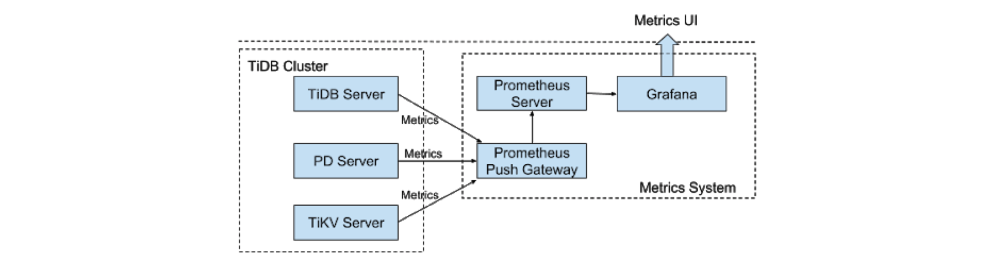
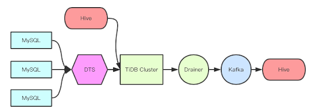
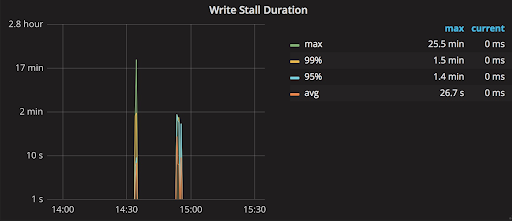

**Industry:** Search and Ecommerce Platform

**Authors:** Yinggang Zhao (Researcher at Meituan-Dianping), Kun Li (Database expert at Meituan-Dianping) and Changjun Piao (Database expert at Meituan-Dianping)

## Introduction

In Chinese, [Meituan-Dianping](https://en.wikipedia.org/wiki/Meituan-Dianping) means “better buying, better life,” and since it was formed in 2015 by the [merger of two companies](https://www.forbes.com/sites/ywang/2015/10/08/chinas-meituan-dianping-merges-to-create-a-mega-online-to-offline-service-platform/#4353d0323e28), the platform has facilitated billions of purchases of goods and services with built-in discounts. By gross merchandise volume, Meituan-Dianping is [China’s largest group-buying website](https://www.crunchbase.com/organization/meituan-com#section-overview). Part Groupon, part Yelp, and part Uber Eats, we offer a range of localized services and entertainment, such as food delivery, restaurant reviews, haircuts and manicures, ticket bookings, bike-sharing, and more. [In April 2018, we had 290 million monthly active users, and last year we generated more than 5.8 billion transactions with over $51 billion in gross transaction volume.](https://www.home.saxo/insights/content-hub/articles/2018/09/07/a-closer-look-at-meituan-dianping) On September 20, 2018, our company [debuted on the Hong Kong stock exchange at an IPO price of HK$69 per share](https://money.cnn.com/2018/09/20/technology/meituan-dianping-ipo/index.html). 

As our business has grown rapidly, our data volume has also surged. This has placed tremendous pressure on the MySQL database system in our backend. Burdened by handling this immense data, we began to explore a better data storage solution. Fortunately, we found [TiDB](https://en.wikipedia.org/wiki/TiDB), a MySQL-compatible NewSQL hybrid transactional and analytical processing ([HTAP](https://en.wikipedia.org/wiki/Hybrid_transactional/analytical_processing_(HTAP))) database, built and supported by PingCAP. Now we can harness our data with more confidence than ever before and provide better services for our users to enjoy a better life.

At the beginning of 2018, our [DBA](https://en.wikipedia.org/wiki/Database_administrator) (database administrator) team worked together with the architecture storage team to choose and implement a distributed database solution. Since November 2018, 10 TiDB clusters have been deployed in our production environment, with nearly 200 physical nodes. These clusters are deployed for six product divisions or platforms: delivery, transport, quick pass, accommodation, the Meituan platform, and the core development platform. Most of these applications are pure [OLTP](https://en.wikipedia.org/wiki/Online_transaction_processing) (online transaction processing) workloads. We are happy to report that all the clusters have been running smoothly since their deployment.

In this post, we will share two of the scenarios for which we chose TiDB, how we are using it, some issues we’ve had and the corresponding solutions, as well as our experiences collaborating with PingCAP.

## Challenges

### Scenario 1: Offline Analytical Workload with Huge Writes and High Read QPS

The scenario at Meituan-Dianping with the largest data size for analysis has up to 500GB writes every day. This scenario features:

- Stable write, with each transaction operating on 100 to 200 rows, and 60,000 writes per second.
- The daily write data of 300GB to 500GB, which will gradually increase to 3TB in the future.
- Regular read job with 5,000 QPS every 15 minutes (high frequency but a small amount of data).
- Irregular query (low frequency but a large amount of data).

Previously, we used MySQL for data storage, but we hit capacity and performance bottlenecks—and we expect the data volume of our service to increase ten times in the future. We tested [ClickHouse](https://en.wikipedia.org/wiki/ClickHouse) but found that it failed to cope well with high-frequency SQL queries in high concurrency situations, although it satisfied our demands for storage capacity and running low-frequency SQL statements. Besides, we thought that it was kind of an overkill to use ClickHouse only for full low-frequency SQL queries.

### Scenario 2: OLTP Workload Sensitive to Response Time

In addition to offline services with massive data to analyze and query, we have lots of sharded services. Although there are multiple sharding policies used in the industry to overcome the bottlenecks of standalone machine performance and storage, these policies do have some drawbacks:

- No application-friendly distributed transactions.
- For queries across databases, the results of the queries are aggregated on the middleware, which is troublesome.
- If a single database is short of storage space, it needs to split again.
- The applications should consider the rules of data distribution, and although the middleware is applied, the problem cannot really be solved.

Many of the applications and services in our environment were sharded, and some of them would soon exceed the storage capacity of a standalone machine or were in need of a new sharding policy. All of these services embodied the following characteristics:

- There weren’t too many SQL queries, but the execution of SQL queries was frequent.
- They called for strong consistency of data.
- Generally, some data had a time property.

## Exploration

To overcome these challenges and lay the foundation for the future of our infrastructure, we started to explore a database solution with the following requirements:

- Compatibility with our existing software stack and ecosystem to minimize the migration cost and efforts. 

    - At Meituan-Dianping, MySQL was our primary database solution supporting most of our business scenarios. So compatibility with the MySQL protocol with secondary index support was a must-have feature. The solution also had to be able to deliver performant OLTP services with high concurrency.
    - There are many product lines in Meituan-Dianping. The services have a huge volume and demand high-quality service from the storage system. We needed minimal transformation of current software stacks, such as service access, monitoring and alert system, and automated operations platform.

- Online scalability. Data sharding, merging, and migration need to be automatic and transparent to the online business. The solution should support shard splitting and automatic migration for data sharding, and the services should not be interrupted during data migration.

- Distributed transactions with strong consistency. A transaction can be executed across shards and nodes and must be strongly consistent.

- Service availability across data centers. Services can be automatically switched over when any data center is down.

- Cross-data center write into one table across data centers. Although it’s a thorny problem, supporting writing one table across data centers is an important requirement to support our current and next-phase business plan.

Before diving deep into all kinds of database solutions, we did our homework, unraveling the details of suitable data storage structure and transaction algorithm through different papers, especially the following ones from Google:

- [Spanner: Google’s Globally-Distributed Database](https://www.usenix.org/system/files/conference/osdi12/osdi12-final-16.pdf)
- [Large-scale Incremental Processing Using Distributed Transactions and Notifications](https://static.googleusercontent.com/media/research.google.com/en//pubs/archive/36726.pdf)
- [In Search of an Understandable Consensus Algorithm](https://web.stanford.edu/~ouster/cgi-bin/papers/raft-atc14)
- [Online, Asynchronous Schema Change in F1](https://static.googleusercontent.com/media/research.google.com/en//pubs/archive/41376.pdf)

Naturally, TiDB, an open source, NewSQL, scalable hybrid transactional and analytical processing ([HTAP](https://en.wikipedia.org/wiki/Hybrid_transactional/analytical_processing_(HTAP))) database built by the PingCAP team and the open source community, caught our eye. It eventually became our database of choice because of its compatibility with MySQL, cutting-edge technical architecture and foresight, and vibrant community. In the nearly three years between the release of TiDB Alpha and the end of July 2018, at least 200 users had deployed TiDB in their production environments. Many of these users are the leading enterprises in their respective industries. 

More specifically, compared with traditional solutions in the industry, TiDB is a perfect match for all the above requirements in that it is:

- Compatible with the MySQL protocol;
- Flexible in online scaling in and scaling out;
- Supports ACID transactions with strong consistency;
- Supports deployment and fault-tolerance across data centers and multi-node write;
- Handles services on TiDB just like on a standalone MySQL.

Thus we began to test TiDB for these features.

### Evaluation

To evaluate if TiDB’s performance and features can meet our requirements, regular functional and performance tests were carried out and compared to those of MySQL. One special test worth mentioning was to validate if each data center has 1 of the 3 replicas so that the crash of one data center will not lead to data loss in the majority of the replicas. We conducted this test against the following standards:

- The horizontal scaling using Raft supports the Learner node so that even if one data center is down, two-thirds of the data replicas are still available.
- The priority tags of TiKV must be reliable to ensure data replicas are distributed evenly among data centers even when the number of machines in each data center is not equal.
- If a data center goes down while the TiDB cluster is highly concurrent, the QPS, the response time, and the number of error reports are not normal and the data is not lost.
- After a Region is manually scheduled to another data center for data balancing, it can move back to the original data center automatically when the original data center is recovered.

All the test results showed that TiDB totally lived up to our expectations. 

### Adoption

Meituan-Dianping is always cautious about adopting new solutions, and TiDB was no exception. The implementation of TiDB went through the following stages of migration: offline analytical scenarios, non-critical workloads, and then mission-critical workloads.

There are many product lines in Meituan-Dianping. The services all have huge volumes and demand high-quality performance from the storage system. Therefore, it is important to plan for a good storage system, including the following aspects: monitoring and alert, and service deployment and data synchronization between upstream and downstream.

### Integration with the current ecosystem:

#### Monitoring and Alert

Meituan-Dianping currently uses the Mt-Falcon platform (a customized distributed monitoring system inspired by [Open-Falcon](https://github.com/open-falcon)) for monitoring and alert. Various plugins have been configured in Mt-Falcon to customize monitoring multiple components, and with [Puppet](https://en.wikipedia.org/wiki/Puppet_(software)) deployed, the privileges of different users and the issue of different files can be recognized. This way, machine installation and privilege control will be established as long as we complete the plugin scripts and the necessary files.

 Monitoring Architecture 

#### Monitoring Architecture

TiDB uses [Prometheus](https://github.com/prometheus/prometheus) plus [Grafana](https://github.com/grafana/grafana) as the monitoring system as shown in the above diagram, with a cluster of more than 700 metrics. As the monitoring architecture below shows, each component pushes its metrics to Pushgateway, and Prometheus obtains metrics from Pushgateway.

 TiDB Monitoring Architecture 

With a set of Prometheus instances deployed in a TiDB cluster, it was inconvenient to gather, analyze, and configure the monitoring metrics in the original TiDB monitoring architecture. Therefore, we decided to converge the monitoring components. As the alert system had been working well on Mt-Falcon, it was unnecessary to build a new one on AlertManager.

To integrate monitoring and alert on Mt-Falcon, we evaluated three policies: 

- **Policy #1:** Modifying the source code and pushing metrics directly to Mt-Falcon.

    **Evaluation:** Since metrics are scattered throughout the TiDB code, which is iterated quickly, it is time-consuming to frequently adjust the monitoring tracking code.

- **Policy #2:** Aggregating the metrics on Pushgateway that can be gathered directly.

    **Evaluation:** Pushgateway is a single entry point, so its data maintenance is troublesome.

- **Policy #3:** Fetching the data via the local API of each component (TiDB, PD and TiKV).

    **Evaluation:** The crash of one component does not affect other components, and it is easy to implement this policy.

We adopted Policy #3. There is one challenge to this: We need to convert the metric type used in Prometheus to a type that Mt-Falcon can identify. Prometheus supports Counter, Gauge, Histogram, and Summary types of metrics, while Mt-Falcon only supports Counter and Gauge types. The computing expressions of Mt-Falcon are few, so we need to convert the metric types and compute the data in the monitoring script.

#### Batch Deployment

During the batch deployment of TiDB using Ansible, we faced a problem: the quickly updated TiDB version brings about frequently updated Ansible, and we only add new code to Ansible instead of modifying the existing code. Consequently, we need to deploy and maintain TiDB clusters of multiple versions online simultaneously. If each cluster has one Ansible directory, it will be a waste of storage space. 

To solve this problem, we create an Ansible directory for each cluster version in the center monitoring machine, and each version is maintained using a specific inventory file. 

#### Heterogeneous Data Synchronization Between Upstream and Downstream

At present, MySQL is used with [Hive](https://en.wikipedia.org/wiki/Apache_Hive), and to replace MySQL with TiDB, we need to address two issues:

- Data migration from MySQL to TiDB.

    - This involves data migration and real-time synchronization of incremental data (DTS). 
        
        [Mydumper](https://github.com/maxbube/mydumper) + [Loader](https://pingcap.com/docs/dev/reference/tools/loader/) is used to export the data in MySQL and then import the data to TiDB; TiDB DM can be used to synchronize the incremental data from MySQL to TiDB. 

    - MySQL uses a large number of auto-increment IDs as the primary key. When the data of sharded MySQL is aggregated to TiDB, the conflict of auto-increment IDs should be resolved. 

        This issue can be fixed by removing the auto-increment IDs and building the unique primary key on TiDB. The new TiDB DM version also has the feature of automatically handling the primary key during the process of merging sharded tables.

- Data migration from Hive to TiDB and from TiDB to Hive.

    - It is easy to migrate data from Hive to TiDB, since TiDB is highly compatible with MySQL. The Insert statement needs no modification; we just need to adjust it slightly.
    
    - For data migration from TiDB to Hive, using [TiDB Binlog](https://github.com/pingcap/tidb-binlog) (Pump + Drainer), an enterprise tool developed by PingCAP, is a good solution. Drainer can export data to Kafka, MySQL, and TiDB. We are currently considering the schema of using Drainer to output data to Kafka in order to synchronize data from TiDB to Hive, as shown in the diagram below. 

        
        
 Synchronization Data from TiDB to Hive 

    <a href="/download" onclick="trackViews('TiDB, the Key to a Better Life for Meituan-Dianping’s 290 Million Monthly Users', 'download-tidb-btn-middle')"><button>Download TiDB</button></a>
    <a href="https://share.hsforms.com/1e2W03wLJQQKPd1d9rCbj_Q2npzm" onclick="trackViews('TiDB, the Key to a Better Life for Meituan-Dianping’s 290 Million Monthly Users', 'subscribe-blog-btn-middle')"><button>Subscribe to Blog</button></a>

### Issues and Solutions

After the service went online, some issues occurred. Here are some typical ones: 

#### Issue #1: Write Stall in TiKV

In the TiKV bottom layer, two [RocksDB](https://en.wikipedia.org/wiki/RocksDB) instances are used as the storage engines. The new data is written into L0 (Level 0), and when the data in L0 reaches a specific size, the Write operation slows down and even stalls for self-protection.

The default configuration in TiKV:

- level0-slowdown-writes-trigger = 20
- level0-stop-writes-trigger = 36

We once ran into the Write stall problem, and found that the causes for too many files in L0 might be:

- The data size of the Write operation was too large and thus the Compact operation could not be completed.
- TiKV created snapshots more slowly than the requests for creating snapshots were sent. Because of this, the accumulated replicas of creating Regions were released suddenly, and a good many L0 files were created in rocksdb-raft. 

 

 Write Stall Monitoring 

We resolved the Write stall issue using the following measures:

- Reduce the frequency of Raft Log Compact (increase the values of raft-log-gc-size-limit and raft-log-gc-count-limit).
- Speed up the Snapshot operation (the overall performance, including the hardware performance).
- Set max-sub-compactions to 3.
- Set max-background-jobs to 12.
- Set the three Triggers of L0 to 16, 32, and 64, respectively.

#### Issue #2: Too Much Deleted Data Overwhelms GC 

Currently, TiDB’s [GC](https://en.wikipedia.org/wiki/Garbage_collection_(computer_science)) (Garbage Collection) performs operations on each kv-instance in the single-thread framework. When too much data is deleted by a transaction, GC slows down and takes even more time than the Write operation.

For the time being, this problem can be solved by adding more TiKV instances. In the long run, GC needs to be able to work in a multi-threaded way. PingCAP has implemented this feature in  TiDB 2.1.

#### Issue #3: Response Time of the Insert Statement Gets Longer

At the beginning, the response time of the Insert statement for H80 was about 20ms. As the service continued to run, the response time gradually increased to more than 200ms. We troubleshot this problem and found its cause: as the number of Regions rises quickly, Raftstore has more work to do. Because Raftstore is single-threaded, and each Region sent a heartbeat regularly, the performance deteriorated. 

The solutions for this issue are as follows:

- Temporary solution
    
    Extend the heartbeat interval from 1s to 2s. This policy has had positive results, as shown in the picture below:

     
    
 Response Time Before and After Optimization of the Insert Statement 

- Permanent solution

    - Reduce the number of Regions and merge empty Regions. TiDB 2.1 has implemented the Region Merge feature.
    - Change Raftstore to be multithreaded. PingCAP engineers are working on it, and this feature will be released in the next version of TiDB.

## Result

In the more than half a year that we have deployed TiDB in the production environment, our confidence in TiDB and PingCAP has grown, and we truly believe that TiDB is a database with great promise.

What’s more, the PingCAP engineers and support team are very professional, dedicated, and highly motivated! They respond to our issues quickly and efficiently. 

## What’s Next

We plan to deploy TiDB in more and more application systems and grow together with TiDB. At present, three DBAs from Meituan-Dianping and several storage experts are fully committed to collaborating with PingCAP on the underlying storage, computing mechanism in the middle layer, access to the service layer, data model selection of the storage plans, and so on.
In the long term, we will build a mightier ecosystem together with PingCAP. Here are some of our initiatives:

- **TitanDB**

    TitanDB is the next big plan for TiDB: a next-generation storage engine. Since it saves the storage space a Value occupies, it can resolve the size limit problem for a single row and raise the upper limit for the storage capacity of a standalone TiKV. With TitanDB, a large-scale TiDB deployment will become more cost effective.

- **TiDB Cloud (based on Docker & Kubernetes)**

    Adapting to the trend of cloud computing, PingCAP open sourced [TiDB Operator](https://github.com/pingcap/tidb-operator) to the community in August 2018. TiDB Cloud offers not only highly automated operations for databases, but also database multi-tenancy based on hardware isolation using Docker. 

- **TiDB HTAP Platform**

    Based on the original computing engine of TiDB Server, PingCAP engineers have built [TiSpark](https://github.com/pingcap/tispark), a thin layer for running Apache Spark on top of TiDB/TiKV to answer complex OLAP queries. This addition makes the TiDB platform a complete [HTAP](https://en.wikipedia.org/wiki/Hybrid_transactional/analytical_processing_(HTAP)) database. This architecture has drastically decreased the data replicas of core services in the company’s data cycle, which saves costs and improves the cost-effectiveness of OLAP applications. We plan to migrate some analytical query systems with real-time or near real-time requirements to TiDB.

    
    
 TiDB Platform Architecture 

- **Follow-on physical backup policy and multi-write across data centers**

    We will adopt TiDB in more application scenarios like physical backup and multiwrite across data centers. 

We look forward to a new era of HTAP database led by TiDB and PingCAP！
