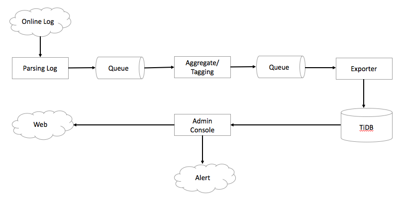
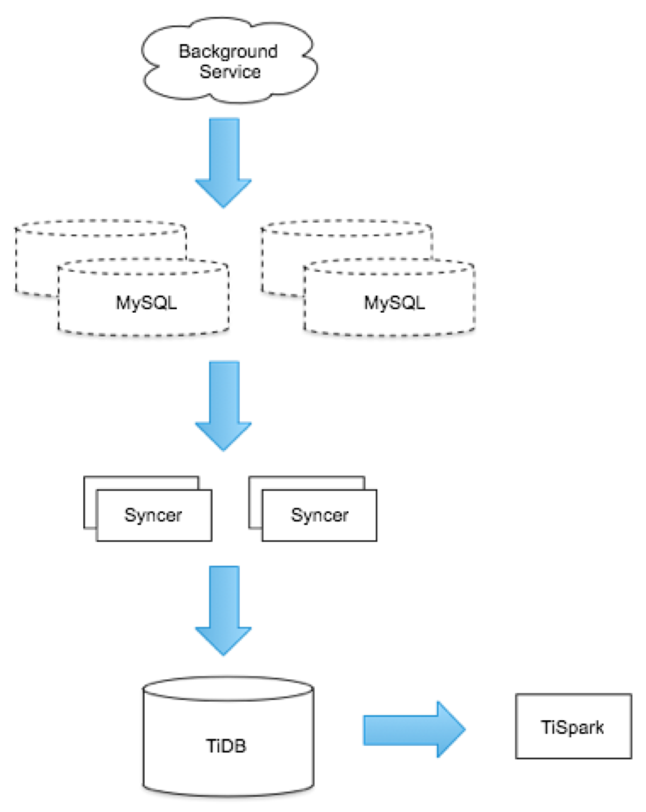

**Industry:** Ridesharing 
                 
**Data Growth Rate:** ~30TB per day

**Authors:** Chengjie Ding and Ming Hu (Infrastructure Platform Engineers at Mobike)

[Mobike](https://www.crunchbase.com/organization/mobike) is the world’s first and largest dockless bike-sharing provider, serving over 200 million users in 200 cities across the world, operating over 9 million smart bikes. It’s an affordable and convenient way of transportation for short urban trips, with a patented bike design with a smart lock system and a mobile app. We handle more than 30 million rides for our users every single day.

The system behind the Mobike app collects over 30 TB of data daily from bikes equipped with GPS and IoT connected devices. The unprecedented growth in data volume and concurrency pose immense challenges on our backend system, especially our database. Thanks to [TiDB](http://bit.ly/tidb_repo_publication), a distributed hybrid transactional and analytical processing ([HTAP](https://en.wikipedia.org/wiki/Hybrid_transactional/analytical_processing_(HTAP))) database built by the [PingCAP](https://pingcap.com) team, not only are we equipped with a solution that can elastically scale out horizontally, but we are also empowered to obtain insights from "fresh" data to support real-time decision-making. The vibrant TiDB open-source community also allows us to deploy and operate around the world without vendor lock-in. Now, we can easily support the rapid growth in our business and data without worrying about infrastructure.

We have been using TiDB in our production environment since early 2017. Now we have deployed TiDB in multiple clusters with close to 100 nodes, handling dozens of TBs of data for different application scenarios. This post will provide a deep dive on why we chose TiDB over MySQL and its sharding solutions by illustrating how TiDB solves our pain points.

## Why TiDB?

Before we chose TiDB, we carefully evaluated MySQL and its sharding solutions. As a fast-growing startup looking to scale quickly, we found MySQL sharding solutions undesirable for the following reasons:

- Standalone MySQL required us to archive data frequently. When the data size outgrew the capacity of a standalone MySQL, we had to shard the database and tables using middleware solutions, which was difficult to manage; 
- Based on our previous experience with sharding, huge volumes of data often lead to a hung database, because it required frequent table structure updates to perform Data Definition Language (DDL) operations. This situation would negatively affect our application’s usability and even cause data inconsistency. In addition, we want the application logic to be upgraded more conveniently, despite of the service volume outburst and the changing service requirement, which cannot be done with sharding;
- If we went with the sharding solution, when it’s time to shard the database, we had to stop the on-going business, refactored the application code, and then migrated the data. What made things worse, we must carefully and manually specify the sharding key because it controls how the data should be distributed across the shards and changing an existing sharding key could cause serious problems. Not to mention that sharding does not support cross-shard distributed transactions, or no guarantee of the strong consistency of transactions.

A new solution must be found to meet the following requirements:

- Online DDL: New services keep emerging, which brings constant DDL changes. We need to be able to add new columns and indices without database downtime.
- Elastic scalability: We need to cope with the rapid data growth and the temporary traffic surge brought by on-demand marketing campaigns by increasing the capacity at the peak time and decrease it when the campaigns are over.
- Support frequent correlated query and temporary query demands from the operational teams.

Thankfully, TiDB more than fits the bill. 

## **Brief Overview of TiDB**

TiDB has the following core features:

- Compatibility with the MySQL protocol;
- Horizontal scalability;
- Distributed ACID transactions across multiple data centers;
- Strong consistency guarantees;
- Automatic failover and high availability.

Inside the TiDB project, there are several components:

1. TiDB cluster consists of **stateless TiDB instances** and serves as a stateless SQL layer that processes users’ SQL queries, accesses data in the storage layer, and returns corresponding results.

2. [TiKV](https://github.com/pingcap/tikv) cluster, composed of **TiKV instances**, is the distributed transactional Key-Value storage where the data resides. Regardless of whether the data comes, it is stored in TiKV eventually. It uses the [Raft](https://raft.github.io/) protocol for replication to ensure data consistency and disaster recovery.

3. [**TiSpark**](https://github.com/pingcap/tispark) sits right on top of TiKV to support both our data scientists for real-time analysis or for offline daily analysis in the existing Hadoop system.

The TiDB ecosystem also has a wealth of other enterprise-level tools, such as the [Ansible scripts](https://github.com/pingcap/tidb-ansible) for quick deployment, Syncer for seamless migration from MySQL, Wormhole for migrating heterogeneous data, and TiDB Binlog, which is a tool to collect binlog files.

## Four In-Production Applications

### **Case 1: Success rate of locking and unlocking**

The success rate of locking and unlocking a smart bike is one of the key metrics for Mobike, because failure to lock/unlock will cause bad user experience and even user attrition. To deliver a smooth experience, we need constant insights on the lock/unlock success rate based on regions, application versions, terminals, users, and bikes to locate the bikes with issues. Each time users lock or unlock bikes, usually during rush hours, massive log information of the bike is being generated. This data volume is estimated to be tens of billions of rows per year.

We deploy TiDB to directly help support the system behind the success rate of locking and unlocking, which fulfills all the above requirements. See the following diagram for how TiDB is integrated in our system:

With TiDB, alert is sent to the administrators when the system detects a success rate drop of locking and unlocking within minutes. We can quickly find a single failed ride and the associated user and bike from the database, which allow us to locate the faulty bike quickly.

### **Case 2: Real-Time Data Analysis**

As our data volume continues to grow exponentially, we need accessible and accurate real-time data analysis to keep our competitive edge vis-a-vis other bikesharing platforms. Before we implemented TiDB, we had several dozens MySQL clusters, some of which are sharded databases, while others are standalone instances. But MySQL was not designed for processing complicated queries against massive datasets, which made real-time data analysis all the more challenging.

To meet this challenge, our initial plan was to synchronize data to Hive. We came up with two methods, but each had significant drawbacks: 

1. Full volume synchronization on a daily basis. This method would result in high pressure for the online databases and consume huge amounts of Hive resource as time goes on.

2. Incremental synchronization on a daily basis. This approach was complex, given that the daily differences should be merged with the preceding day’s data, because HDFS does not support an `update` operation. The advantage of this method was that if the data size is large, incremental synchronization is faster and saves more space than full synchronization. The disadvantage is that incremental synchronization occupies a lot of Hadoop’s computing resources, which affects the system’s stability.

Instead with TiDB, real-time data synchronization can be performed from multiple MySQL instances with tools designed specifically for the MySQL ecosystem. Syncer, which we mentioned before, enabled us to synchronize our TiDB cluster with various MySQL instances and the sharded MySQL clusters. TiDB supports the `update` operation, so it does not have the same issues Hive has. With TiSpark in the mix, which is a thin layer built for running Apache Spark on top of TiDB/TiKV, we can leverage Spark to quickly run complex OLAP queries immediately after data is imported to TiDB.

The following diagram depicts our implementation of a real-time data analysis system with TiDB and TiSpark. Powered by this system, we can easily perform all kinds of analytical tasks any time we want, which would be impossible to do with Hadoop.

Currently, our TiDB cluster holds several dozen nodes with multiple TBs of data. Benefiting from the high available architecture of TiDB, our system is stable and can achieve horizontal scalability simply by adding more x86 servers, all the while procaviding real-time data analytics capabilities no matter how quickly our datasets grow.

### **Case 3: OLTP for the Mobike Store**

Mobike Store is an online shopping platform for users to purchase items using Mobike coins--an innovative loyalty reward program that gained wide popularity among our riders. Users can collect these Mobike coins in various ways, based on their riding history, frequency, and particular behaviors.  

With a rapidly growing user base, data from Mobike Store soared. We estimate that its data volume will easily reach hundreds of billion rows within the year. To support the Mobike Store system, we needed a database that can meet the following requirements:

- Be online and available 24 x 7 x 365 with operational stability in any scenario;
- All data needs to be stored permanently;
- Handle high concurrency during peak hours and when special promotional campaigns are running;
- No service interruption even as our core business grows and evolves.

Based on our internal test results, TiDB is well-suited to support Mobike Store’s infrastructural needs. When the data volume in a table exceeds 50 million rows, TiDB shows considerable superiority over MySQL. TiDB’s native horizontal scalability enables us to increase our capacity elastically. It also supports online DDL, which facilitates the constant iterations of services like Mobike Store well--even though as the application changes, there is no need to halt the service.

Since we deployed TiDB, the data size for OLTP in Mobike Store has reached tens of billions of rows and operation has been smooth, with timely and professional support from the PingCAP team.

    <a href="/download" onclick="trackViews('Blitzscaling the Largest Dockless Bikesharing Platform with TiDB’s Help', 'download-tidb-btn-middle')"><button>Download TiDB</button></a>
    <a href="https://share.hsforms.com/1e2W03wLJQQKPd1d9rCbj_Q2npzm" onclick="trackViews('Blitzscaling the Largest Dockless Bikesharing Platform with TiDB’s Help', 'subscribe-blog-btn-middle')"><button>Subscribe to Blog</button></a>

### **Case 4: The Log Collection Database**

To enable instant insights for real-time decision-making, Mobike keeps and analyzes logs from all kinds of data sources, such as parking histories and notifications when bikes are successfully unlocked. Because of this large log data volume, we care a lot about a database’s scalability, as well as cross-database analysis capacity.

Before TiDB, we had the following problems:

- Any time we wanted to develop a new service, we had to plan and design a MySQL sharding solution separately in advance based on the data volume, growth and concurrency requirement;
- Because all our services are interconnected, it was difficult to aggregate data from separate databases that support different services;
- For other complex real-time data analytical requirements, we needed to migrate data to a big data platform first by performing ETL, which is tedious and time-consuming.

With TiDB, all these issues become easy to address:

- To accommodate data from new services and applications, we just add more TiKV nodes. The concurrency of the system is no longer an issue because the cluster simply grows horizontally and become more distributed;
- Placing all these interconnected services in our TiDB cluster makes it easy to access any data of certain types and from certain periods for analysis;
- Using TiSpark, we can run complex analytical queries on data in the TiDB cluster directly. This way, we can easily achieve real-time data analysis with just one database solution, with no need to perform ETL.

## Issues and Optimizations

While TiDB is a great product, there were some issues and challenges when using it to fit in with our complex use cases. Thankfully, the technical support and development team at PingCAP was always available and helpful. In this section, I will cover the major challenges we encountered (and since conquered) together and some of the optimizations we made.

As noted in the post, [TiDB Internal (I) - Data Storage](https://pingcap.com/blog/2017-07-11-tidbinternal1/), TiKV is essentially a huge, ordered Key-Value Map. Data is stored and distributed in Regions. Each Region contains a continuous range of data. If one Region contains data from several tables or multiple hot Regions co-exist on one machine, a resource bottleneck emerges, hence the problem of resource isolation.

This issue was carefully considered in TiDB’s design, which is why `HotRegionBalance` was designed into [Placement Driver ](https://pingcap.com/docs/overview/#tidb-introduction)(PD), a separate component that manages TiKV clusters, to avoid it. Yet, if there are multiple databases inside one cluster or multiple tables in one database, the probability of resource bottleneck will still increase, because the scheduling policy in PD is based on following assumptions:

- Resource consumption of each Region is equal;
- There is no correlation between different Regions;
- Regions are distributed as evenly as possible among stores. 

To resolve this issue, we collaborated with the PingCAP team and accomplished the following optimizations:

### **Optimization 1: Table-based split**

[The table-based split optimization](https://github.com/pingcap/tikv/blob/719aec200ee74162c9865e8d1cc02eea0067ee61/src/raftstore/coprocessor/split_check/table.rs) for coprocessor in TiKV aims to ensure that each Region contains only data from one table to reduce the probability of resource bottleneck among small tables. Now, when new table data is inserted into one Region, TiKV calculates its tableID based on the Key Range of the current Region. If the Key inserted is out of the Key Range, this Region will split in advance.

### **Optimization 2: Resource Isolation at Table Level**

We added mapping relations between the TableID and NameSpace, as well as NameSpace and TiKV Store to the [table directory](https://github.com/pingcap/pd/tree/master/table) in PD. The mapping relations is written and persisted in etcd to ensure security. Now, whenever new data is inserted, we can get the TableID from TiDB layer and then find the TiKV address of the target Region by PD to ensure that the new data is not placed in other TiKV nodes. Additionally, we have worked with the PingCAP team and built a NameSpace scheduler to reschedule the unstructured Regions to the TiKV servers where they should be, thus guaranteeing no data interference at table level.

### **Optimization 3: Management Tool**

To manage the NameSpace, we developed a specific management tool. Fortunately, TiDB was designed flexibly enough, so to accomplish this optimization,  we just need to call the related API to get the TableID by the table name via the original TiDB interface. We added an [HTTP interface](https://github.com/pingcap/pd/blob/master/tools/pd-ctl/pdctl/command/table_namespace_command.go) to the command directory of [pd-ctl](https://github.com/pingcap/pd/tree/master/tools/pd-ctl), the PD command line management tool, to manage and verify the relations between Table Name and Table ID.

## Conclusion

It has been one year since we deployed TiDB in our production environment. In the past year, the number of our users has increased nearly ten times and the daily riding data has grown dozens of times. Thanks to the online scalability of TiDB, we have successfully scaled our infrastructure. We can finally focus on the development and optimization of Mobike applications to deliver amazing experiences for our user, without worrying about sharding rules for MySQL. This is extremely valuable for a fast-growing startup, like us, giving us a head-start in a competitive environment.

The main benefits of TiDB include:

-  	**Flexible scalability.** Its scalability rivals that of NoSQL database. When the data size and the access traffic are on the rise, it can improve the system service support capability through horizontal scaling, while holding response latency stable.
- 	**Usability.** TiDB is compatible with MySQL protocols, so it’s an easy drop-in solution that allow us to avoid sharding. Its interface is user-friendly, so our technicians can easily perform operations and backend administrations.
-	**Enterprise-Grade Support.** We can communicate with PingCAP support personnel and rely on them to provide quick responses and solutions to any of our issues.

Our close cooperation with the PingCAP team and interaction with TiDB’s open-source community has also brought us substantial benefits and feedbacks, greatly reducing our code maintenance costs.

In the future, we plan to continue working closely with PingCAP to strengthen the management tools we are developing, implement TiDB even deeper into our infrastructure, and apply TiDB more widely inside Mobike.

Another Use Case:
[The Hybrid Database Capturing Perishable Insights at Yiguo](https://www.datanami.com/2018/02/22/hybrid-database-capturing-perishable-insights-yiguo/)
