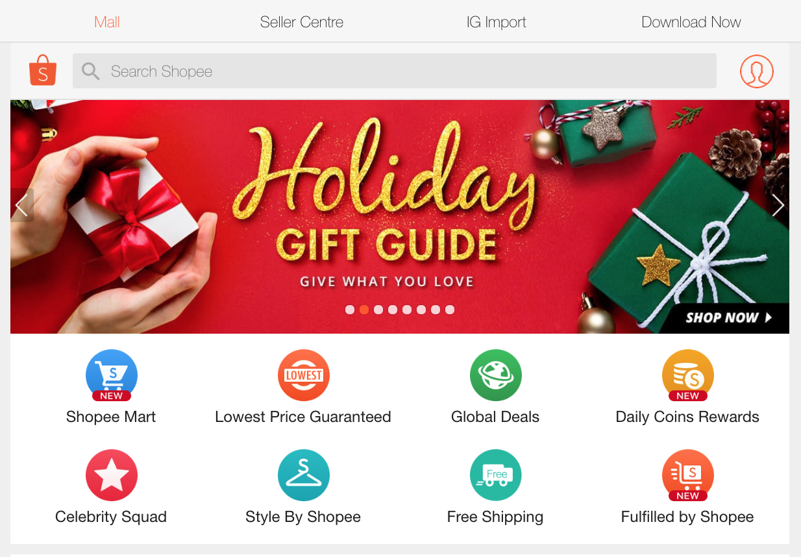
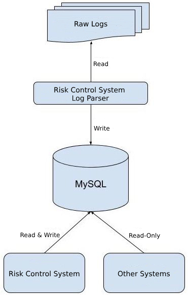
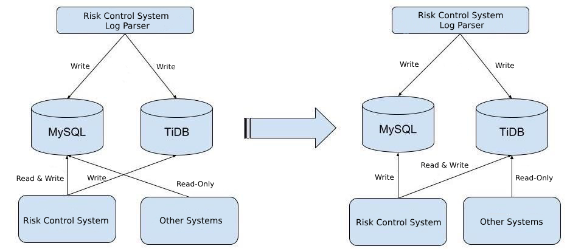
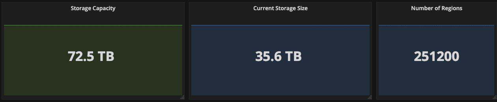
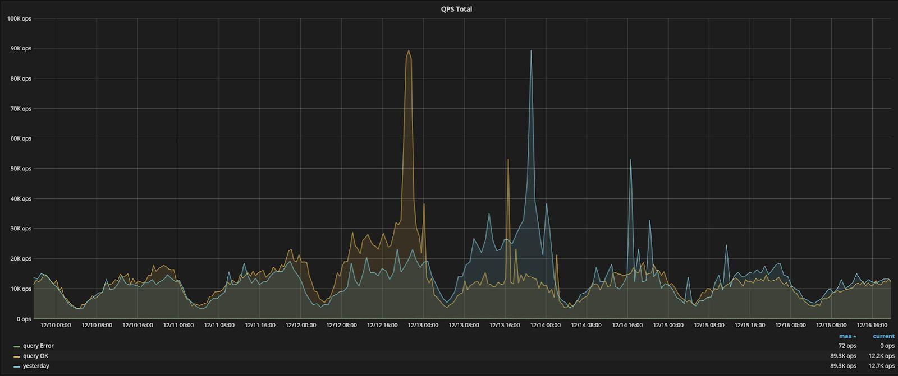
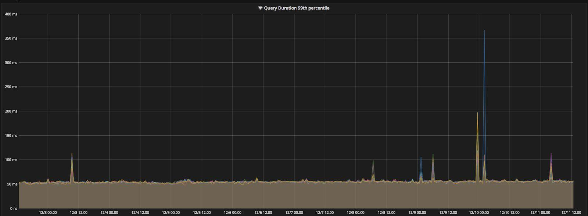

---
title: Shopping on Shopee, the TiDB Way
author: ['Chunhui Liu', 'Chao Hong']
date: 2019-02-14
summary: As our business boom, our team faced severe challenges in scaling our backend system to meet the demand until we found TiDB, a MySQL-compatible NewSQL hybrid transactional and analytical processing (HTAP) database, built and supported by PingCAP. Now we can provide better service and experience for our users without worrying about our database capacity. 
tags: ['TiDB','Success Story']
categories: ['MySQL Scalability']
url: /success-stories/tidb-in-shopee/
customer: Shopee
customerCategory: Internet
notShowOnLogoWall: true
--- 

**Industry:** E-Commerce

**Authors:** Chunhui Liu and Chao Hong (Database Administrators at Shopee)

[Shopee](https://en.wikipedia.org/wiki/Shopee) is the leading e-commerce platform in Southeast Asia and Taiwan. It is a platform tailored for the region, providing customers with an easy, secure and fast online shopping experience through strong payment and logistical support.

Shopee aims to continually enhance its platform and become the region's e-commerce destination of choice. Shopee has a wide selection of product categories ranging from consumer electronics to home & living, health & beauty, baby & toys, fashion and fitness equipment.

Shopee, a Sea company, was first launched in Singapore in 2015, and has since expanded its reach to Malaysia, Thailand, Taiwan, Indonesia, Vietnam and the Philippines. Sea is a leader in digital entertainment, e-commerce and digital financial services across Greater Southeast Asia. Sea's mission is to better the lives of consumers and small businesses with technology, and is listed on the NYSE under the symbol SE.

 Figure 1: The Shopee website 

As our business boomed, our team faced severe challenges in scaling our backend system to meet the demand. Fortunately, we found [TiDB](https://en.wikipedia.org/wiki/TiDB), a MySQL-compatible NewSQL hybrid transactional and analytical processing ([HTAP](https://en.wikipedia.org/wiki/Hybrid_transactional/analytical_processing_(HTAP))) database, built and supported by [PingCAP](https://pingcap.com/) and its open-source community. Now we can provide better service and experience for our users without worrying about our database capacity.

Currently, we have deployed two TiDB clusters totalling 60 nodes in our risk control and audit log systems. In this post, we will elaborate on why we chose TiDB, how we are using it, and our future plan for TiDB inside our infrastructure.

## What Is TiDB?

TiDB in a nutshell is a platform comprised of multiple components that when used together becomes a NewSQL database that has HTAP capabilities.

 Figure 2: TiDB platform architecture 

Inside the TiDB platform, the main components are as follows:

- [**TiDB Server**](https://github.com/pingcap/tidb) is a stateless SQL layer that processes users' SQL queries, accesses data in the storage layer, and returns corresponding results to the application. It is MySQL compatible and sits on top of TiKV.
- [**TiKV**](https://github.com/pingcap/tikv) is the distributed transactional Key-Value storage layer where the data persists. It uses the [Raft](https://raft.github.io/) consensus protocol for replication to ensure strong data consistency and high availability.
- [**TiSpark**](https://github.com/pingcap/tispark) cluster also sits on top of TiKV. It is an Apache Spark plugin that works with the TiDB platform to support complex OLAP queries for BI analysts and data scientists.
- [**Placement Driver (PD)**](https://github.com/pingcap/pd): A metadata cluster powered by [etcd](https://github.com/etcd-io/etcd) that manages and schedules TiKV.

Beyond these main components, TiDB also has an ecosystem of tools, such as [Ansible scripts](https://github.com/pingcap/tidb-ansible) for quick deployment, [Syncer](https://pingcap.com/docs/tools/syncer/) and [DM](https://github.com/pingcap/dm) for seamless migration from MySQL, and [TiDB Binlog](https://github.com/pingcap/tidb-binlog), which is used to collect the logical changes made to a TiDB cluster and provide incremental backup and replication to the downstream (TiDB, Kafka or MySQL).

## Our Pain Point

Our risk control system detects abnormal behaviors and fraudulent transactions from our internal logs of orders and user behaviors. This log was stored in MySQL and sharded into 100 tables based on `USER_ID`.

 Figure 3: Data collection and processing in the risk control system 

This approach began to show its limitations as the major shopping season approached. During one major 2018 promotion event, the number of orders exceeded 11 million, 4.5 times larger than the previous year. On December 12, 2018, another major online shopping day known as “Double 12”, the number of orders reached an all-time high in Shopee history -- 12 million.

Although we enabled [InnoDB Transparent Page Compression](https://dev.mysql.com/doc/refman/8.0/en/innodb-page-compression.html) to compress the data size by half and increased the MySQL server storage space from 2.5TB to 6TB as a temporary fix, we knew we needed a horizontally scalable database solution for the long term.

## Evaluation

Before choosing TiDB, we carefully researched and compared the pros and cons of MySQL sharding solution with the TiDB platform. Here was what our comparison found.

### MySQL Sharding

**To continue with our current sharding solution, we would need to** re-shard the data in the existing 100 tables to 1,000 or perhaps 10,000 tables and then distribute these shards among different MySQL instances.

**Advantage:**

- Our R&D and [DBA](https://en.wikipedia.org/wiki/Database_administrator) (database administrator) teams are experienced with MySQL sharding.

**Disadvantages:**

- **The application code becomes complex and difficult to maintain.** We code in Golang and Python and have deployed MySQL in several systems of Shopee. To support the new sharding rules, each system would need more code refactoring.
- **Changing existing sharding key is troublesome.** We must specify sharding key manually and carefully because it controls how the data is distributed across the shards. Changing an existing sharding key might lead to serious problems. In addition, cross-shard distributed transactions would not be supported.
- **Upgrading application logic affects application usability.** Mounting data often triggers a hung database, because it demands frequent table schema changes to perform [DDL](https://en.wikipedia.org/wiki/Data_definition_language) (Data Definition Language) operations. This impacts our application's usability and even causes data inconsistency.

### TiDB

**Advantages:**

- **Supports elastic horizontal scalability.** We can scale the database horizontally simply by adding new TiKV nodes when the data size increases.
- **Guarantees strong data consistency with auto partitioning.** All the data in TiDB is automatically partitioned into smaller chunks, and automatically replicated and made strongly consistent by executing the [Raft Consensus Algorithm](https://raft.github.io/). This implementation saves us time and reduces operational cost of manually partitioning and managing tables.
- **Highly compatible with the MySQL protocol.** We can use TiDB as if we were using MySQL, almost like “a MySQL with infinite capacity”, so to speak. This compatibility also lowers migration cost and keeps our application development productive because developers do not have to learn a new database.
- **Supports online DDL.** We can add new columns and indices without downtime.

**Disadvantage:**

- Our team has no experience in TiDB.

After a thorough evaluation, we decided to be an early adopter of TiDB, given all its attractive advantages, and TiDB turned out to be a perfect match for our services. Here​ is​ how we migrated ​the traffic ​and ​how we are ​currently using​ TiDB in our system.

## Migration from MySQL to TiDB

Our traffic migration process from MySQL to TiDB is as follows:

1. Performed doublewrite on the application. The log data was written into MySQL and TiDB at the same time so that the data in the two databases were consistent.
2. Migrated the old data from MySQL to TiDB and verified it to ensure the data in the two databases was consistent.
3. Migrated the read-only traffic from MySQL to TiDB gradually. (See Figure 4 below)
4. Stopped doublewrite and from this point, the application traffic was completely migrated to TiDB.

 Figure 4: Traffic migration process 

During the traffic migration process, we benefited a great deal from the doublewrite approach:

- We acquired enough time to get familiar with the TiDB behavior. Because of the doublewrite approach, the traffic switching process took several months, during which our R&D and DBA teams were able to learn more about how TiDB works and behaves.
- Before stopping the doublewrite operation, the application traffic could roll back to MySQL if TiDB encountered some issues, making the migration process relatively risk free.
- It gave us an opportunity to refactor the database. Shopee users are distributed among 7 regions. Before the application traffic was migrated to TiDB, all risk control logs were stored in the same logical database. This time we stored the log data into 7 different logical databases (`rc_sg`, `rc_my`, `rc_ph`, …, `rc_tw`) according to user regions. This way, we could customize a specific data structure for each region.

    <a href="/download" onclick="trackViews('Shopping on Shopee, the TiDB Way', 'download-tidb-btn-middle')"><button>Download TiDB</button></a>
    <a href="https://share.hsforms.com/1e2W03wLJQQKPd1d9rCbj_Q2npzm" onclick="trackViews('Shopping on Shopee, the TiDB Way', 'subscribe-blog-btn-middle')"><button>Subscribe to Blog</button></a>

## Deployment Set Up

Initially, we migrated 4TB of data from MySQL to a TiDB cluster that consisted of 14 nodes, comprising of 3 PD nodes, 3 TiDB nodes and 8 TiKV nodes.

### Hardware Configuration

- TiKV nodes

  - CPU: 2 * Intel(R) Xeon(R) CPU E5-2640 v4 @ 2.40GHz, 40 cores
  - Memory: 192GB
  - Disk: 4 * 960GB Read Intensive SAS SSD Raid 5
  - Network card: 2 * 10Gbps NIC Bonding

- PD nodes and TiDB nodes

  - CPU: 2 * Intel(R) Xeon(R) CPU E5-2640 v4 @ 2.40GHz, 40 cores
  - Memory: 64GB
  - Disk: 2 * 960GB Read Intensive SAS SSD Raid 1
  - Network card: 2 * 10Gbps NIC Bonding

So far, our system has been running smoothly with the data volume growing to 35TB at the time of this writing (See Figure 5). After scaling our capacity twice, there are now 42 nodes in the cluster.

 Figure 5: Hardware status of TiDB for risk control logs 

### Performance

 Figure 6: QPS of TiDB for risk control logs 

Generally, the total value of [QPS](https://en.wikipedia.org/wiki/Queries_per_second) (queries per second) (for both Error and OK queries) of TiDB for risk control logs is less than 20,000. But during the December 12 shopping holiday the QPS jumped to more than 100,000.

Although the data size has grown eightfold over the past 6 months, the whole cluster still maintains a stable query response time. Generally, the 99th percentile response time was less than 60ms (See Figure 7), which is very good for a risk control system mainly processing complex SQL queries.

 Figure 7: 99th percentile response time of TiDB for risk control logs 

## Advice for Other TiDB Users

While we have been happy with our experience with TiDB, the adoption was not without challenges. One issue we have encountered is that after adding new nodes to an existing TiKV cluster to expand our storage capacity, it took a long time to rebalance data -- roughly 24 hours to rebalance about 1TB of new data. Thus, to better prepare for this bottleneck, we would usually do this scaling a few days before any of our promotional campaigns when we know traffic will spike, and closely monitor the progress of data rebalancing. We also recommend setting the scheduling related parameters in PD to a larger value.

Another issue is that TiDB's MySQL compatibility is not fully complete; for example, TiDB does not currently support the `SHOW CREATE USER` syntax, which is related to MySQL user privilege. Instead, we have to read the system table (mysql.user) to check the basic information of a database account. The good thing is the PingCAP team is very transparent about MySQL features that are [currently not supported](https://pingcap.com/docs/v3.0/reference/mysql-compatibility) in TiDB, and is responsive to our requests -- a [pull request](https://github.com/pingcap/tidb/issues/7733) is already filed for this particular issue.

## What's Next

With one year's worth of TiDB experience under our belt, we feel confident in TiDB's potential and have plans to expand its usage inside Shopee's infrastructure in the following ways.

- Currently, our TiDB clusters serve large amounts of non-transactional data. We plan to evaluate the migration of some transactional data from MySQL to TiDB.

- We plan to use TiDB as part of our MySQL replication scheme, where TiDB will serve as the MySQL slave and data in MySQL will be replicated to TiDB in real time.

    This slave-like TiDB cluster will then support analytical queries for our business intelligence system, drawing insights from our data. Since these queries are read-only and often require a full table scan or index scan, TiDB is much better suited to process these queries than MySQL. We also plan to use TiSpark to read data from TiKV directly if faster analytical query performance is needed.

- Currently, we are running TiDB clusters on bare metal. It takes our DBAs substantial amount of time to maintain the hardware, network, and OS of our servers. In the future, we intend to run TiDB on our container platform and build up a toolset to achieve self-service resource application and configuration management. Then our staff will be freed from the daily grinds of operation and maintenance.

We would like to thank every PingCAP member who has helped us during the past year. They have been quick to respond, attentive in following up our project, and provided helpful advice along the way. We have also relied on the TiDB documentation, which is informative and clearly-structured.
