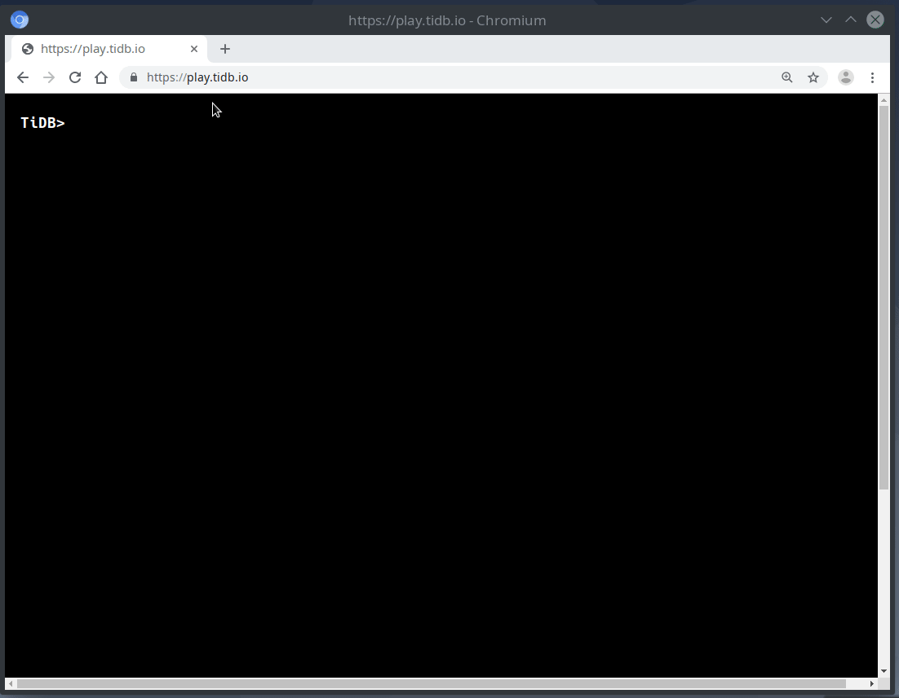

Remember the time when you had to download, install/deploy, and configure a database before knowing whether a database is compatible with your existing applications and your familiar SQL statements? What about a brand-new database that's built from the ground up?

For TiDB, an open source database which supports pluggable storage engine, our community users and our customers tell us that they need an easier way to write TiDB SQL statements, to test the compatibility, and to easily understand the difference between TiDB and MySQL. Thanks to Ti-Cool (PR: [#13069 - support compiling tidb to wasm](https://github.com/pingcap/tidb/pull/13069)), the second place project from [INSERT INTO tidb.hackathon_2019 VALUES ("Hack", "Fun", "TiDB Ecosystem"](https://pingcap.com/blog/insert-into-tidb-hackathon-2019-values-hack-fun-tidb-ecosystem), we are one step closer.

The Ti-Cool team was composed of:

* [Joshua Zhou](https://github.com/lucklove)
* [Tony Lu](https://github.com/tonyluj)
* [Minghua Tang](https://github.com/5kbpers)

Now, you can run TiDB directly in a web browser. Just like this:

 Run TiDB in a web browser 

## How can you try it?

1. Open your favorite web browser. (We expect it to work on Firefox and Chromium based browsers like Chrome on Linux, Windows, and Mac, we are also testing other web browsers.) Navigate to [https://play.tidb.io](https://play.tidb.io).

2. Wait a few seconds for the TiDB database to load.

3. You can start to write SQL statements, which are mostly MySQL statements because of TiDB's compatibility with MySQL (see the [unsupported features here](https://docs.pingcap.com/tidb/v4.0/mysql-compatibility#unsupported-features)).

4. When you're done using TiDB, close your web browser tab. The database and the data you created just vanish into thin air like they never existed.

Better yet, here is a preliminary playground you can try with TiDB documentation: [http://tour.tidb.io/](http://tour.tidb.io/)

## How is it possible?

You must be wondering how we did it. Well, we stand on the shoulders of giants. And the magic lies in these few keywords: WebAssembly (Wasm), Golang, TiDB community.

* Thanks to [Wasm](https://webassembly.org/) for making it possible to build desktop-quality applications in the web browser.

* Thanks to the [Golang](https://golang.org/) for supporting Wasm, and making it possible to run performant Golang applications or even databases in the web browser.

* Thanks to the Ti-Cool team in the TiDB community for contributing TiDB-Wasm in the 2019 TiDB Hackathon, making running TiDB in local model with by embedding GoLevelDB in the web browser possible. The team members are currently working on a technical blog to share how they made it. Stay tuned!

## What are the limitations?

As cool as it is, the tool has the following very important limitations, limiting its current use cases:

* TiDB-Wasm includes TiDB server only. TiDB is the stateless MySQL component of the TiDB platform (check other components in the [TiDB Architecture](https://docs.pingcap.com/tidb/v4.0/architecture)). Compiled to Wasm, this tool is **only** suitable for experimenting with SQL and testing out TiDB compatibility with MySQL queries.

* The Wasm binary file is close to 70 MB and compressed to 13 MB. The database and the data you create in TiDB-Wasm are written to memory, and therefore consume a lot of memory resources.  

* TiDB-Wasm does not support most of the web browsers on mobile devices yet.

* The tool currently cannot demonstrate multi-node TiDB deployments. This means you can't play with TiDB's titanium-solid resiliency, test doing rolling updates, or online scale-out and scale-in.

* This project includes a GUI, and is not intended to be used as part of a web application. While it is possible to operate a Wasm runtime on a server, we still recommend you use our official deployment tools. Even though Wasm has near-native performance, the current implementation does not support multi-node clusters that are required for a production or workload testing deployment.

* [Let us know](https://github.com/pingcap/tidb/projects/27) if you find more issues and limitations!

If a database like TiDB written in Golang can run in a web browser, what about other complex Golang applications? I couldn't help but think about Ending's law: "Any application that can be compiled to WebAssembly, will be compiled to WebAssembly eventually."

So why not experiment a bit with TiDB-Wasm? While it's not for production usage, it's still fun to think about what the future could bring and what can happen when you're part of a vibrant community like other cool 2019 TiDB Hackathon projects to come. Join our community now, and let's have fun hacking: [https://github.com/pingcap/community](https://github.com/pingcap/community)
