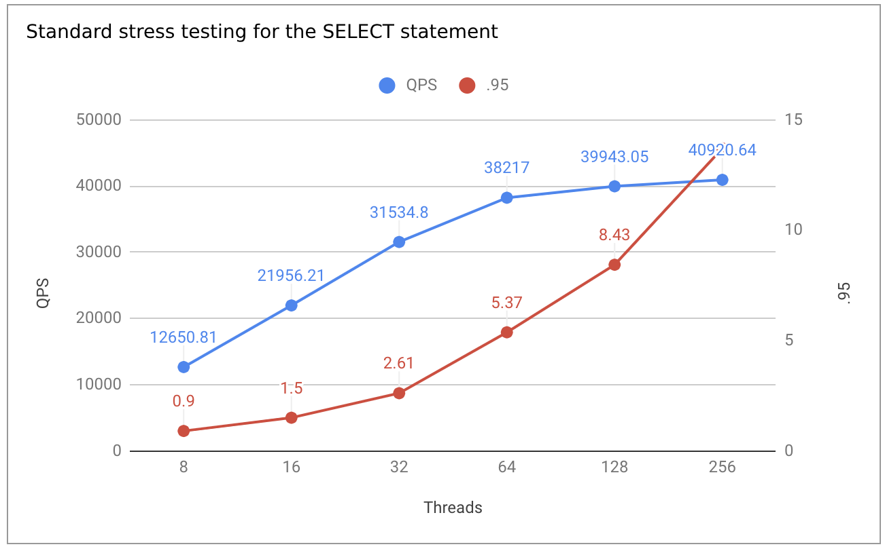
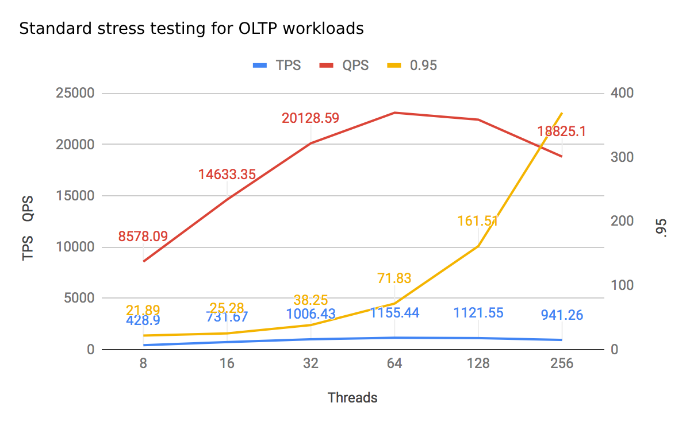
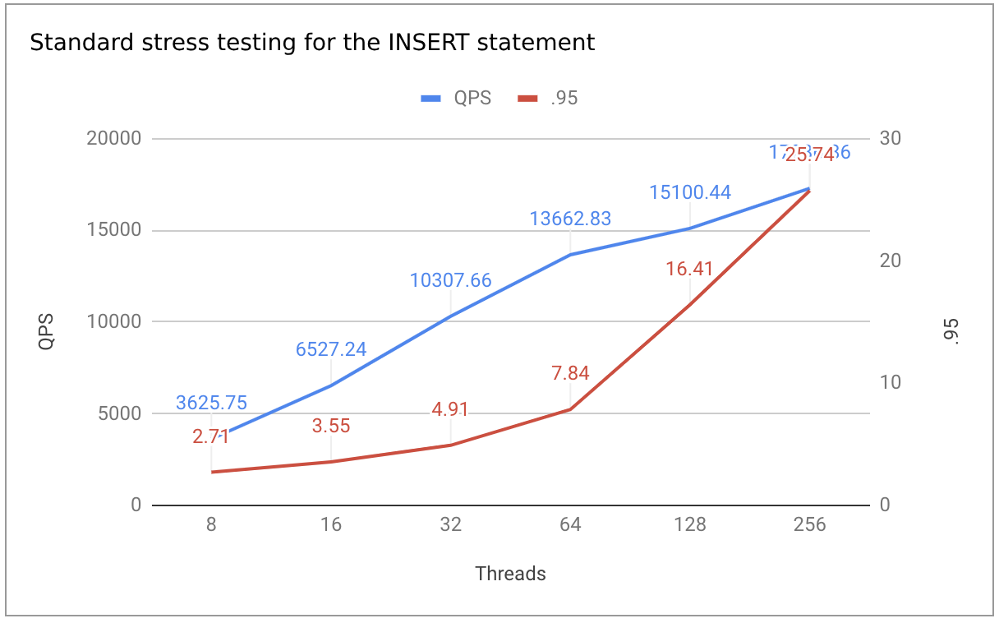
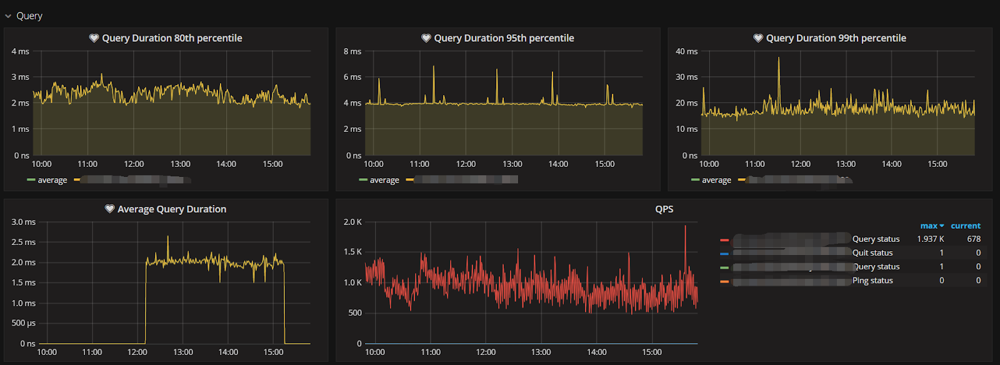

---
title: Powering the Xiaomi Mobile Lifestyle with TiDB
author: ['Liang Zhang', 'Youfei Pan', 'Biwen Wang']
date: 2019-04-11
summary: As sales of Xiaomi smartphones continue to climb and the MIUI user base continues to grow, the Database Administration team at Xiaomi was having an increasingly hard time managing their MySQL database infrastructure until they adopted TiDB, an open source distributed hybrid transactional and analytical processing database created and supported by PingCAP. Now they also have plans to migrate additional workloads to TiDB in the future.
tags: ['TiDB','Success Story']
categories: ['MySQL Scalability']
url: /success-stories/tidb-in-xiaomi/
--- 

**Industry:** Consumer Electronics
 
**Authors:** Liang Zhang (DBA team leader at Xiaomi), Youfei Pan (DBA at Xiaomi), and Biwen Wang (Software engineer at Xiaomi)

[Xiaomi](https://en.wikipedia.org/wiki/Xiaomi) is a leading consumer electronics and software company and the [fourth-largest smartphone manufacturer](https://www.notebookcheck.net/IDC-Xiaomi-ends-Q1-2018-as-the-fourth-largest-smartphone-brand-in-the-world.301842.0.html) in the world, with market-leading positions in both China and India. 

[MIUI](https://en.wikipedia.org/wiki/MIUI) (MI User Interface) is a mobile operating system developed by Xiaomi, based on Google's Android operating system. It supports various Xiaomi services and customized apps, such as Themes, Music, and its own App Store.

 Figure 1: MIUI interface 

 
As sales of Xiaomi smartphones continue to climb and the MIUI user base continues to grow, we as the Database Administration (DBA) team was having an increasingly hard time managing our MySQL database infrastructure. That is until we adopted [TiDB](http://bit.ly/tidb_repo_publication), an open source distributed hybrid transactional and analytical processing ([HTAP](https://en.wikipedia.org/wiki/Hybrid_transactional/analytical_processing_(HTAP))) database created and supported by [PingCAP](https://pingcap.com).

Currently, TiDB is deployed in Xiaomi's production environment to service two applications: instant delivery and our third party ad network. These two workloads generate about 100 million read and write queries daily. We have plans to migrate additional workloads to TiDB in the future.

In this post, we will show how we stress-tested TiDB during our evaluation, how we migrated data from MySQL to TiDB, and the issues and learning we encountered along the way. 

## What Is TiDB?

### TiDB Architecture

TiDB in a nutshell is a platform comprised of multiple components that when used together becomes a NewSQL database that has HTAP capabilities.

 Figure 2: TiDB platform architecture 

Inside the TiDB platform, the main components are as follows:

- **[TiDB Server](https://github.com/pingcap/tidb)** is a stateless SQL layer that processes users' SQL queries, accesses data in the storage layer, and returns corresponding results to the application. It is MySQL compatible and sits on top of TiKV.
- **[TiKV](https://github.com/pingcap/tikv)** is the distributed transactional key-value storage layer where the data persists. It uses the [Raft](https://raft.github.io/) consensus protocol for replication to ensure strong data consistency and high availability.
- **[TiSpark](https://github.com/pingcap/tispark)** cluster also sits on top of TiKV. It is an Apache Spark plugin that works with the TiDB platform to support complex OLAP queries for BI analysts and data scientists.
- **[Placement Driver (PD)](https://github.com/pingcap/pd)**: A metadata cluster powered by [etcd](https://github.com/etcd-io/etcd) that manages and schedules TiKV.

Beyond these main components, TiDB also has an ecosystem of tools, such as [Ansible scripts](https://github.com/pingcap/tidb-ansible) for quick deployment, [Syncer](https://pingcap.com/docs/tools/syncer/) and [DM](https://github.com/pingcap/dm) for data replication from existing MySQL instances (both sharded and unsharded), and [TiDB Binlog](https://github.com/pingcap/tidb-binlog), which is used to collect the logical changes made to a TiDB cluster and provide incremental backup and replication to different  downstream options (e.g. TiDB, Kafka or MySQL).

### Core Features

Because of its component-based layered architecture, TiDB can be used as a single system for both [OLTP](https://en.wikipedia.org/wiki/Online_transaction_processing) (Online Transactional Processing) and [OLAP](https://en.wikipedia.org/wiki/Online_analytical_processing) (Online Analytical Processing) workloads, thus enabling HTAP capabilities.

It has the following core features:

- Highly compatible with MySQL and users can easily enhance their current MySQL deployment with TiDB to power their applications without changing a single line of code in most cases and still benefit from the MySQL ecosystem. PingCAP is very transparent with aspects of MySQL that are not currently compatible in TiDB, which are all listed in [Compatibility with MySQL](https://pingcap.com/docs/v3.0/reference/mysql-compatibility/). 
- Horizontal scalability achieved by simply by adding new nodes. Because the SQL processing layer (TiDB Server) and the storage layer (TiKV) are decoupled, you can scale each resource independently of each other. 
- ACID compliance where all your data is consistent.
- High availability of all your data as guaranteed by TiDB's implementation of the Raft consensus algorithm.

## Our Paint Point

Before using TiDB, our team was managing our core business data on a standalone MySQL on disks with 2.6 TB capacity. As data volume surged, bottlenecks began to form. We noticed significant performance degradation and lack of availability in storage capacity, while [DDL](https://en.wikipedia.org/wiki/Data_definition_language) (data definition language) operations on large tables simply could not be performed.

We initially chose to solve our scalability challenges via traditional MySQL manual sharding, but we found this solution undesirable in that:

- **It is intrusive to the application code.** When sharding our database, we had to stop the on-going business, refactor the application code, and then migrate the data. 
- **It increases the maintenance costs for our team.** We had to continuously shard our database in different ways to keep up with growth. We used MySQL proxy and a middleware solution, but it was still difficult to implement cross-shard transactions and cross-shard aggregate queries, such as correlated query, subquery and group-by aggregation of the whole table.

## Stress Testing TiDB

As part of our evaluation of TiDB, we performed some stress testing to verify whether its performance on OLTP workloads would satisfy our service requirements. Here is the configuration and results of our tests, using TiDB 2.0.

### Hardware Configuration

| Component | Number of instances | CPU | Memory | Disk | Version | Operating system |
| :----- | :----- | :----- | :----- | :----- | :----- | :----- |
| TiDB | 3 | Intel(R) Xeon(R) CPU E5-2620 v3 @ 2.40GHz | 128G | SSD | Raid 5 | 2.0.3 | CentOS Linux release 7.3.1611 |
| PD | 3 | Intel(R) Xeon(R) CPU E5-2620 v3 @ 2.40GHz | 128G | SSD Raid 5 | 2.0.3 | CentOS Linux release 7.3.1611 |
| TiKV | 4 | Intel(R) Xeon(R) CPU E5-2620 v3 @ 2.40GHz | 128G | SSD Raid 5 | 2.0.3 | CentOS Linux release 7.3.1611 |

### Objects and Results

Standard stress testing for the `SELECT` statement:

| Threads | QPS | Latency (avg/.95/max) |
| :----- | :----- | :----- |
| 8 | 12650.81 | 0.63 / 0.90 / 15.62 |
| 16 | 21956.21 | 0.73 / 1.50 / 15.71 |
| 32 | 31534.8 | 1.01 / 2.61 / 25.16 |
| 64 | 38217 | 1.67 / 5.37 / 49.80 |
| 128 | 39943.05 | 3.20 / 8.43 / 58.60 |
| 256 | 40920.64 | 6.25 / 13.70 / 95.13 |

 Figure 3: Standard stress testing for the SELECT statement 

Standard stress testing for OLTP workloads:

| Threads | TPS | QPS | Latency (avg/.95/max) |
| :----- | :----- | :----- | :----- |
| 8 | 428.9 | 8578.09 | 18.65 / 21.89 / 116.06 |
| 16 | 731.67 | 14633.35 | 21.86 / 25.28 / 120.59 |
| 32 | 1006.43 | 20128.59 | 31.79 / 38.25 / 334.92 |
| 64 | 1155.44 | 23108.9 | 55.38 / 71.83 / 367.53 |
| 128 | 1121.55 | 22431 | 114.12 / 161.51 / 459.03 |
| 256 | 941.26 | 18825.1 | 271.94 / 369.77 / 572.88 |

 Figure 4: Standard stress testing for OLTP workloads 

Standard stress testing for the `INSERT` statement:

| Threads | QPS | Latency (avg/.95/max) |
| :----- | :----- | :----- |
| 8 | 3625.75 | 2.20 / 2.71 / 337.94 |
| 16 | 6527.24 | 2.45 / 3.55 / 160.84 |
| 32 | 10307.66 | 3.10 / 4.91 / 332.41 |
| 64 | 13662.83 | 4.68 / 7.84 / 467.56 |
| 128 | 15100.44 | 8.47 / 16.41 / 278.23 |
| 256 | 17286.86 | 14.81 / 25.74 / 3146.52 |

 Figure 5: Standard stress testing for the INSERT statement 

TiDB's performance results were able to meet our requirements, even though the system did have some stability issues when we dramatically increased our test workloads that far exceeded the real production environment. Therefore, we decided to use some read traffic in the MySQL slave as the canary traffic in TiDB. 

    <a href="/download" onclick="trackViews('Powering the Xiaomi Mobile Lifestyle with TiDB', 'download-tidb-btn-middle')"><button>Download TiDB</button></a>
    <a href="https://share.hsforms.com/1e2W03wLJQQKPd1d9rCbj_Q2npzm" onclick="trackViews('Powering the Xiaomi Mobile Lifestyle with TiDB', 'subscribe-blog-btn-middle')"><button>Subscribe to Blog</button></a>

## Migration Process

Our team conducted the migration process to TiDB in two steps: data migration and traffic shifting.  

### TiDB Data Migration

The data to be migrated included full data and incremental data. We made use of two tools developed by PingCAP, TiDB Lightning and Syncer.

- Logical backup and import can be used for full data migration. In addition, [TiDB Lightning](https://pingcap.com/docs/tools/lightning/overview-architecture/) is a tool for the physical import of full data to the TiDB cluster.
- [Syncer](https://pingcap.com/docs/tools/syncer/) (now [TiDB Data Migration](https://pingcap.com/docs/dev/reference/tools/data-migration/overview/)) can be used to replicate the incremental data from MySQL to TiDB.

As shown in the following diagram, Syncer relies on various rules to implement different filtering and merging effects; one upstream MySQL instance corresponds to one Syncer process; multiple Syncer processes are required when sharding data is replicated.

 Figure 6: Syncer architecture 

Here is our experience with using Syncer:

- Before using Syncer to synchronize data, check the user privilege, the binlog information, whether `server-id`, `log_bin`, and `binlog_format` is `ROW`, and whether `binlog_row_image` is `FULL`.
- Enable the rigid mode of data validation and check the data and table schema before data migration.
- Deploy the TiDB default monitoring system to observe data replication information.
- For table shards to be replicated to the same TiDB cluster, check whether `route-rules`  can be used in the current scenario and whether the unique key and primary key conflict after data is merged. 

### Traffic Shifting

Traffic that was shifted to TiDB included both read traffic and write traffic. Each time we shifted traffic, we observed the canary traffic for one to two weeks to observe any issues and conduct rollback if needed. 

Our experience during traffic shifting:

- In shifting the read traffic to TiDB, it was easy to perform rollback. If everything was okay for the canary traffic, we shifted the entire read traffic.
- After the read traffic was shifted to TiDB, shifting the write traffic to TiDB began. In this process, we needed to make a data rollback policy or enable the [doublewrite buffer](https://dev.mysql.com/doc/refman/5.6/en/innodb-doublewrite-buffer.html) with Syncer paused.

## Cluster Status

### Cluster Topology

We deployed our 7-node TiDB cluster, with 3 nodes each deployed with one TiDB instance and one PD instance and 4 nodes each deployed with one TiKV instance. When a new application is added to our TiDB cluster, we add new TiKV nodes as needed to increase storage capacity. 

### Monitoring System

TiDB uses [Prometheus](https://github.com/prometheus/prometheus) plus [Grafana](https://github.com/grafana/grafana) by default as the monitoring system stack. Prometheus is used to store the monitoring and performance metrics, and Grafana is used to visualize these metrics in a dashboard. This monitoring system also connects to [Open-Falcon](https://github.com/open-falcon) and running stably.
       

 Figure 7: TiDB monitoring system in Xiaomi 

## Advice for Other TiDB Users

Although we have been happy with our production experience with TiDB so far, there were some challenges, which we'd like to share as advice for other TiDB users. First, there were a few issues like syntactic error message display and trouble with manual compacting TiKV Regions, which were fixed in TiDB version 2.1. 

Another problem was when we were adding index to large tables, related applications were disrupted. The initial workaround was to simply perform similar tasks during low peak periods, but now PingCAP has made additional improvements to TiDB to mitigate this issue by adding better control for operational priority and improving the concurrency of processing read and write traffic.

We also encountered write amplification with RocksDB that makes our storage usage less efficiently. So far, the best recommendation is to set the `dynamic-level-bytes` configuration of RocksDB using TiKV to reduce some write amplification.

## What's Next

With our initial success of using TiDB in the instant delivery and third party ad network applications, we have plans to migrate over more Xiaomi services in the MIUI ecosystem, many of which have similar technical characteristics. To better use our resources, we also plan to deploy an archival cluster for some data and use Syncer to support the archiving process. 

On top of the current OLTP-centric workload, we also plan to support more OLAP scenarios using TiSpark and [TiDB Binlog](https://github.com/pingcap/tidb-binlog), for both online and offline analysis. 

We would like to thank PingCAP engineers for all their help, support, and professionalism during our data migration and deployment process. 
